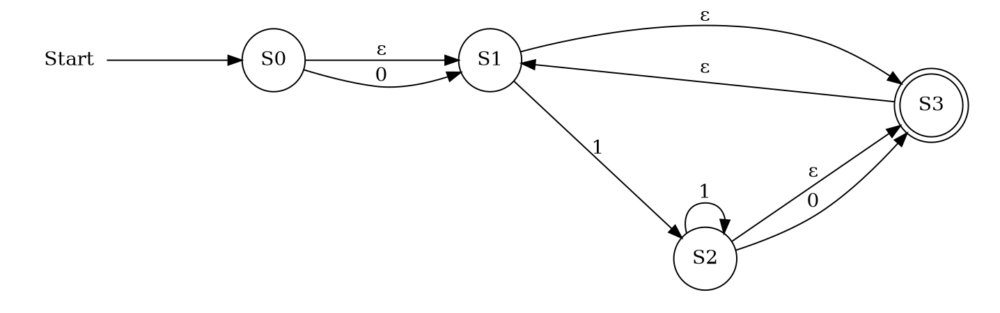
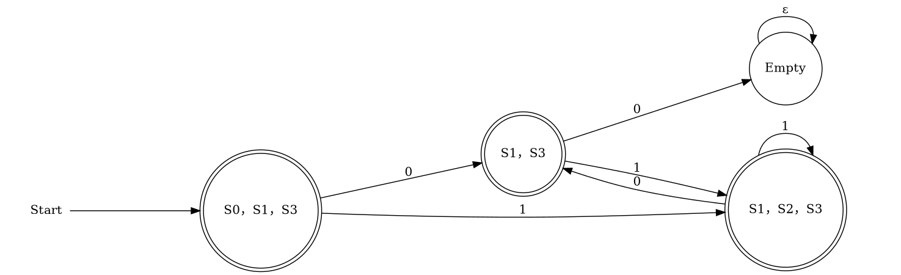

# Compiler Construction HW 2

$\text{21 CST H3Art}$

*2024 Fall Semester*

## Write regular expressions for the following languages over the alphabet $\sum = \{0, 1\}$. 

Hint: some of these languages may include $ε$.

(a) The set of all strings that do not contain the substring $00$.

(b) The set of all strings that contain at least three $1$s.

(c) The set of strings where all characters must appear in consecutive pairs (i.e. $00$ or $11$)

Examples of strings in the language: $\varepsilon$, $000011$. and $11$. Examples of strings not in the language: $11\underbar{1}00$, $00\underbar{1}00$, and $1100\underbar{0}$)

**Solution:**

(a) 

```regex
0?(1+0?)*
```

(b) 

```regex
(0|1)*1(0|1)*1(0|1)*1(0|1)*
```

(c)

```regex
(00|11)*
```

## Convert your regular expression from (1a) to a DFA.

For the expression `0?(1+0?)*`, the corresponing NFA is:



and convert the NFA to DFA, we have:


