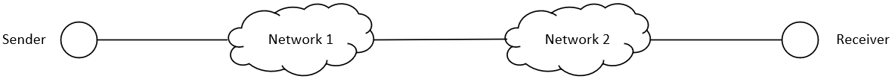

# Computer Networks

## Mid-term Test

*with partial answer*

**Fall Semester 2023**

**Answer ALL Questions 1~4 (100%)**

**Question 5 (20%) are bonus questions. These questions are optional. However, if you complete these question, you will receive additional bonus.**

1. (10%) What are the 7 layers of OSI reference model? Please use 1~2 sentences to describe each layer.

2. **Physical Layer:**
   1. (10%) Suppose "Cat-5" twisted-pair cable has a bandwidth of about $100\mathrm{MHz}$, and the signal-to-noise ratio (SNR) is $30\mathrm{dB}$. What's the theoretical maximum data rate for this channel?
   2. (15%) Two users share a communication channel by CDMA. The chip sequence of user 1 and user 2 are $s_1 = (+1, +1, -1, -1, +1, -1, -1, +1)$ and $s_2 = (-1, -1, -1, -1, +1, +1, +1, +1)$ respectively. Suppose the vector received is $(-2, -2, 0, 0, 0, +2, +2, 0)$. Find the data sent by user 1. Show your steps.

3. **Data link Layer (include MAC sublayer):**
   1. (15%) What are hidden and exposed terminal problems in wireless LAN? Please explain the detailed steps.
   2. (15%) In the *Go-Back-N* sliding window protocol, suppose the number of bits for sequence number is $4\mathrm{bits}$. What's the *valid range* of sending window size $W_s$? Explain why.

   >   **Answer:**
   >   The valid range is $1 < W_s \leq 15$.
   >   In order to avoid ambiguity of acknowledgement, the advanced window after acknowledgement should have no overlap with original one. So sliding window protocol require $W_s + W_r \leq 2^m$, where $m$ is the number of bits for sequence number. In this question, $m = 4$ and $W_r = 1$ for Go-Back-N. Then $1 < W_s \leq 2^4 - 1$.

4. **Network Layer:**
   1. (20%) An IPv4 packet has the following field (all values are in decimal): $\text{IHL} = 5, \text{Total Length} = 20, \text{Identification} = 100, \text{MF} = 0, \text{DF} = 0, \text{Offset} = 0$. Suppose this IP packet is forwarded through two different networks. The $\text{MTU}$ for the first network is $1500 \mathrm{Bytes}$, and the $\text{MTU}$ for the second network is $596 \mathrm{Bytes}$. Assume this packet is fragmented when traversing those two networks. Please show the detailed process of fragmentation, and give the values for the following IP header fields in each IP fragmentation: $\text{Total Length}, \text{Identification}, \text{MF}$ and $\text{Offset}$.
   

   >   **Answer:**
   >   The size of payload of the IP packet is $2000\mathrm{Bytes}$.
   >   When the IP packet traverses the first network with $\text{MTU} = 1500$, it will be fragmented into two pieces:
   >   (1) $\text{Total Length} = 1500, \text{Identification} = 100, \text{MF} = 1, \text{Offset} = 0$
   >   (2) $\text{Total Length} = 540, \text{Identification} = 100, \text{MF} = 0, \text{Offset} = 185$
   >
   >   When the IP packet traverses the second network with $\text{MTU} = 596$, the first piece is further divided into three pieces:
   >   (1.1) $\text{Total Length} = 596, \text{Identification} = 100, \text{MF} = 1, \text{Offset} = 0$
   >   (1.2) $\text{Total Length} = 596, \text{Identification} = 100, \text{MF} = 1, \text{Offset} = 72$
   >   (1.3) $\text{Total Length} = 348, \text{Identification} = 100, \text{MF} = 1, \text{Offset} = 144$
   >   $\vdots$

   2. (15%) A router has the following entries in its routing table (using CIDR):

   | Address/mask    | Next hop    |
   | --------------- | ----------- |
   | 213.219.56.0/22 | Interface 0 |
   | 213.219.60.0/22 | Interface 1 |
   | 219.48.40.0/23  | Router 1    |
   | 0.0.0.0/0       | Router 2    |

   For each of the following IP addresses, what does the router do if a packet with that address arrives?
   (a). 213.219.63.10
   (b). 213.219.52.2
   (c). 219.48.40.7

5. **Bonus Questions (Optional):**
   1. (10%) The Stop-and-Wait protocol is used on a link with data rate of $50\mathrm{K bit/s}$. Suppose the transmission delay of the link is $10\mathrm{ms}$, and the size of acknowledgements and processing time are all ignored. In order to achieve at least $50%$ link utilization, what's the minimum size of data frame?

   >   **Answer:**
   >   $1/(2BD + 1) = 50\% \Rightarrow BD = 0.5$
   >   
   >   $BD = 50\mathrm{Kbps} \times 0.01\mathrm{s} / \text{Frame Size} = 0.5$
   >
   >   Thus, the data frame should be at least $1000\mathrm{bits} = 125\mathrm{Bytes}$.

   2. (10%) Under the CIDR, try to aggregate the following four prefixes: 
   212.56.132.0/24, 212.56.133.0/24, 212.56.134.0/24, 212.56.135.0/24

   >   **Answer:**
   >   The first two bytes are equal. So we only need to focus on the third byte:
   >   For 212.56.132.0/24, its third byte in binary is: 10000100
   >   For 212.56.133.0/24, its third byte in binary is: 10000101
   >   For 212.56.134.0/24, its third byte in binary is: 10000110
   >   For 212.56.135.0/24, its third byte in binary is: 10000111
   >
   >   The first six bits are equal. So we can use the first two bytes and the first six bits in third bytes as the new prefix. The aggregated prefix is 212.56.132.0/22.