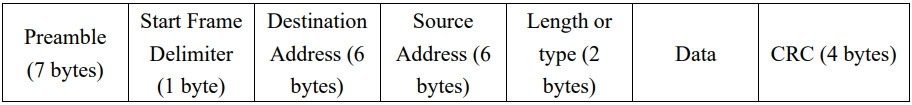
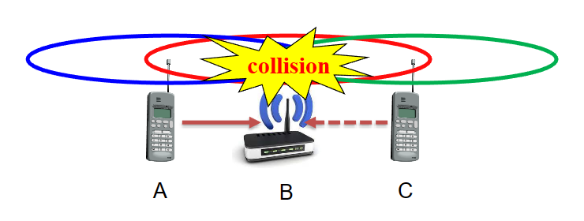
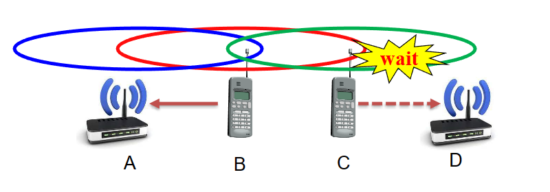
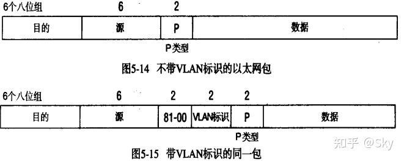
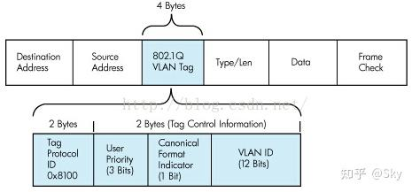
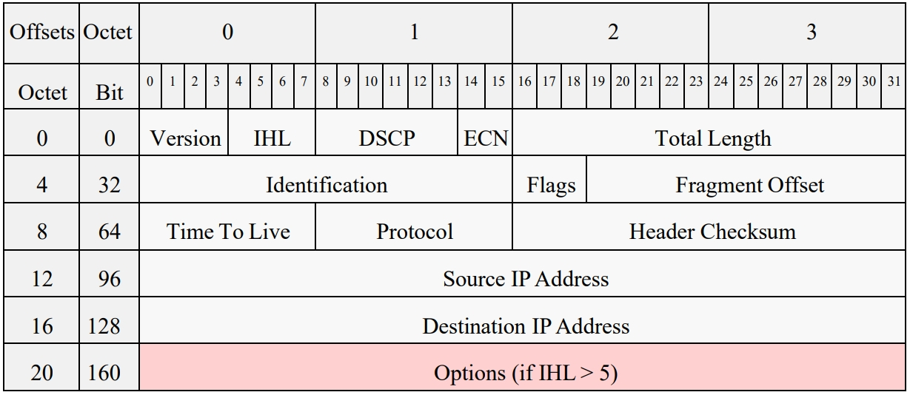
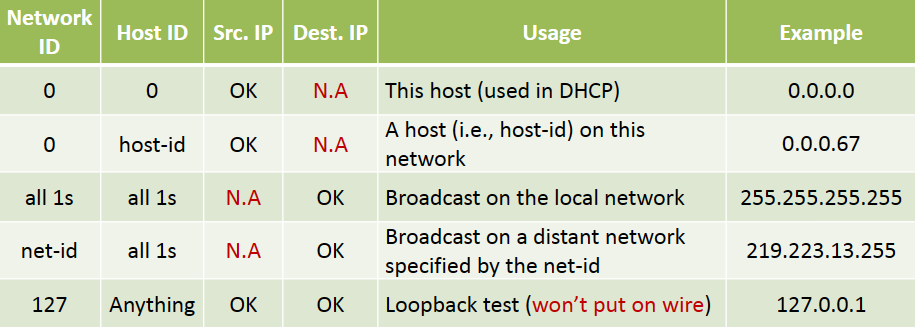
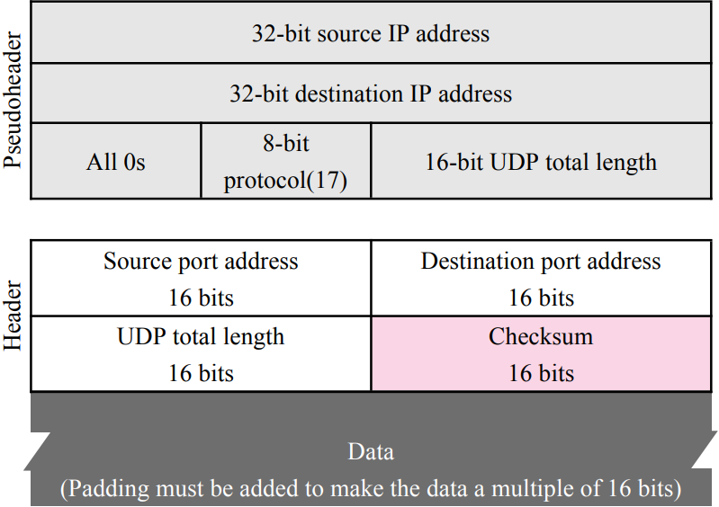
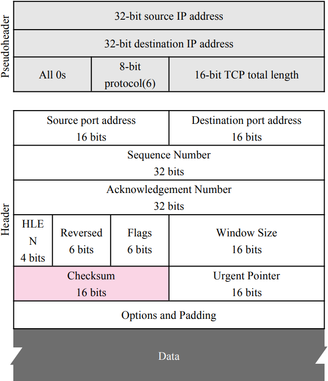

# Review Nouns of Computer Networks

$\text{H3Art}$

<!-- TOC -->

- [Review Nouns of Computer Networks](#review-nouns-of-computer-networks)
  - [Chapter 1: INTRODUCTION](#chapter-1-introduction)
  - [Chapter 2: THE PHYSICAL LAYER](#chapter-2-the-physical-layer)
  - [Chapter 3: THE DATA LINK LAYER](#chapter-3-the-data-link-layer)
  - [Chapter 4: THE MEDIUM ACCESS CONTROL SUBLAYER](#chapter-4-the-medium-access-control-sublayer)
  - [Chapter 5: THE NETWORK LAYER](#chapter-5-the-network-layer)
  - [Chapter 6: THE TRANSPORT LAYER](#chapter-6-the-transport-layer)
  - [Chapter 7: THE APPLICATION LAYER](#chapter-7-the-application-layer)
  - [Topic: Software Defined Networking(SDN)](#topic-software-defined-networkingsdn)

<!-- /TOC -->

## Chapter 1: INTRODUCTION
- **PAN个人局域网**: Personal Area Network, can be built with Bluetooth, RFID
- **LAN局域网**: Local Area Network, connects devices in a home or office building
- **MAN城域网**: Metropolitan Area Network, connects devices over a metropolitan area
- **WAN广域网**: Wide Area Network, connects devices over a country
  - **ISP因特网服务提供商**: Internet Service Provider network is also a WAN
- **The Internet大写开头的Internet代表因特网**: Network of all networks, start from **APPANET**
- **WLAN无线局域网**: Wireless LAN, has two different communication modes in **802.11**:
  - Infrastructure wireless LAN: Clients communicate via an **AP** (Access Point) that is wired to the rest of the network.
  - Ad hoc networks: clients can communicate directly in the radio range.
- **RFID无线射频识别**: Radio Frequency Identification
- **NFC近场通信**: Near Field Communication
- **IoT物联网**: Internet of Things
- **Connection-Oriented面向连接**: 需要**建立连接**，在发送消息时使用该连接，最后需要关闭连接，信息有序传输（可分为字节流或者消息流）
- **Connectionless无连接**: 每个信息都承载目的地地址，信息无序传输，
- **Reliable Service可靠服务**: Reliable service must have acknowledgement. 对通信过程加了校验、重传、恢复、流控等能力
- **Unreliable Service不可靠服务**: 不保证发送的数据就是接收者得到的数据
- **OSI model**: Open Systems Interconnection model
  - **Physical Layer物理层**: Deals with the physical connection between devices. It defines how raw bits are sent and received over a medium. 处理设备之间的物理连接。它定义了如何通过介质发送和接收原始比特
  - **Data Link Layer数据链路层**: Responsible for creating a reliable link between two directly connected nodes. It handles error detection and control. Examples: MAC addresses, Ethernet, and switches. 负责在两个直接连接的节点之间创建可靠的链路。它处理错误检测和控制。示例：MAC地址、以太网和交换机
  - **Network Layer网络层**: Determines the best path to transfer data between networks. It deals with logical addressing and routing. Examples: IP addresses, routers, and IP protocol. 确定网络之间传输数据的最佳路径。它涉及逻辑寻址和路由。示例：IP 地址、路由器和IP协议
  - **Transport Layer运输层**: Ensures data transfer is reliable, orderly, and error-free between devices on different networks. It deals with end-to-end communication. 确保不同网络上的设备之间的数据传输可靠、有序、无差错。它涉及端到端通信
  - **Session Layer会话层**: Establishes, maintains, and terminates connections between two devices. It manages sessions or connections. 建立、维护和终止两个设备之间的连接。它管理会话或连接
  - **Presentation Layer表示层**: Transforms data to ensure it's presented correctly. It deals with encryption, decryption, and data compression. 转换数据以确保其正确呈现。它涉及加密、解密和数据压缩
  - **Application Layer应用层**: Directly interacts with end-user applications. It provides network services to user's apps. 直接与最终用户应用程序交互。它为用户的应用程序提供网络服务
- OSI was developed by **International Standards Organization** (ISO).
- **TCP/IP model**:
TCP/IP is the foundational communication protocol suite of the internet. It's more condensed than the OSI model and comprises four layers:
  - **Link Layer**: Corresponds to the OSI's Physical and Data Link layers. It handles the physical connection and data framing. Examples: Ethernet, Wi-Fi.
  - **Internet Layer**: Similar to the OSI's Network layer. It facilitates data transfer between networks. Examples: IP (IPv4 and IPv6), ICMP, ARP.
  - **Transport Layer**: orresponds to the OSI's Transport layer. It provides end-to-end communication services. Examples: TCP (reliable) and UDP (unreliable).
  - **Application Layer**: **Encompasses the OSI's Session, Presentation, and Application layers.** It's where user applications and services operate. Examples: HTTP, FTP, DNS.

## Chapter 2: THE PHYSICAL LAYER
- **Full-duplex全双工**: Used for transmission in both directions at once
- **Half-duplex半双工**: Both directions, but not at the same time
- **Simplex单工**: Only one fixed direction at all times; not common
- **ISM(Industrial, Scientific, Medical)**: 三类最初被划定用于工业、科学和医疗应用的非通信目的的频段，包括WiFi, Bluetooth等
- **Electromagnetic Spectrum电磁频谱**: 以下列举几类扩频技术
  - **FHSS跳频扩频**: Frequency hopping spread spectrum
  - **DSSS直接序列扩频**: Direct sequence spread spectrum
  - **UWB超宽带**: Ultra-wideband
- **Data Rate of a Channel**:
  - To electrical engineers, **analog bandwidth模拟带宽** is a quantity measured in $\mathrm{Hz}$
  - To computer scientists, **digital bandwidth数字带宽** is the maximum **data rate of a channel**, a quantity measured in $\mathrm{bits/sec}(\mathrm{bps})$
  - The data rate is the end result of using the analog bandwidth of a physical channel for digital transmission.
- **Baseband基带**: Signals that run from 0 up to a max frequency
- **Passband通带**: Signals that are shifted to a higher range of frequencies, e.g., wireless transmission.
- In a **noiseless无噪声** channel, **Nyquist's theorem奈奎斯特定理** relates the data rate to the bandwidth $B$ and number of signal levels $V$, it converts Bandwidth in $\mathrm{Hz}$ to Bandwidth in $\mathrm{bits/sec}$:

$$
\text{Max. data rate} = 2B \log_2V \mathrm{bits/sec}
$$

- In a **noisy有噪声** channel, **Shannon's theorem香农定理** relates the data rate to the bandwidth $B$ and signal strength $S$ relative to the noise $N$, assume **random noise** is present:

$$
\text{Max. data rate} = B \log_2 (1 + S/N) \mathrm{bits/sec}
$$

- **SNR信噪比**: Signal-to-Noise Ratio is used to express the quantity $10\log_{10}(S/N)$ in $\mathrm{dB}$ (namely decibels, 分贝)
- **Modulation调制** schemes send bits as signals
  - For **Baseband基带** transmission, it directly converts bits into signals (common for wires)
    - **NRZ不归零** Non-Return-to-Zero is the simplest code scheme (e.g., +1V="1", -1V="0"). Assume the bandwidth is $B$ Hz, The $\text{Max. bit rate} = 2B \mathrm{bits/sec}$
    - **Manchester Encoding曼彻斯特编码**: It embeds clock in signal. Signal is XOR of data (NRZ) and clock (transition per bit), Low-to-high is 0; high-to-low is 1. Signal rate is twice the bit rate.
    - **NRZI反转不归零**: 1 is represented by a transition, 0 is represented by no transition.
    - **4B/5B Codes 4B/5B编码**: Maps 4 data bits to 5 coded bits with 1s and 0s.
    It keeps never more than three consecutive 0s back-to-back, resulting 5-bit codes are then transmitted using the NRZI encoding.

    | Data | Code  | Data | Code  | Data | Code  | Data | Code  |
    | ---- | ----- | ---- | ----- | ---- | ----- | ---- | ----- |
    | 0000 | 11110 | 0100 | 01010 | 1000 | 10010 | 1100 | 11010 |
    | 0001 | 01001 | 0101 | 01011 | 1001 | 10011 | 1101 | 11011 |
    | 0010 | 10100 | 0110 | 01110 | 1010 | 10110 | 1110 | 11100 |
    | 0011 | 10101 | 0111 | 01111 | 1011 | 10111 | 1111 | 11101 |

    - **Bandwidth efficiency带宽效率**: The relation of **bit rate比特率** and **symbol rate符号率** is as follows, where $N$ is number of bits per symbol. **Baud rate波特率** is an old name for symbol rate.

    $$
    \text{Bit rate} = \text{Symbol rate} \times N
    $$
  - For **Passband通带** transmission, it regulates the amplitude幅度, phase相位, or frequency频率 of carrier signal (common for wireless and optical channels). We can take a baseband signal that occupies 0 to $B \mathrm{Hz}$ and shift it up to occupy a passband of $S$ to $S+B \mathrm{Hz}$ without changing the amount of information that it can carry, even though the signal will look different.
    - **ASK幅移键控**: Amplitude shift keying
    - **FSK频移键控**: Frequency shift keying
    - **PSK相移键控**: Phase shift keying

- **Multiplexing多路复用** schemes share a channel among users
  - **FDM频分复用**: Frequency Division Multiplexing shares the channel by placing users on different frequencies
  - **TDM时分复用**: Time Division Multiplexing shares a channel over time, it widely used in telephone/cellular systems
  - **CDMA码分复用**: Code Division Multiplexing shares the channel by giving users a code
    - To transmit a "1" bit, a station sends its chip sequence
    - To transmit a "0" bit, a station sends the negation of its chip sequence
    - Codes are orthogonal(正交): can be sent at the same time

- **Structure of the Telephone System**:
  - Fully interconnected network (1876)
  - Centralized switch (1878)
  - Two-level hierarchy
  - More levels
    
The **telephone system** is divided into:
- Outside plant: local loops and trunks
- Inside plant: switches

- **Local loops本地回路**, mostly analog twisted pairs to houses ("last mile")
  - **Modems调制解调器**: modulator demodulator
    - Telephone modems send digital data over an ~3.3KHz analog voice channel
  - **DSL数字用户线**: Digital Subscriber Lines broadband sends data over the local loop to the local office using frequencies that are not used for POTS (Plain Old Telephone Service)

- Trunks(中继线), digital fiber optic links that carry calls

- **Switching交换**:
  - **Circuit switching电路交换**: Used in the traditional telephone system. It requires call setup (connection) before data flows, also disconnection at end.
  - **Packet switching分组交换**: Used in VoIP/Voice over IP. It treats messages independently

## Chapter 3: THE DATA LINK LAYER
- **Possible services in link layer链路层可能提供的服务**:
  - **Unacknowledged connectionless service**: For low error rate link like Ethernet (以太网)
  - **Acknowledged connectionless service**: For unreliable links like IEEE 802.11 (WiFi)
  - **Acknowledged connection-oriented service**: For long, unreliable links, exspecially suitable for long unreliable link like Satellite channel (卫星信道)

- **Data Link Layer Design Issues数据链路层设计问题**:
  - **Framing成帧**: Let receivers identify each frame, breaking up a bit stream into frames, marking the start and end of each frame
  - **Error control错误控制**: Make sure each frame is delivered to destination correctly
    - Requires errors to be detected at the receiver
    - Typically retransmit unacknowledged frames
    - Timers protect against lost acknowledgements
    - Three common techniques to do this:
      - **Acknowledgments确认**: 
        - Receiver returns an **acknowledgment (ACK)** frame to the sender indicating the correct receipt of a frame.
        - Receiver sometimes can also return a **negative ACK (NACK)** for incorrectly-received frames.
      - **Timers计时器**: for lost ACK/NACK
        - Retransmission timers are used to resend frames that don't produce an ACK, e.g., ACK lost. 
        - When sending a frame, schedule a timer to expire at some time after the ACK should have been returned. 
        - If the timer goes off, retransmit the frame.
      - **Sequence Numbers序列号**: to suppress duplicated frames
        - Retransmissions may cause duplicated frames.
        - To suppress duplicates, add sequence numbers to each frame, so that the receiver can distinguish between new frames and repeats of old frames.
  - **Flow control流量控制**: Regulate flow of frames when speed of sender and reviver are different
  - **Feedback-based基于反馈** flow control: receiver gives feedback on the data it can accept, discuss in the Link layer, e.g., **CSMA/CA**
  - **Rate-based基于速率** flow control: the protocol has a built-in mechanism that limits the rate, discuss in the Transport layer, e.g., TCP congestion control

- **Framing成帧**: 
  - Four methods:
    - **Byte count字节计数法**
    Frame begins with a count of the number of bytes in it(Include itself)

    - **Flag bytes with byte stuffing字节填充的标志字节法**
    Special flag bytes delimit frames; occurrences of flags in the data must be stuffed (escaped)

    - **Starting and ending flags with bit stuffing比特填充的标志字节法**
    Frame flag has six consecutive "1"s: 01111110, when transmitting data bits, after five "1"s in the data, a "0" is added, upon receiving, a "0" after five "1"s is deleted

    - **Physical layer coding violations物理层编码违禁法**
    Send a signal that doesn't conform (符合) to any legal bits representation

  - Combination of framing methods
  Ethernet and 802.11 (WiFi) frame begin with a well-defined pattern called a **preamble前导码**

- **Error Control错误控制**:

  - **Error-Correcting Codes纠错码, 或称前向纠错码** (Only need to know Hamming distance)
    - **Hamming distance海明距离** is the minimum bit flips to turn one valid codeword into any other valid one, example with 4 codewords of 10 bits: 0000000000, 0000011111, 1111100000, and 1111111111, the Hamming distance is 5.
      - The larger the hamming distance, the better the codes are able to detect errors
      - To detect $d$ bit errors requires having a Hamming distance of at least $d + 1$ bits
      - To correct $d$ errors requires distance of $2d + 1$ bits

  - **Error-Detecting Codes检错码** (Principle of CRC, basic concepts of Parity and Checksum)
    - **Parity奇偶校验码**: Parity (奇偶) bit is added as the modulo 2 sum of data bits
    - **Checksum校验和**: A group of check bits associated with a message, regardless of how they are calculated
    - **CRC循环冗余校验码**: Cyclic Redundancy Check is the most popular error detection code at the **link layer** is based on **polynomial code多项式码**.
      - Ex: 10111 is degree 4: $x^4 + x^2 + x + 1$，补4个0再进行计算
      - 计算方式：以$\text{XOR}$运算符进行多项式除法
      - CRC-16 = $x^{16} + x^{15} + x^2 + 1$ (used in HDLC)
      - CRC-32 = $x^{32} + x^{26} + x^{23} + x^{22} + x^{16} + x^{12} + x^{11} + x^{10} + x^8 + x^7 + x^5 + x^4 + x^2 + x + 1$

- **Flow Control流量控制**:
  - **NIC网卡**: Network Interface Card
  - **Stop-and-Wait停等协议**:
    - **ARQ自动重传请求**: Automatic Repeat-reQuest，提供可靠服务
    - For stop-and-wait, 2 numbers (1 bit) of sequence number are sufficient
    - **Sending window size = 1**
    - **Receiving window size = 1**
  - **Link utilization连接利用率**:
    - **BDP带宽延迟积**: Bandwidth-delay product = $BDP = \text{Bandwidth}(\mathrm{bit/sec}) \times \text{Delay}(\mathrm{sec})$
    - Best window ($w$) depends on bandwidth-delay ($BD$), i.e., number of frames:
    $$
    \text{link utilization} \leq \frac{w}{1+2BD}
    $$
    - 公式理解：
      - 式子中$BD$代表number of frames，单位时间传输的帧数量，$BD = BDP / \text{frame size}$
      - $2BD$是因为传输了$BD$个数据，返回了$BD$个ACK
      - 分母中的$+1$代表的是还没有得到ACK的在传数据
  - **Go-Back-N回退N帧协议**:
    - Receiver only accepts/acks frames that arrive in order. Discards frames that follow a missing/errored frame. Sender times out and resends all outstanding frames
    - **Sending window size > 1**
    - **Receiving window size = 1**

  - **Selective Repeat选择重传协议**:
    - **Cumulative ACK累计确认** indicates highest in-order frame
    - **NAK非确认**: Negative ACK causes sender retransmission of a missing frame before a timeout resends
    - **ACK timer确认计时器**: Slightly larger than the normal time interval expected between sending a frame and receiving its ACK. 略长于发送包和收到确认的间隔
    - **Sending window size > 1**
    - **Receiving window size > 1**

  - **Windows Size窗口大小**:$W_S$: Sending window, $W_R$: Receiving window, sequence number is $m$ bits, $W_S \geq W_R$ and $W_S + W_R \leq 2^m$

  | Protocol         | $W_S$                  | $W_R$                  |
  | ---------------- | ---------------------- | ---------------------- |
  | Stop-and-Wait    | $1$                    | $1$                    |
  | Go-Back-N        | $> 1$ ($\leq 2^m - 1$) | $1$                    |
  | Selective Repeat | $> 1$                  | $> 1$ ($\leq 2^{m-1}$) |

## Chapter 4: THE MEDIUM ACCESS CONTROL SUBLAYER
- **ALOHA 原为美国夏威夷地区人们相互之间的问候语**: The **earliest** **wireless** communication network protocol
  - In pure ALOHA, users transmit frames whenever they have data; retry after a random time for collisions
    - No **Carrier Sense**没有载波监听
  - Slotted ALOHA: Using slotted time and no carrier sense
- **CSMA载波监听多路访问**: Carrier Sense Multiple Access protocol, it improves on ALOHA by sensing the channel
  - **1-persistent** (greedy) sends as soon as idle, used in Classic Ethernet(MAC Protocol)
  - **Nonpersistent** waits a random time then tries again
  - **p-persistent** sends with probability p when idle
  - **CSMA/CD具备冲突检测的载波监听多路访问**: CSMA/CD improvement is to detect/abort collisions, Collision time is much shorter than frame time. The worst-case delay in collision detection is time for a signal to propagate between the two farthest stations be $\tau$, the detection time will be $2\tau$. （这解释了一个帧的最小长度边界，最小长度的帧保证其帧大小除以传输速率，得到的时间必须大于$2\tau$，因此如果发生碰撞，检测到碰撞的时间依然比传输这个帧到达对应站点的时间短，这能保证错误一定会被检测到）
    - CSMA: Listen before talk
      - Sense the channel
      - If the channel is idle, transmit immediately
      - If the channel is busy, waits a random amount of time then sense the channel again
    - CD: Stop if collision occurs
      - If there is a collision, stops transmission immediately, waits a random amount of time then senses the channel again

- **Ethernet以太网**:
- **Classic Ethernet传统以太网**: 
  - **Coaxial cable同轴电缆**
  - Up to **10 Mbps**, with **Manchester encoding曼彻斯特编码**
  - **Repeaters中继器** are used to increase cable length
  - Classic Ethernet Standard
    - **DIX Standard**:
      - 8 bytes Preamble前缀
      - 6 bytes Dst Address目的地址
      - 6 bytes Src Address源地址
      - **2 bytes Type类型(>0x600, i.e. decimal 1536)**
      - 0-1500 bytes Data Payload负载数据
      - 0-46 bytes Padding补充到最小帧大小的填充
      - 4 bytes Checksum校验和
    - **IEEE 802.3**:
      
      - 7 bytes Preamble前缀
      - **1 byte SOF(Start of Frame)帧起始标志位**
      - 6 bytes Dst Address目的地址
      - 6 bytes Src Address源地址
      - **2 bytes Length长度**
      - 0-1500 bytes Data Payload with **LLC(Logic Link Control逻辑链路控制) header**负载数据和LLC头部
      - 0-46 bytes Padding补充到最小帧大小的填充
      - 4 bytes Checksum校验和
    - **Minimum Frame length**: **64 ~ 1518 bytes** (up to **1500 bytes payload**)
    - **Destination address**: the **first bit** to be **0** is **unicasting单播** address, **1** is **multicasting多播**, and **all 1** is **broadcasting广播**
    - **Source address**: 48 bits, globally unique
    - **MTU最大传输单元**: Maximum Transmission Unit is the size of the largest Protocol Data Unit (PDU) that can be communicated in a single network layer transaction
  - CSMA/CD with **BEB二进制指数后退**: 指在遇到重复的冲突时，站点将重复传输，但在每一次冲突之后，等待时延的平均值将加倍
- **Switched Ethernet交换式以太网**: 
  - **Hubs集线器**: Wire all lines into a single CSMA/CD domain
  - **Switches交换机**: Isolate each port to a separate domain
    - One of the most important characters of switchedEthernet is to **isolate collision domain隔离冲突域**
  - **Collision domain冲突域**: An area of the network where frame can collide
    - Can not be broken up by **hubs集线器/repeaters中继器**
    - Will be broken up by **switches交换机/bridges网桥/routers路由器**
  - **Broadcast domain广播域**: All nodes that can be reached by a broadcast frame transmission
    - Will be broken up by **routers**
- **Fast Ethernet快速以太网**(802.3u):
  - Fast Ethernet  extended Ethernet **from 10 Mbps to 100 Mbps**
  - **Twisted pair** (with Cat 5)
  - Unchanged Frame format
  - Restriction of Max./Min.frame length
  - Using **4B/5B** encoding scheme
  - **Autonegotiation自动协商**: Two stations automatically negotiate **speed** (10 or 100 Mbps) and **duplexity** (half or full)
- **Gigabit Ethernet千兆以太网**(802.3ab):
  - Unchanged Frame format
  - Restriction of Max./Min.frame length
    - **Carrier extension载波扩展**: 限制了帧的最小长度，需要补齐至最小长度以太网帧(512 bytes)
    - **Frame bursting帧突发**: concatenate multiple frames in a single transmission
  - With **full-duplex** lines between computers/**switches**
    - **NO CSMA/CD**
  - With **half-duplex** lines between computers/**Hub**
    - **CSMA/CD is required**
  - Twisted pair
  - Using **8B/10B** encoding
  - Jumbo frames: Allow frames up to 9KB
- **10-Gigabit Ethernet万兆以太网**:
  - Only provide **full-duplex** link, **no CSMA/CD**
  - Using **64B/66B** encoding
  - Deployed in: Data centers, high-end routers, servers, etc.

- **WLAN无线局域网**: Wireless LAN
- Two Modes of Wireless LANs:
  - **Infrastructure Mode有基础设施模式**: Wireless hosts communicate to an **access point接入点(AP)**, which typically connects to wired networks
    - **Base station基站**: connects mobiles into wired network, it equals an access point(AP)
    - Assign a **Service Set Identifier服务集标识符** (SSID, 1~32 byte sstring) to each AP
    - Also assign a channel number to the AP
      - 802.11 defines 11~14 partially overlapping channels(2.4GHz band)
  - **Ad Hoc Mode点对点模式**: Wireless hosts communicate in a **peer-to-peer** basis without any access point
    - **No base stations**
    - nodes can only transmit to other nodes within coverage
- **802.11**:
  - **NICs网络接口卡/网卡** are compatible with multiple physical layers:
    - 802.11 b/a/g/n/ac/ax
  - **Steps to Join a Network**:
    - Discover available networks
      - Passive Scanning: Beacon frames periodically sent from APs
      - Active Scanning: Probe Request sent from host
    - Select a network: The user selects from available networks
    - Authentication: A wireless host proves its identity to the AP
      - Open System Authentication(**default** authentication protocol for 802.11)
      - Shared Key Authentication(assumed that the wireless host and the AP somehow agrees on a shared secret key **via a channel independent of IEEE 802.11**)
    - Association: The wireless hosts needs to associate (i.e.**register**) with an AP.
- **CSMA/CA具备冲突避免的载波监听多路访问**:
  - Two problems and their solutions:
    - **Hidden terminals隐藏终端**:
      
      - A sends to B, C cannot receive A
      - C wants to send to B, C senses a "free" medium
      - Collision at B, A cannot receive the collision
      - A is "hidden" for C, vice versa
    - **Exposed terminals暴露终端**:
      
      - B is sending to A, C wants to send to D
      - C has to wait, it senses the channel busy
      - But A is outside the radio range of C, therefore waitingis not necessary
      - C is "exposed" to B
  - **MACA具有避免冲突功能的多路访问**: Multiple Access with Collision Avoidance uses short signaling packets for collision avoidance
    - **RTS请求发送**: Request To Send(20 bytes) is a sender request the right to send from a receiver
    - **CTS清空信道，确认发送**: Clear To Send(14 bytes) is the receiver grants the right to send as soon as it is ready to receive
    - **Signaling packets contain**:
      - sender address
      - receiver address
      - packet size
    - **RTS/CTS** avoids the problem of **hidden terminals**
      - 在通信前必须自己发送RTS且取得基站的CTS确认，没有则无法开始通信，如果自己没有发送RTS但收到CTS，也可以知道有其他设备在进行通信，因此会进行等待，可以避免隐藏终端问题
    - **RTS/CTS cannot entirely** avoid the problem of **exposed terminals**
      - 在通信时受到其他在通信设备的影响导致无法通信，这可能是因为本设备收到了其它的CTS而推迟通信，所以无法完全解决暴露终端问题
  - **CSMA/CA with RTS-CTS**
    - **DIFS分布式帧间空间**: Distributed Inter-frame Space
    - **SIFS短帧间空间**: Short Inter-frame Space
    - DIFS > SIFS: 保证连接的建立不会被短帧诸如CTS、ACK等打断
    - 即便用到这样的操作，在RTS发送，准备建立连接时，依然会出现冲突

- **Data Link Layer Switching数据链路层交换**
  - **Bridge/Switches Design网桥/交换机设计**：
    - **Cut-through Switching直通交换**
    - **Store-and-forward Switching存储-转发交换**
  - **Learning Bridges自学习桥接器/网桥**：可以学习（Backward learning algorithm逆向学习算法）从哪个端口发出的数据包，构建缓存表将其缓存
  - **Spanning Tree Bridges生成树桥接器/网桥**：
    - 为了解决逆向学习过程中造成的无限循环，使用生成树算法来避免此问题
  - **Repeaters, Hubs, Bridges, Switches, Routers, and Gateways**
    - Repeaters, Hubs中继器、集线器 —— just electronic amplification —— **Physical Layer**
    - Bridges, Switches网桥、交换机 —— Examine the data link layer addresses to do routing, can convert between different physical/data link types —— **Data Link Layer**
    - Router路由器 —— examine the addresses in packets and route based on them —— **Network Layer**

- **Virtual LANs虚拟局域网**
  - **Purpose**: Better to group users on LANs to reflect the organizational structure rather than the physical layout of the building. **更好地对 LAN 上的用户进行分组，以反映组织结构而不是建筑物的物理布局**
  - VLANs splits one **physical LAN** into multiple **logical LANs** to simplify management tasks
  - **802.1Q** frames carry a **color tag** (VLAN identifier, 4 bytes)
    - Length/Type value is **0x8100** for **VLAN protocol**
    - Priority means class of service (COS)
    - Total frame length: 1522 bytes（传统以太网帧是1518 bytes）
    
    

## Chapter 5: THE NETWORK LAYER

- **TCP/IP** do **Non-Transparent Fragmentation非透明分片**：这意味着在传输过程中被分片的数据包不会被重新组装，他们会在到达目的地后才进行重组
- **IPv4 header**
  
  - Protocol:
    - ICMP: 1
    - TCP: 6
    - UDP: 17
    - OSPF: 89
  - Checksum: A checksum of the **IP header ONLY**
    - The header must be **recalculated** at every router since the time_to_live (TTL) field is decremented
- **IPv4 Address**
  - Address encodes its **network ID** and **host ID**
  - Special IP Addresses
  
  - **Classful Addressing分类寻址**
  - **Subne子网**
  - **FLSM定长子网掩码**: Fixed Length Subnet Masks. All subnets use same subnet mask and are equal in size.
  - **VLSM可变长度子网掩码**: Variable Length Subnet Masks
    - **CIDR无分类域间路由**: Classless InterDomain Routing, IP Address: { \<Prefix\>, \<Host ID\>} 
- **IPv6**
  - An IPv6 address is represented by 8 groups of 16-bit **hexadecimal values separated by colons**( : ). And omit leading zeroes in a 16-bit value, replace one group of consecutive zeroes by **a double colon**( :: )

- **NAT网络地址翻译**: Network Address Translation maps one external IP address to many internal IP addresses

- **ICMP因特网信息控制协议**: Internet Control Message Protocol
- **ARP地址解析协议**: Address Resolution Protocol
- **DHCP动态主机配置协议**: Dynamic Host Configuration Protocol

## Chapter 6: THE TRANSPORT LAYER
- **TPDU传输协议数据单元**: Transport Protocol Data Unit
- **Port Number端口号**:
  - System Ports/Well-known ports (0 - 1023)
    - DNS: 53
    - DHCP: 67(Server) & 68(Host)
    - HTTP: 80
    - HTTPS: 443
    - FTP data: 20
    - FTP control: 21
    - SMTP: 25
  - Registered Ports (1024 - 49151)
  - Dynamic and/or Private Ports (49152 - 65535)

- **UDP用户数据报协议**: User Datagram Protocol
  - No retransmission
  - Out of order
  - Connectionless
  - No congestion control/flow control
  - Simple
  - Small packet header (8 bytes)
  
  - UDP are used in:
    - RIP(Routing information Protocol)
    - DNS(Domain Name System)
    - DHCP(Dynamic Host Configuration Protocol)
    - QUIC(Quick UDP Internet Connections protocol)
    - HTTP3(HyperText Transfer Protocol, Version 3)

- **TCP传输控制协议**: Transmission Control Protocol
  - TCP socket套接字
    - Socket is presented as **(IP address, port)**
    - Every connection is expressed as **(socket_source , socket_destination)**
    - Each TCP connection is a **point-to-point** **full-duplex** channel
  - TCP are used in:
    - SSH(Secure Shell)
    - SMTP(Simple Mail Transfer Protocol)
    - HTTP(HyperText Transfer Protocol)
    - HTTPS(HyperText Transfer Protocol Secure)
    - POP-3(Post Office Protocol - Version 3)
    - IMAP(Internet Mail Access Protocol)
    - FTP(File Transfer Protocol)
  - TCP Header
    
    - **CWR**(Congestion Window Reduce拥塞窗口减小) and **ECE** flag are used to signal congestion control when **ECN** (Explicit Congestion Notification显式拥塞通知) is used.
    - **PSH** (PuSH) flag: when PSH = 1, the receiver should deliver the segment to application upon arrival and **not buffer it**.
    - **Checksum** (2 bytes): similar to UDP checksum, providing extra reliability. It **checksums TCP header, TCP data and the pseudoheader** (12 bytes).
    - **Urgent pointer** (2 bytes): an offset from the sequence number **indicating the last urgent data byte** (urgent data are put at the beginning of TCP data)
    - **Padding**: ensure that the TCP header ends and data begins on a **32 bit boundary**. The padding is composed of zeros.
  - TCP Options:
    - **MSS最大段长度**:
      - **Maximum Segment Size** is a widely used option to allow each host to specify the maximum TCP segment size to accept.
      - Using **large** segments is more efficient than using small ones.
      - Default MSS is **536** bytes payload
        - All Internet hosts are required to accept TCP segments of **536 + 20(TCP header) = 556** bytes.
    - **Window Scale Options窗口缩放选项**: Increases the TCP window size
    - **Timestamp Option时间戳选项**: Can be used for round-trip measurements
    - **SACK选择确认**: Selective acknowledgments
  - **TCP Connection Setup & Release**
    - TCP waits for **2MSL (Maximum Segment Lifetime最大段生存时间)** to guarantee that all packets from the connection have died off.
  - **TCP Sliding Window**
    - When window is 0, normally, sender is not allowed to send any segments, except:
      - **Urgent data**: e.g., Ctrl+C command
      - **Window probe packet窗口探测包**: let receiver re-announce the next byte expected (下一个期望接收的字节序号) and window size
    - Delayed Acknowledgements:
      - Delay small segment, including ACKs and window updates, for some amount of time and hope that they can be **piggybacked捎带** on some data.
    - **Nagle’s Algorithm**: 当一个TCP连接中有在传数据（即那些已发送但还未收到ACK确认的数据），小的报文段（长度小于SMSS）就不能发送，直到所有的在传数据都收到ACK确认；并且需要TCP重新组包将小数据整合成大包发送。（攒一会搞个大包发送过去）
    - **Clark’s Solution**: 为了解决Silly Window Syndrome糊涂窗口综合症而创造的算法，糊涂窗口综合症指的是假定发送应用程序产生了1000字节的数据块，但接收应用程序每次只吸收1字节的数据，在缓存满了之后，每次当缓存有了1字节的空间。接收端的TCP宣布其窗口大小为1字节，这表示正渴望等待发送数据的发送端的TCP会把这个宣布当作一个好消息，并发送只包括一个字节数据的报文段。这样的过程一直继续下去。一个字节的数据被消耗掉，然后发送只包含一个字节数据的报文段。
      - Clark方法做的是只要有数据到达就发送确认，但宣布的窗口大小为0，直到或者缓存空间已能放入具有最大长度的报文段，或者缓存空间的一半已经空了时才宣布窗口大小不为0
  - **TCP Timer Management**
    - TCP的数据传输的RTT(Round-Trip Time)变化较大，因此需要一个好的方式来估计RTT的值以便实现好的重传机制
    - **SRTT平滑往返时间**: Smoothed Round-Trip Time
      - Each TCP connection maintains a variable **SRTT**
      - Measure **SampleRTT** for each segment/ACK pair, and update SRTT:
      $$\text{SRTT}_i = \alpha\cdot\text{SRTT}_{i-1} + (1 - \alpha)\cdot\text{Sample RTT}_i$$
      - $\alpha$ is a **smoothing factor**($0 \leq \alpha < 1$), determining how quickly old values are forgotten
      - RFC2988: $\alpha = 7/8$
    - **RTTVAR往返时间方差**: Round-Trip Time Variance
      - Calculate both the mean of RTT and the variance of that mean
      $$\text{RTTVAR}_i = \beta\cdot\text{RTTVAR}_{i-1} + (1 - \beta)\cdot|\text{SRTT}_i - \text{Sample RTT}_i|$$
      - $0 \leq \beta < 1$, $\beta = 3/4$ in RFC 2988
    - **RTO重传超时**: Retransmission Timeout
      $$\text{RTO} = \text{SRTT} + 4\times\text{RTTVAR}$$
    - **Karn’s Algorithm**
      - 在更新估计量时忽略任何重传段
      - 每次重传后将 RTO 加倍，直到没有重传

  - **TCP Congestion Control**
    - **Receiver’s window接收窗口**(rwnd)，流量控制
    - **Congestion window拥塞窗口**(cwnd)，拥塞控制
    - **Slow Start慢开始**: Initially, cwnd = 1, i.e., the size of one MSS
    - **ssthresh慢开始门槛**: slow start threshold
      - When cwnd > ssthresh, TCP enters the state of congestion avoidance
      - When packet loss is detected(packet loss or up to 3 duplicated ACKs), ssthresh is set to be half of cwnd, then set cwnd=1
    - **Congestion Avoidance拥塞避免**: TCP slows down the increase of cwnd, switching to additive increase (加法增加) rather than doubled
    - **TCP Tahoe**：包括慢开始、拥塞避免、快速重传（3个重复的ACK获得时）、当检测到拥塞时回到慢开始（cwnd=1）这一系列策略的集合
    - **TCP Reno**：加上了fast recovery策略的TCP Tahoe，即当检测到重复ACK（3次），cwnd减半而不是置1，策略也命名为AIMD(Additive Increase, Multiplicative Decrease)，即加法增加，乘法减少策略，但如果是重传超时（RTO/retransmission timeout）而非快速重传引起的拥塞时，cwnd也会置为1
    - **CUBIC**：A popular congestion control algorithm, default in the Linux kernels >=2.6.19 and modern versions of Microsoft Windows
      - CUBIC adjusts its congestion window as a function of time
    - **BBR瓶颈带宽和往返传播时间**：Bottleneck Bandwidth and Round-trip propagation time is a new congestion control algorithm

## Chapter 7: THE APPLICATION LAYER
- Most use **client/server** model
- **DHCP动态主机配置协议**: Dynamic Host Configuration Protocol
  - provides **plug-and-play即插即用** networking
  - DHCP can configure:
    - IP address
    - Subnet mask
    - Default gateway
    - DNS gateway
  - DHCP process:
    - When computer boots up, it has no IP, but can be identified by Ethernet address. It **broadcasts** a **DHCP DISCOVER** packet, which will be delivered to DHCP server. Each network has at least one DHCP proxy, which will relay (**unicast**) the DHCP DISCOVER packet to DHCP server if necessary. DHCP server allocates IP address and replies **DHCP OFFER** packet.
  - DHCP packets are carried by **UDP**.
    - Server: port **67**
    - Host: port **68**
  - **lease period租用期**: IP address assignment is only for a fixed period.
- **DNS域名系统**: Domain Name System is an automated system to translate names to addresses
  - **hierarchical有层次的**
  - **domain-based基于域的** naming scheme
  - **distributed分布式的** database system
  - **Top-Level Domains顶级域名**:
    - com: commercial
    - edu: educational institutions
    - gov: government
    - org: non-profit organization
    - net: network providers
    - ...
    - Country domain: cn, uk, jp, hk
  - **Each component** can be up to **63 characters**, **full path** names must **not exceed 255 characters**
  - Each zone has an **authoritative name server授权名称服务器**
  - **Root Name Servers根域名服务器** have information for each **TLD顶级域名**
  - **Zone $\not =$ Domain**
  - **13 root name servers** worldwide, each may contain multiple machines using **anycast任意播**
  - **Recursive query递归查询**:
    - When the name server of a host cannot resolve a query, the server issues a query to resolve the query.(**客户端只发一次请求，要求对方给出最终结果**)
    - Host usually sends a recursive query to the **local name server**
  - **Iterative queries迭代查询**:
    - When the name server of a host cannot resolve a query, it sends a **referral转介** to another server to the resolver.(**客户端发出一次请求，对方如果没有授权回答，它就会返回一个能解答这个查询的其它名称服务器列表，客户端会再向返回的列表中发出请求，直到找到最终负责所查域名的名称服务器，从它得到最终结果**)
    - If the local name server cannot answer, the **local name server** becomes **DNS client**, sending iterative queries to other name server.
  - DNS protocol runs on **UDP port 53**
  - To reduce DNS traffic, name servers **caches缓存** information on domain name/IP address mappings
    - Reduces steps in a query and improves performance
    - Cache entries **expires** after **Time_to_live**
    - The **cache** reply from the server is marked as **"unauthoritative非权威应答"**
  - DNS is distributed database storing **RR/resource records资源记录**:
    - RR format: (name, value, type, ttl)
    - Key resource records in the namespace are:
      - A: IPv4 address
      - AAAA: IPv6 address
      - NS: Name server
      - CNAME: Canonical典型 name(Domain name)
      - ...
  - DNS over HTTPS(DoH): Perform remote DNS resolution via the HTTPS protocol
- **WWW万维网**: World Wide Web
  - WWW uses **client/server model**:
    - Client: browser
    - Web server
  - WWW provides distributed service using **hyperlink超链接**
  - **URL统一资源定位符**: Uniform Resource Locator is a system of globally unique identifiers for resources on the Web and elsewhere
    - **Case insensitive大小写敏感**
    - **URL Format**:
      - **\<protocol>://\<host name>:\<port>/\<path name>**
      - Protocols:
        - ftp: File Transfer Protocol
        - http: hypertext transfer protocol
        - https: http with security
        - file: local file
        - mailto: sending email
      - Host name: Domain name of web server
      - Port can be ignored, since **the default port for HTTP is 80**
  - **HTTP超文本传输协议**: HyperText Transfer Protocol is the foundation of data communication for WWW
    - **Stateless无状态**: HTTP server maintains no information about past client requests
    - **Connectionless无连接**: No order control at application layer
    - Only **two** basic types of messages, in **ASCII text**:
      - **Request**: sent from client to server
      - **Response**: replied from server to client
    - Client to follow a hyperlink:
      - Determine the protocol (HTTP)
      - Ask DNS for the IP address of server
      - Make a TCP connection to server
      - Send request for the page; server sends it back
      - Fetch other URLs as needed to display the page
      - Close idle TCP connections
    - Server takes to serve pages:
      - Accept a TCP connection from client
      - Get page request and map it to a resource (e.g., file name)
      - Get the resource (e.g., file from disk or database)
      - Send contents of the resource to the client.
      - Release idle TCP connections
    - **HTTP Process**:
      - TCP Connection Establishment
      - HTTP Request
      - HTTP Response
      - Release TCP connection
    - **HTTP Request Message**:
      - **ASCII** (human-readable format)
      - In the HTTP/1.1, all headers except **Host** are optional.
    - **HTTP Response Message**:
      - The response message consists of the following:
        - A Status-Line: e.g., HTTP/1.1 200 OK
        - Response Headers, such as Content-Type: text/html
        - An empty line
        - An optional message body
      - **Status Code状态码**:

      | Code | Meaning      | Example                                            |
      | ---- | ------------ | -------------------------------------------------- |
      | 1xx  | Information  | 100 = Server agrees to handle client's request     |
      | 2xx  | Success      | 200 = Request succeeded; 204 = No content present  |
      | 3xx  | Redirection  | 301 = Page moved; 304 = Cached page still valid    |
      | 4xx  | Client Error | 403 = Forbidden page; 404 = Page not found         |
      | 5xx  | Server Error | 500 = Internal server error; 503 = Try again later |
    
    - **HTTP Connections**(重点):
      - **Nonpersistent HTTP非持续HTTP**: At most **one object** is sent over a TCP connection
      - **Persistent HTTP持续HTTP**(since HTTP/1.1): **Multiple objects** can be sent over single TCP connection between client and server.
        - Further improvement using **Pipeline流水线**: send another request before the previous response has arrived.
        - Persistent connection is efficient because time is not wasted for **setting up additional connections** and **no slow start (TCP congestion)** during following objects transmission

    - **HTTP Cookie** support stateful client/server interactions
      - What cookies can bring:
        - authorization
        - shopping carts
        - recommendations
        - user session state

    - **HTTP Caching**:
      - People often revisit webpages, browser can cache the fetched webpage for subsequent use.
      - How to determine the cached copy is fresh enough?
        - **Page validation页面验证**:
          - **Expires header** in HTTP response, indicating when the page must be fetched again, but not all responses have **Expires header**.
        - **Conditional GET条件GET请求**:
          - Cached copy has the time of **Last-Modified**, then client sends this time using the **If-Modified-Since** header in HTTP request
      - **Proxy Server代理服务器**:
        - Proxy Server is typically installed by ISP (university, company, residential ISP), acts as both client and server.
        - 代理服务器就是揽下了缓存页面的活，如果一个ISP中有主机请求这个页面，且代理服务器已缓存完毕的话，那么代理服务器就可以直接返回这个页面的内容给请求的主机，否则它便向Internet中的对应服务器发出请求，以获取需要的页面并进行缓存

    - **HTTP/2**:
      - One TCP connection
      - Request → Stream
      - Binary framing layer
      - Header compression (HPACK)

    - **HTTP/3**:
      - Based on HTTP over **QUIC**
      - Builds upon HTTP/2
      - **QUIC**: A transport protocol based on UDP

  - **HTML超文本标记语言**: HyperText Markup Language is the main markup language for creating web pages and other information that can be displayed in a web browser
    - HTML are **printable ASCII text**
  - **Static Web Pages静态网页**: Can be visually rich but no interaction with use
  - **Dynamic Pages动态页面**: Pages vary each time like using an application
    - Accepting and processing client's input data
    - Can be implemented on both server-side and client-side
    - **Server-side** Dynamic Web Page:
      - **CGI通用网关接口**: Common Gateway Interface call back-end programs, accepting client's input and generating HTML pages in response
      - **Embedded Scripts嵌入脚本**: Embedded scripts inside HTML pages and execute them by server itself to generate web pages
        - PHP(Hypertext Preprocessor)/JSP(JavaServer Pages)/ASP.NET(Active Server Pages .NET)
    - **Client-side** Dynamic Web Page:
      - Dynamic HTML: Response to mouse movements or directly interact with users
      - JavaScript/VBScript/Java Applets

- **Electronic Email电子邮件**:
  - Four components:
    - **User agents用户代理**:
      - mail reader/composer
      - Outlook, Apple Mail, Thunderbird, Foxmail
    - **Mail servers邮件服务器**:
      - mail.google.com
      - mail.jnu.edu.cn
      - ...
    - **Email Message Formats**:
      - Email address: **[username] @ [domain name of mail server]**
      - Email message is encapsulated in the **envelop**:
        - Contains information needed for transporting the message(destination, priority, security level, ...)
      - Message content includes two parts:
        - **Header**: control information for User Agent
        - **Body**: real message that user to send
      - **The Internet Message Format互联网消息格式**:
        - Each header field is **readable ASCII text** for a **single line单行**
        - Header and message body are **separated by a blank line以空行分割**:
  
        | Header       | Meaning                                               |
        | ------------ | ----------------------------------------------------- |
        | To:          | Email address(es) of primary recipient(s)             |
        | Cc:          | Email address(es) of secondary recipient(s)           |
        | Bcc:         | Email address(es) for blind carbon copies             |
        | From:        | Person or people who created the message              |
        | Sender:      | Email address of the actual sender                    |
        | Received:    | Line added by each transfer agent along the route     |
        | Return-Path: | Can be used to identify a path back to the sender     |
        | Date:        | The date and time the message was sent                |
        | Reply-To:    | Email address to which replies should be sent         |
        | Message-Id:  | Unique number for referencing this message later      |
        | In-Reply-To: | Message-ld of the message to which this is a reply    |
        | Reference:   | Other relevant Message-lds                            |
        | Keywords:    | User-chosen keywords                                  |
        | Subject:     | Short summary of the message for the one-line display |

    - **Mail transfer protocol邮件传输协议**:
      - **SMTP简单邮件传输协议**: Simple Mail Transfer Protocol, works on port 25, TCP, direct delivery from sender's server to receiver's server, it **must be 7-bit ASCII encoded**
        - Three Phases Submission of SMTP:
          - **Handshake**: TCP connection setting up between client and server
          - **Transfer Message**
          - **Close**: Release TCP connection
        - **Client/server** model:
          - "client": sending mail server
          - "server": receiving mail server
        - Commands and responses:
          - Commands: **ASCII text**
          - Response: status code and phrase
      - ESMTP/Extended SMTP: With authentication and encryption
    - **Mail access protocol邮件访问协议**:
      - **POP3第三代邮局协议**: Post Office Protocol, version 3
        - **Simple** protocol supports **few features** and **less secure**
        - Authorization (agent <-->server) and download emails to user agent's computer
        - Client (User agent) / Server (Mail server)
      - **IMAP互联网消息访问协议**: Internet Message Access Protocol
        - More features (more complex)
        - Manipulation of stored messages on server
        - Client (User agent) / Server (Mail server)
  - **MIME多用途互联网邮件扩展**: Multipurpose Internet Mail Extensions
    - In early Internet (ARPANET), emails are written in English and expressed in ASCII, MIME use the basic email format, but add new structure and rules for non-ASCII messages
    - Base64 encoding
    - Quoted-printable encoding
  - Web Email
    - **HTTP** between **user computer** and **mail server**
    - **SMTP** between **mail servers**

## Topic: Software Defined Networking(SDN)
- **Definition**: SDN is a framework to allow network administrators to automatically and dynamically manage and control a large number of network devices, services, topology, traffic paths, and packet handling (QoS) policies using high-level languages and APIs.
  - SDN 是一个框架，允许网络管理员使用高级语言和 API 自动动态地管理和控制大量网络设备、服务、拓扑、流量路径和数据包处理 (QoS) 策略
  - 实现了**Network programmability**
  
- **Data Plane and Control Plane数据平面和控制平面**:
  - **Control Plane**: Logic for controlling forwarding behavior控制转发行为的逻辑
    - Routing, circuit set-up路由和电路建立
  - **Data Plane**: Forward traffic according to control plane logic根据控制平面逻辑转发流量
    - Forwarding, buffering, filtering, scheduling转发、缓存、过滤和定时
  - Main approach of existing SDN solution: **Data and Control Plane Separation数据平面与控制平面分离**
    - From Vertically integrated, Closed, proprietary, Slow innovation to Horizontal, Open interfaces, Rapid innovation
      - 从垂直整合、封闭、专有、缓慢创新到水平、开放接口、快速创新
    - 将原有的控制平面的内容转移到采用统一的远程控制器为路由器生成路由转发表，而不是路由器间传输路由信息来构建路由表
    - 此时数据平面的路由器就只负责转发，不负责控制

- **SDN控制器**
  - **OpenFlow**
    - 控制层面与数据层面的通信接口
    - Defines:
      - **OpenFlow Switch OpenFlow交换机**
      - **Flow Table流表**
        - 由SDN远程控制器来管理
        - 包含字段：
          - **首部字段值**：涉及数据链路层、网际层、运输层三个层次的首部
          - **计数器**：记录与该流表匹配的分组数量的计数器和流表向上次更新到目前的计时器
          - **动作**：转发、丢弃、复制并从多个端口转发、重写首部字段
          - **优先级**
      - OpenFlow Channel
      - OpenFlow Protocol
    - OpenFlow channel is usually encrypted by using **TLS**, can also be run directly over **TCP**
  - 南/北向API：
    - SDN控制器与其下面的数据层面（Data Plane）中的受控设备的通信接口称为**南向API**
    - SDN控制器与其上面的控制层面（Control Plane）中的网络控制应用程序的接口称为**北向API**

- **SDN Archtecture SDN体系结构及其关键特征**:
  - 基于流的转发
  - 数据层面与控制层面分离
  - 位于数据层面分组交换机之外的网络控制功能 
  - 可编程的网络