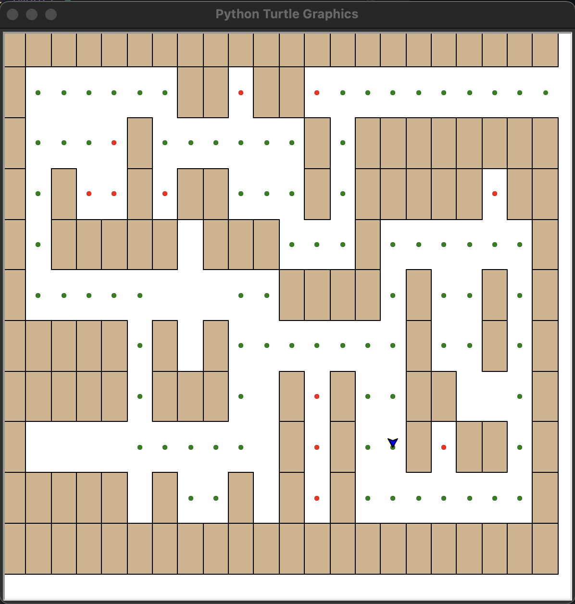

# 实验三

## 一. 背景知识
递归思想及相关应用


## 二. 目的要求
1. 理解某些复杂问题可以通过简单的递归实现
2. 学习如何构建递归程序
3. 实现问题的递归解法
4. 理解计算机系统如何实现递归


## 三. 实验内容
1. 利用递归将任意整数转换成以2~16为进制基数的字符串
2. 用turtle模块递归地绘制螺旋线和分形树
3. 绘制谢尔平斯基三角形
4. 利用递归算法解决汉诺塔问题
5. 利用递归算法解决迷宫问题
6. 分别用递归和动态规划实现零钱兑换

### 进阶
1. 写一个程序来解决这样一个问题：有2个坛子，其中一个的容量是4加仑，另一个的是3加仑。坛子上都没有刻度线。可以用水泵将它们装满水。如何使4加仑的坛子最后装有2加仑的水？
2. 假设一个计算机科学家兼艺术大盗闯入美术馆。他只能用一个容量为W磅的背包来装盗取的艺术品，并且他对每一件艺术品的价值和重量了如指掌。他会如何写一个动态规划程序来帮助自己最大程度地获利呢？下面的例子可以帮助你思考：假设背包容量是20磅，艺术品为5件
   
    | 艺术品 | 重量 | 价值 |
    | ------ | ---- | ---- |
    | 1      | 2    | 3    |
    | 2      | 3    | 4    |
    | 3      | 4    | 8    |
    | 4      | 5    | 8    |
    | 5      | 9    | 10   |


## 四. 实验结果
1. 利用递归将任意整数转换成以2~16为进制基数的字符串
- 测试代码
```python
from convertToString import *

print(toStr(255, 16))
print(toStr(127, 2))
print(toStr(33, 3))
print(toStr(128, 8))
```

- 测试输出
```
FF
1111111
1020
200
```

2. 用turtle模块递归地绘制螺旋线和分形树
- 测试代码
```python
from drawSpiral import *
from drawTree import *

myTurtle = Turtle()
myWin = myTurtle.getscreen()

# 绘制螺旋线
drawSpiral(myTurtle, 100)
time.sleep(3)
myWin.reset()
myTurtle.home()

# 绘制分形树
myTurtle.right(90)
myTurtle.penup()
myTurtle.forward(200)
myTurtle.pendown()
myTurtle.right(180)
tree(myTurtle, 100)
time.sleep(3)
myWin.reset()
myTurtle.home()
```

- 测试输出


3. 绘制谢尔平斯基三角形
- 测试代码
```python
from drawTriangle import *

myTurtle = Turtle()
myWin = myTurtle.getscreen()

myPoints = [(-250, -125), (0, 250), (250, -125)]
sierpinski(myPoints, 5, myTurtle)
time.sleep(3)
myWin.reset()
myTurtle.home()
```

- 测试输出


4. 利用递归算法解决汉诺塔问题
- 测试代码
```python
from hanoiTower import *

moveTower(2, 1, 3, 2)
print()
moveTower(3, 1, 3, 2)
print()
```

- 测试输出
```
moving disk from 1 to 2

moving disk from 1 to 3

moving disk from 2 to 3


moving disk from 1 to 3

moving disk from 1 to 2

moving disk from 3 to 2

moving disk from 1 to 3

moving disk from 2 to 1

moving disk from 2 to 3

moving disk from 1 to 3

```

5. 利用递归算法解决迷宫问题
- 测试代码
```python
from mazeExplore import *

myTurtle = Turtle()
myWin = myTurtle.getscreen()

myMaze = Maze("mazefile.txt", myTurtle)
# 在屏幕上绘制迷宫
myMaze.drawMaze()
# 开始探索迷宫
searchFrom(myMaze, myMaze.startRow, myMaze.startCol)
time.sleep(3)
myWin.reset()
myTurtle.home()
```

- 测试输出


6. 分别用递归和动态规划实现零钱兑换
- 测试代码
```python
import time
from makeChange import *

start = time.time()
print(recMakeChange([1, 5, 10, 25], 63))
print("Time cost by recursion way is %fs" %(time.time() - start))
start = time.time()
print(dpMakeChange([1, 5, 10, 25], 63))
print("Time cost by dynamic programming way is %fs" %(time.time() - start))
print()

start = time.time()
print(recMakeChange([1, 5, 10, 21, 25], 63))
print("Time cost by recursion way is %fs" %(time.time() - start))
start = time.time()
print(dpMakeChange([1, 5, 10, 21, 25], 63))
print("Time cost by dynamic programming way is %fs" %(time.time() - start))
print()
```

- 测试输出
```
6
Time cost by recursion way is 14.094686s
6
Time cost by dynamic programming way is 0.000031s

3
Time cost by recursion way is 7.182629s
3
Time cost by dynamic programming way is 0.000036s
```

7. 写一个程序来解决这样一个问题：有2个坛子，其中一个的容量是4加仑，另一个的是3加仑。坛子上都没有刻度线。可以用水泵将它们装满水。如何使4加仑的坛子最后装有2加仑的水
- 测试代码
```python
from fillWater import *

waterFilling(4, 3, 2)
```

- 测试输出
```
Fill the small jar
Pour the small jar into the big one
Now the big jar has 3 gallons of water
Now the small jar has 0 gallons of water

Fill the small jar
Pour the small jar into the big one
Now the big jar has 4 gallons of water
Now the small jar has 2 gallons of water

Pour the water out of the big jar

Pour the small jar into the big one
Now the big jar has 2 gallons of water
Now the small jar has 0 gallons of water
```

8. 假设一个计算机科学家兼艺术大盗闯入美术馆。他只能用一个容量为W磅的背包来装盗取的艺术品，并且他对每一件艺术品的价值和重量了如指掌。他会如何写一个动态规划程序来帮助自己最大程度地获利呢？下面的例子可以帮助你思考：假设背包容量是20磅，艺术品为5件
- 测试代码
```python
from stealArtworks import *

a = [(2, 3), (3, 4), (4, 8), (5, 8), (9, 10)]
print(knapsackProblem(a, 20))
```

- 测试输出
```
[26, [(3, 4), (5, 8), (9, 10)]]
```


## 五. 实验总结
- 理解某些复杂问题可以通过简单的递归实现——汉诺塔问题、求斐波那契数列中的项
- 学习如何构建递归程序：三原则
  - 递归算法必须有基本情况
  - 递归算法必须改变其状态并向基本情况靠近
  - 递归算法必须递归地调用自己
- 实现问题的递归解法
- 理解计算机系统如何实现递归——隐式地调用系统分配的栈空间来实现递归

