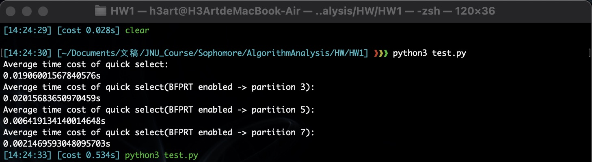

# Algorithm Homework 1

<!-- TOC -->

- [Algorithm Homework 1](#algorithm-homework-1)
  - [Coding](#coding)
    - [The inplementation of Quick Select](#the-inplementation-of-quick-select)
    - [The implementation of BFPRT Quick Select(Median of median module)](#the-implementation-of-bfprt-quick-selectmedian-of-median-module)
    - [The implementation of BFPRT Quick Select(Quick Select module)](#the-implementation-of-bfprt-quick-selectquick-select-module)
  - [Testing](#testing)
    - [Testing Data Generation](#testing-data-generation)
    - [Control Group](#control-group)
    - [Testing Preparation](#testing-preparation)
    - [Result](#result)
      - [Testing 1](#testing-1)
      - [Testing 2](#testing-2)
      - [Testing 3](#testing-3)
      - [Testing 4](#testing-4)
      - [Testing 5](#testing-5)
      - [Testing 6](#testing-6)
    - [Conclusion](#conclusion)

<!-- /TOC -->

## Coding
Write programs to implement the **SELECT($S$, $i$)** algorithm. Any programming language is allowed. However, **Python/C++/Java** is recommended.

### The inplementation of Quick Select

```python
'''
In the testing part, I found the recursive version
of quick selection will lead to stack overflow, it
cannot execute when the data size greater than about 1200.

Therefore, I modified this inplementation from recursive way 
to iterative way.
'''


class Selector:
    def __init__(self, array: list) -> None:
        self.array = array.copy()

    # Iterative quick selection
    def selectionIterative(self,  nthIndex: int) -> int:
        # Set the final element of array as the pivot
        pivot = self.array[len(self.array) - 1]

        # First Partition
        lowerSide = [element for element in self.array if element < pivot]
        midSide = [element for element in self.array if element == pivot]
        biggerSide = [element for element in self.array if element > pivot]

        lenOfLowerSide = len(lowerSide)
        lenOfMidSide = len(midSide)

        # Iteratively Selection
        # Caution:
        # range(a, b) -> [a, b)
        while (nthIndex not in range(lenOfLowerSide, lenOfLowerSide + lenOfMidSide)):
            if (nthIndex in range(0, lenOfLowerSide)):
                tempArray = lowerSide
            else:
                tempArray = biggerSide
                nthIndex = nthIndex - lenOfLowerSide - lenOfMidSide

            pivot = tempArray[len(tempArray) - 1]

            lowerSide = [element for element in tempArray if element < pivot]
            midSide = [element for element in tempArray if element == pivot]
            biggerSide = [element for element in tempArray if element > pivot]

            lenOfLowerSide = len(lowerSide)
            lenOfMidSide = len(midSide)

        return pivot
```

### The implementation of BFPRT Quick Select(Median of median module)

```python
'''
Actually the built-in sort() method is faster than this insertSort()

However, it can reduce the time-complexity constant to a very low magnitude,
which makes the test become:

"The larger the partition gap I set, the faster algorithm it performs...?"

I still use my insertSort() in here.
'''


class MedianFinder:
    def __init__(self, gap: int, array: list) -> None:
        self.array = array.copy()
        self.partitionGap = gap

    def insertSort(self, array: list) -> None:
        for i in range(1, len(array)):
            key = array[i]
            j = i-1
            while j >= 0 and key < array[j]:
                array[j+1] = array[j]
                j -= 1
            array[j+1] = key

    def medianOfMedian(self) -> int:
        length = len(self.array)

        # Use while() loop instead of recursion to find median of median
        while (length > self.partitionGap):
            extraPartition = length % self.partitionGap != 0
            partitionNumber = length // self.partitionGap
            medianArray = []

            for i in range(0, partitionNumber):
                # Life is short, we need python
                tempArray = [
                    element for element in self.array[i * self.partitionGap:(i + 1) * self.partitionGap]
                ]
                self.insertSort(tempArray)
                medianArray.append(
                    tempArray[self.partitionGap // 2]
                )

            if (extraPartition):
                tempArray = [
                    element for element in self.array[partitionNumber * self.partitionGap:]
                ]
                self.insertSort(tempArray)
                medianArray.append(
                    tempArray[len(tempArray) // 2]
                )

            self.array = medianArray
            length = len(self.array)

        self.insertSort(self.array)
        return self.array[length // 2]
```

### The implementation of BFPRT Quick Select(Quick Select module)

```python
'''
Basically the same as the Quick Select
'''

class Selector:
    def __init__(self, array: list) -> None:
        self.array = array.copy()

    def getArray(self) -> list:
        return self.array

    # Iterative BFPRT algorithm
    def selectionEnhanceIterative(self, nthIndex: int, partitionGap: int) -> int:
        # Use median of median algorithm to find the pivot,
        # other parts are basically the same as Quick Select
        pivot = MedianFinder(partitionGap, self.array).medianOfMedian()

        # Partition
        lowerSide = [element for element in self.array if element < pivot]
        midSide = [element for element in self.array if element == pivot]
        biggerSide = [element for element in self.array if element > pivot]

        lenOfLowerSide = len(lowerSide)
        lenOfMidSide = len(midSide)

        while (nthIndex not in range(lenOfLowerSide, lenOfLowerSide + lenOfMidSide)):
            if (nthIndex in range(0, lenOfLowerSide)):
                tempArray = lowerSide
            else:
                tempArray = biggerSide
                nthIndex = nthIndex - lenOfLowerSide - lenOfMidSide

            pivot = MedianFinder(partitionGap, tempArray).medianOfMedian()

            lowerSide = [element for element in tempArray if element < pivot]
            midSide = [element for element in tempArray if element == pivot]
            biggerSide = [element for element in tempArray if element > pivot]

            lenOfLowerSide = len(lowerSide)
            lenOfMidSide = len(midSide)

        return pivot
```


## Testing
Generate an $n$-sized sequence $S$ of random integers ($n ≥ 1000$).
1. Will the **SELECT($S$, $i$)** algorithm find out the $i$th smallest element correctly?
2. Do we have to arrange $S$ into columns of size $5$? Should we get the same result if we arrange $S$ into columns of other size, e.g., $3$ or $7$?

### Testing Data Generation
I design a test data generator, which can generate a test data file with data of given size and whether the data is ordered or unordered(**USER_SETTING** in the code below indicates that you manually determine the data size)

Source Code:

```python
import random


class Generator:
    def __init__(self, fileName: str) -> None:
        self.file = open(fileName, 'w')

    def unorderedGenerate(self, quantity: int, minNum: int, maxNum: int) -> None:
        for i in range(quantity):
            # Caution:
            # The final ' ' will not be deleted in split(' ')
            if (i == quantity - 1):
                self.file.write(str(random.randint(minNum, maxNum)))
            else:
                self.file.write(str(random.randint(minNum, maxNum)) + ' ')

    def orderedGenerate(self, quantity: int, minNum: int, maxNum: int) -> None:
        tempArray = []
        for i in range(quantity):
            tempArray.append(random.randint(minNum, maxNum))
        tempArray.sort()
        for i in range(quantity):
            # Caution:
            # The final ' ' will not be deleted in split(' ')
            if (i == quantity - 1):
                self.file.write(str(tempArray[i]))
            else:
                self.file.write(str(tempArray[i]) + ' ')

    def __del__(self) -> None:
        self.file.close()


def main():
    generator = Generator('testdata.txt')
    scale = USER_SETTING
    generator.orderedGenerate(scale, -scale, scale)
    print('Data have been generated successfully')


if __name__ == '__main__':
    main()
```

### Control Group
check the correctness of result by sorting the $S$ and returning the $i$th element

Source Code:

```python
class Comparator:
    def __init__(self, array: list) -> None:
        self.array = array.copy()

    def selection(self, nthIndex: int) -> int:
        self.array.sort()
        return self.array[nthIndex]
```

### Testing Preparation
- Using the same data set, each selection algorithm was tested for $10$ times in equal gap.
- The average time of selection section consumed was calculated.
- After the selection, `assert()` was used to compare the correctness with the control group.

Hence, I design a **Test** class and **Reader** class for data reading.

Source Code:

```python
from dataReader import Reader
from selector import Selector
from selectorComparator import Comparator
import time


class Reader:
    def __init__(self, fileName) -> None:
        self.file = open(fileName, 'r')
        self.array = []

    def readData(self) -> list:
        self.array = self.file.readline().split(' ')
        self.array = [int(element) for element in self.array]

    def getData(self) -> list:
        return self.array


class Test:
    def __init__(self, fileName: str) -> None:
        self.reader = Reader(fileName)
        self.data = self.reader.readData()
        self.selector = Selector(self.reader.getData())
        self.comparator = Comparator(self.reader.getData())

        # Test index range from 0 to len(data) - 1
        self.testDataLen = len(self.reader.getData())
        # Test 10 positions per data set
        self.testStepLen = self.testDataLen // 10

    def quickSelectTest(self) -> float:
        totalTimeCost = 0
        for i in range(0, self.testDataLen, self.testStepLen):
            startTime = time.time()
            selectResult = self.selector.selectionIterative(i)
            totalTimeCost += time.time() - startTime

            # Judge whether the result is correct
            assert (selectResult == self.comparator.selection(i)
                    ), 'Quick Select algorithm is implemented wrongly.'

        testTimes = self.testDataLen / self.testStepLen
        avgTimeCost = totalTimeCost / testTimes
        return avgTimeCost

    def BFPRTtimeCostTest(self, partitionGap: int) -> float:
        totalTimeCost = 0
        for i in range(0, self.testDataLen, self.testStepLen):
            startTime = time.time()
            selectResult = self.selector.selectionEnhanceIterative(
                i, partitionGap)
            totalTimeCost += time.time() - startTime

            # Judge whether the result is correct
            assert (selectResult == self.comparator.selection(
                i)), 'Quick Select algorithm(BFPRT enabled) is implemented wrongly.'

        testTimes = self.testDataLen / self.testStepLen
        avgTimeCost = totalTimeCost / testTimes
        return avgTimeCost


def main():
    test = Test('testdata.txt')

    print('Average time cost of quick select:')
    print(str(test.quickSelectTest()) + 's')

    for i in range(3, 8, 2):
        print('Average time cost of quick select(BFPRT enabled -> partition {}):'.format(i))
        print(str(test.BFPRTtimeCostTest(i)) + 's')


if __name__ == '__main__':
    main()
```

### Result
The testing was divided into 6 groups:
- Data size: 1000, ordered
- Data size: 1000, unordered
- Data size: 10000, ordered
- Data size: 10000, unordered
- Data size: 100000, ordered
- Data size: 100000, unordered

#### Testing 1


#### Testing 2


#### Testing 3


#### Testing 4


#### Testing 5


#### Testing 6


### Conclusion
As we can see from the testing results:

**\# 1**
The average running time can output in each test, which indicates that the **correctness** of the algorithm implementation **is verified**.

**\# 2**
The original **Quick Select** algorithm **performed very poorly when the test data set was ordered**, obviously its time complexity is $O(n^2)$, but it also became the fastest when data set was unordered. 

It should be attributed to the fact that programmer's own implementation of the data structure was **much slower than the built-in method in python**, but original Quick Select still need to be improved.

**\# 3**
The improved Quick Select algorithm based on BFPRT algorithm can indeed maintain high efficiency in the state of very unbalanced data, and **the size of the partition gap also has a significant impact on the execution efficiency** of the algorithm.

**\# 4**
In theory, the maximum efficiency can be obtained when the partition gap is $5$ in the Median of median algorithm. However, in the actual implementation of python, **a large number of list derivations, assignment, judgment and other operations are used, which cause the algorithm constant to be too large in sublist operations**, the partition gap of $7$(maybe larger) can achieve higher efficiency.