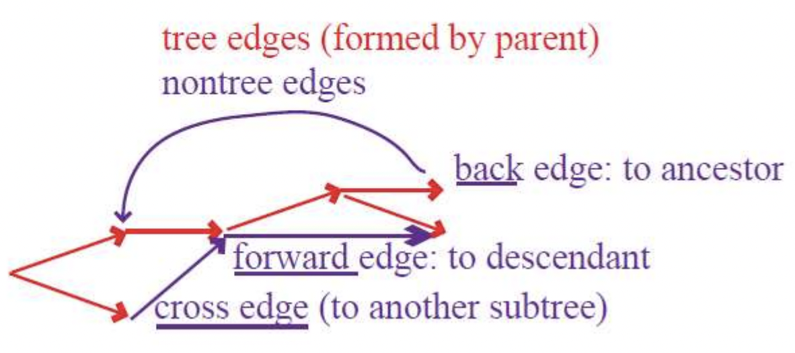
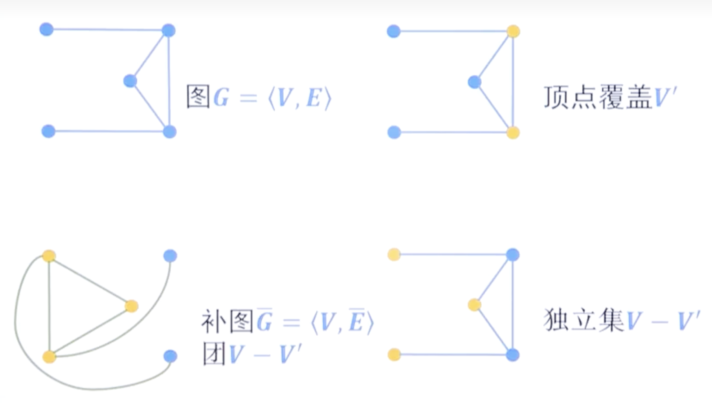

# Final Lecture of Alg

*INFO: Q & A class at 6.19, 18th week Mon.(Online)*

## Review Chapter List

---

### Introduction 简介部分

#### The characteristics of an algorithm
- **Unambiguous确定性/不模棱两可**: every step is deterministic
- **Mechanical可行性**: machine can “understand”
- **Finite有穷性**: can be implemented in limited steps
- **Input/output具备输入输出**: to state the problem size and the result

#### Asymptotic notation: $O$ $\Omega$ $\Theta$
- **Caution**:
  - $\sum_{i=1}^ni^k = \Theta(n^{k+1})$
  - $\sum_{i=1}^n\frac{1}{i} = \Theta(\log n)$
  - $\log n! = \Theta(n\log n)$
  - $n^{\log_ab} = a^{\log_an}$
  - $(\log n)^{\log n} = O(2^{(\log_2n)^2})$
  - $(\log n)^{\log n} = \Omega(n/\log n)$
  - $n! = o(n^n)$

#### Common rules for asymptotic analysis
- **Master Theorem**:
  If $T(n) = aT(\lceil n/b\rceil) + O(n^d)$ for some constants $a > 0$, $b > 1$ and $d ≥ 0$, then
  $$T(n) = \begin{cases}
    O(n^d) & \text{if } d > \log_ba \\
    O(n^d\log_bn) & \text{if } d = \log_ba \\
    O(a^{\log_bn}) = O(n^{\log_ba}) & \text{if } d < \log_ba
  \end{cases}
  $$
- **Recursion Tree**
  - The sum of the values at each level of the tree is the final time complexity
- **Expression Expansion**

---

### Divide-and-Conquer 分治算法

#### Hallmarks: Optimal substructure and independent sub-problem
- **Optimal substructure最优子结构**
- **Independent sub-problem独立子问题**

#### Master theorem and its proof
- **Proof of Master Theorem**:
  - Assume $n$ is a power of $b$
  - The total work done at the $k$th level
  $\displaystyle a^k\times O(\frac{n}{b^k})^d = O(n^d)\times (\frac{a}{b^d})^k$
  - As $k$ goes from $0$ to $\log_bn$, these numbers form a geometric series with ratio $a/b^d$
  1. The ratio is less than $1$, then the series is decreasing, and its sum is just given by the first term, $O(n^d)$
  2. The ratio is greater than $1$, the series is increasing and its sum is given by its last term, $O(n^{\log_ba})$
   $\displaystyle n^d(\frac{a}{b^d})^{\log_bn} = n^d\bigg(\frac{a^{\log_bn}}{(b^{\log_bn})^d}\bigg) = a^{\log_bn} = a^{(\log_an)(\log_ba)} = n^{\log_ba}$
  3. The ratio is exactly $1$, in this case $O(\log_bn)$ terms of the series are equal to $O(n^d)$

#### Merge sort $(O(n\log n))$
- $T(n) = 2T(n/2) + (n - 1)$

#### Selection $(O(n))$

---

### Graph Algorithms 图算法

#### Explore $(O(E))$ and DFS $(O(|V|+|E|))$

#### DAG: topological ordering, Shortest paths $(O(|V|+|E|))$

#### BFS $(O(|V|+|E|))$

#### Dijkstra's algorithm $(O(|V|+|E|)\log|V|)$
- Assume non-negative weight edges

#### Priority queue implementations: array, binary heap and $d$-ary heap
binary heap:
- heapify $O(\log n)$
  - Correct a single violation
- build heap $O(n\log n)$
  - Produce a heap from an unordered array
- heap sort $O(n\log n)$

|Implementation|Delete Min|Insert/Decrease Key|Djikstra's Algorithm Time Cost($\vert V\vert\times\text{Delete Min} + (\vert V\vert+\vert E\vert)\times\text{Insert/Decrease Key}$)|
|-|-|-|-|
|Array|$O(\vert V\vert)$|$O(1)$|$O(\vert V\vert^2)$|
|Binary heap|$O(\log \vert V\vert)$|$O(\log \vert V\vert))$|$O((\vert E\vert + \vert V\vert)\log\vert V\vert)$|
|d-ary heap|$O(\frac{d\log \vert V\vert}{\log d})$|$O(\frac{\log\vert V\vert}{\log d})$|$O((\vert V\vert\cdot d + \vert E\vert）\frac{\log \vert V\vert}{\log d})$|
|Fibonacci heap|$O(\log \vert V \vert)$|$O(1)$(amortized)|$O(\vert V\vert\log\vert V\vert + \vert E\vert)$|

#### Bellman-Ford algorithm $(O(|V||E|))$
- 每次遍历所有顶点$V$，根据顶点的边更新下一次抵达的顶点的最短距离

#### Conversion of graph concept
- **Vertex Cover**顶点覆盖，顶点能够连接图中所有的边
- **Set Cover**集合覆盖，其实相当于顶点覆盖，一个顶点连接的所有边构成一个集合
- **Independent Set**独立集，各顶点之间不存在联系
- **Clique**团，顶点之间两两连接
- **Complement Graph**补图，原来有边的地方没有边，原来没边的地方有边
- **Minimum Spanning Tree**最小生成树，边覆盖，边连接所有顶点，且总权值最小

---

### Greedy Algorithms 贪心算法

#### Tree's propeties
- A tree on $n$ nodes has $n-1$ edges.
- Any connected, undirected graph $G=(V,E)$ with $|E|=|V|-1$ is a tree.
- An undirected graph is a tree if and only if there is a unique path between any pair of nodes

#### MST: Kruskal's algorithm $(O(|V|+|E|)\log|V|)$, Prim's algorithm $(O(|V|+|E|)\log|V)$
||Kruskal's Algorithm|Prim's Algorithm|
|-|-|-|
|Sort all edges?|Yes|No|
|Minimum|The lightest edge in the remaining edges|The lightest edge among the cross edges|
|Data Structure|Disjoint Set(Connect Component)|Binary Heap(Priorty Queue)|
|Time Complexity|$O((\vert V\vert + \vert E\vert)\log \vert V\vert)$|$O((\vert V\vert + \vert E\vert)\log \vert V\vert)$|

#### Disjoint Set
- **Properties**:
  - For any $x \not ={π(x)}$, rank$(x)$ < rank$(π(x))$
  - Any root node of rank $k$ has at least $2^k$ nodes in its tree
  - If there are $n$ elements overall, there can be at most $n/2^k$ nodes of rank $k$ (All the trees have height ≤ $\log n$)
- Proof of Property 2 (at least):
  - merge two trees with height $k$.
- Proof of Property 3 (at most): 
  - $k=0$: forest of n singleton trees with height $0$.
  - $k=1$: $n/2$ single-child trees with height $1$.
  - assume when rank = $k$, the property holds
  - how to produce the most nodes at rank $k+1$? Merge equal-height trees as many as possible so that the number of nodes of rank $k+1$ is at most ($n/2^k)/2$.

#### The cut property
- **Cut🈹️**: Any partition of the vertices into two groups, $S$ and $V-S$.
- **Cut property**: Suppose edges $X$ are part of a minimum spanning tree of $G=(V,E)$. Pick any subset of nodes $S$ for which $X$ does not cross between $S$ and $V-S$, and let $e$ be the lightest edge across this partition. Then $X \cup \{e\}$ is a part of some MST.
- 这段话描述的是图论中MST（最小生成树）的一个重要性质，即在一个由边组成的集合$X$是$G$的最小生成树的情况下，任取$G$的一个点集$S$，选取$S$和$V-S$之间的最轻边$e$，一定有$X\cup \{e\}$ 是$G$的某个最小生成树的一部分。
- Proof of the cut property
  - Assume $X$ is part of some MST $T$, and $e$ is not in $T$
  - Construct a different MST $T'$ containing $X \cup \{e\}$
    - Adding $e$ to $T$ will create a cycle
    - $T' = T\cup \{e\} - \{e'\}$
    - $T'$ has the same number of edges as $T$, so $T'$ is a tree
    - $\text{weight}(T') = \text{weight}(T) + w(e) - w(e')$, since $w(e) ≤ w(e')$, $\text{weight}(T') ≤ \text{weight}(T)$. $T'$ is also a MST

#### Huffman encoding $(O(n\log n))$
- 使用优先队列（二叉树实现）的复杂度为$O(n\log n)$

#### Greedy algorithm for set cover (approximation ratio $\ln n$)
- 这个问题的想法是，每次挑选出连接边数最多一个点，将其加入顶点覆盖的解集中，再将与这个顶点相关的所有边全部删除，以此类推获得顶点覆盖的近似解
- The approximation ratio **depends on $n$**, not a vaild approximation algorithm

---

### Dynamic Programming 动态规划

#### Hallmarks: optimal substructure and overlapping sub-problem
- **Optimal substructure最优子结构**
- **Overlapping sub-problem覆盖子问题**

#### Longest Increasing Subsequence(LIS) $(O(n^2))$
- 题意是要求寻找一个序列中的最长递增子**序列**，记长度为$n$
- 利用动态规划法，采用在线处理思想，维护一个记录与序列元素下标相同的数组，记录以当前位置为结尾的序列所具有的最长递增子序列的长度
- 每次读取到一个新的元素$k$时，将其与前$k-1$个元素比较，若比其中的某个元素$x$大，可以将当前元素$k$的最长递增子序列记录数组记录为$x$元素的记录$+1$
- 因此，总共需要读取$n$个元素，对于每个元素，需要读取比它更小的$k-1$个元素，总体的时间复杂度为$O(n^2)$

#### Edit distance $(O(mn))$
- 题意是求两个字符串间，通过删除、插入或修改这三种操作，将其中一个字符串变换为另一个字符串所需的最小操作次数
- 时间复杂度$O(mn)$，其中$m$指的是第一个字符串的长度，$n$指的是第二个字符串的长度
- 基本思路为：
  - 选定第一个字符串或第二个字符串为参照，这里取第一个字符串为参照
  - 将第二个字符串与第一个字符串进行逐字符比对，记第一个字符串的比较字符为$c_i$，第二个字符串的比较字符为$c_j$，其存在以下几种结果：
    - 字符与原字符串的字符相等（$c_i=c_j$），那么无需进行操作，直接继承双方各个的上一次字符的操作结果
    - 字符与原字符串的字符不相等（$c_i!=c_j$），那么观察继承双方上一个字符是删除、插入或修改操作中哪一个所需的操作次数最小，便采用之，最后加$1$代表此字符进行了操作

#### Knapsack $(O(nW))$
- 背包问题的意思是：给定容量$W$的背包，给定$n$件物品，每件物品有自己对应的价值，也有自己对应的体积，要求取当前条件下背包能放入物品价值的最大值
- 时间复杂度为$O(nW)$，$n$是物品数量，$W$是背包的容量
- 在动态规划算法中，我们需要做的是：
  - 维护一个以背包容量和物品种类数为轴的二维表
  - 每次从一个固定的背包容量开始，开始遍历每个物品种类
    - 若为01背包，对单个物品有取或不取两种选择
    - 若为普通背包，对单个物品可取多件或不取
  - 在取这件物品时，以当前循环下背包的最大容量减去该物品所占的容量，若可以取，再比较取了该物品的价值是否会比当前已记录的最大价值更大

#### Chain matrix multiplication $(O(n^3))$
- 从最小规模的2个矩阵之间相乘开始计算，eg: 2x3与3x4的矩阵相乘需要进行2x3x4次乘法，记录下来
- 接下来从3个矩阵之间相乘开始计算，根据已知的2个矩阵相乘的结果，可以看作找1个矩阵与另一个矩阵（上一次已经求出结果的2个矩阵的乘积）进行相乘，以此类推
- 因此，以整个矩阵相乘链为序，从第i个矩阵到第j个矩阵的最少相乘次数为**min(从第i个矩阵到第k个矩阵的相乘次数 + 从第k+1个矩阵到第j个矩阵的相乘次数 + 这两部分相乘所需的次数)**
- 每次循环都需要从第一个矩阵开始，每次都需要遍历当前规模（2，3，4……直到n），因此实现计算范围的确定（第i个矩阵及第j个矩阵）已经需要$O(n^2)$的复杂度，当我们进入规模内部，需要遍历当前规模下的所有可能两部分矩阵的划分方案，因此也需要$O(m)$的复杂度，$m$指代当前规模的大小，$m ≤ n$因此最终的复杂度为$O(n^3)$

---

### NP-complete NP完全问题

#### P, NP, Reduction, NP-completeness(NPC)
- NP Problem:
  - SAT
  - 3-SAT
  - Independent Set
  - 3D Matching
  - Vertex Cover
  - Clique
  - ZOE
  - Subset Sum
  - ILP
  - Rudrata Cycle
  - TSP

#### Example for reduction
- SAT $\rightarrow$ 3-SAT

- 3-SAT $\rightarrow$ Independent Set
  - 画图，将3-SAT中的每个子句转化为一个三角形的图，然后将诸如$x$的顶点与每个$\bar{x}$的顶点相连，保证$x$与$\bar{x}$不能被同时选取

- Independent Set $\rightarrow$ Vertex Cover
  - 独立集与顶点覆盖的关系是：在一个图$G$中，所有的顶点$V$，记一个顶点覆盖的顶点集合为$S$，那么$V-S$就是一个独立集；反之亦然

- Independent Set $\rightarrow$ Clique
  - 独立集与团的关系是：在一个图$G$中，取其补图$G'$，即有边的地方没有边，没有边的地方有边，那么原来的独立集在补图中就是一个团

- 3D Matching $\rightarrow$ SAT

- Rudrata Cycle $\rightarrow$ SAT

 
#### Approximated algorithm for vertex cover(approximation ratio 2)
- 这个问题的想法是，每次挑选出一条边，边两端的顶点加入顶点覆盖的解集中，再将与这两个顶点相关的所有边全部删除，以此类推获得顶点覆盖的近似解
- The approximation ratio is **constant**
- A vertex cover of a graph $G = (V, E)$ is a subset of vertices $S \subseteq V$ that includes at least one endpoint of every edge in $E$. Give a $2$-approximation algorithm for the following task.
  - Let $U \subseteq E$ be the set of all the edges that are picked by **Approximation_Vertex_Cover**. The optimal vertex cover must include at least one endpoint of each edge in $U$(and other edges). Furthermore, no two edges in $U$ share an endpoint. Therefore, $|U|$ is a lower bound for $C_\text{opt}$. Namely, $C_\text{opt} ≥ |U|$. The number of vertices in $V'$ returned by **Approximation_Vertex_Cover** is $2\cdot|U|$. Therefore, $C = |V'| = 2\cdot|U| ≤ 2C_\text{opt}$. Hence, $C ≤ 2\cdot C_\text{opt}$.