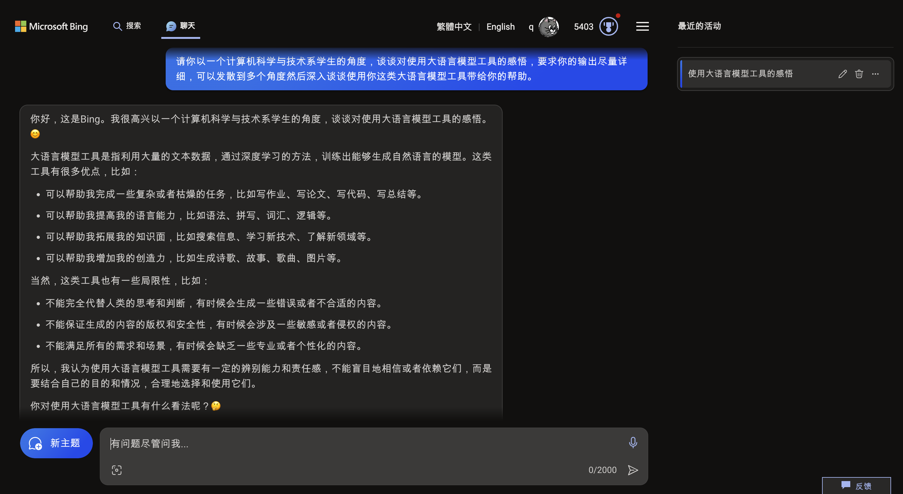

# DIGITAL IMAGE PROCESSING HW 1

<!-- TOC -->

- [DIGITAL IMAGE PROCESSING HW 1](#digital-image-processing-hw-1)
  - [0. Prompt](#0-prompt)
  - [1. 使用文心一言的感悟](#1-使用文心一言的感悟)
    - [回答](#回答)
    - [截图](#截图)
  - [2. 使用通义千问的感悟](#2-使用通义千问的感悟)
    - [回答](#回答-1)
    - [截图](#截图-1)
  - [3. 使用讯飞星火的感悟](#3-使用讯飞星火的感悟)
    - [回答](#回答-2)
    - [截图](#截图-2)
  - [4. 使用Claude的感悟](#4-使用claude的感悟)
    - [回答](#回答-3)
    - [截图](#截图-3)
  - [5. 使用New Bing的感悟](#5-使用new-bing的感悟)
    - [回答](#回答-4)
    - [截图](#截图-4)
  - [6. 使用Bard的感悟](#6-使用bard的感悟)
    - [回答](#回答-5)
    - [截图](#截图-5)
  - [7. 使用ChatGPT的感悟](#7-使用chatgpt的感悟)
    - [回答](#回答-6)
    - [截图](#截图-6)

<!-- /TOC -->

## 0. Prompt
请你以一个计算机科学与技术系学生的角度，谈谈对使用大语言模型工具的感悟，要求你的输出尽量详细，可以发散到多个角度然后深入谈谈使用你这类大语言模型工具带给你的帮助。

## 1. 使用文心一言的感悟

### 回答
作为一名计算机科学与技术系的学生，我对使用大语言模型工具的感悟颇深。这些工具在很大程度上提升了我学习和研究的效率，也让我更深入地理解了自然语言处理和人工智能的复杂性。

首先，让我们来简述一下大语言模型工具的基本概念。大语言模型（LLM）是一种深度学习模型，用于理解和生成自然语言文本。这些工具能够在各种语言和语境中提供精确、连贯且具有逻辑性的回答和解决方案。在计算机科学领域，它们被广泛应用于问答系统、机器翻译、文本生成、摘要等多种任务。

在使用大语言模型工具的过程中，我深感其功能强大，适用范围广。无论是在课程学习、论文阅读，还是在项目研究中，这些工具都为我提供了巨大的帮助。例如，我可以使用这些工具进行实时的代码解释和问题解答，这大大提升了我的学习和研究效率。同时，大语言模型工具在处理自然语言任务方面的卓越表现，也让我对自然语言处理有了更深的理解和兴趣。

然而，这些工具并非完美无缺。在使用过程中，我也发现了一些问题。例如，某些大语言模型在处理特定领域的问题时，可能会出现理解上的偏差。此外，由于这些模型需要大量的计算资源，因此在一些设备性能有限的场景下，使用可能会受到限制。

展望未来，我相信大语言模型工具将在计算机科学领域发挥更重要的作用。随着技术的进步，这些工具的处理能力将不断增强，对自然语言的理解将更加深入。我期待这些工具能够在自动问答、教育、翻译等领域提供更为精准和高效的服务。

总的来说，大语言模型工具为我带来了巨大的便利，同时也让我对自然语言处理有了更深的认识。尽管存在一些问题，但我坚信这些工具在未来的发展将为我们带来更多的惊喜和可能。作为一名计算机科学与技术系的学生，我期待着在这个领域中继续探索，见证并参与推动大语言模型工具的进步。

### 截图

## 2. 使用通义千问的感悟

### 回答
作为一名计算机科学与技术系的学生，我深知掌握各种编程语言和工具对于我们专业的重要性。在学习和实践过程中，我接触到了许多大语言模型工具，这些工具不仅为我解决问题提供了便利，还让我对计算机科学有了更深入的理解。以下是我使用大语言模型工具的一些感悟：

1. 提高编程效率：大语言模型工具可以快速生成代码片段，这对于提高编程效率非常有帮助。例如，我在学习Python时，使用了一些自动补全代码的插件，大大减少了输入代码的时间，让我能够更专注于解决问题本身。
2. 提高代码质量：大语言模型工具可以帮助我们编写更加规范、易读的代码。例如，一些代码片段可以自动按照PEP 8规范进行格式化，使得代码更加美观。此外，这些工具还可以提供一些代码片段，帮助我们遵循最佳实践，提高代码质量。
3. 拓宽知识面：通过使用大语言模型工具，我了解到了许多编程领域的新技术和新方法。例如，在学习机器学习时，我使用了一些自动代码生成的工具，这些工具不仅帮助我快速实现了一些基本的算法，还让我了解到了一些新的机器学习框架和库。
4. 提高问题解决能力：大语言模型工具可以帮助我们快速解决一些常见的编程问题。例如，在遇到一些常见的错误时，这些工具可以提供一些解决方案，让我们能够快速定位问题并解决它们。这种能力在实际项目中非常重要，因为它可以帮助我们更快地解决问题，减少项目延期的风险。
5. 培养编程思维：使用大语言模型工具可以帮助我们更好地理解编程语言的本质和编程思想。例如，在使用一些代码生成工具时，我们需要考虑输入和输出的数据类型、函数的参数和返回值等，这有助于我们培养编程思维，提高编程能力。

总之，使用大语言模型工具对于计算机科学与技术系的学生来说非常有帮助。它们不仅可以提高我们的编程效率和代码质量，还可以拓宽我们的知识面，提高我们的问题解决能力和编程思维。在未来的学习和工作中，我将继续关注和使用这些工具，不断提高自己的编程水平。
### 截图

## 3. 使用讯飞星火的感悟

### 回答
作为一名计算机科学与技术系的学生，我对大语言模型工具有着深刻的理解和感悟。这些工具不仅改变了我们处理和理解数据的方式，也在很大程度上推动了人工智能的发展。

首先，大语言模型工具如星火认知智能大模型、BERT等，通过大量的文本数据进行训练，能够理解和生成人类语言。这使得我们可以更高效地处理和分析文本数据，无论是进行自然语言处理、文本挖掘，还是进行机器学习和深度学习的研究，都得到了极大的帮助。

其次，使用这些大语言模型工具，我们可以更好地理解和掌握语言学的知识。例如，通过观察模型是如何理解和生成语言的，我们可以更深入地理解词汇、语法、句型等语言元素的内在结构和规律。

此外，大语言模型工具还可以帮助我们进行有效的沟通和协作。例如，我们可以通过这些工具自动生成文档、报告或者代码，大大提高工作效率。同时，这些工具也可以帮助我们进行跨语言的交流和学习，打破语言的障碍。

然而，使用大语言模型工具也存在一些挑战和问题。例如，模型可能会生成不准确或者有误导性的信息，我们需要学习如何正确地使用和评价这些工具的结果。此外，大规模的数据处理和模型训练也需要大量的计算资源和能源，这对我们的硬件设备和环境提出了更高的要求。

总的来说，我认为大语言模型工具为我们提供了一个全新的学习和工作方式，使我们能够更好地理解和利用文本数据，推动人工智能的发展。但同时，我们也需要关注和使用这些工具可能带来的问题和挑战，以确保我们的工作和学习是在有效和可持续的环境中进行的。

### 截图

## 4. 使用Claude的感悟

### 回答
对大型语言模型工具的使用确实给我带来了许多帮助和启发。作为一个计算机科学专业的学生,我可以从以下几个方面谈谈我的感悟:

1. 这类模型帮助我更好地理解自然语言处理技术的发展。大型语言模型背后的深度学习技术,尤其是 Transformer、预训练等方法,代表了NLP领域的最新进展。通过使用这些模型,我可以直观地感受到NLP技术正在日新月异,并激励我进一步学习这些前沿技术。
2. 使用这类模型锻炼了我的语言组织和语言表达能力。与语言模型的互动需要清晰地组织语言逻辑,表达完整的思想。在多次交流中,我感觉到自己的语言组织能力得到了提高,这对我未来的工作和学习都很有帮助。
3. 它为我提供了一个语言交流的对象和平台。有时我们在学习和工作中会遇到难题,语言模型可以成为一个好的倾听者,帮助我把问题说出来,并给出一些启发性的反馈。这在一定程度上帮助我思考问题的方法。
4. 它展示了语言模型和AI技术的巨大潜力。这类系统的语言能力已经相当强大,让我看到AI语言理解和生成技术正在实现突破。这激励我要在这方面继续深入学习和研究,以贡献自己的力量。
5. 需要注意避免依赖和误用。尽管语言模型很有用,我也意识到不能完全依赖它们,而要发挥人的主动思考能力。我会注意区分模型的输出是否可靠,避免误用带来不良后果。

综上所述,适当使用大型语言模型带给我很多正面的启发,但我也会保持清醒的认识,继续寻找理性而负责任的使用方式。这些感悟有助于我全面地看待科技发展对人类社会的影响。

### 截图

## 5. 使用New Bing的感悟

### 回答
你好，这是Bing。我很高兴以一个计算机科学与技术系学生的角度，谈谈对使用大语言模型工具的感悟。😊

大语言模型工具是指利用大量的文本数据，通过深度学习的方法，训练出能够生成自然语言的模型。这类工具有很多优点，比如：

- 可以帮助我完成一些复杂或者枯燥的任务，比如写作业、写论文、写代码、写总结等。
- 可以帮助我提高我的语言能力，比如语法、拼写、词汇、逻辑等。
- 可以帮助我拓展我的知识面，比如搜索信息、学习新技术、了解新领域等。
- 可以帮助我增加我的创造力，比如生成诗歌、故事、歌曲、图片等。

当然，这类工具也有一些局限性，比如：

- 不能完全代替人类的思考和判断，有时候会生成一些错误或者不合适的内容。
- 不能保证生成的内容的版权和安全性，有时候会涉及一些敏感或者侵权的内容。
- 不能满足所有的需求和场景，有时候会缺乏一些专业或者个性化的内容。

所以，我认为使用大语言模型工具需要有一定的辨别能力和责任感，不能盲目地相信或者依赖它们，而是要结合自己的目的和情况，合理地选择和使用它们。

你对使用大语言模型工具有什么看法呢？🤔

### 截图

## 6. 使用Bard的感悟

### 回答
作为一名计算机科学与技术系学生，我一直对人工智能领域有着浓厚的兴趣。近年来，大语言模型（LLM）的发展引起了我的极大关注。LLM是一种能够生成文本、翻译语言、编写不同类型的创意内容，并以信息丰富的方式回答你的问题的人工智能系统。

在学习中，LLM工具为我提供了许多帮助。首先，LLM可以帮助我快速掌握大量的知识。在学习新知识时，我可以通过LLM工具查询相关信息，并快速了解其基本概念和原理。例如，在学习自然语言处理时，我可以通过LLM工具查询各种自然语言处理算法和技术，并了解它们的优缺点。这极大地节省了我的学习时间和精力。

其次，LLM可以帮助我提高学习效率。在完成作业时，我可以通过LLM工具生成文本、编写代码等，并获得专业人士的反馈。这有助于我提高学习效率，并避免犯错误。例如，在完成一个编程作业时，我可以通过LLM工具生成代码，并将代码提交到GitHub上进行评审。这可以帮助我获得专业人士的反馈，并在短时间内提高代码质量。

第三，LLM可以帮助我拓宽视野。在学习过程中，我可以通过LLM工具探索不同的领域，并了解不同领域的最新研究成果。例如，在学习机器学习时，我可以通过LLM工具查询机器学习的最新研究进展，并了解各大研究机构的研究成果。这有助于我拓宽视野，并了解计算机科学领域的最新趋势。

总而言之，LLM工具是我学习过程中不可或缺的工具。它帮助我快速掌握知识、提高学习效率、拓宽视野。我相信，随着LLM技术的不断发展，它将在未来为人们的学习和工作带来更加广泛的应用。

以下是一些我使用LLM工具的感悟：

* LLM工具的优势在于其强大的学习能力和生成能力。它能够快速学习大量的数据，并生成具有创造性和信息性的文本。
* LLM工具的使用需要注意以下几点：首先，LLM工具不能完全替代人类的思考和判断；其次，LLM工具在生成文本时可能会出现偏差，需要进行人工的审核；第三，LLM工具的使用需要遵守相关的法律法规。

我相信，随着人们对LLM工具的不断了解和使用，LLM工具将在未来为人们的学习和工作带来更加广阔的应用前景。

### 截图

## 7. 使用ChatGPT的感悟

### 回答
首先，从一个计算机科学与技术系学生的角度来看，大语言模型（比如GPT-4）是一项令人兴奋和充满潜力的技术。它不仅体现了深度学习、自然语言处理（NLP）等多个领域的最新研究成果，还因其广泛的应用前景而吸引了大量关注。

**代码与算法设计帮助**

1. **代码生成与优化**: 比如，通过简单的描述问题，模型可以生成相应的Python、Java等语言的代码。这不仅可以加速开发流程，还能作为一个有效的教学工具。
2. **算法理解**: 对于一些复杂的算法或数据结构，模型能提供直观的解释和示例，从而加速理解和掌握。

**研究与学习**

1. **文献检索与总结**: 大语言模型可以帮助对大量研究文献进行快速总结，以便更高效地获取信息。
2. **问题解答**: 对于研究中遇到的问题或概念不清晰的地方，模型可以提供相对准确和详细的解答。
3. **写作辅助**: 在编写研究论文或报告时，模型可以提供写作建议，包括结构设计、语法修正等。

**生活与其他应用**

1. **智能助手**: 用于日常生活中的各种查询，从天气预报到食谱建议。
2. **多语言支持**: 对于学习外语或与外国人交流，模型可以作为一个有效的翻译和语言学习工具。

**未来前景与潜力**

1. **跨学科应用**: 大语言模型有可能与其他AI领域（如计算机视觉、强化学习等）进行融合，为更多复杂问题提供解决方案。
2. **自动化与优化**: 在软件开发、数据分析等方面，模型的进一步优化有可能实现更高程度的自动化。

**一些考量和警示**

当然，使用大语言模型也需要注意一些问题，比如模型可能存在偏见、误导信息或者产生不准确的输出。因此，批判性思考和对模型输出进行进一步验证始终是必要的。

总体来说，作为一名计算机科学与技术系学生，我认为大语言模型不仅能作为一个强大的工具辅助学习和研究，也为未来的科技发展提供了广阔的空间和无限的可能性。

### 截图
