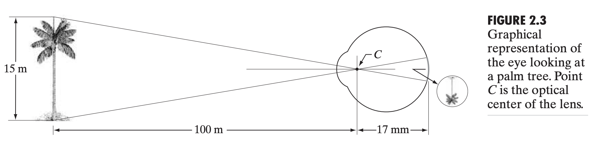
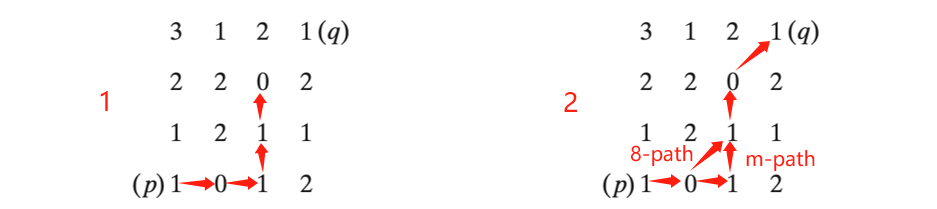
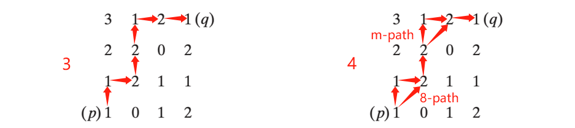

# DIGITAL IMAGE PROCESSING HW 3

> Using *Digital Image Processing 3rd Edition*
>
> pp.121-125
> 
> Problem: 2.1, 2.3, 2.5, 2.11, 2.12, 2.15

## Problem 2.1
Using the background information provided in Section 2.1, and thinking purely in geometric terms, estimate the diameter of the smallest printed dot that the eye can discern if the page on which the dot is printed is $0.2$ m away from the eyes. Assume for simplicity that the visual system ceases to detect the dot when the image of the dot on the fovea becomes smaller than the diameter of one receptor (cone) in that area of the retina. Assume further that the fovea can be modeled as a square array of dimensions $1.5 \mathrm{mm} \times 1.5 \mathrm{mm}$ and that the cones and spaces between the cones are distributed uniformly throughout this array.

> **Solution**:
>
> The diameter $x$ of the retinal image corresponding to the dot can be determined using similar triangles. This relationship is given by $\displaystyle \frac{d/2}{0.2} = \frac{x/2}{0.017}$, which simplifies to $x = 0.085d$. We can conceptualize the fovea as a square sensor array with approximately $3.37 \times 10^5$ elements. This is equivalent to an array comprising $580 \times 580$ elements. With uniform spacing between these elements, there are $580$ elements and $579$ spaces along a length of $1.5\mathrm{mm}$. Consequently, the size of each element and space is $\displaystyle s = \frac{1.5\mathrm{mm}}{1159} = 1.3 \times 10^{-6} \mathrm{m}$. If the size of the dot image on the fovea is smaller than the size of one resolution element, the eye is presumed to be unable to perceive the dot. In other terms, the eye won't detect a dot if its diameter $d$ meets the condition $0.085d < 1.3 \times 10^{-6} \mathrm{m}$ or $d < 15.3 \times 10^{-6} \mathrm{m}$.

## Problem 2.3
Although it is not shown in Fig. 2.10, alternating current certainly is part of the electromagnetic spectrum. Commercial alternating current in the United States has a frequency of $60 \mathrm{Hz}$. What is the wavelength in kilometers of this component of the spectrum?

> **Solution**:
> 
> According to the relationship between the wavelength and frequency of light, we can calculate: $\displaystyle\lambda = c / \nu = \frac{2.998 × 10^8 \mathrm{m/s}}{60 \mathrm{Hz}} = 4.997 × 10^6 \mathrm{m} = 4997 \mathrm{km}$.

## Problem 2.5
A CCD camera chip of dimensions $7 \times 7$ mm, and having $1024 \times 1024$ elements, is focused on a square, flat area, located $0.5$ m away. How many line pairs per mm will this camera be able to resolve? The camera is equipped with a $35$-$\mathrm{mm}$ lens. (Hint: Model the imaging process as in Fig. 2.3, with the focal length of the camera lens substituting for the focal length of the eye.)

> **Solution**:
> 
> Based on the geometry depicted in Fig. 2.3, the relationship $\displaystyle\frac{7\mathrm{mm}}{35\mathrm{mm}}=\frac{z}{500\mathrm{mm}}$ holds, yielding $z = 100\mathrm{mm}$. Thus, the side length of the target is $100\mathrm{mm}$. With a total of $1024$ elements per line, the resolution is $1024/100 =10\space\mathrm{elements/mm}$ for a single line. Considering line pairs, this value is halved, resulting in a resolution of $5\space\mathrm{lp/mm}$.

## Problem 2.11
Consider the two image subsets, $S_1$ and $S_2$ shown in the following figure. For $V = \{1\}$ determine whether these two subsets are (a) $4$-adjacent, (b) $8$-adjacent, or (c) $m$-adjacent.

> **Solution**:
> 
> Let $p$ and $q$ be as shown in figure as follows. 
>
> 
> 
> (a) $S_1$ and $S_2$ are not $4$-connected because $q$ is not in the set $N_4(p)$.
> (b) $S_1$ and $S_2$ are $8$-connected because $q$ is in the set $N_8(p)$.
> (c) $S_1$ and $S_2$ are $m$-connected because q is in $N_D(p)$, and the set $N_4(p) ∩ N_4(q)$ is empty.

## Problem 2.12
Develop an algorithm for converting a one-pixel-thick $8$-path to a $4$-path.

> **Solution**:
> 
> The solution to this problem involves identifying all potential neighborhood shapes that transition from a diagonal segment to its corresponding $4$-connected segments. Whenever a diagonal segment is encountered along the boundary, the algorithm efficiently searches for the appropriate match.

## Problem 2.15
Consider the image segment shown.
(a) Let $V=\{0, 1\}$ and compute the lengths of the shortest $4$-, $8$-, and $m$-path between $p$ and $q$. If a particular path does not exist between these two points, explain why.
(b) Repeat for $V = \{1, 2\}$.

> **Solution**:
> 
> (a) When $V = \{0,1\}$, $4$-path does not exist between $p$ and $q$ because it is impossible to get from $p$ to $q$ by traveling along points that are both $4$-adjacent and also have values from $V$. Figure 1 shows this condition; it is not possible to get to $q$. The shortest $8$-path is shown in figure 2; its length is $4$. The length of the shortest $m$-path is $5$. Both of these shortest paths are unique in this case.
>
> 
> 
> (b) One possibility for the shortest $4$-path when $V = \{1,2\}$ is shown in figure 3; its length is $6$. One possibility for the shortest $8$-path is shown in figure 4; its length is $4$. The length of a shortest $m$-path is $6$. These paths are not unique.
> 
> 