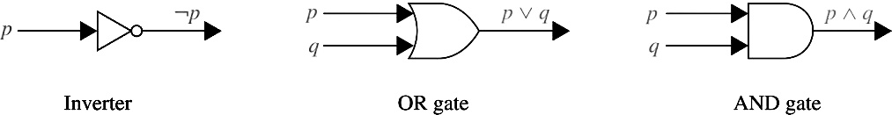

# $Discrete\space{Mathematics}\space{\mathrm{I}}\space{Review}$

$\displaystyle\mathrm{By\space21\space{CST}\space{H3Art}}$

## Chapter 1 The Foundations: Logic and Proofs

### Terms
**proposition命题**: a statement that is true or false

**propositional variable命题变量**: a variable that represents a proposition

**truth value真值**: true or false

**$¬p$(negation of $p$)否**: the proposition with truth value opposite to the truth value of $p$

**logical operators逻辑运算符**: operators used to combine propositions

**compound proposition复合命题**: a proposition constructed by combining propositions using logical operators

**truth table真值表**: a table displaying all possible truth values of propositions

**$p∨q$(disjunction of $p$ and $q$)析取**: the proposition “$p$ $\mathrm{OR}$ $q$,” which is true if and only if at least one of $p$ and $q$ is true

**$p∧q$(conjunction of $p$ and $q$)合取**: the proposition “$p$ $\mathrm{AND}$ $q$,” which is true if and only if both $p$ and $q$ are true

**$p⊕q$(exclusive or of $p$ and $q$)异或**: the proposition “$p$ $\mathrm{XOR}$ $q$,” which is true when exactly one of $p$ and $q$ is true

**$p→q$($p$ implies $q$)蕴含**: the proposition “if $p$, then $q$,” which is false if and only if $p$ is true and $q$ is false

**converse of $p → q$逆命题**: the conditional statement $q → p$

**contrapositive of $p → q$逆反命题**: the conditional statement $¬q → ¬p$

**inverse of $p → q$反命题**: the conditional statement $¬ p → ¬q$

**$p ↔ q$(biconditional)双条件**: the proposition “$p$ if and only if $q$,” which is true if and only if $p$ and $q$ have the same truth value

**bit位**: either a $0$ or a $1$

**Boolean variable布尔变量**: a variable that has a value of $0$ or $1$

**bit operation位运算**: an operation on a bit or bits

**bit string位串**: a list of bits

**bitwise operations按位运算**: operations on bit strings that operate on each bit in one string and the corresponding bit in the other string

**logic gate逻辑门**: a logic element that performs a logical operation on one or more bits to produce an output bit

**logic circuit逻辑电路**: a switching circuit made up of logic gates that produces one or more output bits 

**tautology永真式/重言式**: a compound proposition that is always true

**contradiction矛盾式**: a compound proposition that is always false

**contingency偶真式**: a compound proposition that is sometimes true and sometimes false

**consistent compound propositions一致的复合命题**: compound propositions for which there is an assignment of truth values to the variables that makes all these propositions true

**satisfiable compound proposition可满足的复合命题**: a compound proposition for which there is an assignment of truth values to its variables that makes it true

**logically equivalent compound propositions逻辑等价复合命题**: compound propositions that always have the same truth values

**predicate谓词**: part of a sentence that attributes a property to the subject

**propositional function命题函数**: a statement containing one or more variables that becomes a proposition when each of its variables is assigned a value or is bound by a quantifier

**domain (or universe) of discourse论域**: the values a variable in a propositional function may take

**$∃x P(x)$ (existential quantification of $P(x)$)存在量词**: the proposition that is true if and only if there exists an $x$ in the domain such that $P(x)$ is true

**$∀x P(x)$ (universal quantification of $P(x)$)全称量词**: the proposition that is true if and only if $P(x)$ is true for every $x$ in the domain

**logically equivalent expressions逻辑等价表达式**: expressions that have the same truth value no matter which propositional functions and domains are used

**free variable自由变量**: a variable not bound in a propositional function

**bound variable绑定变量**: a variable that is quantified

**scope of a quantifier量词的作用范围**: portion of a statement where the quantifier binds its variable

**argument论证**: a sequence of statements

**argument form论证形式**: a sequence of compound propositions involving propositional variables

**premise前提**: a statement, in an argument, or argument form, other than the final one

**conclusion结论**: the final statement in an argument or argument form

**valid argument form有效的论证形式**: a sequence of compound propositions involving propositional variables where the truth of all the premises implies the truth of the conclusion

**valid argument有效的论证**: an argument with a valid argument form

**rule of inference推理规则**: a valid argument form that can be used in the demonstration that arguments are valid

**fallacy谬论**: an invalid argument form often used incorrectly as a rule of inference (or sometimes, more generally, an incorrect argument)

**circular reasoning or begging the question循环推理或乞题**: reasoning where one or more steps are based on the truth of the statement being proved

**theorem定理**: a mathematical assertion that can be shown to be true

**conjecture猜想**: a mathematical assertion proposed to be true, but that has not been proved

**proof证明**: a demonstration that a theorem is true

**axiom公理**: a statement that is assumed to be true and that can be used as a basis for proving theorems

**lemma引理**: a theorem used to prove other theorems

**corollary推论**: a proposition that can be proved as a consequence of a theorem that has just been proved

**vacuous proof空洞证明**: a proof that $p→q$ is true based on the fact that $p$ is false

**trivial proof平凡证明**: a proof that $p→q$ is true based on the fact that $q$ is true

**direct proof直接证明**: a proof that $p→q$ is true that proceeds by showing that $q$ must be true when $p$ is true

**proof by contraposition对位证明**: a proof that $p→q$ is true that proceeds by showing that $p$ must be false when $q$ is false

**proof by contradiction反证法/归谬法**: a proof that $p$ is true based on the truth of the conditional statement $¬p→q$, where $q$ is a contradiction

**exhaustive proof穷举证明**: a proof that establishes a result by checking a list of all possible cases

**proof by cases案例证明**: a proof broken into separate cases, where these cases cover all possibilities

**without loss of generality不失一般性**: an assumption in a proof that makes it possible to prove a theorem by reducing the number of cases to consider in the proof

**counterexample反例**: an element $x$ such that $P(x)$ is false

**constructive existence proof构造性证明**: a proof that an element with a specified property exists that explicitly finds such an element

**nonconstructive existence proof非构造性证明**: a proof that an element with a specified property exists that does not explicitly find such an element

**rational number有理数**: a number that can be expressed as the ratio of two integers $p$ and $q$ such that $q≠0$

**uniqueness proof唯一性证明**: a proof that there is exactly one element satisfying a specified property

### Results
The logical equivalences given in Tables 6, 7, and 8 in Section 1.3

**1.3节的表6、表7和表8中给出的逻辑等价如下**

|Table 6|Logical Equivalences|
|-|-|
|**Equivalence等价**|**Name名称**|
|$p\land\mathrm{T}\equiv{p} \\\\ p\lor\mathrm{F}\equiv{p}$|Identity laws|
|$p\lor\mathrm{T}\equiv\mathrm{T} \\\\ p\land\mathrm{F}\equiv{F}$|Domination laws|
|$p\lor{p}\equiv{p} \\\\ p\land{p}\equiv{p}$|Idempotent laws|
|$\neg(\neg{p})\equiv{p}$|Double negation law|
|$p\lor{q}\equiv{q}\lor{p} \\\\ p\land{q}\equiv{q}\land{p}$|Commutative laws|
|$(p\lor{q})\lor{r}\equiv{p}\lor(q\lor{r}) \\\\ (p\land{q})\land{r}\equiv{p}\land(q\land{r})$|Associative laws|
|$p\lor(q\land{r})\equiv(p\lor{q})\land(p\lor{r}) \\\\ p\land(q\lor{r})\equiv(p\land{q})\lor(p\land{r})$|Distributive laws|
|$\neg(p\land{q})\equiv\neg{p}\lor\neg{q} \\\\ \neg(p\lor{q})\equiv\neg{p}\land\neg{q}$|De Morgan’s laws|
|$p\lor(p\land{q})\equiv{p} \\\\ p\land(p\lor{q})\equiv{p}$|Absorption laws|
|$p\lor\neg{p}\equiv\mathrm{T} \\\\ p\land\neg{p}\equiv\mathrm{F}$|Negation laws|

|Table 7 Logical Equivalences Involving Conditional Statements|
|-|
|**涉及条件语句的逻辑等价**|
|$p\rightarrow{q}\equiv\neg{p}\lor{q}$|
|$p\rightarrow{q}\equiv\neg{q}\rightarrow\neg{p}$|
|$p\lor{q}\equiv\neg{p}\rightarrow{q}$|
|$p\land{q}\equiv\neg(p\rightarrow\neg{q})$|
|$\neg(p\rightarrow{q})\equiv{p}\land\neg{q}$|
|$(p\rightarrow{q})\land(p\rightarrow{r})\equiv{p}\rightarrow(q\land{r})$|
|$(p\rightarrow{r})\land(q\rightarrow{r})\equiv(p\lor{q})\rightarrow{r}$|
|$(p\rightarrow{q})\lor(p\rightarrow{r})\equiv{p}\rightarrow(q\lor{r})$|
|$(p\rightarrow{r})\lor(q\rightarrow{r})\equiv(p\land{q})\rightarrow{r}$|

|Table 8 Logical Equivalences Involving Biconditional Statements|
|-|
|**涉及双条件语句的逻辑等价**|
|$p\leftrightarrow{q}\equiv(p\rightarrow{q})\land(q\rightarrow{p})$|
|$p\leftrightarrow{q}\equiv\neg{p}\leftrightarrow\neg{q}$|
|$p\leftrightarrow{q}\equiv(p\land{q})\lor(\neg{p}\land\neg{q})$|
|$\neg(p\leftrightarrow{q})\equiv{p}\leftrightarrow\neg{q}$|

De Morgan’s laws for quantifiers

**量词的德摩根定律**

Rules of inference for propositional calculus

**命题演算的推理规则**

|Rule Expression规则表示|Name名称|
|-|-|
|$(p\land(p\rightarrow{q}))\xrightarrow{}q$|Modus ponens肯定前件式|
|$(\neg{q}\land(p\rightarrow{q}))\xrightarrow{}\neg{p}$|Modus tollens否定后件式|
|$((p\rightarrow{q})\land(q\rightarrow{r}))\xrightarrow{}(p\rightarrow{r})$|Hypothetical syllogism假言三段论|
|$((p\lor{q})\land\neg{p})\xrightarrow{}q$|Disjunctive syllogism析取三段论|
|$p\xrightarrow{}(p\lor{q})$|Addition附加律|
|$(p\land{q})\xrightarrow{}p$|Simplification化简律|
|$(p\rightarrow{q})\xrightarrow{}(\neg{q}\rightarrow\neg{p})$|Contrapositive逆否律|
|$((p)\land(q))\xrightarrow{}(p\land{q})$|Conjunction合取律|
|$((p\lor{q})\land(\neg{p}\lor{r}))\xrightarrow{}(q\lor{r})$|Resolution消解律|

Rules of inference for quantified statements

**量词语句的推理规则**

|Rule Expression规则表示|Name名称|
|-|-|
|全称命题 推 对任意量|Universal instantiation全称实例化|
|对任意量 推 全称命题|Universal generalization普遍推广|
|存在命题 推 对某个量|Existential instantiation存在实例化|
|对某个量 推 存在命题|Existential generalization存在推广|

### Exercises & Summary
Section 1.1 Ex. 24-e,f,g,h; 32-e  
Section 1.2 Ex. 8-b,d; 42  
Section 1.3 Ex. 12-a  
Section 1.4 Ex. 24-a,b,c,d  
Section 1.5 Ex. 6-a,b,c,d; 20; 24  
Section 1.6 Ex. 6; 14-a,b  
Section 1.7 Ex. 18  
Section 1.8 Ex. 4; 6  

1. **对$p\rightarrow{q}$的不同表示方法(In English)**

    |Expression|$p\rightarrow{q}$|
    |-|-|
    |if $p$, then $q$|$q$ whenever $p$|
    |$p$ implies $q$|$p$ is sufficient for $q$|
    |if $p$, $q$|$q$ follows from $p$|
    |$p$ only if $q$|$q$ is necessary for $p$|
    |$q$ unless $¬p$|a necessary condition for $p$ is $q$|
    |$q$ when $p$|a sufficient condition for $q$ is $p$|
    |$q$ if $p$|
    
2. **真值表的画法示例**

    *$\mathrm{T}$为真，$\mathrm{F}$为假*

    |$p$|$q$|$\neg{p}$|$\neg{p}\land{q}$|
    |-|-|-|-|
    |$\mathrm{T}$|$\mathrm{T}$|$\mathrm{F}$|$\mathrm{F}$|
    |$\mathrm{T}$|$\mathrm{F}$|$\mathrm{F}$|$\mathrm{F}$|
    |$\mathrm{F}$|$\mathrm{T}$|$\mathrm{T}$|$\mathrm{T}$|
    |$\mathrm{F}$|$\mathrm{F}$|$\mathrm{T}$|$\mathrm{F}$|

3. **图示数字电路的与($\mathrm{AND}$)、或($\mathrm{OR}$)、非($\mathrm{NOT}$)门**

    

4. **命题证明的方式**
    
    Terms：Inverse反 Converse逆 Contrapositive逆反

    **(1). Proof by contradiction(反证)**

    Assume the if-statement is true and the inverse of then-conclusion is true.

    假设if后连带的命题为真，then后连带的命题的反(否)命题也为真

    Prove this if-then statement is false, so the original proposition is true.

    证明这个新的if-then命题为假的，因此原命题为真

    **(2). Proof by contraposition(逆反命题)**
    
    Assume the contraposition of then-conclusion is true.

    假设then后连带的命题的逆否命题为真

    Through this premise, prove the contrapositive proposition of the original if-statement is true.

    通过这个前提，证明原来if后连带的命题的逆否命题为真

## Chapter 2 Basic Structures: Sets, Functions, Sequences, Sums, and Matrices

### Terms
**set集合**: a collection of distinct objects

**axiom公理**: a basic assumption of a theory

**paradox悖论**: a logical inconsistency

**element, member of a set集合元素**: an object in a set

**roster method列举法**: a method that describes a set by listing its elements

**set builder notation集合构造器标记法**: the notation that describes a set by stating a property an element must have to be a member

**$∅$(empty set, null set)空集**: the set with no members

**universal set全集**: the set containing all objects under consideration

**Venn diagram文氏图/韦恩图**: a graphical representation of a set or sets

**$S = T$(set equality)集合相等**: $S$ and $T$ have the same elements

**$S ⊆ T$($S$ is a subset of $T$)子集**: every element of $S$ is also an element of $T$

**$S ⫋ T$($S$ is a proper subset of $T$)真子集**: $S$ is a subset of $T$ and $S ≠ T$

**finite set有限集**: a set with $n$ elements, where $n$ is a non-negative integer

**infinite set无限集**: a set that is not finite

**$|S|$(the cardinality of $S$)基数**: the number of elements in $S$(注意，集合必须满足其中元素互不相同)

**$P(S)$(the power set of $S$)幂集**: the set of all subsets of $S$

**$A ∪ B$(the union of $A$ and $B$)并**: the set containing those elements that are in at least one of $A$ and $B$

**$A ∩ B$(the intersection of $A$ and $B$)交**: the set containing those elements that are in both $A$ and $B$

**$A − B$(the difference of $A$ and $B$)差**: the set containing those elements that are in $A$ but not in $B$

**$A ⊕ B$(the symmetric difference of $A$ and $B$)对称差**: the set containing those elements in exactly one of $A$ and $B$(等于$(A - B)∪(B - A)$)

**$Ā$(the complement of $A$)补**: the set of elements in the universal set that are not in $A$

**membership table成员表**: a table displaying the membership of elements in sets

**function from $A$ to $B$ 从$A$到$B$的映射函数**: an assignment of exactly one element of $B$ to each element of $A$

**domain off定义域**: the set $A$, where $f$ is a function from $A$ to $B$

**co-domain off伴域**: the set $B$, where $f$ is a function from $A$ to $B$

**$b$ is the image of $a$ under $f$ 像**: $b = f(a)$

**$a$ is a preimage of $b$ under $f$ 前像**: $f(a) = b$

**range of $f$值域**: the set of images of $f$

**onto function, surjection满射**: a function from $A$ to $B$ such that every element of $B$ is the image of some element in $A$($B$作为值域，它的每个元素都有至少一个$A$中的值映射，允许$f(a_1)=f(a_2)=f(a_3)=b_n$的情况存在)
 
**one-to-one function一对一函数, injection入射**: a function such that the images of elements in its domain distinct(与满射不同，不强制要求$B$的所有元素都存在从$A$中的映射，也不允许$f(a_1)=f(a_2)=f(a_3)=b_n$的情况存在)
 
**one-to-one correspondence一一对应,  bijection双射**: a function that is both one-to-one and onto
 
**inverse of $f$逆**: the function that reverses the correspondence given by $f$ (when $f$ is a bijection)

**$f\space◦\space{g}$(composition of $f$ and $g$)复合函数**: the function that assigns $f(g(x))$ to $x$

**$\lfloor{x}\rfloor$(floor function of $x$)向下取整函数**: the largest integer not exceeding $x$

**$\lceil{x}\rceil$(ceiling function of)$x$ 向上取整函数**: the smallest integer greater than or equal to $x$

**partial function部分函数**: an assignment to each element in a subset of the domain a unique element in the co-domain

**sequence序列**: a function with domain that is a subset of the set of integers

**geometric progression几何级数**: a sequence of the form $a$, $ar$, $ar²$,$...$, where $a$ and $r$ are real numbers

**arithmetic progression算术级数**: a sequence of the form $a$, $a+d$,$a+2d$,$...$, where $a$ and $d$ are real numbers

**string串**: a finite sequence

**empty string空串**: a string of length zero

**recurrence relation递推关系**: a equation that expresses the nth term an of a sequence in terms of one or more of the previous terms of the sequence for all integers n greater than a particular integer

**cardinality基数**: two sets $A$ and $B$ have the same cardinality if there is a one-to-one correspondence from $A$ to $B$

**countable set可数集**: a set that either is finite or can be placed in one-to-one correspondence with the set of positive integers

**uncountable set不可数集**: a set that is not countable

**$ℵ_0$ (aleph null)**: the cardinality of a countable set

**$\frak{c}$实数集的基数**: the cardinality of the set of real numbers

**Cantor diagonalization argument康托对角线论证法(Cantor表)**: a proof technique used to show that the set of real numbers is uncountable

**computable function可计算函数**: a function for which there is a computer program in some programming language that finds its values

**uncomputable function不可计算函数**: a function for which no computer program in a programming language exists that finds its values

**continuum hypothesis连续统假设**: the statement there no set $A$ exists such that $ℵ_0 < |A| < \frak{c}$

**matrix矩阵**: a rectangular array of numbers

**matrix addition矩阵加法**: $A+B=[a_{ij}+b_{ij}]$

**matrix multiplication矩阵乘法**: 

$\begin{bmatrix}
    a_{11}&a_{12}&\dots&a_{1k}
    \\\\
    a_{21}&a_{22}&\dots&a_{2k}
    \\\\
    \vdots&\vdots&\space&\vdots
    \\\\
    a_{i1}&a_{i2}&\dots&a_{ik}
    \\\\
    \vdots&\vdots&\space&\vdots
    \\\\
    a_{m1}&a_{m2}&\dots&a_{mk}
\end{bmatrix}\begin{bmatrix}
    b_{11}&b_{12}&\dots&b_{1j}&\dots&b_{1n}
    \\\\
    b_{21}&b_{22}&\dots&b_{2j}&\dots&b_{2n}
    \\\\
    \vdots&\vdots&\space&\vdots&\space&\vdots
    \\\\
    b_{k1}&b_{k2}&\dots&b_{kj}&\dots&b_{kn}
\end{bmatrix}=\begin{bmatrix}
    c_{11}&c_{12}&\dots&c_{1n}
    \\\\
    c_{21}&c_{22}&\dots&c_{2n}
    \\\\
    \vdots&\vdots&c_{ij}&\vdots
    \\\\
    c_{m1}&c_{m2}&\dots&c_{mn}
\end{bmatrix}$

**$I_n$(identity matrix of order $n$)$n$阶单位阵**: the $n×n$ matrix that has entries equal to $1$ on its diagonal and $0$s elsewhere

$I_n=\begin{bmatrix}
    1&0&\dots&0
    \\\\
    0&1&\dots&0
    \\\\
    \vdots&\vdots&\space&\vdots
    \\\\
    0&0&\dots&1
\end{bmatrix}_{n\times{n}}$

**$A^t$(transpose of $A$)转置矩阵**: the matrix obtained from $A$ by interchanging the rows and columns

**symmetric matrix对称矩阵**: a matrix is symmetric if it equals its transpose

**zero–one matrix $0$-$1$矩阵**: a matrix with each entry equal to either $0$ or $1$

**$A ∧ B$(the meet of A and B) A交B**: 

eg: $A=\begin{bmatrix}
    1&0&1
    \\\\
    0&1&0
\end{bmatrix}\space\space\space{B}=\begin{bmatrix}
    0&1&0
    \\\\
    1&1&0
\end{bmatrix}$

$A\land{B}=\begin{bmatrix}
    1\land0&0\land1&1\land0
    \\\\
    0\land1&1\land1&0\land0
\end{bmatrix}=\begin{bmatrix}
    0&0&0
    \\\\
    0&1&0
\end{bmatrix}$

**$A ∨ B$(the join of A and B) A并B**:

$A\lor{B}=\begin{bmatrix}
    1\lor0&0\lor1&1\lor0
    \\\\
    0\lor1&1\lor1&0\lor0
\end{bmatrix}=\begin{bmatrix}
    1&1&1
    \\\\
    1&1&0
\end{bmatrix}$

**$A\odot{B}$(the Boolean product of A and B)布尔积**: 

eg: $A=\begin{bmatrix}
    1&0
    \\\\
    0&1
    \\\\
    1&0
\end{bmatrix}\space\space\space{B}=\begin{bmatrix}
    1&1&0
    \\\\
    0&1&1
\end{bmatrix}$

$A\odot{B}=\begin{bmatrix}
    (1\land1)\lor(0\land0)&(1\land1)\lor(0\land1)&(1\land0)\lor(0\land1)
    \\\\
    (0\land1)\lor(1\land0)&(0\land1)\lor(1\land1)&(0\land0)\lor(1\land1)
    \\\\
    (1\land1)\lor(0\land0)&(1\land1)\lor(0\land1)&(1\land0)\lor(0\land1)
\end{bmatrix}=\begin{bmatrix}
    1&1&0
    \\\\
    0&1&1
    \\\\
    1&1&0
\end{bmatrix}$

### Results
The set identities given in Table 1 in Section 2.2

**2.2节表1给出的集合恒等式如下**

|Table 1|Set Identities|
|-|-|
|**Identity性质**|**Name名称**|
|$A\cap{U}=A \\\\ A\cup\emptyset=A$|Identity laws|
|$A\cup{U}=U \\\\ A\cap\emptyset=\emptyset$|Domination laws|
|$A\cup{A}=A \\\\ A\cap{A}=A$|Idempotent laws|
|$\overline{(\overline{A})}=A$|Complementation law|
|$A\cup{B}=B\cup{A} \\\\ A\cap{B}=B\cap{A}$|Commutative laws|
|$A\cup(B\cup{C})=(A\cup{B})\cup{C} \\\\ A\cap(B\cap{C})=(A\cap{B})\cap{C}$|Associative laws|
|$A\cup(B\cap{C})=(A\cup{B})\cap(A\cup{C}) \\\\ A\cap(B\cup{C})=(A\cap{B})\cup(A\cap{C})$|Distributive laws|
|$\overline{A\cap{B}}=\overline{A}\cup\overline{B} \\\\ \overline{A\cup{B}}=\overline{A}\cap\overline{B}$|De Morgan’s laws|
|$A\cup(A\cap{B})=A \\\\ A\cap(A\cup{B})=A$|Absorption laws|
|$A\cup\overline{A}=U \\\\ A\cap\overline{A}=\emptyset$|Complement laws|

The summation formulae in Table 2 in Section 2.4

**2.4节表2中的求和公式如下**

|Table 2|Some Useful Summation Formulae|
|-|-|
|**Sum和**|**Closed Form闭合形式**|
|$\displaystyle\sum_{k=0}^nar^k(r\not=0)$|$\displaystyle\frac{ar^{n+1}-a}{r-1},r\not=1$|
|$\displaystyle\sum_{k=1}^nk$|$\displaystyle\frac{n(n+1)}{2}$|
|$\displaystyle\sum_{k=1}^nk^2$|$\displaystyle\frac{n(n+1)(2n+1)}{6}$|
|$\displaystyle\sum_{k=1}^nk^3$|$\displaystyle\frac{n^2(n+1)^2}{4}$|
|$\displaystyle\sum_{k=0}^\infty{x^k},\|x\|<1$|$\displaystyle\frac{1}{1-x}$|
|$\displaystyle\sum_{k=1}^\infty{kx^{k-1}},\|x\|<1$|$\displaystyle\frac{1}{(1-x)^2}$|

The set of rational numbers is countable.

**有理数集是可数的**

The set of real numbers is uncountable.

**实数集是不可数的**

### Exercises & Summary
Section 2.1 Ex. 2; 10; 20; 24; 34; 44  
Section 2.2 Ex. 7; 8; 26; 48  
Section 2.3 Ex. 2; 12; 14; 36; 42; 66  
Section 2.4 Ex. 16-a,b; 32-a, b; 44  
Section 2.5 Ex. 2; 14  
Section 2.6 Ex. 28; 33  

1. **Power Set(幂集)**

    设集合$A = \\{a, b, c\\}$，那么$A$的幂集$P(A)=\\{\\{∅\\},\\{a\\},\\{b\\},\\{c\\},\\{a,b\\},\\{a,c\\},\\{b,c\\},\\{a,b,c\\}\\}$

    注意：幂集指的是原集合中所有的子集(包括全集和空集)构成的集族，而不是原集合中所有元素选出来构成的集合，所以$∅$并不是任何集合的幂集元素，$\\{∅\\}$才是一个幂集元素

2. **$n$ times of a set(集合的$n$次方)**

    与集合的幂集不同，集合的$n$次方指的是一个集合中的元素为$(x_1,x_2,\dots,x_n)$，其中$x_i$可以是原集合中的任一元素，满足以上条件的所有元素构成的集合

    例如：$A=\\{0, a\\}$，求$A^3$:

    $A^3 = \\{(0,0,0),(0,0,a),(0,a,0),(a,0,0),(0,a,a),(a,a,0),(a,0,a),(a,a,a)\\}$，注意集合元素用小括号括起来

3. **Generalized Unions and Intersections(集合的连续并运算与交运算)**

    $$\bigcup_{i=1}^nA_i=A_1\cup{A_2}\cup\dots\cup{A_n}$$

    $$\bigcap_{i=1}^nA_i=A_1\cap{A_2}\cap\dots\cap{A_n}$$

4. **Product Notation(连乘符号)**

    $$\prod_{j=m}^na_j=\prod_{m≤j≤n}a_j=a_m\times{a_{m+1}}\times\dots\times{a_n}$$

## Chapter 3 Algorithms

### Terms
**algorithm算法**: a finite sequence of precise instructions for performing a computation or solving a problem

**searching algorithm搜索算法**: the problem of locating an element in a list

**linear search algorithm线性搜索算法**: a procedure for searching a list element by element(最坏时间复杂度为$O(n)$)

**binary search algorithm二分搜索算法**: a procedure for searching an ordered list by successively splitting the list in half(最坏时间复杂度为$O(\log{n})$)

**sorting排序**: the reordering of the elements of a list into prescribed order

**$f(x)$ is $O(g(x))$**: the fact that $|f(x)| ≤ C|g(x)|$ for all $x > k$ for some constants $C$ and $k$

**witness to the relationship $f(x)$ is $O(g(x))$见证关系**: a pair $C$ and $k$ such that $|f(x)| ≤ C|g(x)|$ whenever $x > k$

**$f(x)$ is $Ω(g(x))$**: the fact that $|f(x)| ≥ C|g(x)|$ for all $x > k$ for some positive constants $C$ and $k$

**$f(x)$ is $Θ(g(x))$**: the fact that $f(x)$ is both $O(g(x))$ and $Ω(g(x))$

**time complexity时间复杂度**: the amount of time required for an algorithm to solve a problem

**space complexity空间复杂度**: the amount of space in computer memory required for an algorithm to solve a problem

**worst-case time complexity最坏情况时间复杂度**: the greatest amount of time required for an algorithm to solve a problem of a given size(一般以大$O$表示)

**average-case time complexity平均情况时间复杂度**: the average amount of time required for an algorithm to solve a problem of a given size(一般以大$Θ$表示)

**algorithmic paradigm算法范式**: a general approach for constructing algorithms based on a particular concept

**brute force暴力模拟**: the algorithmic paradigm based on constructing algorithms for solving problems in a naive manner from the statement of the problem and definitions

**greedy algorithm贪心算法**: an algorithm that makes the best choice at each step according to some specified condition

**tractable problem易解问题**: a problem for which there is a worst-case polynomial-time algorithm that solves it

**intractable problem难解问题**: a problem for which no worst-case polynomial-time algorithm exists for solving it

**solvable problem可解问题**: a problem that can be solved by an algorithm

**unsolvable problem不可解问题**: a problem that cannot be solved by an algorithm

### Results
linear and binary search algorithms(given in Section 3.1)

**线性搜索和二分搜索**:

线性搜索的伪代码(pseudocode)表示如下:

>    **procedure** linear search($x$: integer, $a_1$, $a_2$,$\dots$,$a_n$: distinct integers)
> 
>    $i := 1$
> 
>    **while** ($i ≤ n$ and $x \not= a_i$)
> 
>    $\space\space\space\space\space\space\space\space\space{i} := i + 1$
> 
>    **if** $i ≤ n$ **then** location $:= i$
> 
>    **else** location $:= 0$
> 
>    **return** location{location is the subscript of the term that equals $x$, or is $0$ if $x$ is not found}

二分搜索的伪代码表示如下:

>    **procedure** binary search($x$: integer, $a_1$, $a_2$,$\dots$,$a_n$: increasing integers)
> 
>    $i := 1${$i$ is left endpoint of search interval}
> 
>    $j := n${$j$ is right endpoint of search interval}
> 
>    **while** $i<j$
> 
>    $\space\space\space\space\space\space\space\space\space{m} := \lfloor(i + j)/2\rfloor$
> 
>    $\space\space\space\space\space\space\space\space\space$**if** $x>a_m$ **then** $i := m + 1$
> 
>    $\space\space\space\space\space\space\space\space\space$**else** $j := m$
> 
>    **if** $x = a_i$ **then** location $:= i$
> 
>    **else** location $:= 0$
> 
>    **return** location{location is the subscript $i$ of the term $a_i$ equal to $x$, or $0$ if $x$ is not found}

**bubble sort**: a sorting that uses passes where successive items are interchanged if they in the wrong order

**冒泡排序: 一种排序方法，如果连续项的顺序错误，则将它们交换**

冒泡排序的伪代码表示如下:

>    **procedure** bubblesort($a_1$,$\dots$,$a_n$: real numbers with $n ≥ 2$)
> 
>    **for** $i := 1$ **to** $n − 1$
> 
>    $\space\space\space\space\space\space\space\space\space$**for** $j := 1$ **to** $n − i$
> 
>    $\space\space\space\space\space\space\space\space\space\space\space\space\space\space\space\space\space\space$**if** $a_j > a_{j+1}$ **then** interchange $a_j$ and $a_{j+1}$
> 
>    {$a_1$,$\dots$,$a_n$ is in increasing order}

**insertion sort**: a sorting that at the $j$th step inserts the $j$th element into the correct position in the list, when the first $j − 1$ elements of the list are already sorted

**插入排序: 当列表的前$j - 1$个元素有序时，在第$j$步时将第$j$个元素插入到有序列表中的正确位置**

插入排序的伪代码表示如下:

>    **procedure** insertion sort($a_1$, $a_2$,$\dots$,$a_n$: real numbers with $n ≥ 2$)
> 
>    **for** $j := 2$ **to** $n$
> 
>    $\space\space\space\space\space\space\space\space\space{i} := 1$
> 
>    $\space\space\space\space\space\space\space\space\space$**while** $a_j > a_i$
> 
>    $\space\space\space\space\space\space\space\space\space\space\space\space\space\space\space\space\space\space{i} := i + 1$
> 
>    $\space\space\space\space\space\space\space\space\space{m} := a_j$
> 
>    $\space\space\space\space\space\space\space\space\space$**for** $k := 0$ **to** $j − i − 1$
> 
>    $\space\space\space\space\space\space\space\space\space\space\space\space\space\space\space\space\space\space a_{j−k} := a_{j−k−1}$
> 
>    $\space\space\space\space\space\space\space\space\space{a}_i := m$
> 
>    {$a_1$,$\dots$,$a_n$ is in increasing order}

The linear search has $O(n)$ worst case time complexity

**线性搜索的最坏时间复杂度为$O(n)$**

The binary search has $O(\log{n})$ worst case time complexity

**二分搜索的最坏时间复杂度为$O(\log{n})$**

The bubble and insertion sorts have $O(n^2)$ worst case time complexity

**冒泡排序和插入排序都有同样的最坏时间复杂度$O(n^2)$**

$\log{n!}$ is $O(n\log{n})$

**$\log{n!}$的大$O$表示为$O(n\log{n})$**

If $f_1(x)$ is $O(g_1(x))$ and $f_2(x)$ is $O(g_2(x))$, then $(f_1 + f_2)(x)$ is $O(\max(g_1(x), g_2(x)))$ and $(f_1f_2)(x)$ is $O(g_1g_2(x))$

**组合函数的复杂度**

若函数$f_1(x)$的大$O$表示为$O(g_1(x))$，函数$f_2(x)$的大$O$表示为$O(g_2(x))$

函数$(f_1+f_2)(x)$的大$O$表示为$O(\max(g_1(x), g_2(x)))$

函数$(f_1f_2)(x)$的大$O$表示为$O(g_1g_2(x))$

If $a_0$, $a_1$,$\dots$,$a_n$ are real numbers with $a_n \not= 0$, then $a_nx^n + a_{n−1}x^{n−1} + \cdots + a_1x + a_0$ is $\Theta(x^n)$, and hence $O(n)$ and $\Omega(n)$

**如果$a_0$, $a_1$,$\dots$,$a_n$是实数且$a_n \not= 0$，那么$a_nx^n + a_{n−1}x^{n−1} + \cdots + a_1x + a_0$的大$\Theta$表示为$\Theta(x^n)$(平均时间复杂度，同时包含了用时的上下限)**

### Exercises & Summary
Section 3.1 Ex. 20; 36; 40  
Section 3.2 Ex. 2; 4; 22; 26; 34-a  
Section 3.3 Ex. 2; 4; 44

1. **Calculation of complexity(复杂度的计算——利用放缩)**

    一般而言考察计算最坏情况复杂度，因此计算需要给定自变量范围大于某个数$k$，然后将原函数多项式放缩为其增长最快的项，得到系数$C$乘以该增长最快的项
    
    注意: 一般是计算最坏情况下的最小复杂度，因为一般是将函数的增长率放大，我们只需要放大到恰比函数本身的增长率大一点点就好，这样才能保证计算出的结果的精准度

    例: $f(x) = x^2 + 2x + 1$，当$x>1$时，$x^2>x$且$x^2>1$，那么$f(x)<x^2+2\times{x}^2+x^2=4{x}^2$

    由此得，$k=1$，$C=4$，$f(x)$为$O(n^2)$

2. **Complexity Comparison(复杂度的比较)**
   
    $C(\mathrm{Constant}) < \log n < n < n\log n < n^2 < n^3 < 2^n < n! < n^n$

3. **Matrix-Chain Multiplication(矩阵连乘的复杂度计算)**

    一个矩阵为$i$行$\times{j}$列，另一个为$j$行$\times{k}$列，那么矩阵相乘时，内部的数乘次数则为$i\times{j}\times{k}$次，由此可以判断连续多个矩阵相乘时如何使用结合律可以使得计算量最小

## Chapter 4 Number Theory and Cryptography

### Terms
**$a\space|\space{b}$($a$ divides $b$)整除**: there is an integer $c$ such that $b=ac$

**$a$ and $b$ are congruent modulo $m$ 模$m$同余**: $m$ divides $a-b$

**modular arithmetic模算术**: arithmetic done modulo an integer $m≥2$

**prime质数**: an integer greater than $1$ with exactly two positive integer divisors

**composite合数**: an integer greater than $1$ that is not prime

**Mersenne prime默森纳质数**: a prime of the form $2^p − 1$, where $p$ is prime

**$\gcd(a, b)$(greatest common divisor of $a$ and $b$)最大公约数**: the largest integer that divides both $a$ and $b$

**relatively prime integers互质**: integers $a$ and $b$ such that $\gcd(a, b) = 1$

**pairwise relatively prime integers两两互质**: a set of integers with the property that every pair of these integers is relatively prime

**$\mathrm{lcm}(a, b)$(least common multiple of a and b)最小公倍数**: the smallest positive integer that is divisible by both $a$ and $b$

**${a}\bmod{b}$**: the remainder when the integer $a$ is divided by the positive integer $b$

**$a ≡ b\pmod{m}$($a$ is congruent to $b$ modulo $m$)同余**: $a-b$ is divisible by $m$

**$n=(a_ka_{k-1}\dots a_1a_0)_b$**: the base $b$ representation of $n$

**binary representation二进制**: the base $2$ representation of an integer

**octal representation八进制**: the base $8$ representation of an integer

**decimal representation十进制**:the base $10$ representation of an integer

**hexadecimal representation十六进制**: the base $16$ representation of an integer

**linear combination of $a$ and $b$ with integer coefficients线性组合**: an expression of the form $sa+tb$, where $s$ and $t$ are integers

**Bézout coefficients of $a$ and $b$ 贝祖系数**: integers $s$ and $t$ such that the **Bézout identity贝祖等式**: $sa + tb = \gcd(a, b)$ holds

**inverse of $a$ modulo $m$ $a$模$m$的逆**: an integer $\bar{a}$ such that $\bar{a}a≡1\pmod{m}$

**linear congruence线性同余**: a congruence of the form $ax≡b\pmod{m}$, where $x$ is an integer variable

**pseudoprime to the base $b$ 伪质数**: a composite integer $n$ such that $b^{n−1} ≡ 1\pmod{n}$

**Carmichael number卡迈克尔数**: a composite integer $n$ such that $n$ is a pseudoprime(伪质数) to the base $b$ for all positive integers $b$ with $\gcd(b, n)=1$

**primitive root of a prime $p$ 原始根**: an integer $r$ in $\mathrm{Z}_p$ such that every integer not divisible by $p$ is congruent modulo $p$ to a power of $r$

**discrete logarithm of $a$ to the base $r$ modulo $p$ 离散对数**: the integer $e$ with $0 ≤ e ≤ p−1$ such that $r^e ≡a\pmod{p}$

**encryption加密**: the process of making a message secret

**decryption解密**: the process of returning a secret message to its original form

**encryption key加密密钥**: a value that determines which of a family of encryption functions is to be used

**shift cipher移位密码**: a cipher that encrypts the plaintext letter $p$ as $(p+k) \bmod m$ for an integer $k$

**affine cipher仿法密码**: a cipher that encrypts the plaintext letter $p$ as $(ap+b) \bmod m$ for integers $a$ and $b$ with $\gcd(a, 26)=1$

**character cipher字符密码**: a cipher that encrypts characters one by one

**block cipher块密码**: a cipher that encrypts blocks of characters of a fixed size

**cryptanalysis密码分析/破译**: the process of recovering the plaintext from ciphertext without knowledge of the encryption method, or with knowledge of the encryption method, but not the key

**cryptosystem密码系统**: a five-tuple $(\mathcal{P}, \mathcal{C}, \mathcal{K}, \mathcal{E}, \mathcal{D})$ where $\mathcal{P}$ is the set of plaintext messages, $\mathcal{C}$ is the set of ciphertext messages, $\mathcal{K}$ is the set of keys, $\mathcal{E}$ is the set of encryption functions, and $\mathcal{D}$ is the set of decryption functions

**private key encryption私钥加密**: encryption where both encryption keys and decryption keys must be kept secret

**public key encryption公钥加密**: encryption where encryption keys are public knowledge, but decryption keys are kept secret

**$\mathrm{RSA}$ cryptosystem $\mathrm{RSA}$加密系统**: the cryptosystem where $\mathcal{P}$ and $\mathcal{C}$ are both $\mathrm{Z}_{26}$, $\mathcal{K}$ is the set of pairs $k=(n, e)$ where $n=pq$ where $p$ and $q$ are large primes and $e$ is a positive integer, $E_k(p)= p^e \bmod n$, and $D_k(c) = c^d \bmod n$ where $d$ is the inverse of $e$ modulo $(p-1)(q-1)$

**key exchange protocol密钥交换协议**: a protocol used for two parties to generate a shared key

**digital signature数字签名**: a method that a recipient can use to determine that the purported sender of a message actually sent the message

### Results
**division algorithm**: Let $a$ and $d$ be integers with $d$ positive. Then there are unique integers $q$ and $r$ with $0 ≤ r < d$ such that $a=dq + r$

**除数算法: 令$a$和$d$都是整数且$d$大于$0$，则存在唯一的整数$q$和$r$满足$0≤r<d$使得$a$可以写作$a=dq+r$**

Let $b$ be an integer greater than $1$. Then if $n$ is a positive integer, it can be expressed uniquely in the form
$n =a_kb^k + a_{k−1}b^{k−1} + \dots + a_1b^1 + a_0$

**令$b$为一个大于$1$的整数，如果$n$是一个正整数，那么$n$可以被表示成一个唯一的形式$n =a_kb^k + a_{k−1}b^{k−1} + \dots + a_1b^1 + a_0$**

The algorithm for finding the base $b$ expansion of an integer(see Algorithm 1 in Section 4.2)

**求整数以$b$为底展开的算法，其伪代码如下**

>    **procedure** base $b$ expansion($n$, $b$: positive integers with $b > 1$)
> 
>    $q := n$
> 
>    $k := 0$
> 
>    **while** $q = 0$
> 
>    $\space\space\space\space\space\space\space\space\space a_k := q \bmod b$
> 
>    $\space\space\space\space\space\space\space\space\space q := q\space\mathrm{div}\space{b}$
> 
>    $\space\space\space\space\space\space\space\space\space k := k + 1$
> 
>    **return** $(a_{k−1},\dots,a_1, a_0)$ {$(a_{k−1} \dots a_1a_0)b$ is the base $b$ expansion of $n$}

The conventional algorithms for addition and multiplication of integers(given in Section 4.2)

**整数加法和乘法的常规算法，其伪代码如下**

整数加法:

>    **procedure** add($a$, $b$: positive integers)
> 
>    {the binary expansions of $a$ and $b$ are $(a_{n−1}\dots a_1a_0)_2$ and 
> 
>    $(b_{n−1}\dots b_1b_0)_2$, respectively}
> 
>    $c := 0$
> 
>    **for** $j := 0$ **to** $n − 1$
>
>    $\space\space\space\space\space\space\space\space\space d := \lfloor(a_j + b_j + c)/2\rfloor$
> 
>    $\space\space\space\space\space\space\space\space\space s_j := a_j + b_j + c − 2d$
> 
>    $\space\space\space\space\space\space\space\space\space c := d$
> 
>    $s_n := c$
> 
>    **return** $(s_0, s_1,\dots,s_n)${the binary expansion of the sum is $(s_ns_{n−1}\dots s_0)_2$}

整数乘法:

>    **procedure** multiply($a$, $b$: positive integers)
> 
>    {the binary expansions of $a$ and $b$ are $(a_{n−1}\dots a_1a_0)_2$ and
>
>    $(b_{n−1}\dots b_1b_0)_2$, respectively}
> 
>    **for** $j := 0$ **to** $n − 1$
> 
>    $\space\space\space\space\space\space\space\space\space$**if** $b_j = 1$ **then** $c_j := a$ shifted $j$ places
> 
>    $\space\space\space\space\space\space\space\space\space$**else** $c_j := 0$
> 
>    {$c_0, c_1,\dots,c_{n−1}$ are the partial products}
> 
>    $p := 0$
> 
>    **for** $j := 0$ **to** $n − 1$
> 
>    $\space\space\space\space\space\space\space\space\space p := p + c_j$
> 
>    **return** $p$ {$p$ is the value of $ab$}

The modular exponentiation algorithm(see Algorithm 5 in Section 4.2)

**模取幂算法，其伪代码如下**

>    **procedure** modular exponentiation($b$: integer, $n = (a_{k−1}a_{k−2}\dots a_1a_0)_2$, $m$: positive integers)
> 
>    $x := 1$
> 
>    $power := b$ **mod** $m$
> 
>    **for** $i := 0$ **to** $k − 1$
> 
>    $\space\space\space\space\space\space\space\space\space$**if** $a_i = 1$ **then** $x := (x · power)$ **mod** $m$
> 
>    $\space\space\space\space\space\space\space\space\space power := (power · power)$ **mod** $m$
> 
>    **return** $x${$x$ equals $b_n$ **mod** $m$}

**Euclidean algorithm**: for finding greatest common divisors by successively using the division algorithm(see Algorithm 1 in Section 4.3)

**欧几里得算法: 利用除法逐次求最大公约数的一种算法，其伪代码如下**

>    **procedure** gcd($a$, $b$: positive integers)
> 
>    $x := a$
> 
>    $y := b$
> 
>    **while** $y \not= 0$
> 
>    $\space\space\space\space\space\space\space\space\space r := x$ **mod** $y$
> 
>    $\space\space\space\space\space\space\space\space\space x := y$
> 
>    $\space\space\space\space\space\space\space\space\space y := r$
> 
>    **return** $x${gcd($a$, $b$) is $x$}

**Bézout’s theorem**: If $a$ and $b$ are positive integers, then $\gcd(a, b)$ is a linear combination of $a$ and $b$

**贝祖定理: 如果$a$和$b$都是正整数，那么$\gcd(a, b)$是$a$和$b$的一个线性组合**

**sieve of Eratosthenes**: A procedure for finding all primes not exceeding a specified number $n$, described in Section 4.3

**埃拉托斯特尼筛法: 一个查找不超过$n$的所有质数的过程**

**fundamental theorem of arithmetic**: Every positive integer can be written uniquely as the product of primes, where the prime factors are written in order of increasing size

**算术基本定理: 每一个正整数都可以唯一地写成质数的乘积，其中质数因子按照从小到大的递增顺序来列出**

If $a$ and $b$ are positive integers, then $ab = \gcd(a, b)\cdot\mathrm{lcm}(a, b)$

**如果$a$和$b$都是正整数，那么$ab = \gcd(a, b)\cdot\mathrm{lcm}(a, b)$**

If $m$ is a positive integer and $\gcd(a, m)=1$, then $a$ has a unique inverse modulo $m$

**如果$m$是一个正整数并且$\gcd(a, m)=1$，则$a$对$m$的模逆是唯一的**

**Chinese remainder theorem**: A system of linear congruences modulo pairwise relatively prime integers has a unique solution modulo the product of these modulo

**中国余数定理: 线性同余对相对素数的模系统对这些模的乘积取模有唯一解**(中国字都认识凑一起就不认识，移步Exercises & Summary)

**Fermat’s little theorem**:  If $p$ is prime and $a$ is an integer not divisible by $p$, then $a^{p-1} ≡ 1\pmod{p}$

**费马小定理: 如果$p$是质数，$a$是一个整数且不能被$p$整除，那么$a^{p-1} ≡ 1\pmod{p}$**

### Exercises & Summary
Section 4.1 Ex. 22; 24  
Section 4.2 Ex. 2-a; 6-a; 12; 22-a; 34-a; 40-a  
Section 4.3 Ex. 24; 26; 40-a  
Section 4.4 Ex. 6-a; 20; 22; 34  
Section 4.5 Ex. 6; 18-a  
Section 4.6 Ex. 8; 14; 26; 30; 32

1. **div & mod(除与模)**

    注意负数的算法，如$-111 / 99 = -2$余$87$，因为$-1\times 99 = -99 > -111$余$-12$是错误的

2. **One’s complement representation & Two’s complement representation(一与二类补码表示法)**

    第一个就是计算机反码的表示法，第二个是补码的表示法(都是用$n$个二进制位数表示)，这个知识点在C语言、计算机组成原理课程会再次提及

    一类补码/反码：最左位代表正负性($0$代表正，$1$代表负)，若为正数，其余位则与原码相同，否则全部位取反($0$变$1$，$1$变$0$)

    二类补码/补码：最左位代表正负性($0$代表正，$1$代表负)，若为正数，其余位与原码相同；若为负数，则剩下的位数表示的是$2^{n-1}-|x|$，$x$指的是原数，也可以看成将负数的反码直接加$1$

    例：

    ||$7$|$-7$|$0$|$-0$|
    |-|-|-|-|-|
    |原码|$0111$|$1111$(最左位代表正负)|$0000$|$1000$|
    |反码|$0111$|$1000$|$0000$|$1111$|
    |补码|$0111$|$1001$|$0000$|$0000$(实现了$0$的统一)|

    总结：正数三码相同(原码/反码/补码)，负数的最左位为$1$，反码在原码其余的位取反，补码在反码基础上加$1$

3. **The identity of modulo(模的性质)**
   
    (1). $(a + b) \bmod p = (a \bmod p + b \bmod p) \bmod p$

    (2). $(a - b) \bmod p = (a \bmod p - b \bmod p) \bmod p$

    (3). $(a \times b) \bmod p = (a \bmod p \times b \bmod p) \bmod p$

    (4). $(a ^ b) \bmod p = ((a \bmod p) ^ b) \bmod p$

4. **Euclidean Algorithm(欧几里得算法)**

    该算法别名**辗转相除法**，求取两个数字的最大公约数
    
    第一步使用两数中较大的那一个数除以较小的数，得到的余数若非零，那么以第一步中的除数为被除数，余数为除数继续进行除法
    
    直到余数为零时，当前步骤的除数便是最大公约数

5. **Bézout’s Theorem(贝祖定理)**
   
    两个数与它们的最大公约数一定可以表示成形如$\gcd(a, b) = sa + tb$的线性表达形式

    例：

    $\gcd(252, 198) = 18$可由欧几里得算法推导出来，那么这三个数字可以组成一个线性表达式

    过程：
    
    $252 - 1 \times 198 = 54$

    $198 - 3 \times 54 = 36$

    $54 - 1 \times 36 = 18$

    由上述式子代换得到$18 = 4 \times 252 - 5 \times 198$

6. **Find an inverse of modulo for two primes by using Euclidean Algorithm & Bézout’s Theorem(求解一对质数中一个质数对另一个质数的模逆元)**

    对于质数$a$与$b$，我们可以通过欧几里得算法求得它们的最大公约数为$1$，再用它们的最大公约数，利用贝祖定理反推出它们的线性表达式，即$1 = sa + tb$
    
    那么对$a$来说，它对$b$的模逆元就是$s$，因为$s$乘$a$的积除以$b$就等于$-t$，余数为$1$

    $$sa = 1 - tb$$

    $$\downarrow$$

    $$\begin{align}
        sa\bmod b &= (1 - tb)\bmod b
        \\\\
        &= (1\bmod b - tb \bmod b)\bmod b
        \\\\
        &= 1\bmod b
        \\\\
        &= 1
    \end{align}$$

7. **Chinese remainder theorem(中国余数定理)**

    对于形如某个数除以$3$余$2$，除以$4$余$1$，除以$5$余$3$，求这个数的问题，可以先写成$a ≡ 2\pmod3$ && $a ≡ 1\pmod4$ && $a ≡ 3\pmod5$, 求a

    那么我们利用线性方程组以及模运算的定律，可以设三个未知数$x, y, z$

    $x$满足$\bmod 3$余$1$且可以被$4$与$5$整除

    $y$满足$\bmod 4$余$1$且可以被$3$与$5$整除

    $z$满足$\bmod 5$余$1$且可以被$4$与$5$整除

    那么$a = 2x + y + z \pmod {3 \times 4 \times 5}$，其结果就是$a = 2x + y + z \pmod {3 \times 4 \times 5} + 3 \times 4 \times 5 \times n(n ∈ \mathrm{Z})$

8. **Back Substitution(回代法求解余数问题)**

    例:

    如果某个数除以$6$余$3$，除以$7$余$4$，求该数

    记该数为$a$，满足$a ≡ 3\pmod6$和$a ≡ 4\pmod7$

    可用贝祖定理将第一个式子表达成$a - 3 = 6t$，则$a = 6t + 3$，再将该式代入第二个式子，得到$6t + 3 ≡ 4\pmod7$

    因为$6t + 3 ≡ 4\pmod7 \rightarrow 6t + 6 ≡ 7\pmod7 \rightarrow 6(t + 1) ≡ 0\pmod7 \rightarrow t + 1 ≡ 0\pmod7 \rightarrow t ≡ -1\pmod7 \rightarrow t ≡ 6(mod 7)$
    
    那么可知$t ≡ 6\pmod7$，接着将该式子变形成$t - 6 = 7u$，有$t = 7u + 6(u ∈ N)$，则将$t$代回最初的式子，得到$a = 42u + 39$

9. **Fermat’s little theorem(费马小定理)**

    对于某个质数$p$以及另一个整数$a$而言，如果$a$不是$p$的倍数，则有$a^{p-1} ≡ 1\pmod{p}$

    例:

    求$23 ^ {1002} \bmod 41$，已知模数为$41$，是质数，而底数$23$不是$41$的倍数，可以将指数$1002$转化成含有$41 - 1$的表达式，即$(40 \times 25 + 2)$，由费马小定理得$23 ^ {40} ≡ 1\pmod{41}$，那么

    $$\begin{align}
    &23 ^ {40 \times 25 + 2}\bmod {41}
    \\\\
    &=(1 ^ {25} \times 23 ^ 2)\bmod{41}
    \\\\
    &=	529\bmod{41}
    \\\\
    &=	37
    \end{align}$$

10. **Diffifie-Hellman Key(DH密钥交换算法)**

    记传输所用的公共质数为$101$，公共底数为$2$，一个人的私钥为$7$，另一个人的私钥为$9$

    第一个人用自己的私钥加密，将$2 ^ 7\bmod 101 = 27$传输给第二个人

    第二个人也用自己的私钥加密，将$2 ^ 9\bmod 101 = 7$传输给第一个人

    第一个人又用自己的私钥再次加密得到的值，$7 ^ 7\bmod 101$得到$90$

    第二个人也用自己的私钥再次加密得到的值，$27 ^ 9\bmod 101$得到$90$

    那么，公钥的值为$90$

    以第一个人的视角可以发现，公共底数$2$先求了第二个人的私钥次幂并对$101$取模，然后这个值又对第一个人的私钥求幂并再次对$101$取模，表示为$(2 ^ 9\bmod 101) ^ 7\bmod 101$，根据模的性质，上述式子可以化为$(2 ^ 9) ^ 7\bmod 101$

    以第二个人的视角同理可得$(2 ^ 7\bmod 101) ^ 9\bmod 101 = (2 ^ 7) ^ 9\bmod 101$，所以公钥最终相等
    
    但传输过程中能在公共通讯中获得的只有公共质数，公共底数以及两名通讯人的第一次计算结果，假如要破译第一个人的私钥，那么需要反过来计算$2 ^ {私钥}\bmod 101 = 27$这个式子中的私钥，解密计算难度远高于加密，因此传输安全性高

11. **$\mathrm{RSA}$ cryptosystem($\mathrm{RSA}$加密系统)**

    公钥记为$(n, e)$，私钥记为$d$

    (1). 公钥的$n$由创建者自行选取2个质数$a$，$b$并将其相乘得到$n$
    
    公钥的$e$需要满足$1 < e < (a - 1)(b - 1)$，且$e$与$(a - 1)(b - 1)$互质

    (2). 私钥$d$来自$e$对$(a - 1)(b - 1)$取模的模逆元，满足$de ≡ 1\pmod{(a - 1)(b - 1)}$

    $\mathrm{RSA}$加密算法：原文以数字串的形式表示，求该数字的$e$次方再对其用数字$n$取模得到密文

    $\mathrm{RSA}$解密算法：求密文数字串的$d$次方，再对其用数字$n$取模得到原文

    加密与解密的关系：$n$在加密和解密过程中都会使用到，如果原文用私钥加密，那么密文就可以用公钥解密，如果原文用公钥加密，那么密文就可以用私钥解密

    $$原文 ^ {公钥e}\bmod n = 密文，密文 ^ {私钥d}\bmod n = 原文$$
    $$原文 ^ {私钥d}\bmod n = 密文，密文 ^ {公钥e}\bmod n = 原文$$

    传输的关系：

    每个人手里都有一个公开的公钥和私有的私钥

    (1). 单对单传输：

    发送者对原文串先利用自己的私钥进行加密，再利用接受者的公钥二次加密

    接受者接收到密文串后先用自己的私钥解密，再利用发送者的公钥二次解密

    (2). 单对多传输：

    发送者对原文串利用自己的私钥进行加密

    接受者利用发送者的公钥进行解密

## Chapter 5 Induction and Recursion

### Terms
**Sequence数列**: a function with domain that is a subset of the set of integers

**geometric progression几何级数**: a sequence of the form $a, ar, ar^2,\dots,$ where $a$ and $r$ are real numbers

**arithmetic progression算术级数**: a sequence of the form $a, a + d, a + 2d,\dots,$ where $a$ and $d$ are real numbers

**the principle of mathematical induction数学归纳法**: the statement $∀n P(n)$ is true if $P(1)$ is true and $∀k[P (k) → P (k + 1)]$ is true

**basis step基本步**: the proof of $P(1)$ in a proof by mathematical induction of $∀nP(n)$

**inductive step归纳步**: the proof of $P(k) → P(k + 1)$ for all positive integers $k$ in a proof by mathematical induction of $∀nP (n)$

**strong induction强归纳**: the statement $∀nP(n)$ is true if $P(1)$ is true and $∀k[(P(1)∧\cdots∧P(k)) → P (k + 1)]$ is true

**well-ordering property良序性**: Every nonempty set of nonnegative integers has a least element

**recursive definition of a function函数的递归定义**: a definition of a function that specifies an initial set of values and a rule for obtaining values of this function at integers from its values at smaller integers

**recursive definition of a set集合的递归定义**: a definition of a set that specifies an initial set of elements in the set and a rule for obtaining other elements from those in the set

**structural induction结构归纳**: a technique for proving results about recursively defined sets

**recursive algorithm递归算法**: an algorithm that proceeds by reducing a problem to the same problem with smaller input

**merge sort归并排序**: a sorting algorithm that sorts a list by splitting it in two, sorting each of the two resulting lists, and merging the results into a sorted list

**iteration迭代**: a procedure based on the repeated use of operations in a loop

**program correctness程序正确性**: verification that a procedure always produces the correct result

**loop invariant循环不变**: a property that remains true during every traversal of a loop

**initial assertion初始断言**: the statement specifying the properties of the input values of a program

**final assertion最终断言**:the statement specifying the properties the output values should have if the program worked correctly

### Results

*None*

### Exercises & Summary
Section 5.1 Ex. 56  
Section 5.2 Ex. 12  
Section 5.3 Ex. 26  
Section 5.4 Ex. 44

1. **Induction(第一类数学归纳法) & Strong Induction(强归纳/第二类数学归纳法)**

    格式如下:
    
    Let $P(n)$ be the proposition that $\cdots$

    **BASIS STEP**:

    $P(1)$ is $\text{TRUE}$ because $\cdots$

    **INDUCTIVE STEP**:

    如果用第一类归纳法(设情况$k$成立，证情况$k+1$成立)($k$为任意正整数):

    For the inductive hypothesis we assume that $P(k)$ holds for an arbitrary positive integer $k$. Since $k+1$ $\cdots$.$P(k + 1)$ is $\text{TRUE}$ under the assumption that $P(k)$ is $\text{TRUE}$.

    如果用第二类归纳法(设情况$k+1$之前所有情况都成立，证情况$k+1$成立)($k>=1$):

    For the inductive hypothesis we assume that $P(j)$ holds for $1<=j <=k$, $\cdots$.Hence, if the hypothesis is $\text{TRUE}$, then the $P(k+1)$ is also $\text{TRUE}$.

2. **Structural Induction(结构归纳法)(较适用于递归算法的归纳法)**

    格式如下:

    This holds for **BASIS STEP**, since $\cdots$(这里是第一个元素).
    
    If this holds for $\cdots$(假设元素), then it also holds for the elements obtained from $\cdots$(同上的假设元素)in the recursive step.

3. **Merge Sort(合并排序)**
   
    

    

## Chapter 6 Counting

### Terms
**combinatorics组合论**: the study of arrangements of objects

**enumeration枚举**: the counting of arrangements of objects

**tree diagram树图**: a diagram made up of a root, branches leaving the root, and other branches leaving some of the endpoints of branches

**permutation排列**: an ordered arrangement of the elements of a set

**$r$-permutation $r$-排列**: an ordered arrangement of $r$ elements of a set

**$P(n,r)$ 排列数**: the number of $r$-permutations of a set with $n$ elements

**$r$-combination $r$-组合**: an unordered selection of $r$ elements of a set

**$C(n,r)$ 组合数**: the number of $r$-combinations of a set with $n$ elements

**binomial coefficient$\dbinom{n}{r}$ 二项式系数$\dbinom{n}{r}$**: also the number of $r$-combinations of a set with $n$ elements

**combinatorial proof组合证明**: a proof that uses counting arguments rather than algebraic manipulation to prove a result

**Pascal’s triangle帕斯卡三角形(杨辉三角)**: a representation of the binomial coefficients where the $i$th row of the triangle contains $\binom{i}{j}$ for $j = 0, 1, 2,\dots, i$

**$S(n, j)$ 第二类斯特林数**: the Stirling number of the second kind denoting the number of ways to distribute $n$ distinguishable objects into $j$ indistinguishable boxes so that no box is empty.

### Results
**product rule for counting**: The number of ways to do a procedure that consists of two tasks is the product of the number of ways to do the first task and the number of ways to do the second task after the first task has been done

**计数乘法规则: 完成一个由两个任务组成的过程的方法数，等于完成第一个任务的方法数与完成第一个任务后完成第二个任务的方法数的乘积**

**product rule for sets**: The number of elements in the Cartesian product of finite sets is the product of the number of elements in each set

**集合乘法规则: 作笛卡尔积，联系第二章的Exercises & Summary部分，对集合$M$和$N$作笛卡尔积的结果为$M×N=\\{(x,y)|x∈M,y∈N\\}$**

**sum rule for counting**: The number of ways to do a task in one of two ways is the sum of the number of ways to do these tasks if they cannot be done simultaneously

**计数加法规则: 用多类方法中的一类来完成一项任务的方法数，就是将每个类完成这些任务的方法数求和**

**sum rule for sets**: The number of elements in the union of pairwise disjoint finite sets is the sum of the numbers of elements in these sets

**集合加法规则: 成对不相交的有限集并集的元素个数是这些集合中元素个数的和**(不相交这个说法涉及线性代数的知识，在离散数学课本的第八章中还会继续说明)

**subtraction rule for counting** or **inclusion–exclusion for counting**: If a task can be done in either $n_1$ ways or $n_2$ ways, then the number of ways to do the task is $n_1 + n_2$ minus the number of ways to do the task that are common to the two different ways

**计数减法规则/计数容斥原理: 如果一项任务可以用$n_1$种方式或$n_2$种方式完成，那么完成该任务的方法的数量是$n_1 + n_2$减去两种不同方法共同完成该任务的方法的数量**

**subtraction rule** or **inclusion–exclusion for sets**: The number of elements in the union of two sets is the sum of the number of elements in these sets minus the number of elements in their intersection

**集合容斥原理: 两个并集非空的集合，它们的元素个数等于这两个集合的元素个数之和减去它们交点的元素个数**

**division rule for counting**: There are $n/d$ ways to do a task if it can be done using a procedure that can be carried out in $n$ ways, and for every way $w$, exactly $d$ of the $n$ ways correspond to way $w$

**计数除法规则: 如果一个任务能由一个可以用$n$种方式完成，而对于每种完成任务的方式$w$，在$n$种方式中正好有$d$种与之对应，那么完成这个任务的方法数为$n/d$**

**division rule for sets**: Suppose that a finite set $A$ is the union of $n$ disjoint subsets each with $d$ elements. Then $n=|A|/d$

**集合除法规则: 假设有限集$A$是$n$个不相交的子集的并集，每个子集都有$d$个元素，那么$n=|A|/d$**

**the pigeonhole principle**: When more than $k$ objects are placed in $k$ boxes, there must be a box containing more than one object

**鸽巢原理: 如果$k+1$个或更多的物体放入$k$个盒子，那么至少有一个盒子包含了$2$个或更多的物体**

**the generalized pigeonhole principle**: When $N$ objects are placed in $k$ boxes, there must be a box containing at least $\lceil{N/k}\rceil$ objects

**广义鸽巢原理: 如果$N$个物体放入$k$个盒子，那么至少有一个盒子包含了至少$\lceil{N}/k\rceil$个物体**

$\displaystyle{P(n, r)=\frac{n!}{(n-r)!}}$

$\displaystyle{C(n, r)=\binom{n}{r}=\frac{n!}{r!(n-r)!}}$

**Pascal’s identity**

**帕斯卡恒等式: $\displaystyle\binom{n+1}{k}=\binom{n}{k-1}+\binom{n}{k}$**

**the binomial theorem**

**二项式定理: $\displaystyle(x+y)^n=\sum_{k=0}^n\binom{n}{k}x^{n-k}y^k$**

There are $n^r$ $r$-permutations of a set with $n$ elements when repetition is allowed

**具有$n$个对象的集合允许重复的$r$-排列的数量是$n^r$**

There are $C(n + r - 1, r)$ $r$-combinations of a set with $n$ elements when repetition is allowed

**具有$n$个对象的集合允许重复的$r$-组合的数量是$C(n + r - 1, r)$**

There are $\displaystyle\frac{n!}{n_1!n_2!\cdots n_k!}$ permutations of $n$ objects of $k$ types where there are $n_i$ indistinguishable objects of type $i$ for $i=1, 2, 3,\dots, k$

**设类型$1$的相同的物体有$n_1$个，类型$2$的相同的物体有$n_2$个，$\dots$，类型$k$的相同的物体有$n_k$个，那么$n$个物体的不同排列数是$\displaystyle\frac{n!}{n_1!n_2!\cdots n_k!}$**

The algorithm for generating the permutations of the set$\\{1, 2,\dots, n\\}$

### Exercises & Summary
Section 6.1 Ex. 44; 48; 64  
Section 6.2 Ex. 2; 4  
Section 6.3 Ex. 22; 30  
Section 6.4 Ex. 8; 12  
Section 6.5 Ex. 12; 14; 30

1. **Proof of Event Independence(事件独立的证明)**
   
    若事件$A$与$B$相互独立，那么$P(A∩B) = P(A) \times P(B)$

## Chapter 7 Discrete Probability

### Terms
**sample space样本空间**: the set of possible outcomes of an experiment event: a subset of the sample space of an experiment

**probability of an event(Laplace's definition)拉普拉斯定义下的一个事件的成功概率**: the number of successful outcomes of this event divided by the number of possible outcomes(该事件成功结果的数量除以所有可能结果的数量)

**probability distribution概率分布**:a function $p$ from the set of all outcomes of a sample space $S$ for which $0 ≤ p(x_i) ≤ 1$ for $i = 1, 2, \dots ,n$ and $\sum_{i=1}^np(x_i) = 1$, where $x_1, \dots , x_n$ are the possible outcomes(即在给定范围内所有事件成功的概率之和为$1$)

**probability of an event $E$ 事件$E$的概率**: the sum of the probabilities of the outcomes in $E$(事件$E$中所有结果的概率之和)

**$p(E|F)$(conditional probability of $E$ given $F$)**: the ratio $p(E ∩ F) / p(F)$

**independent events独立事件**: events $E$ and $F$ such that $P(E ∩ F)= P(E)P(F)$ ($E$和$F$同时发生的概率)

**pairwise independent events成对的独立事件**: events $E_1, E_2, \dots, E_n$ such that $p(E_i ∩ E_j) = p(E_j)p(E_j)$ for all pairs of integers $i$ and $j$ with $1 ≤ j < k ≤ n$

**mutually independent events相互独立的事件**: events $E_1, E_2, \dots, E_n$ such that $p(E_{i_1} ∩ E_{i_2} ∩ \cdots ∩ E_{i_m}) = p(E_{i_1})p(E_{i_2}) \cdots p(E_{i_m})$ whenever $i_j$, $j = 1, 2, \dots, m$, are integers with $1 ≤ i_1 < i_2 < \cdots < i_m ≤ n$ and $m ≥ 2$

**random variable随机变量**: a function that assigns a real number to each possible outcome of an experiment

**distribution of a random variable $X$ 随机变量$X$的分布**: the set of pairs $(r, P(X=r))$ for $r∈X(S)$

**uniform distribution均匀分布**: the assignment of equal probabilities to the elements of a finite set

**expected value of a random variable随机变量的期望**: the weighted average of a random variable, with values of the random variable weighted by the probability of outcomes, that is, $E(X)=\sum_{s\in{S}}p(s)X(s)$(将每个事件成立的收益值乘以它们发生的概率)

**geometric distribution几何分布**: the distribution of a random variable $X$ such that $p(X=k) = p(1-p)^{k-1}$ for $k = 1, 2, \dots$ for some real number $p$ with $0 ≤ p ≤ 1$

**independent random variables独立随机变量**: random variables $X$ and $Y$ such that $p(X = r_1$ and $Y = r_2) = p(X = r_1)p(Y = r_2)$ for all real numbers $r_1$ and $r_2$(两个事件相互独立时满足的概率关系)

**variance of a random variable $X$ 随机变量$X$的方差**: the weighted average of the square of the difference between the value of $X$ and its expected value $E(X)$, with weights given by the probability of outcomes, that is, $\displaystyle{V}(X)=\sum_{s\in{S}}(X(s)-E(X))^2p(s)=\frac{1}{n}\sum_{i=0}^n(X_i-\overline{X})^2$

**standard deviation of a random variable $X$ 随机变量$X$的标准差**: the square root of the variance of $X$, that is, $\sigma(X) = \sqrt{V(X)}$

**Bernoulli trial伯努利试验(二项分布)**: an experiment with two possible outcomes(二项分布满足期望$E(X) = np$, 方差$D(X) = np(p-1)$)

**probabilistic (or Monte Carlo) algorithm蒙特卡洛算法**: an algorithm in which random choices are made at one or more steps(是按抽样调查法求取统计值来推定未知特性量的计算方法)

**probabilistic method概率方法**: a technique for proving the existence of objects in a set with certain properties that proceeds by assigning probabilities to objects and showing that the probability that an object has these properties is positive

### Results
The probability of exactly $k$ successes when $n$ independent Bernoulli trials are carried out equals $C(n, k)p^kq^{n−k}$, where $p$ is the probability of success and $q = 1 − p$ is the probability of failure

**当进行$n$个独立的伯努利试验时，恰好$k$次成功的概率等于$C(n, k)p^kq^{n−k}$，其中$p$是成功的概率，$q$是失败的概率，$q=1-p$**

**Bayes’ theorem**: If $E$ and $F$ are events from a sample space $S$ such that $p(E) \not= 0$ and $p(F) \not= 0$, then $\displaystyle{p(F|E)=\frac{p(E|F)p(F)}{p(E|F)p(F)+p(E|\overline{F})p(\overline{F})}}$

**贝叶斯定理: 如果$E$和$F$是来自样本空间$S$的事件，且$p(E) \not= 0$, $p(F) \not= 0$，则$\displaystyle{p(F|E)=\frac{p(E|F)p(F)}{p(E|F)p(F)+p(E|\overline{F})p(\overline{F})}}$**

$E(X)=\sum_{r\in{X(S)}}p(X=r)r$

**linearity of expectations 线性期望**: $E(X_1 + X_2 + \cdots+ X_n) = E(X_1) + E(X_2) + \cdots+ E(X_n)$ if $X_1, X_2, \dots, X_n$ are random variables

If $X$ and $Y$ are independent random variables, then $E(XY) = E(X)E(Y)$

**如果$X$和$Y$是独立的随机变量，那么$E(XY) = E(X)E(Y)$**

**Bienaymé’s formula比奈梅公式**: If $X_1, X_2, \dots, X_n$ are independent random variables, then $V(X_1 + X_2 + \cdots+ X_n) = V(X_1) + V(X_2) + \cdots+ V (X_n)$

**Chebyshev’s inequality切比雪夫不等式**: $p(|X(s) − E(X)| ≥ r) ≤ V (X)/r^2$, where $X$ is a random variable with probability function $p$ and $r$ is a positive real number.

### Exercises & Summary
Section 7.1 Ex. 22; 24-a,b  
Section 7.2 Ex. 2; 16  
Section 7.3 Ex. 2; 6  
Section 7.4 Ex. 8; 28