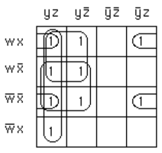

# $Discrete\space{Mathematics}\space{\mathrm{II}}\space{Review}$

$\displaystyle\mathrm{By\space21\space{CST}\space{H3Art}}$

## Chapter 8 Advanced Counting Techniques

### Terms
**recurrence relation递归关系**: a formula expressing terms of a sequence, except for some initial terms, as a function of one or more previous terms of the sequence

**initial conditions for a recurrence relation递归关系的初始条件**: the values of the terms of a sequence satisfying the recurrence relation before this relation takes effect

**dynamic programming动态规划**: an algorithmic paradigm that finds the solution to an optimization problem by recursively breaking down the problem into overlapping subproblems and combining their solutions with the help of a recurrence relation

**linear homogeneous recurrence relation with constant coefficients常系数线性齐次递归关系**: a recurrence relation that expresses the terms of a sequence, except initial terms, as a linear combination of previous terms

**characteristic roots of a linear homogeneous recurrence relation with constant coefficients常系数线性齐次递归关系的特征根**: the roots of the polynomial associated with a linear homogeneous recurrence relation with constant coefficients

**linear nonhomogeneous recurrence relation with constant coefficients常系数线性非齐次递归关系**: a recurrence relation that expresses the terms of a sequence, except for initial terms, as a linear combination of previous terms plus a function that is not identically zero that depends only on the index

**divide-and-conquer algorithm分治算法**: an algorithm that solves a problem recursively by splitting it into a fixed number of smaller non-overlapping subproblems of the same type

**generating function of a sequence序列的生成函数(母函数)**: the formal series that has the $n$th term of the sequence as the coefficient of $x^n$

**sieve of Eratosthenes埃拉托色尼筛法(埃氏筛法)**: a procedure for finding the primes less than a specified positive integer

**derangement错位排列**: a permutation of objects such that no object is in its original place

### Results
**the formula for the number of elements in the union of two finite sets 求两个有限集并集中元素个数的公式**:

$\vert{A}\cup{B}\vert=\vert{A}\vert+\vert{B}\vert-\vert{A}\cap{B}\vert$

**the formula for the number of elements in the union of three finite sets 求三个有限集并集中元素个数的公式**:

$\vert{A}\cup{B}\cup{C}\vert=\vert{A}\vert+\vert{B}\vert+\vert{C}\vert-\vert{A}\cap{B}\vert-\vert{A}\cap{C}\vert-\vert{B}\cap{C}\vert+\vert{A}\cap{B}\cap{C}\vert$

**the principle of inclusion–exclusion 容斥原理**:

$\vert{A_1}\cup{A_2}\cup\dots\cup{A_n}\vert=\sum_{1\le{i}\le{n}}{\vert{A_i}\vert}-\sum_{1\le{i}\le{j}\le{n}}{\vert{A_i}\cap{A_j}\vert}+\sum_{1\le{i}\le{j}\le{k}\le{n}}{\vert{A_i}\cap{A_j}\cap{A_k}\vert}-\dots+(-1)^{n+1}\vert{{A_1}\cap{A_2}\cap\dots\cap{A_n}}\vert$

**the number of onto functions from a set with $m$ elements to a set with $n$ elements 一个有$m$个元素的集合到一个有$n$个元素的集合上映函数的个数为**:

$n^m-C_n^1(n-1)^m+C_n^2(n-2)^m-\dots+(-1)^{n-1}C_n^{n-1}\cdot{1^m}$

**the number of derangements of $n$ objects $n$个对象的错位排列数量公式**:

$D_n=n![1-{1\over1!}+{1\over2!}-\dots+(-1)^n{1\over{n!}}]$

### Exercises & Summary
Section 8.1 Ex. 8  
Section 8.2 Ex. 26  
Section 8.3 Ex. 36; 37  
Section 8.4 Ex. 32; 34; 36  
Section 8.5 Ex. 8  
Section 8.6 Ex. 16  

1. **找出长度为$n$且包含三个连续$0$的比特串的个数的递归关系**

    解：设$a_n$是长度为$n$包含三个连续$0$的比特串的个数。
    
    为了构建一个长度为$n$且包含连续三个$0$的比特串，我们可以从$1$开始，后面跟着一个长度为$n - 1$，包含三个连续$0$的比特串，或者我们可以从$01$开始，后面跟着一个长度为$n - 2$，包含三个连续$0$的比特串，或者我们可以从$001$开始，后面跟着一个长度为$n - 3$，包含三个连续$0$的比特串，或者我们可以从$000$开始，后面跟着任何长度为$n - 3$的比特串。
    
    这四种情况是互斥的，并且穷尽了比特串如何开始的可能性。从这个分析中，我们可以立即写出递归关系，即对所有$n≥3$：$a_n = a_{n−1} + a_{n−2} + a_{n−3} + 2^{n−3}$。因为没有长度为$0$、$1$或$2$的位串包含三个连续的$0$，所以初始条件为$a_0 = a_1 = a_2 = 0$。

2. **根据线性非齐次递归关系定理6，$a_n = 6a_{n−1}−12a_{n−2} + 8a_{n−3} + F(n)$保证存在特解的一般形式是什么**

    解：我们需要使用**定理6(在课本8.2中)**，所以我们需要找到相关齐次递归关系的特征多项式的根。特征方程是$r^3 − 6r^2 + 12^r − 8 = 0$，$r = 2$是唯一的根，这个根的重数是$3$。

    >    定理：
    >
    >    假设$\{{a_n}\}$满足线性非齐次递归关系：
    >
    >    $a_n= c_1a_{n−1} + c_2a_{n−2} +\cdots+ c_ka_{n−k} + F (n)$
    >    
    >    $c_1, c_2, \cdots, c_k$为实数
    >    
    >    $F(n)$的原形式为：
    >
    >    $F (n) = (b_tn^t + b_{t−1}n^{t−1} + \cdots + b_1n + b_0)s^n$
    >    
    >    其中$b_0, b_1, \cdots, b_t$和$s$是实数
    >
    >    当$s$不是相关线性齐次递归关系特征方程的根时，存在$(p_tn^t + p_{t−1}n^{t−1} + \cdots + p_1n + p_0)s^n$形式的特解。
    >
    >    当$s$是特征方程的根且其重数为$m$时，存在
    >    $n^m(p_tn^t + p_{t−1}n^{t-1} + \cdots + p_1n + p_0)s^n$形式的特解

 - 当$F(n) = n^2$时，特解为：$p_2n_2 + p_1n + p_0$
 - 当$F(n) = 2^n$时，特解为：$n^3p_02^n$
 - 当$F (n) = n2^n$时，特解为：$n^3(p_1n + p_0)2^n$
 - 当$F (n) = (−2)^n$时，特解为：$p_0(−2)^n$
 - 当$F (n) = n^22^n$时，特解为：$n^3(p_2n^2 + p_1n + p_0)2^n$
 - 当$F (n) = n^3(−2)^n$时，特解为：$(p_3n^3 + p_2n^2 + p_1n + p_0)(−2)^n$
 - 当$F (n) = 3$时，特解为：$p_0$(记$s=1$)

3. **求$n = 2^k$时的$f(n)$和$f(n)$的大$O$表示，其中$f$满足递归关系$f(n) = 8f(n/2) + n^2$与$f(1) = 1$**

    解：我们需要使用**主定理(在课本8.3中)**，还有它的部分拓展

    >   定理：
    >
    >   设$f$是一个满足递归关系的递增函数，形式为
    >
    >   $f(n) = af(n/b) + cn^d$
    >
    >   只要$n$能被$b$整除，其中$a≥1$，$b$是大于$1$的整数，$c$是正实数，$d$是非负实数，则：
    >
    >   当$a>b^d$，$f(n)$为$O(n^{\log_ba})$
    >
    >   当$a=b^d$，$f(n)$为$O(n^d\log{n})$
    >
    >   当$a<b^d$，$f(n)$为$O(n^d)$
    >
    >   $n=b^k$且$a=b^d$时，其中$k$是一个正整数，有：
    >
    >   $f(n) = f(1)n^d+cn^d\log_bn$
    >
    >   $n=b^k$且$a\not ={b^d}$时，其中$k$是一个正整数，有：
    >
    >   $f(n) = C_1n^{\log_ba} + C_2n^d$
    >
    >   其中$C_1 = f(1) + b^dc/(a−b^d)$，$C_2 = b^dc/(b^d−a)$

    由题意得，$a=8$，$b=2$，$c=1$，$d=2$，$f(1)=1$
    
    则$\displaystyle{C_1=1+2^2\times\frac{1}{8-2^2}=2}$

    $\displaystyle{C_2=2^2\times\frac{1}{2^2-8}=-1}$

    所以$f(n)=2n^{\log_28}-n^2=2n^3-n^2$

    $f(2^k)=2^{3k+1}-2^{2k}$，$f(n)的$大$O$表示为$O(n^3)$

4. (1). **在初始条件$a_0=5$的情况下，利用生成函数求解递归关系$a_k=7a_{k−1}$的通项公式**

    (2). **在初始条件$a_0=1$的情况下，利用生成函数求解递归关系$a_k=3a_{k−1}+4^{k−1}$的通项公式**

    (3). **在初始条件$a_0=4$，$a_1=12$的情况下，利用生成函数求解递归关系$a_k=a_{k−1}+2a_{k−2}+2^k$的通项公式**

    解：关于生成函数(母函数)，常用的基本函数如下表(没把课本P542全扒下来)：

    |$G(x)$|$a_k$|
    |-|-|
    |$\displaystyle(1+x)^n=\sum_{k=0}^nC_n^kx^k=1+C_n^1x+C_n^2x^2+\cdots+x^n$|$C_n^k$|
    |$\displaystyle(1+ax)^n=\sum_{k=0}^nC_n^ka^kx^k=1+C_n^1ax+C_n^2a^2x^2+\cdots+a^nx^n$|$C_n^ka^k$|
    |$\displaystyle(1+x^r)^n=\sum_{k=0}^nC_n^kx^{rk}=1+C_n^1x^r+C_n^2x^{2r}+\cdots+x^{rn}$|$C_n^{k/r}$($r$能整除$k$，否则$a_k$为$0$)|
    |$\displaystyle\frac{1}{1-x}=\sum_{k=0}^{\infty}x^k=1+x+x^2+\cdots$|$1$|
    |$\displaystyle\frac{1}{1-ax}=\sum_{k=0}^{\infty}a^kx^k=1+ax+a^2x^2+\cdots$|$a^k$|
    |$\displaystyle\frac{1}{(1-x)^2}=\sum_{k=0}^{\infty}(k+1)x^k=1+2x+3x^2+\cdots$|$k+1$|
    |$\displaystyle{\frac{1}{(1-ax)^n}=\sum_{k=0}^{\infty}C_{n+k-1}^ka^kx^k=1+C_n^1ax+C_{n+1}^2a^2x^2+\cdots}$|$C_{n+k−1}^ka^k=C_{n+k−1}^{n−1}a^k$|

    (1). 设$\displaystyle{G(x)=\sum_{k=0}^{\infty}a_kx^k}$，则有：
    
    $\displaystyle{xG(x)=\sum_{k=0}^{\infty}a_kx^{k+1}=\sum_{k=1}^{\infty}a_{k-1}x^k}$(仅把变量名作了修改)，因此有：

    $\displaystyle{G(x)-7xG(x)=\sum_{k=0}^{\infty}a_kx^k-\sum_{k=1}^{\infty}7a_{k-1}x^k}$
    
    $\displaystyle{=a_0+\sum_{k=1}^{\infty}(a_k-7a_{k-1})x^k=a_0+0=5}$

    由于给定的递归关系和初始条件，因此$G(x)(1-7x)=5$，即有：

    $\displaystyle{G(x)=\frac{5}{1-7x}}$

    用$G(x)$形式与上表进行比对，可得：
    
    $a_k=5\cdot7^k$

    (2). 设$\displaystyle{G(x)=\sum_{k=0}^{\infty}a_kx^k}$，则有：
    
    $\displaystyle{xG(x)=\sum_{k=0}^{\infty}a_kx^{k+1}=\sum_{k=1}^{\infty}a_{k-1}x^k}$(仅把变量名作了修改)，因此有：

    $\displaystyle{G(x)-3xG(x)=\sum_{k=0}^{\infty}a_kx^k-\sum_{k=1}^{\infty}3a_{k-1}x^k=a_0+\sum_{k=1}^{\infty}(a_k-3a_{k-1})x^k}$

    $\displaystyle={1+\sum_{k=1}^{\infty}4^{k-1}x^k=1+x\sum_{k=1}^{\infty}4^{k-1}x^{k-1}=1+x\cdot\frac{1}{1-4x}=\frac{1-3x}{1-4x}}$

    由于给定的递归关系和初始条件，因此$\displaystyle{G(x)(1-3x)=\frac{1-3x}{1-4x}}$，即有：
    
    $\displaystyle{G(x)=\frac{1}{1-4x}}$

    用$G(x)$形式与上表进行比对，可得：
    
    $a_k=4^k$

    (3). 设$\displaystyle{G(x)=\sum_{k=0}^{\infty}a_kx^k}$，则有：
    
    $\displaystyle{xG(x)=\sum_{k=0}^{\infty}a_kx^{k+1}=\sum_{k=1}^{\infty}a_{k-1}x^k}$
    
    $\displaystyle{x^2G(x)=\sum_{k=0}^{\infty}a_kx^{k+2}=\sum_{k=2}^{\infty}a_{k-2}x^k}$(仅把变量名作了修改)，因此有：

    $\displaystyle{G(x)-xG(x)-2x^2G(x)=\sum_{k=0}^{\infty}a_kx^k-\sum_{k=1}^{\infty}a_{k-1}x^k-\sum_{k=2}^{\infty}2a_{k-2}x^k}$

    $\displaystyle{=a_0+a_1x-a_0x+\sum_{k=2}^{\infty}2^k\cdot{x^k}=4+8x+\frac{1}{1-2x}-1-2x=\frac{4-12x^2}{1-2x}}$

    由于给定的递归关系和初始条件，因此$\displaystyle{G(x)(1−2x)(1+x)=\frac{4-12x^2}{1-2x}}$，即有：

    $\displaystyle{G(x)=\frac{4-12x^2}{(1+x)(1-2x)^2}}$

    我们需要把上式分解为和形式，即：

    $\displaystyle{G(x)=\frac{4-12x^2}{(1+x)(1-2x)^2}=\frac{A}{1+x}+\frac{B}{1-2x}+\frac{C}{(1-2x)^2}}$

    非常暴力地直接通分求解$A$，$B$，$C$，得到：

    $\displaystyle{G(x)=\frac{-8/9}{1+x}+\frac{38/9}{1-2x}+\frac{2/3}{(1-2x)^2}}$

    用$G(x)$形式与上表进行比对，可得：
    
    $a_k=(-8/9)(-1)^k+(38/9)2^k+(2/3)(k+1)2^k$

5. **$n$个学生在同一间教室上两个课程，每个课程分配了$n$个座位。如果没有学生被分配到两个课程中相同的座位，这些座位有多少种分配方式**

    >   $D_n$代表错位排列数量的值，其公式在上方Results部分的最后给出

    解：有$n!$种第一次分配座位的方法。那么下一次分配座位必须是与这个编号有关的**错位排列**，所以有$D_n$个可能的第二个座位。因此答案是$n!D_n$

## Chapter 9 Relations

### Terms
**binary relation from ${A}$ to ${B}$ $A$与$B$的二元关系**: a subset of ${A} × {B}$

**relation on ${A}$ $A$上的(二元)关系**: a binary relation from ${A}$ to itself (i e., a subset of ${A} × {A}$)

${S}\circ{R}$: composite of ${R}$ and ${S}$

${R^{-1}}$: inverse relation of ${R}$

${R^n}$: $n$th power of ${R}$

**reflexive自反性**: a relation ${R}$ on ${A}$ is reflexive if $(a, a) ∈ {R}$ for all $a ∈ {A}$

**symmetric对称性**: a relation ${R}$ on ${A}$ is symmetric if $(b, a) ∈ {R}$ whenever $(a, b) ∈ {R}$

**antisymmetric反对称性**: a relation ${R}$ on ${A}$ is antisymmetric if $a = b$ whenever $(a, b) ∈ {R}$ and $(b, a) ∈ {R}$

**transitive传递性**: a relation $R$ on $A$ is transitive if $(a, b) ∈ {R}$ and $(b, c) ∈ {R}$ implies that $(a, c) ∈ {R}$

**$n$-ary relation on $A_1, A_2, \dots, A_n$**: a subset of $A_1× A_2 ×···× A_n$

**relational data model关系数据模型**: a model for representing databases using $n$-ary relations

**primary key主键**: a domain of an $n$-ary relation such that an $n$-tuple is uniquely determined by its value for this domain

**composite key复合键**: the Cartesian product of domains of an $n$-ary relation such that an $n$-tuple is uniquely determined by its values in these domains

**selection operator选择操作符**: a function that selects the $n$-tuples in an $n$-ary relation that satisfy a specified condition

**projection投影**: a function that produces relations of smaller degree from an $n$-ary relation by deleting fields

**join连接**: a function that combines $n$-ary relations that agree on certain fields

**directed graph or digraph有向图**: a set of elements called vertices and ordered pairs of these elements, called edges

**loop环**: an edge of the form $(a, a)$

**closure of a relation ${R}$ with respect to a property ${P}$ 关系${R}$相对于属性${P}$的闭合**: the relation ${S}$ (if it exists) that contains ${R}$, has property ${P}$, and is contained within any relation that contains ${R}$ and has property ${P}$

**path in a digraph有向图的路径**: a sequence of edges $(a, x_1), (x_1, x_2), \cdots, (x_{n−2}, x_{n−1}), (x_{n−1}, b)$such that the terminal vertex of each edge is the initial vertex of the succeeding edge in the sequence

**circuit (or cycle) in a digraph有向图中的回路**: a path that begins and ends at the same vertex

**${R^*}$(connectivity relation连通关系)**: the relation consisting of those ordered pairs $(a, b)$ such that there is a path from $a$ to $b$

**equivalence relation等价关系**: a reflexive, symmetric, and transitive relation

**equivalent等价**: if ${R}$ is an equivalence relation, $a$ is equivalent to $b$ if $a{R}b$

**$[a]_R$(equivalence class of a with respect to $R$ $a$相对于$R$的等价类)**: the set of all elements of $A$ that are equivalent to $a$

**$[a]_m$(congruence class modulo $m$ 模$m$同余类)**: the set of integers congruent to a modulo $m$

**partition of a set $S$ 集合$S$的划分**: a collection of pairwise disjoint nonempty subsets that have $S$ as their union

**partial ordering偏序关系**: a relation that is reflexive, antisymmetric, and transitive

**poset $(S, R)$**: a set $S$ and a partial ordering $R$ on this set

**comparable可比较的**: the elements $a$ and $b$ in the poset $(A, \preccurlyeq)$ are comparable if $a \preccurlyeq b$ or $b \preccurlyeq a$

**incomparable不可比较的**: elements in a poset that are not comparable

**total (or linear) ordering全序关系**: a partial ordering for which every pair of elements are comparable

**totally (or linearly) ordered set全序关系集**: a poset with a total (or linear) ordering

**well-ordered set良序集**: a poset $(S, \preccurlyeq)$, where $\preccurlyeq$ is a total order and every nonempty subset of $S$ has a least element

**lexicographic order字典序**: a partial ordering of Cartesian products or strings

**Hasse diagram哈斯图**: a graphical representation of a poset where loops and all edges resulting from the transitive property are not shown, and the direction of the edges is indicated by the position of the vertices

**maximal element极大元素(可以有多个)**: an element of a poset that is not less than any other element of the poset

**minimal element极小元素(可以有多个)**: an element of a poset that is not greater than any other element of the poset

**greatest element最大元素(只能有一个或没有)**: an element of a poset greater than all other elements in this set

**least element最小元素(只能有一个或没有)**: an element of a poset less than all other element in this set

**upper bound of a set集合的上界**: an element in a poset greater than all other elements in the set

**lower bound of a set集合的下界**: an element in a poset less than all other elements in the set

**least upper bound of a set集合的最小上界**: an upper bound of the set that is less than all other upper bounds

**greatest lower bound of a set集合的最大下界**: a lower bound of the set that is greater than all other lower bounds

**lattice格**: a partially ordered set in which every two elements have a greatest lower bound and a least upper bound

**compatible total ordering for a partial ordering兼容偏序关系的全序关系**: a total ordering that contains the given partial ordering

**topological sort拓扑排序**: the construction of a total ordering compatible with a given partial ordering

### Results
The reflexive closure of a relation $R$ on the set $A$ equals ${R}\cup{\Delta}$, where $\Delta=\\{{(a, a) | a ∈ A}\\}$.

**自反闭包的解释：对于任意$a$，关系$R$中包含了所有$(a, a)$的关系**

The symmetric closure of a relation $R$ on the set $A$ equals ${R}\cup{R^{−1}}$, where ${R^{−1}}=\\{{(b, a) | (a, b) ∈ R}\\}$.

**对称闭包的解释：对于任意$(a, b)$，关系$R$中包含了对应的$(b, a)$关系**

A relation $R$ on a set $A$ such that for all $a, b ∈ A$, if $(a, b) ∈ R$ and $(b, a) ∈ R$, then $a = b$ is called antisymmetric.

**反对称闭包的解释：对于任意$(a, b)$，关系$R$中能满足存在$(b, a)$的$a$和$b$必定相等。即要么$(a, b)$不存在对称关系$(b, a)$，要么$(a, b)$就在主对称轴上——满足$a=b$**

The transitive closure of a relation equals the connectivity relation formed from this relation.

**传递闭包的解释：关系中只要存在$(a, b)$和$(b, c)$，就必定存在$(a, c)$**

**整个关系集合中所有的$(a, b)$和$(b, c)$都必须对应出一个$(a, c)$，但注意，$(a, b)$和$(b, c)$的存在性也需要重视**

Warshall’s algorithm for finding the transitive closure of a relation.

**关于Warshall算法求传递闭包的解释将在下面的习题中展示**

Let $R$ be an equivalence relation. Then the following three statements are equivalent:  
(1) $a\ R\ b$;  
(2) $[a]_R\cap[b]_R = \emptyset$;  
(3) $[a]_R = [b]_R$.

The equivalence classes of an equivalence relation on a set $A$ form a partition of $A$. Conversely, an equivalence relation can be constructed from any partition so that the equivalence classes are the subsets in the partition.

The principle of well-ordered induction

The topological sorting algorithm

**以上无翻译的部分似乎没教，只简单提及**

### Exercises & Summary
Section 9.1 Ex. 6; 32; 56  
Section 9.3 Ex. 2; 14; 32  
Section 9.4 Ex. 6; 26-a; 28-a  
Section 9.5 Ex. 24; 36  
Section 9.6 Ex. 22; 32  

1. **${S}\circ{R}$的运用：令关系$R=\\{(1, 2), (1, 3), (2, 3), (2, 4), (3, 1)\\}$，关系$S=\\{(2, 1), (3, 1), (3, 2), (4, 2)\\}$，求${S}\circ{R}$**

    解：${S}\circ{R}$就是用$R$关系中的第一个元素合成$S$关系中的第二个元素，但需要保证$R$关系中的第二个元素和$S$关系中的第一个元素是相同的(请注意，${S}\circ{R} \not={R}\circ{S}$)

    举例：$(1, 2)$是$R$中的关系之一，$(2, 1)$是$S$中的关系之一，那么$(1, 1)$就是${S}\circ{R}$中的关系之一。因为关系作为一个集合(set)，其元素不能重复，最终答案为：$\\{(1, 1),(1, 2),(2, 1),(2, 2)\\}$

    补充：诸如令$R=\\{(1, 2), (1, 3), (2, 3), (2, 4), (3, 1)\\}$，求$R^2, R^3$，其实就是求${R}\circ{R}$和${R}\circ{R}\circ{R}$

2. **用一个矩阵表示$\\{1,2,3,4\\}$上的每一个关系：$\\{(1, 2),(1, 3), (1, 4), (2, 3), (2, 4), (3, 4)\\}$**

    解：矩阵上方的数字为对应元素的标号，可以不写，竖列的元素也是从上到下1，2，3，4排布

    $\space\space\space1\space\space\space$ $2\space\space\space$ $3\space\space\space$ $4\space\space\space$

    $\begin{bmatrix}
        0&1&1&1
        \\\\
        0&0&1&1
        \\\\
        0&0&0&1
        \\\\
        0&0&0&0
    \end{bmatrix}$

3. **设$R_1$和$R_2$是矩阵表示的集合$A$上的关系，$M_{R_1}$表示$R_1$的关系矩阵，$M_{R_2}$表示$R_2$的关系矩阵**

    $M_{R_1}=\begin{bmatrix}
        0&1&0
        \\\\
        1&1&1
        \\\\
        1&0&0
    \end{bmatrix}
    \space\space{M_{R_2}}=\begin{bmatrix}
        0&1&0
        \\\\
        0&1&1
        \\\\
        1&1&1
    \end{bmatrix}$

    求出以下关系的矩阵表示：
    - $R_1\cup{R_2}$
    - $R_1\cap{R_2}$
    - $R_2\circ{R_1}$
    - $R_1\circ{R_1}$
    - $R_1\oplus{R_2}$

    解：

    - 求$R_1\cup{R_2}$用**连接(join)**，即矩阵$M_{R_1}$中所有元素与$M_{R_2}$中对应位置的元素取**并(OR)**

    $\begin{bmatrix}
        0&1&0
        \\\\
        1&1&1
        \\\\
        1&1&1
    \end{bmatrix}$

    - 求$R_1\cap{R_2}$用**交集**，即矩阵$M_{R_1}$中所有元素与$M_{R_2}$中对应位置的元素取**交(AND)**

    $\begin{bmatrix}
        0&1&0
        \\\\
        0&1&1
        \\\\
        1&0&0
    \end{bmatrix}$

    - 求$R_2\circ{R_1}$用**布尔积**的方式，但注意，$R_2\circ{R_1}$对应的矩阵的布尔积顺序为$M_{R_1}\oplus{M_{R_2}}$，布尔积的顺序是：左边矩阵的第$n$行和右边矩阵的第$m$列之间，每一个对应的元素取**交(AND)**，再将每一对元素取交的结果**并(OR)** 起来，得到的结果成为布尔积结果矩阵中第$m$行第$n$列的单个元素

    $\begin{bmatrix}
        0&1&1
        \\\\
        1&1&1
        \\\\
        0&1&0
    \end{bmatrix}$

    - 求$R_1\circ{R_1}$与上题同理

    $\begin{bmatrix}
        1&1&1
        \\\\
        1&1&1
        \\\\
        0&1&0
    \end{bmatrix}$

    - 求$R_1\oplus{R_2}$用**异或**，即矩阵$M_{R_1}$中所有元素与$M_{R_2}$中对应位置的元素取**异或(XOR)**

    $\begin{bmatrix}
        0&0&0
        \\\\
        1&0&0
        \\\\
        0&1&1
    \end{bmatrix}$
    
  
4. **判断有向图中各个顶点及其边构成的关系集是否满足：自反性(reflexive)、非自反性(irreflexive)、对称性(symmetric)、反对称性(antisymmetric)、非对称性(asymmetric)以及传递性(transitive)**

        

    >   如果每个顶点都有一个循环，那么这个关系就具有自反性(reflexive)
    >
    >   如果根本没有循环，那就具有非自反性(irreflexive)
    >
    >   如果存在顶点$a$与任意顶点$b$之间有一条边$(a, b)$，则$(b, a)$也必定存在，这样的关系就具有对称性(symmetric)
    >
    >   如果整个关系中一对满足对称性的边都没有，则关系具有反对称性(antisymmetric)
    >
    >   非对称性(asymmetric)关系是指同时满足反对称性和非自反性的关系
    >
    >   如果在一个关系图中长度为$2$的所有路径(即一对边$(x, y)$和$(y, z)$)都具有长度为$1$的相应路径(边$(x, z)$)，则关系具有传递性(transitive)

    解：

    (1). 图一关系是自反的，但不是非自反的，因为每个顶点都有循环。它不是对称的，因为边$(c, a)$存在，但边$(a, c)$不存在。它不是反对称的，因为边$(a, b)$和边$(b, a)$都存在，所以它也不是不对称的。它不具有传递性，因为从$c$到$b$的路径$(c, a)$，$(a, b)$没有边$(c, b)$伴随

    (2). 图二中的关系既不具有自反性也不具有非自反性，因为一些顶点上存在循环，也存在一个顶点上没有循环。但它是对称的，因为连通点之间的边都是成对的。它不是反对称的，因为边$(a, b)$和边$(b, a)$都存在。所以这也不是不对称的。它是不传递的，因为边$(c, a)$和边$(a, c)$存在，但边$(c, c)$不存在

    (3). 图三中的关系具有自反性但不具有非自反性，因为所有顶点都有循环。它是对称的，但不是反对称或不对称的。它是可传递的，长度为$2$的任意路径都具有快捷路径(即长度为$1$的对应路径)

5. **找出这个关系$R$在$\\{a, b, c, d, e\\}$上的传递闭包：$\\{(a, c), (b, d), (c, a), (d, b), (e, d)\\}$**

    >   课本中在Section 9.4中提到一个定理：
    >
    >   关系$R$的传递闭包等于连通性关系$R^*$，为了求$R$的传递闭包，问题转化为求$R^{\ast}$
    >
    >   $R^*=R\cup{R^2}\cup{R^3}\cup\cdots\cup{R^n}$(其中$n$的值等于关系$R$中的单个元素的数量——即关系$R$用邻接矩阵表示时矩阵的维度)
    >
    >   $M_{R^*}=M_R\vee{M_R^{[2]}}\vee{M_R^{[3]}}\vee\cdots\vee{M_R^{[n]}}$(上面等式转化为矩阵表示的形式)
    >
    >   求$M_R^{[n]}$可以用题目3中的方式，对$M_R$做$n-1$次布尔积$\odot$运算得到

    解：由题意得

    $M_R=\begin{bmatrix}
        0&0&1&0&0
        \\\\
        0&0&0&1&0
        \\\\
        1&0&0&0&0
        \\\\
        0&1&0&0&0
        \\\\
        0&0&0&1&0
    \end{bmatrix}
    \space\space
    M_R^{[2]}=\begin{bmatrix}
        1&0&0&0&0
        \\\\
        0&1&0&0&0
        \\\\
        0&0&1&0&0
        \\\\
        0&0&0&1&0
        \\\\
        0&1&0&0&0
    \end{bmatrix}
    \space\space
    M_R^{[3]}=\begin{bmatrix}
        0&0&1&0&0
        \\\\
        0&0&0&1&0
        \\\\
        1&0&0&0&0
        \\\\
        0&1&0&0&0
        \\\\
        0&0&0&1&0
    \end{bmatrix}=M_R$

    根据上面的推导有$M_R^{[4]}=M_R^{[2]}$和$M_R^{[5]}=M_R^{[3]}=M_R$，所以最后的结果为：

    $M_{R^*}=M_R\vee{M_R^{[2]}}\vee{M_R^{[3]}}\vee{M_R^{[4]}}\vee{M_R^{[5]}}=M_R\vee{M_R^{[2]}}$

    $M_{R^*}=\begin{bmatrix}
        1&0&1&0&0
        \\\\
        0&1&0&1&0
        \\\\
        1&0&1&0&0
        \\\\
        0&1&0&1&0
        \\\\
        0&1&0&1&0
    \end{bmatrix}$

6. **利用Warshall算法找出这个关系$R$在$\\{a, b, c, d, e\\}$上的传递闭包：$\\{(a, c), (b, d), (c, a), (d, b), (e, d)\\}$**

    解：由题意得$R$的关系矩阵为：

    $M_R=\begin{bmatrix}
        0&0&1&0&0
        \\\\
        0&0&0&1&0
        \\\\
        1&0&0&0&0
        \\\\
        0&1&0&0&0
        \\\\
        0&0&0&1&0
    \end{bmatrix}=W_0(i=0)$

    对于这个$5\times5$的关系矩阵，需要进行$5$次Warshall算法的运算：

    当$i=1$时，对$W_0$的第$1$列进行扫描，发现$W_0[3, 1]$(第$3$行第$1$列)为$1$，将当前的第$1$行的元素与当前的第$3$行的元素进行**逻辑加**，获得新的第$3$行，即：

    $W_1=\begin{bmatrix}
        0&0&1&0&0
        \\\\
        0&0&0&1&0
        \\\\
        1&0&1&0&0
        \\\\
        0&1&0&0&0
        \\\\
        0&0&0&1&0
    \end{bmatrix}$

    当$i=2$时，对$W_1$的第$2$列进行扫描，发现$W_1[4, 2]=1$，将当前的第$2$行的元素与当前的第$4$行的元素进行**逻辑加**，获得新的第$4$行，即：

    $W_2=\begin{bmatrix}
        0&0&1&0&0
        \\\\
        0&0&0&1&0
        \\\\
        1&0&1&0&0
        \\\\
        0&1&0&1&0
        \\\\
        0&0&0&1&0
    \end{bmatrix}$

    当$i=3$时，对$W_2$的第$3$列进行扫描，发现$W_2[1, 3]=1$，$W_2[3, 3]=1$，将当前的第$3$行的元素与当前的第$1$行和第$3$行的元素进行**逻辑加**，获得新的第$1$行和第$3$行，即：

    $W_3=\begin{bmatrix}
        1&0&1&0&0
        \\\\
        0&0&0&1&0
        \\\\
        1&0&1&0&0
        \\\\
        0&1&0&1&0
        \\\\
        0&0&0&1&0
    \end{bmatrix}$

    当$i=4$时，对$W_3$的第$4$列进行扫描，发现$W_3[2, 4]$，$W_3[4, 4]$，$W_3[5, 4]$，将当前的第$4$行的元素与当前的第$2$行、第$4$行和第$5$行的元素进行**逻辑加**，获得新的第$2$行、第$4$行和第$5$行，即：

    $W_4=\begin{bmatrix}
        1&0&1&0&0
        \\\\
        0&1&0&1&0
        \\\\
        1&0&1&0&0
        \\\\
        0&1&0&1&0
        \\\\
        0&1&0&1&0
    \end{bmatrix}$

    当$i=5$时，对$W_4$的第$5$列进行扫描，发现没有为$1$的元素，则$W_5=W_4$，且$W_5$就是最终的答案

7. **当$m$分别为$2$、$3$、$6$、$8$时，同余类$[4]_m$是什么**

    解：

    当$m=2$时，$[4]_2=\\{4+2n|n∈\mathrm{Z}\\}=\\{\dots, −2, 0, 2, 4,\dots\\}$

    当$m=3$时，$[4]_3=\\{4+3n|n∈\mathrm{Z}\\}=\\{\dots, −2, 1, 4, 7,\dots\\}$

    当$m=6$时，$[4]_6=\\{4+6n|n∈\mathrm{Z}\\}=\\{\dots, −2, 4, 10, 16,\dots\\}$

    当$m=8$时，$[4]_8=\\{4+8n|n∈\mathrm{Z}\\}=\\{\dots, −4, 4, 12, 20, \dots\\}$

8. **画出下列集合上表示可除性的哈斯图**
   
    (1). $\\{1, 2, 3, 4, 5, 6\\}$  
    (2). $\\{3, 5, 7, 11, 13, 16, 17\\}$  
    (3). $\\{2, 3, 5, 10, 11, 15, 25\\}$  
    (4). $\\{1, 3, 9, 27, 81, 243\\}$

    >   作图法：
    >
    >   (1) 以圆圈/圆点表示元素
    >
    >   (2) 写出所有满足给定偏序关系的关系元素$(x, y)$，比如要满足可除关系，$(2, 4)$就是其中一个关系元素
    >
    >   (3) 将所有关系元素列出来后，每次将从未出现在如上所示$y$位置的$x$元素作为一层列出来，自底向上逐步列出所有元素
    >
    >   (4) 若$y$覆盖(满足给定关系)$x$，则连线

    解：

    (1).
    
    

    (2).
    
    

    (3).

    

    (4).

    
    
9.  **根据哈斯图所表示的偏序，回答下列问题**
    
    

    (1). 找出极大元素(maximal)  
    (2). 找到极小元素(minimal)  
    (3). 是否存在最大元素(greatest)  
    (4). 是否存在最小元素(least)  
    (5). 找出$\\{a, b, c\\}$的所有上界(upper bound)  
    (6). 如果$\\{a, b, c\\}$的上界存在，求它的最小上界(the least upper bound)  
    (7). 找出$\\{f, g, h\\}$的所有下界(lower bound)  
    (8). 如果$\\{f, g, h\\}$的下界存在，求它的最大下界(the greatest lower bound)  

    解：

    (1). $l$和$m$  
    (2). $a$、$b$和$c$   
    (3). 无法得知$l$和$m$哪个更大，因此不存在最大元素  
    (4). 无法得知$a$和$b$还有$c$哪个更小，因此不存在最小元素  
    (5). 我们需要找到具有向下到达所有$a$、$b$和$c$的路径的元素。$k$、$l$和$m$是符合这个描述的元素  
    (6). 由图可得$k$比$l$和$m$都小，所以$k$就是最小上界  
    (7). 没有元素同时小于$f$和$h$，所以没有下界  
    (8). $\\{f, g, h\\}$的下界不存在

## Chapter 10 Graphs

### Terms
**undirected edge无向边**: an edge associated to a set $\\{u, v\\}$, where $u$ and $v$ are vertices

**directed edge有向边**: an edge associated to an ordered pair $(u, v)$, where $u$ and $v$ are vertices

**multiple edges多边**: distinct edges connecting the same vertices

**multiple directed edges多有向边**: distinct directed edges associated with the same ordered pair $(u, v)$,where $u$ and $v$ are vertices

**loop自环**: an edge connecting a vertex with itself 

**undirected graph无向图**: a set of vertices and a set of undirected edges each of which is associated with a set of one or two of these vertices

**simple graph简单图**: an undirected graph with no multiple edges or loops

**multigraph多重图**: an undirected graph that may contain multiple edges but no loops

**pseudograph伪图**: an undirected graph that may contain multiple edges and loops

**directed graph有向图**: a set of vertices together with a set of directed edges each of which is associated with an ordered pair of vertices

**directed multigraph有向多重图**: a graph with directed edges that may contain multiple directed edges

**simple directed graph简单有向图**: a directed graph without loops or multiple directed edges

**adjacent邻接**: two vertices are adjacent if there is an edge between them

**incident关联**: an edge is incident with a vertex if the vertex is an endpoint of that edge

**$\mathrm{deg}^v$ (degree of the vertex $v$ in an undirected graph于无向图中顶点的度)**: the number of edges incident with $v$ with loops counted twice

**$\mathrm{deg}^−(v)$ (the in-degree of the vertex $v$ in a graph with directed edges于有向图中顶点的入度)**: the number of edges with $v$ as their terminal vertex

**$\mathrm{deg}^+(v)$ (the out-degree of the vertex $v$ in a graph with directed edges于有向图中顶点的出度)**: the number of edges with $v$ as their initial vertex

**degree sequence度序**: the ranking of vertex degrees in the graph from big to small

**underlying undirected graph of a graph with directed edges有向图的底层无向图**: the undirected graph obtained by ignoring the directions of the edges

**$K_n$ (complete graph on $n$ vertices具有$n$个顶点的完全图)**: the undirected graph with $n$ vertices where each pair of vertices is connected by an edge

**bipartite graph二部图**: a graph with vertex set that can be partitioned into subsets $V_1$ and $V_2$ so that each edge connects a vertex in $V_1$ and a vertex in $V_2$. The pair ($V_1$, $V_2$) is called a bipartition of $V$.(将整个图分区为$2$块，其中每条边必须连接不同块中的顶点)

**$K_{m,n}$ (complete bipartite graph完全二部图)**: the graph with vertex set partitioned into a subset of $m$ elements and a subset of $n$ elements with two vertices connected by an edge if and only if one is in the first subset and the other is in the second subset

**$C_n$ (cycle of size $n$ 具有$n$个顶点的环图), $n ≥ 3$**: the graph with n vertices $v_1, v_2,\dots, v_n$ and edges $\\{{v_1, v_2}\\}, \\{{v_2, v_3}\\},\dots, \\{{v_{n−1}, v_n}\\}, \\{{v_n, v_1}\\}$

**$W_n$ (wheel of size $n$ 具有$n$个顶点的环图加$1$个内部顶点组成的轮形图), $n ≥ 3$**: the graph obtained from $C_n$ by adding a vertex and edges from this vertex to the original vertices in $C_n$

**$Q_n$ ($n$-cube 具有$n$维的超立方体图，具有$2^n$个顶点), $n ≥ 1$**: the graph that has the $2^n$ bit strings of length $n$ as its vertices and edges connecting every pair of bit strings that differ by exactly one bit

**matching in a graph $G$ 图$G$中的匹配**: a set of edges such that no two edges have a common endpoint

**complete matching $M$ from $V_1$ to $V_2$ 从$V_1$到$V_2$的完全匹配$M$**: a matching such that every vertex in $V_1$ is an endpoint of an edge in $M$

**maximum matching最大匹配**: a matching containing the most edges among all matchings in a graph

**isolated vertex孤立顶点**: a vertex of degree zero

**pendant vertex垂顶点**: a vertex of degree one

**regular graph正则图**: a graph where all vertices have the same degree

**subgraph of a graph $G=(V , E)$ $G=(V, E)$的子图**: a graph $(W, F)$, where $W$ is a subset of $V$ and $F$ is a subset of $E$

**${G_1}\cup{G_2}$ (union of $G_1$ and $G_2$ $G_1$和$G_2$的并集)**: the graph $({V_1}\cup{V_2}, {E_1}\cup{E_2})$, where $G_1 = (V_1, E_1)$ and $G_2 = (V_2, E_2)$

**adjacency matrix邻接矩阵**: a matrix representing a graph using the adjacency of vertices

**incidence matrix关联矩阵**: a matrix representing a graph using the incidence of edges and vertices

**isomorphic simple graphs同构简单图**: the simple graphs $G_1 = (V_1, E_1)$ and $G_2 = (V_2, E_2)$ are isomorphic if there exists a one-to-one correspondence f from $V_1$ to $V_2$ such that $\\{{f (v1), f (v2)}\\} ∈ E_2$ if and only if $\\{{v_1, v_2}\\} ∈ E_1$ for all $v_1$ and $v_2$ in $V_1$

**invariant for graph isomorphism同构图不变量**: a property that isomorphic graphs either both have or both do not have

**path from $u$ to $v$ in an undirected graph无向图中从$u$到$v$的路径**: a sequence of edges $e_1, e_2,\dots,e_n$, where $e_i$ is associated to $\\{{x_i, x_{i+1}}\\}$ for $i = 0, 1,\dots,n$, where $x_0 = u$ and $x_{n+1} = v$

**path from $u$ to $v$ in a graph with directed edges通过有向边表示的从$u$到$v$的路径**: a sequence of edges $e_1, e_2,\dots,e_n$, where $e_i$ is associated to $(x_i, x_{i+1})$ for $i = 0, 1,\dots,n$, where $x_0 = u$ and $x_{n+1} = v$

**simple path简单路径**: a path that does not contain an edge more than once

**circuit回路**: a path of length $n ≥ 1$ that begins and ends at the same vertex

**connected graph连通图**: an undirected graph with the property that there is a path between every pair of vertices

**cut vertex of $G$ 图$G$的切割顶点**: a vertex $v$ such that $G − v$ is disconnected

**cut edge of $G$ 图$G$的切割边**: an edge $e$ such that $G − e$ is disconnected

**nonseparable graph不可分割图**: a graph without a cut vertex

**vertex cut of $G$ $G$的点割集**: a subset $V'$ of the set of vertices of $G$ such that $G − V'$ is disconnected

**$κ(G)$ (the vertex connectivity of $G$ $G$的连通性)**: the size of a smallest vertex cut of $G$(等于$G$的最小割点集的大小)

**$k$-connected graph $k$连通图**: a graph that has a vertex connectivity no smaller than $k$

**edge cut of $G$ $G$的边割集**: a set of edges $E'$ of $G$ such that $G − E'$ is disconnected

**$λ(G)$(the edge connectivity of $G$ $G$的边连通性)**: the size of a smallest edge cut of $G$

**connected component of a graph $G$ 图$G$的连通分量**: a maximal connected subgraph of $G$($G$的最大连通子图)

**strongly connected directed graph强连通有向图**: a directed graph with the property that there is a directed path from every vertex to every vertex

**strongly connected component of a directed graph $G$ 强连通有向图$G$的连通分量**: a maximal strongly connected subgraph of $G$

**Euler path欧拉通路**: a path that contains every edge of a graph exactly once

**Euler circuit欧拉回路**: a circuit that contains every edge of a graph exactly once

**Hamilton path哈密顿通路**: a path in a graph that passes through each vertex exactly once

**Hamilton circuit哈密顿回路**: a circuit in a graph that passes through each vertex exactly once

**weighted graph边权图**: a graph with numbers assigned to its edges

**shortest-path problem最短路径问题**: the problem of determining the path in a weighted graph such that the sum of the weights of the edges in this path is a minimum over all paths between specified vertices

**traveling salesperson problem旅行商问题**: the problem that asks for the circuit of shortest total length that visits every vertex of a weghted graph exactly once

**planar graph平面图**: a graph that can be drawn in the plane with no crossings(边之间没有交叉点的图)

**regions of a representation of a planar graph平面图形表示法的区域**: the regions the plane is divided into by the planar representation of the graph(即被图形的平面表示法分割成的区域)

**elementary subdivision基本细分**: the removal of an edge $\\{u, v\\}$ of an undirected graph and the addition of a new vertex $w$ together with edges $\\{u, w\\}$ and $\\{w, v\\}$

**homeomorphic同胚**: two undirected graphs are homeomorphic if they can be obtained from the same graph by a sequence of elementary subdivisions

**graph coloring图着色**: an assignment of colors to the vertices of a graph so that no two adjacent vertices have the same color

**chromatic number颜色数**: the minimum number of colors needed in a coloring of a graph

### Results
**The handshaking theorem**: If $G = (V , E)$ be an undirected graph with $m$ edges, then $2m =\sum_{v∈V}\mathrm{deg}(v)$.

**握手定理(又称图论基本定理)：对于任何无向图$G = (V , E)$，其边数$m$和顶点的度数$\mathrm{deg}(v)$满足关系：$2m =\sum_{v∈V}\mathrm{deg}(v)$**

**Hall’s marriage theorem**: The bipartite graph $G = (V , E)$ with bipartition $(V_1, V_2)$ has a complete matching from $V_1$ to $V_2$ if and only if $|N(A)|≥|A|$ for all subsets $A$ of $V_1$.

**霍尔婚配定理：具有二分区$(V_1, V_2)$的二部图$G = (V, E)$，当且仅当$V_1$的所有子集$A$的$|N(A)|≥|A|$($N(A)$代表另一部图中的与$A$中顶点相连的顶点构成的集合)，$V_1$到$V_2$完全匹配**

There is an Euler circuit in a connected multigraph if and only if every vertex has even degree.

**在连通多重图中，当且仅当每个顶点的度数都是偶数时，就有欧拉回路**

There is an Euler path in a connected multigraph if and only if at most two vertices have odd degree.

**在连通多重图中，当且仅当至多有两个顶点的度数为奇数时，就有欧拉通路**

**Dijkstra’s algorithm**: a procedure for finding a shortest path between two vertices in a weighted graph (see Section 10.6).

**迪杰斯特拉算法:在边权图的两个顶点之间寻找最短路径的过程**

**Euler’s formula**: $r = e − v + 2$ where $r$, $e$, and $v$ are the number of regions of a planar representation, the number of edges, and the number of vertices, respectively, of a connected planar graph.

**欧拉公式：$r = e − v + 2$，其中$r$、$e$和$v$分别是连通平面图的平面表示的区域数量、边的数量和顶点的数量**

**Kuratowski’s theorem**: A graph is nonplanar if and only if it contains a subgraph homeomorphic to $K_{3,3}$ or $K_5$. (Proof beyond scope of this book.)

**库拉图斯基定理：图$G$是平面图当且仅当$G$不含与$K_{3,3}$或$K_5$同胚的子图**

**The four color theorem**: Every planar graph can be colored using no more than four colors. (Proof far beyond the scope of this book!)

**四色定理：每个平面图的颜色不能超过四种**

### Exercises & Summary
Section 10.1 Ex. 3 - 9  
Section 10.2 Ex. 8; 20; 22; 26; 36  
Section 10.3 Ex. 32-a,d; 38; 42  
Section 10.4 Ex. 14; 32; 34  
Section 10.5 Ex. 26; 44  
Section 10.6 Ex. 6-b  
Section 10.7 Ex. 4; 6; 24  
Section 10.8 Ex. 4; 18  

1. **判断图的性质(简单图、多重图、伪图、有向图、有向多重图)**
    - 简单图(Simple graph)：没有多边或自环的无向图(多边就是两个顶点间连接了多条边)
    - 多重图(Multigraph)：包含多边但不包含自环的无向图
    - 伪图(Pseudograph)：包含多边和自环的无向图
    - 有向图(Directed graph)：只要边是有向的就可以归入有向图(可以有环)
    - 有向多重图(Directed multigraph)：包含多边和自环的有向图(注意这里的多边必须是**平行边**，边的指向必须相同，两个顶点之间一进一出的边不是平行边)

2. **判断一个简单无向图是否为二部图**

    利用课本10.2的定理4进行判断：

    >   定理：
    >
    >   一个简单图是二部图，当且仅当可以为图中的每个顶点分配两种不同的颜色之一，并且相邻的两个顶点不会被分配到相同的颜色

3. **确定$K_n$、$C_n$、$W_n$、$Q_n$在$n$为多少时是二部图**

    (1). $K_1$没有足够的顶点是二部的(二分区中的顶点集合必须是非空的)。显然$K_2$是二部的。$n>2$时，在$K_n$中存在三角形(根据上一题的定理，三角形图不能满足双色不相邻)，所以这些完全图不是二部的

    (2). 首先，我们需要$n≥3$才能定义$C_n$。如果$n$是偶数，那么$C_n$是二部的，如果$n$是奇数，那么$C_n$不是二部的

    (3). 每个轮形图都包含三角形，所以$W_n$不是二部的

    (4). 对于所有$n≥1$的顶点，$Q_n$是二部的，因为我们可以将顶点分为两类：有奇数个$1$的位串表示的顶点，以及有偶数个$1$的位串表示的顶点(可以画出$Q_1$、$Q_2$、$Q_3$来帮助理解，用奇数个$1$位串表示的顶点必定只与用偶数个$1$位串表示的顶点相连)

4. **判断图同构(isomorphic)**

    (1).

    

    (2). 

    

    

    解：

    (1). 这两个图同构。每个图都由一个$K_4$和额外一个顶点组成，第五个顶点与$K_4$中的两个顶点相邻。其中一种同构对应关系为：$f(u_1) = v_1$，$f(u_2) = v_3$，$f(u_3) = v_2$，$f(u_4) = v_5$，$f(u_5) = v_4$

    (2). 这两个不是同构的。在第一个图中，度为$4$的顶点是相邻的，而第二张图不是这样

5. **找出强连通分量(strongly connected components)**

    (1). 

    

    (2). 

    

    (3). 

    

    解：

    (1). 回路$b\rightarrow{a}\rightarrow{e}\rightarrow{b}$保证了这三个顶点位于一个强连通分量中。因为没有从$c$到任何其他顶点的路径，也没有从任何其他顶点到$d$的路径，这两个顶点本身就是强连通分量。因此，强连通分量是$\\{a, b, e\\}$，$\\{c\\}$和$\\{d\\}$

    (2). 回路$c\rightarrow{d}\rightarrow{e}\rightarrow{c}$保证这三个顶点位于一个强连通分量中。顶点$a$、$b$和$f$本身是强分量，因为它们之间没有路径。因此强连通分量是$\\{a\\}$，$\\{b\\}$，$\\{c, d, e\\}$和$\\{f\\}$

    (3). 回路$a\rightarrow{b}\rightarrow{c}\rightarrow{d}\rightarrow{f}\rightarrow{g}\rightarrow{h}\rightarrow{i}\rightarrow{a}$确保这八个顶点位于一个强连通分量中。因为没有从$e$到任何其他顶点的路径，这个顶点本身就是一个强连通分量。因此，强连通分量为$\\{a, b, c, d, f, g, h, i\\}$和$\\{e\\}$

6. **找出割点(cut vertex)与割边(cut edge)**

    

    解：
    
    >   割点与割边的定义：
    >
    >   删除其中任何一个割点或割边都会创建一个包含两个分量的图

    顶点$c$和$d$是割点，删除任何其他顶点都不会断开图，$\\{c, d\\}$是唯一的割边，删除任何其他边都不会断开图

7. **确定$K_n$、$C_n$、$W_n$、$Q_n$在$n$为多少时具有欧拉回路(Euler circuit)**

    >   欧拉回路：
    >
    >   遍历图的每条边仅一次的回路(需要能够回到遍历起点)
    >
    >   在连通多重图中，当且仅当每个顶点的度数都是偶数时，就有欧拉回路
    >
    >   在连通多重图中，当且仅当至多有两个顶点的度数为奇数时，就有欧拉通路(注意这个只是通路)

    (1). $K_n$图当且仅当$n$为奇数时，每个顶点的度数$(n−1)$为偶数。因此，当且仅当$n$为奇数(大于$1$)时，存在欧拉回路

    (2). 对于所有$n≥3$，$C_n$具有一个欧拉回路(即$C_n$本身)

    (3). $W_n$由于轮缘周围顶点的度数都是奇数，所以轮形图不具有欧拉回路

    (4). $Q_n$图顶点的度数都是$n$。因此，当且仅当$n$为偶数(大于$0$)时，存在欧拉回路

8. **确定$K_n$、$C_n$、$W_n$、$Q_n$在$n$为多少时具有哈密顿回路(Hamilton circuit)**

    >   哈密顿回路：
    >
    >   遍历图中每个顶点仅一次的回路(需要能够回到遍历起点)
    >
    >   (判断充分条件)设$G$是有$n(n≥3)$个顶点的无向简单图，若对于$G$中任意顶点$v_i$，均有$\mathrm{deg}(v_i)≥n/2$，那么$G$中存在哈密顿回路，反之不一定

    (1). 对于所有$n≥3$的情况，$K_n$都有哈密顿回路，但对于$n≤2$的情况则没有

    (2). 当$n≥3$时，$C_n$有一个哈密顿回路

    (3). 用两条边取代沿轮缘的一条边，一条指向中心，另一条从中心引出，就可以将一个$C_n$的哈密顿回路扩展到$W_n$的哈密顿回路。因此，当$n≥3$时，$W_n$有一个哈密顿回路

    (4). $Q_n$的推导很复杂，这里不放过程了，当$n≥2$时，$Q_n$存在哈密顿回路

9. **最短路径问题：寻找下图从$a$到$z$的最短路径及其长度**

    

    >   迪杰斯特拉算法(Dijkstra’s algorithm)：
    >
    >   根据已知顶点的所用的路长(边的权重)，加上该顶点所能到达的下一个顶点所需的路长，与到达的下一个顶点的已知的路长值(若没有，记为无穷大$\infty$)进行比较，取较小值作为到达这个顶点的最短路径

    解：利用**迪杰斯特拉算法**(Dijkstra’s algorithm)，有：

    |步骤|$L(a)$|$L(b)$|$L(c)$|$L(d)$|$L(e)$|$L(f)$|$L(g)$|$L(z)$|进行搜索的顶点|
    |-|-|-|-|-|-|-|-|-|-|
    |0|0|$\infty$|$\infty$|$\infty$|$\infty$|$\infty$|$\infty$|$\infty$|$\mathrm{None}$|
    |1|0|4|3|$\infty$|$\infty$|$\infty$|$\infty$|$\infty$|$a$|
    |2|0|4|3|9|$\infty$|$\infty$|$\infty$|$\infty$|$b$|
    |3|0|4|3|6|9|$\infty$|$\infty$|$\infty$|$c$|
    |4|0|4|3|6|7|11|$\infty$|$\infty$|$d$|
    |5|0|4|3|6|7|11|12|$\infty$|$e$|
    |6|0|4|3|6|7|11|12|18|$f$|
    |7|0|4|3|6|7|11|12|16|$g$|

10. **画平面图(planar graph)以及判断平面图**

    >   平面图的定义：
    >
    >   如果可以在平面上画出没有任何边相交的图，则称为平面图。这样的绘图法被称为图的平面表示法

    (1). 画平面图或者转化平面图：

    将给定图的各个顶点上代号，然后重构这个图，使得顶点与顶点之间的关系与原图相同(对应顶点的度、连接的其他顶点)，但要保证顶点之间的边不能相交

    (2). 判断平面图：

    利用定理进行判断：

    >   库拉图斯基定理(Kuratowski’s theorem)：
    >
    >   图$G$是平面图当且仅当$G$不含与$K_{3,3}$或$K_5$同胚的子图

    >   四色定理(The four colors theorem)：
    >
    >   给图的每个顶点上色，相邻的顶点不能涂相同的颜色，那么每个平面图的颜色不会超过四种

## Chapter 11 Trees

### Terms
**tree 树**: a connected undirected graph with no simple circuits(没有简单回路的连通无向图)

**forest 森林**: an undirected graph with no simple circuits(没有简单回路的无向图)

**rooted tree 有根树**: a directed graph with a specified vertex, called the root, such that there is a unique path to every other vertex from this root(是一个有向图)

**subtree 子树**: a subgraph of a tree that is also a tree

**parent of $v$ in a rooted tree 根树中节点$v$的父节点**: the vertex $u$ such that $(u, v)$ is an edge of the rooted tree

**child of a vertex $v$ in a rooted tree 根树中节点$v$的子节点**: any vertex with $v$ as its parent

**sibling of a vertex $v$ in a rooted tree 根树中节点$v$的兄弟节点**: a vertex with the same parent as $v$

**ancestor of a vertex $v$ in a rooted tree 根树中节点$v$的祖先节点**: any vertex on the path from the root to $v$

**descendant of a vertex v in a rooted tree 根树中节点$v$的后代**: any vertex that has $v$ as an ancestor

**internal vertex 内部节点**: a vertex that has children

**leaf 叶节点**: a vertex with no children

**level of a vertex 节点的层级**: the length of the path from the root to this vertex

**height of a tree 树的高度**: the largest level of the vertices of a tree

**$m$-ary tree $m$叉树**: a tree with the property that every internal vertex has no more than $m$ children

**full $m$-ary tree 满$m$叉树**: a tree with the property that every internal vertex has exactly $m$ children(每个节点要么是叶节点要么有$m$个子节点，但不要求每个叶节点的深度相同)

**binary tree 二叉树**: an m-ary tree with m = 2 (each child may be designated as a left or a right child of its parent)

**ordered tree 有序树**: a tree in which the children of each internal vertex are linearly ordered

**balanced tree 平衡树**: a tree in which every leaf is at level h or h − 1, where h is the height of the tree

**binary search tree 二叉搜索树**: a binary tree in which the vertices are labeled with items so that a label of a vertex is greater than the labels of all vertices in the left subtree of this vertex and is less than the labels of all vertices in the right subtree of this vertex

**decision tree 决策树**: a rooted tree where each vertex represents a possible outcome of a decision and the leaves represent the possible solutions of a problem

**game tree 博弈树**: a rooted tree where vertices represents the possible positions of a game as it progresses and edges represent legal moves between these positions

**prefix code 前缀编码**: a code that has the property that the code of a character is never a prefix of the code of another character(一个字符的编码永远不是另一个字符的编码的前缀)

**minmax strategy 最大/最小策略**: the strategy where the first player and second player move to positions represented by a child with maximum and minimum value, respectively

**value of a vertex in a game tree 博弈树中一个顶点的值**: for a leaf, the payoff to the first player when the game terminates in the position represented by this leaf; for an internal vertex, the maximum or minimum of the values of its children, for an internal vertex at an even or odd level, respectively

**tree traversal 树遍历**: a listing of the vertices of a tree

**preorder traversal 前序遍历**: a listing of the vertices of an ordered rooted tree defined recursively—the root is listed, followed by the first subtree, followed by the other subtrees in the order they occur from left to right

**inorder traversal 中序遍历**: a listing of the vertices of an ordered rooted tree defined recursively—the first subtree is listed, followed by the root, followed by the other subtrees in the order they occur from left to right

**postorder traversal 后序遍历**: a listing of the vertices of an ordered rooted tree defined recursively—the subtrees are listed in the order they occur from left to right, followed by the root

**infix notation 中缀表示法**: the form of an expression (including a full set of parentheses) obtained from an inorder traversal of the binary tree representing this expression

**prefix (or Polish) notation 前缀表示法(波兰表示法)**: the form of an expression obtained from a preorder traversal of the tree representing this expression

**postfix (or reverse Polish) notation 后缀表示法(逆波兰表示法)**: the form of an expression obtained from a postorder traversal of the tree representing this expression

**spanning tree 生成树**: a tree containing all vertices of a graph

**minimum spanning tree 最小生成树**: a spanning tree with smallest possible sum of weights of its edges(边的权值和尽可能最小的生成树)

### Results
A graph is a tree if and only if there is a unique simple path between every pair of its vertices.

**当且仅当图的顶点之间只有一条唯一的简单路径时，图就是树**

A tree with $n$ vertices has $n − 1$ edges.

**一棵有$n$个顶点的树有$n−1$条边**

A full $m$-ary tree with $i$ internal vertices has $mi + 1$ vertices.

**一个包含$i$个内部顶点的完整$m$叉树包含$mi + 1$个顶点**

The relationships among the numbers of vertices, leaves, and internal vertices in a full $m$-ary tree:

A full $m$-ary tree with

(1). $n$ vertices has $i = (n − 1)/m$ internal vertices and $l = [(m − 1)n + 1]/m$ leaves

(2). $i$ internal vertices has $n = mi + 1$ vertices and $l = (m − 1)i + 1$ leaves

(3). $l$ leaves has $n = (ml − 1)/(m − 1)$ vertices and $i = (l − 1)/(m − 1)$ internal vertices

**在一个完整的$m$叉树中顶点、叶节点和内部顶点的数量之间的关系为：**

**(1). $n$个节点的树有$i = (n−1)/m$个内部节点，$l = [(m−1)n + 1]/m$个叶节点**

**(2). $i$个内部节点的树有$n = mi + 1$个顶点，$l = (m−1)i + 1$个叶节点**

**(3). $l$个叶节点的树有$n = (ml−1)/(m−1)$个顶点，$i = (l−1)/(m−1)$个内部节点**

There are at most $m^h$ leaves in an $m$-ary tree of height $h$.

**在高度为$h$的$m$叉树中，叶节点最多有$m^h$个**

If an $m$-ary tree has $l$ leaves, its height $h$ is at least $\lceil{log_m{l}}\rceil$. 

**如果一个$m$叉树有$l$个叶节点，它的高度$h$至少为$\lceil{log_m{l}}\rceil$**

If the tree is also full and balanced, then its height is $\lceil{log_m{l}}\rceil$.

**如果一棵树恰好是满且平衡的，那么它的高度是$\lceil{log_m{l}}\rceil$**

**Huffman coding**: a procedure for constructing an optimal binary code for a set of symbols, given the frequencies of these symbols

**哈夫曼编码：给定一组符号的出现频率，为这些符号构造最佳二进制编码的过程**

**depth-first search, or backtracking**: a procedure for constructing a spanning tree by adding edges that form a path until this is not possible, and then moving back up the path until a vertex is found where a new path can be formed

**深度优先搜索/回溯法：一种构造生成树的过程，通过添加形成路径的边，直到无法形成路径的状态，然后沿着路径向上移动(回溯)，直到找到一个可以形成新的路径的顶点**

**breadth-first search**: a procedure for constructing a spanning tree that successively adds all edges incident to the last set of edges added, unless a simple circuit is formed

**广度优先搜索：一种构造生成树的方法，依次添加与最后添加的一组边相关的所有边，除非形成了简单回路**

**Prim’s algorithm**: a procedure for producing a minimum spanning tree in a weighted graph that successively adds edges with minimal weight among all edges incident to a vertex already in the tree so that no edge produces a simple circuit when it is added

**普里姆算法：在带权图中生成最小生成树的一种过程，它在与树中已存在的一个顶点相关的所有边中依次添加具有最小权值的边，这样任何边在添加时都不会产生简单回路(基本思想是从一个结点开始，不断加点)**

**Kruskal’s algorithm**: a procedure for producing a minimum spanning tree in a weighted graph that successively adds edges of least weight that are not already in the tree such that no edge produces a simple circuit when it is added

**Kruskal算法：在带权图中生成最小生成树的一种过程，它不断地添加尚未在树中存在的最小权边，使得任何边在添加时都不会产生简单回路(基本思想是从小到大加入边)**

### Exercises & Summary
Section 11.1 Ex. 18; 28  
Section 11.2 Ex. 2; 24  
Section 11.3 Ex. 8; 12; 14  
Section 11.4 Ex. 14; 16  
Section 11.5 Ex. 2; 6  

1. **利用哈夫曼编码(Huffman coding)为给定的字符构建前缀编码的最小生成树，计算平均每个字符所需的编码比特数**

    $\mathrm{A}: 0.10, \mathrm{B}: 0.25, \mathrm{C}: 0.05, \mathrm{D}: 0.15, \mathrm{E}: 0.30, \mathrm{F}: 0.07, \mathrm{G}: 0.08$

    >   哈夫曼树(Huffman tree)的构造法：
    >
    >   每次在已知的树(包含单顶点，顶点本身作为根节点)中选出根节点存储的值最小的树和存储值次小的树组合在一起，形成一颗新的树加入到已知树中(选出的两棵树在已知树中删除)
    >
    >   规范：
    >
    >   权重(根存储值)较小的作为右子树，权重较大的作为右子树
    >
    >   构建完树后，以指向右子树的边代表$1$，指向左子树的边代表$0$

    解：
    
    由于$\mathrm{F}$和$\mathrm{C}$是权重最小的符号，因此将它们组合成权重为$0.07 + 0.05 = 0.12$的子树，我们将其命名为$\mathrm{T_1}$，较大的权重符号$\mathrm{F}$位于左侧，此时已知树集合为：

    $\\{\mathrm{A}: 0.10, \mathrm{B}: 0.25, \mathrm{D}: 0.15, \mathrm{E}: 0.30, \mathrm{G}: 0.08, \mathrm{T_1}: 0.12\\}$
    
    现在权值最小的两棵树是单个符号$\mathrm{A}$和$\mathrm{G}$，所以我们得到了树$\mathrm{T_2}$它的左子树$\mathrm{A}$和右子树$\mathrm{G}$，权值为$0.18$，此时已知树集合为：

    $\\{\mathrm{B}: 0.25, \mathrm{D}: 0.15, \mathrm{E}: 0.30, \mathrm{T_1}: 0.12, \mathrm{T_2}: 0.18\\}$
    
    下一步是将$\mathrm{D}$和$\mathrm{T_1}$合并成权重为$0.27$的子树$\mathrm{T_3}$，此时已知树集合为：

    $\\{\mathrm{B}: 0.25, \mathrm{E}: 0.30, \mathrm{T_2}: 0.18, \mathrm{T_3}: 0.27\\}$

    然后$\mathrm{B}$和$\mathrm{T_2}$形成权重为$0.43$的$\mathrm{T_4}$，此时已知树集合为：

    $\\{\mathrm{E}: 0.30, \mathrm{T_3}: 0.27, \mathrm{T_4}: 0.43\\}$
    
    $\mathrm{E}$和$\mathrm{T_3}$形成权重为$0.57$的$\mathrm{T_5}$，此时已知树集合为：

    $\\{\mathrm{T_4}: 0.43, \mathrm{T_5}: 0.57\\}$
    
    最后一步是合并$\mathrm{T_5}$和$\mathrm{T_4}$。结果如下所示：

    $\\{\mathrm{T_{final}: 1.00}\\}$

    

    通过观察这棵生成树，我们可以看到$\mathrm{A}$被编码为$110$，$\mathrm{B}$被编码为$10$，$\mathrm{C}$被编码为$0111$，$\mathrm{D}$被编码为$010$，$\mathrm{E}$被编码为$00$，$\mathrm{F}$被编码为$0110$，$\mathrm{G}$被编码为$111$
    
    要计算编码一个字符所需的平均比特数，我们将每个字母所用的比特数乘以其权重，然后相加
    
    由于$\mathrm{A}$的编码占用$3$比特，权重为$0.10$，所以它对总和的贡献为$0.30$。同样，$\mathrm{B}$的贡献为$2\times0.25 = 0.50$。我们得到$3\times0.10 + 2\times0.25 + 4\times0.05 + 3\times0.15 + 2\times0.30 + 4\times0.07 + 3\times0.08 = 2.57$。因此，平均每个字符编码需要$2.57$个比特位

2. **树的遍历(tree traversal)：**

    

    |遍历方式|访问顺序|
    |-|-|
    |前序遍历(preorder)|根$\rightarrow$左子树$\rightarrow$右子树(根左右)|
    |中序遍历(inorder)|左子树$\rightarrow$根$\rightarrow$右子树(左根右)|
    |后序遍历(postorder)|左子树$\rightarrow$右子树$\rightarrow$根(左右根)|

    解：

    (1). 前序遍历：$a\rightarrow{b}\rightarrow{d}\rightarrow{e}\rightarrow{i}\rightarrow{j}\rightarrow{m}\rightarrow{n}\rightarrow{o}\rightarrow{c}\rightarrow{f}\rightarrow{g}\rightarrow{h}\rightarrow{k}\rightarrow{l}\rightarrow{p}$

    (2). 中序遍历：$d\rightarrow{b}\rightarrow{i}\rightarrow{e}\rightarrow{m}\rightarrow{j}\rightarrow{n}\rightarrow{o}\rightarrow{a}\rightarrow{f}\rightarrow{c}\rightarrow{g}\rightarrow{k}\rightarrow{h}\rightarrow{p}\rightarrow{l}$

    (3). 后序遍历：$d\rightarrow{i}\rightarrow{m}\rightarrow{n}\rightarrow{o}\rightarrow{j}\rightarrow{e}\rightarrow{b}\rightarrow{f}\rightarrow{g}\rightarrow{k}\rightarrow{p}\rightarrow{l}\rightarrow{h}\rightarrow{c}\rightarrow{a}$

3. **DFS(depth-first search深度优先搜索)与BFS(breadth-first search广度优先搜索)的运用**

    

    给定以上一个图，绘制出其以$a$为起点的DFS路径和BFS路径(字母顺序优先)：

    解：

    (1). DFS：

    路径是通过从$a$开始并尽可能不回溯地连续生成的，在每个点上，选择第一个未使用的顶点(按字母顺序)。当路径到达顶点$l$时，我们需要回溯。回溯到$h$，我们就可以形成一条一直到$n$的路径，最后我们回溯到顶点$i$来获取顶点$m$

    

    (2). BFS：

    从$a$开始，将边$\\{a, b\\}$和边$\\{a, c\\}$加入路径，到达下一个顶点$b$，将边$\\{b, c\\}$加入路径，此时顶点$b$无边可加，回到顶点$g$，将边$\\{g, l\\}$和$\\{g, h\\}$加入路径，顶点$c$和顶点$l$无边可加，来到顶点$h$，将边$\\{h, i\\}$加入路径，到达下一个顶点$i$时将边$\\{i, d\\}$、边$\\{i, e\\}$、边$\\{i, j\\}$和$\\{i, n\\}$加入路径，最后得到顶点$f$、$k$的步骤与上述步骤相同

    

4. **最小生成树的建构**

    >   Kruskal算法：
    >
    >   每次选择图中边权最小的边加入生成树的建构，但需要保证加入的该边不能使得图中产生简单回路

    >   Prim算法：
    >
    >   每次选择已入生成树顶点能到达的最近顶点加入生成树

    

    解：

    (1). 利用Kruskal算法，我们在每一步都添加一条不能形成简单回路的最短边。因此，我们首先选择边$\\{a, b\\}$，然后是边$\\{c, d\\}$(字母顺序关系不大)，然后是$\\{a, e\\}$和$\\{d, e\\}$。整个生成树的总权重是$6$

    (2). 利用Prim算法，我们从边权最小的边$\\{a, b\\}$开始。到目前为止，与树关联的权值最小的边是权值为$2$的边$\\{a, e\\}$，因此我们将它添加到树中。接下来我们添加边$\\{d, e\\}$，然后是边$\\{c, d\\}$。整个生成树的总权重是$6$

## Chapter 12 Boolean Algebra

### Terms
**Boolean variable 布尔变量**: a variable that assumes only the values $0$ and $1$

**$\bar{x}$ (complement of $x$ $x$的补)**: an expression with the value $1$ when $x$ has the value $0$ and the value $0$ when $x$ has the value $1$

**$x\cdot{y}$(or $xy$) (Boolean product or conjunction of $x$ and $y$ 布尔乘)**: an expression with the value $1$ when both $x$ and $y$ have the value $1$ and the value $0$ otherwise 

**$x + y$ (Boolean sum or disjunction of $x$ and $y$ 布尔加)**: an expression with the value $1$ when either $x$ or $y$, or both, has the value $1$, and $0$ otherwise

**Boolean expressions 布尔表达式**: the expressions obtained recursively by specifying that $0, 1, x_1,\dots,x_n$ are Boolean expressions and $\overline{E_1}$, $(E_1 + E_2)$, and $(E_1E_2)$ are Boolean expressions if $E_1$ and $E_2$ are

**dual of a Boolean expression 布尔表达式的对偶(符号、真假交换)**: the expression obtained by interchanging $+$ signs and $·$ signs and interchanging $0$s and $1$s

**Boolean function of degree $n$ $n$次布尔函数**: a function from $B^n$ to $B$ where $B = \\{{0, 1}\\}$

**Boolean algebra 布尔代数**: a set $B$ with two binary operations $∨$ and $∧$, elements $0$ and $1$, and a complementation operator $\space\bar{}\space$ that satisfies the identity, complement, associative, commutative, and distributive laws

**literal of the Boolean variable $x$ 布尔变量$x$的字面量**: either $x$ or $\bar{x}$

**minterm of $x_1, x_2,\dots,x_n$ $x_1, x_2,\dots,x_n$的最小项**: a Boolean product $y_1y_2 ··· y_n$, where each $y_i$ is either $x_i$ or $\bar{x_i}$

**sum-of-products expansion (or disjunctive normal form) 积和展开(或析取范式)**: the representation of a Boolean function as a disjunction of minterms

**functionally complete 函数完备**: a set of Boolean operators is called functionally complete if every Boolean function can be represented using these operators

**$x\space|\space{y}$ (or $x\space{NAND}\space{y}$)**: the expression that has the value $0$ when both $x$ and $y$ have the value $1$ and the value $1$ otherwise

**$x↓y$ (or $x\space{NOR}\space{y}$)**: the expression that has the value $0$ when either $x$ or $y$ or both have the value $1$ and the value $0$ otherwise

**inverter 反相器**: a device that accepts the value of a Boolean variable as input and produces the complement of the input

**$\mathrm{OR}$ gate 逻辑$\mathrm{OR}$门**: a device that accepts the values of two or more Boolean variables as input and produces their Boolean sum as output

**$\mathrm{AND}$ gate 逻辑$\mathrm{AND}$门**: a device that accepts the values of two or more Boolean variables as input and produces their Boolean product as output

**half adder 半加器**: a circuit that adds two bits, producing a sum bit and a carry bit

**full adder 全加器**: a circuit that adds two bits and a carry, producing a sum bit and a carry bit

**$\mathrm{K}\text{-}\mathrm{map}$ for $n$ variables $n$个变量的$\mathrm{K}\text{-}\mathrm{map}$**: a rectangle divided into $2^n$ cells where each cell represents a minterm in the variables

**minimization of a Boolean function 布尔函数最小化**: representing a Boolean function as the sum of the fewest products of literals such that these products contain the fewest literals possible among all sums of products that represent this Boolean function

**implicant of a Boolean function 布尔函数的蕴含项**: a product of literals with the property that if this product has the value $1$, then the value of this Boolean function is $1$

**prime implicant of a Boolean function 布尔函数的素蕴含项**: a product of literals that is an implicant of the Boolean function and no product obtained by deleting a literal is also an implicant of this function

**essential prime implicant of a Boolean function 布尔函数的本质素蕴含项**: a prime implicant of the Boolean function that must be included in a minimization of this function

**don’t care condition 不关心条件**: a combination of input values for a circuit that is not possible or never occurs

### Results
The identities for Boolean algebra (see Table 5 in Section 12.1).
|Boolean Identity 布尔恒等式|Name 名称|
|-|-|
|$\bar{\bar{x}}=x$|Law of the double complement|
|$x+x=x \\\\ x\cdot{x}=x$|Idempotent laws|
|$x+0=x \\\\ x\cdot{1}=x$|Identity laws|
|$x+1=1 \\\\ x\cdot{0}=0$|Domination laws|
|$x+y=y+x \\\\ xy=yx$|Commutative laws|
|$x+(y+z)=(x+y)+z \\\\ x(yz)=(xy)z$|Associative laws|
|$x+yz=(x+y)(x+z) \\\\ x(y+z)=xy+xz$|Distributive laws|
|$\overline{(xy)}=\bar{x}+\bar{y} \\\\ \overline{(x+y)}=\bar{x}\bar{y}$|De Morgan’s laws|
|$x+xy=x \\\\ x(x+y)=x$|Absorption laws|
|$x+\bar{x}=1$|Unit property|
|$x\bar{x}=0$|Zero property|

An identity between Boolean functions represented by Boolean expressions remains valid when the duals of both sides of the identity are taken.

**布尔恒等式在取恒等式两边的对偶时仍然有效**

Every Boolean function can be represented by a sum-of products expansion.

**每个布尔函数都可以用积和展开(析取范式)表示**

Each of the sets $\\{+, \bar{}\\}$ and $\\{·, \bar{}\\}$ is functionally complete.

**$\\{+, \bar{}\\}$和$\\{·, \bar{}\\}$都是函数完备的运算符集合**

Each of the sets $\\{↓\\}$ and $\\{|\\}$ is functionally complete.

**$\\{↓\\}$和$\\{|\\}$都是函数完备的运算符集合**

The use of $\mathrm{K}\text{-}\mathrm{map}$s to minimize Boolean expressions.

**使用$\mathrm{K}\text{-}\mathrm{map}$求出最小(最简)布尔表达式**

The Quine–McCluskey method for minimizing Boolean expressions.

**使用奎因-麦克拉斯基方法求出最小(最简)布尔表达式**

### Exercises & Summary
Section 12.2 Ex. 2-a,b; 4-a,b; 8; 12-a,b  
Section 12.3 Ex. 8; 10  
Section 12.4 Ex. 12-c,d; 14-c,d; 24-b; 32  

1. **求布尔函数的积和展开式(析取范式)**
   
    (1). $F(x, y)=\bar{x}+y$  
    (2). $F(x, y)=x\bar{y}$  

    解：

    (1). 
    
    $$F(x, y)=\bar{x}\cdot1+\bar{y}\cdot{1}\space\space\space\mathrm{Identity\space{Law}}$$

    $$=\bar{x}\cdot(y+\bar{y})+\bar{y}\cdot(x+\bar{x})\space\space\space\mathrm{Unit\space{Property}}$$

    $$=\bar{x}y+\bar{x}\bar{y}+x\bar{y}+\bar{x}\bar{y}\space\space\space\mathrm{Distributive\space{Law}}$$

    $$=\bar{x}y+\bar{x}\bar{y}+x\bar{y}\space\space\space\mathrm{Idempotent\space{Law}}$$

    (2).不用操作

    $$F(x, y)=x\bar{y}$$

2. **求布尔函数$F(x, y, z)$等于$1$时的积和展开式(析取范式)当且仅当**

    (1). $x=0$  
    (2). $xy=0$  

    解：

    (1). 根据题意可得$F(x, y, z)=\bar{x}$，则有：

    $$F(x, y, z)=\bar{x}\cdot1\cdot1\space\space\space\mathrm{Identity\space{Law}}$$

    $$=\bar{x}(y+\bar{y})(z+\bar{z})\space\space\space\mathrm{Unit\space{Property}}$$

    $$=\bar{x}yz+\bar{x}y\bar{z}+\bar{x}\bar{y}z+\bar{x}\bar{y}\bar{z}\space\space\space\mathrm{Distributive\space{Law}}$$

    (2). 根据题意可得$F(x, y, z)=\overline{xy}$，则有：

    $$F(x, y, z)=\bar{x}+\bar{y}\space\space\space\mathrm{De\space{Morgan’s}\space{Law}}$$

    $$=\bar{x}\cdot1\cdot1+\bar{y}\cdot1\cdot1\space\space\space\mathrm{Identity\space{Law}}$$

    $$=\bar{x}(y+\bar{y})(z+\bar{z})+\bar{y}(x+\bar{x})(z+\bar{z})\space\space\space\mathrm{Unit\space{Property}}$$

    $$=\bar{x}yz+\bar{x}y\bar{z}+\bar{x}\bar{y}z+\bar{x}\bar{y}\bar{z}+x\bar{y}z+x\bar{y}\bar{z}+\bar{x}\bar{y}z+\bar{x}\bar{y}\bar{z}\space\space\space\mathrm{Distributive\space{Law}}$$

    $$=\bar{x}yz+\bar{x}y\bar{z}+\bar{x}\bar{y}z+\bar{x}\bar{y}\bar{z}+x\bar{y}z+x\bar{y}\bar{z}\space\space\space\mathrm{Idempotent\space{Law}}$$

3. **找到一个值为$0$的布尔和，包含$x$或$\bar{x}$，$y$或$\bar{y}$，$z$或$\bar{z}$，当且仅当**

    (1). $x=y=1$，$z=0$  
    (2). $x=y=z=0$  
    (3). $x=z=0$，$y=1$  

    解：

    (1). $F(x, y, z)=\bar{x}+\bar{y}+z$

    (2). $F(x, y, z)=x+y+z$

    (3). $F(x, y, z)=x+\bar{y}+z$

4. **求字面量布尔和的布尔乘积式，其值为$0$当且仅当**

    $x = y = 1$，$z = 0$和$x = z = 0$，$y = 1$还有$x = y = z = 0$
    (提示：利用上一题的结果)

    解：$F(x, y, z)=(\bar{x}+\bar{y}+z)(x+\bar{y}+z)(x+y+z)$

5. **使用运算符$\cdot$和$\space\bar{}\space$来表示布尔函数**
   
    (1). $x + y + z$  
    (2). $x + \bar{y}(\bar{x} + z)$  
    (3). $\overline{x+\bar{y}}$  
    (4). $\bar{x}(x + \bar{y} + \bar{z})$

    >   德摩根律(De Morgan's Law)的运用
    >
    >   $x+y=\overline{\bar{x}\bar{y}}$

    解：

    (1). $x+y+z=\overline{\overline{(x+y)}\bar{z}}=\overline{\bar{x}\bar{y}\bar{z}}$  

    (2). $x+\bar{y}(\bar{x}+z)=\overline{\bar{x}\overline{\bar{y}(\bar{x}+z)}}=\overline{\bar{x}\overline{\bar{y}\overline{x\bar{z}}}}$

    (3). $\overline{x+\bar{y}}=\bar{x}y$

    (4). $\bar{x}(x + \bar{y} + \bar{z})=\bar{x}\overline{\bar{x}\bar{y}\bar{z}}$

6. **设计一个由$4$个开关控制的灯具电路，实现对其中任意一个开关操作时，能够在灯灭时打开灯，在灯亮时关闭灯**

    解：由题意得，在初始状态所有开关未闭合，灯关闭；当其中任意$1$个开关闭合，灯打开；当其中任意$2$个开关闭合，灯关闭；当其中任意$3$个开关闭合，灯打开；当所有开关都闭合时，灯关闭。

    由此可得，我们利用$4$个布尔字面量$w$，$x$，$y$，$z$来表示$4$个灯的状态，记灯关闭为$1$，灯打开为$0$，易得当表达式的单个项中含有偶数个原字面量/反字面量的布尔积时，表示灯关闭的其中一种状态。整个布尔和的表达式为：

    $$F(w, x, y, z)=wxyz+\bar{w}\bar{x}yz+\bar{w}x\bar{y}z+\bar{w}xy\bar{z}+w\bar{x}\bar{y}z+w\bar{x}y\bar{z}+wx\bar{y}\bar{z}+\bar{w}\bar{x}\bar{y}\bar{z}$$

    则电路为：

    

7. **用与门($\mathrm{AND}$ gate)、或门($\mathrm{OR}$ gate)和反相器($\mathrm{NOT}$)构造一个半减法器电路。半减法器有两个位作为输入，产生一个差位和一个借位作为输出**

    解：首先，我们必须确定输出是什么。设$x$和$y$为输入位，我们要计算$x−y$
    
    半减法器有两个输出：差位$z$和借位$b$。如果需要借用，则借位将为$1$，这仅在$x=0$和$y=1$时发生，因此$b=\bar{x}y$

    当$x=0$，$y=1$或当$x=1$，$y=0$时，差位为$1$；当$x=y$时，它等于$0$
    
    因此我们有$z=\bar{x}y+x\bar{y}$，这和$b+x\bar{y}$是一样的。因此，我们可以画出如下所示的半减法器：

    

8. **$\mathrm{K}\text{-}\mathrm{map}$的运用：使用$\mathrm{K}\text{-}\mathrm{map}$来寻找最小展开**
   
    (1). $xy\bar{z}+x\bar{y}z+x\bar{y}\bar{z}+\bar{x}yz+\bar{x}\bar{y}z$  
    (2). $xyz+x\bar{y}z+x\bar{y}\bar{z}+\bar{x}yz+\bar{x}y\bar{z}+\bar{x}\bar{y}\bar{z}$  
    (3). $wxyz + wxy\bar{z} + wx\bar{y}z + w\bar{x}\bar{y}z + w\bar{x}\bar{y}\bar{z} + \bar{w}x\bar{y}z + \bar{w}\bar{x}y\bar{z} + \bar{w}\bar{x}\bar{y}z$  
    (4). $wxyz + wxy\bar{z} + wx\bar{y}z + w\bar{x}yz + w\bar{x}y\bar{z} + \bar{w}xyz + \bar{w}\bar{x}yz + \bar{w}\bar{x}y\bar{z} + \bar{w}\bar{x}\bar{y}z$

    >   绘制$\mathrm{K}\text{-}\mathrm{map}$的规范：
    >
    >   两个字面量的布尔积一般按照其布尔积值为$1$对应的字面量的顺序进行排布，即(以$x$、$y$为例)：
    >
    >   $11\space\space10\space\space00\space\space01$
    >
    >   $\downarrow\space\space\downarrow\space\space\downarrow\space\space\downarrow$
    >
    >   $xy\space\space{x}\bar{y}\space\space\bar{x}\bar{y}\space\space\bar{x}y$
    >
    >   这个规律我也不知道怎么解释()，一旦将顺序调换让$1$与$0$无法保持连续相接(上方的$11$ $10$ $00$ $01$排法连起来，首尾也视作循环连接)，将无法获得正确的$\mathrm{K}\text{-}\mathrm{map}$答案
    >
    >   构造出$\mathrm{K}\text{-}\mathrm{map}$的框架后，将原有表达式中的项记为$1$填入其中，并与相邻的项构造成为一个胶囊状的连接部分(首尾可以进行循环连接)
    >
    >   只要将胶囊状的部分利用$x+\bar{x}=1$$(\mathrm{Unit\space{Property}})$消去，就可以得到最小展开中的其中一个项，以此类推，已经考虑过的部分可以再参与其他胶囊状部分的化简(我们要求尽可能的一次取更大的块合并消去，在下面的例题中会给出演示)，最终得到整个最小展开式

    解：

    (1). $\mathrm{K}\text{-}\mathrm{map}$如下：

    

    化简上部中间的两项，得到$x\bar{z}$

    化简最右边的两项，得到$\bar{y}z$

    化简最下面的两项，得到$\bar{x}z$

    其最小展开为：$x\bar{z}+\bar{y}z+\bar{x}z$(该答案不唯一)

    (2). $\mathrm{K}\text{-}\mathrm{map}$如下：

    

    化简最左边竖着的两项，得到$yz$

    化简底部中间的两项，得到$\bar{x}\bar{z}$

    化简上部右边的两项，得到$x\bar{y}$

    其最小展开为：$yz+\bar{x}\bar{z}+x\bar{y}$(该答案不唯一)

    (3). $\mathrm{K}\text{-}\mathrm{map}$如下：

    

    化简最右边整列，得到$\bar{y}z$

    化简左上角的两项，得到$wxy$

    化简中部横着的两项，得到$w\bar{x}\bar{y}$

    直接写出中部单独的一项，得到$\bar{w}\bar{x}y\bar{z}$

    其最小展开为：$\bar{y}z+wxy+w\bar{x}\bar{y}+\bar{w}\bar{x}y\bar{z}$

    (4). $\mathrm{K}\text{-}\mathrm{map}$如下：

    

    化简最上部左右两边的两项，得到$wxz$

    化简中部左右两边的两项，得到$\bar{w}\bar{x}z$

    化简左上角的四项，得到$wy$

    化简中部的四项，得到$\bar{x}y$

    化简最左边的一列，得到$yz$

    其最小展开为：$wy+\bar{x}y+yz+wxz+\bar{w}\bar{x}z$

9.  **使用奎因-麦克拉斯基方法(Quine–McCluskey method)求出最小(最简)布尔表达式**

    >   奎因-麦克拉斯基方法(Quine–McCluskey method)：
    >
    >   它在功能上等同于卡诺图($\mathrm{K}\text{-}\mathrm{map}$)，但是它具有文字表格的形式，因此它更适合用于电子设计自动化算法的实现(更加适用于超过$4$个变量的布尔式化简，但手写起来麻烦【【【)
    >
    >   步骤：
    >
    >   将给定式子的每一项标号，最好是根据蕴含项中$1$的数量进行排列并分组，这样可以避免不必要的比较，这样就获得了式子所有项的一次蕴含项
    >
    >   得到一次蕴含项后，我们需要尽可能将他们合并，如果两个项之间有$3$个位置是相同的，就可以合并成一个素蕴含项，不同的位置用“-”代替
    >
    >   在合并时，我们可以通过一些技巧来减少不必要的比较，方法如下：
    >
    >   1. 只有相邻的两个组(根据蕴含项中$1$的数量分的组)需要比较，如果组不相邻，那么他们一定不可能合并，比如组$0$就只需要和组$1$比较，组$1$只需要和组$0$和组$2$比较
    >
    >   2. 同一个组内的项不用比较，他们也一定不可能合并
    >
    >   如果某两个项“-”的位置一样，且只有一个变量不同，就可以合并成一个项，不同的变量用"-"代替，最终结果含有两个“-”
    >
    >   举个例子，000- 与 100- 中“-”的位置一样，且只有第一个变量不同，他们就可以合并为 -00-
    >
    >   这种合并可以一直持续下去，无法进入下一轮合并的项就是质蕴含项，执行这个过程直到没有任何项可以被合并为止，这时我们就得到了所有质蕴含项
    
    化简$wx\bar{y}\bar{z} + w\bar{x}yz + w\bar{x}y\bar{z} + w\bar{x}\bar{y}\bar{z} + \bar{w}x\bar{y}\bar{z} + \bar{w}\bar{x}y\bar{z} + \bar{w}\bar{x}\bar{y}\bar{z}$

    解：

    初始状态：

    |标号|项|蕴含项的比特串|
    |:-:|:-:|:-:|
    |1|$w\bar{x}yz$|$1011$|
    |2|$wx\bar{y}\bar{z}$|$1100$|
    |3|$w\bar{x}y\bar{z}$|$1010$|
    |4|$w\bar{x}\bar{y}\bar{z}$|$1000$|
    |5|$\bar{w}x\bar{y}\bar{z}$|$0100$|
    |6|$\bar{w}\bar{x}y\bar{z}$|$0010$|
    |7|$\bar{w}\bar{x}\bar{y}\bar{z}$|$0000$|

    第一次合并：

    |合并标号|项|蕴含项的比特串|
    |:-:|:-:|:-:|
    |$(1,3)$|$w\bar{x}y$|$101\text{-}$|
    |$(2,4)$|$w\bar{y}\bar{z}$|$1\text{-}00$|
    |$(2,5)$|$x\bar{y}\bar{z}$|$\text{-}100$|
    |$(3,4)$|$w\bar{x}\bar{z}$|$10\text{-}0$|
    |$(3,6)$|$\bar{x}y\bar{z}$|$\text{-}010$|
    |$(4,7)$|$\bar{x}\bar{y}\bar{z}$|$\text{-}000$|
    |$(5,7)$|$\bar{w}\bar{y}\bar{z}$|$0\text{-}00$|
    |$(6,7)$|$\bar{w}\bar{x}\bar{z}$|$00\text{-}0$|

    第二次合并：

    |合并标号|项|蕴含项的比特串|
    |:-:|:-:|:-:|
    |$(2,4,5,7)$|$\bar{y}\bar{z}$|$\text{-}\text{-}00$|
    |$(3,4,6,7)$|$\bar{x}\bar{z}$|$\text{-}0\text{-}0$|

    因为第二次合并中的两个蕴含项，以及第一次合并中的$(1,3)$蕴含项不包含在任何第二次合并后的任何一个蕴含项中。因此答案是：$\bar{y}\bar{z}+\bar{x}\bar{z}+w\bar{x}y$

10. **不关心条件(don’t care condition)的使用**

    **找出一个最小的积和展开式(析取范式)，给定的$\mathrm{K}\text{-}\mathrm{map}$中的$d$代表不关心条件**

    

    解：我们需要找到覆盖所有$1$的块，并且我们不关心$d$是否被覆盖。
    
    覆盖最下方$1$的最好方法是取整个最底层，其最小项是$\bar{w}x$。为了覆盖剩余的$1$，最大的块将是图的右上角四个小块，其最小项是$w\bar{y}$
    
    因此最小的积和展开式(析取范式)是$\bar{w}x+w\bar{y}$。有些$d$没有被发现也没关系

## Chapter 13 Modeling Computation

### Terms
**alphabet (or vocabulary) 字母表/词汇表**: a set that contains elements used to form strings

**language 语言**: a subset of the set of all strings over an alphabet

**phrase-structure grammar $(V, T, S, P)$ 短语结构语法$(V, T, S, P)$**: a description of a language containing an alphabet $V$, a set of terminal symbols $T$, a start symbol $S$, and a set of productions $P$(字母表$V$，结束符$T$，开始符$S$，产生式$P$)

**the production $w\rightarrow{w_1}$ 产生式$w\rightarrow{w_1}$**: $w$ can be replaced by $w_1$ whenever it occurs in a string in the language

**${w_1}\rightarrow{w_2}$ ($w_2$ is directly derivable from $w_1$ 直接衍生)**: $w_2$ can be obtained from $w_1$ using a production to replace a string in $w_1$ with another string

**${w_1}\xrightarrow{*}w_2$ ($w_2$ is derivable from $w_1$ 衍生)**: $w_2$ can be obtained from $w_1$ using a sequence of productions to replace strings by other strings

**type $0$ grammar 第$0$类语法**: any phrase-structure grammar

**type $1$ grammar 第$1$类语法**: a phrase-structure grammar in which every production is of the form $w_1 → w_2$, where $w_1 = lAr$ and $w_2 = lwr$, where $A ∈ N, l, r, w ∈ (N ∪ T)*$ and $w\not ={λ}$, or $w_1 = S$ and $w_2 = λ$ as long as S is not on the right-hand side of another production

**type 2, or context-free, grammar 第$2$类语法或上下文无关语法**: a phrase-structure grammar in which every production is of the form $A → w_1$, where $A$ is a nonterminal symbol

**type 3, or regular, grammar 第$3$类语法或正则语法**: a phrase-structure grammar where every production is of the form $A → aB$, $A → a$, or $S → λ$, where $A$ and $B$ are nonterminal symbols, $S$ is the start symbol, and $a$ is a terminal symbol

**derivation (or parse) tree 衍生(或解析)树**: an ordered rooted tree where the root represents the starting symbol of a type $2$ grammar, internal vertices represent nonterminals, leaves represent terminals, and the children of a vertex are the symbols on the right side of a production, in order from left to right, where the symbol represented by the parent is on the lefthand side

**Backus–Naur form 巴科斯范式**: a description of a context-free grammar in which all productions having the same nonterminal as their left-hand side are combined with the different righthand sides of these productions, each separated by a bar, with nonterminal symbols enclosed in angular brackets and the symbol → replaced by ::=

**finite-state machine $(S, I, O, f, g, s_0)$ (or a Mealy machine) 有限状态机/米利型有限状态机$(S, I, O, f, g, s_0)$**: a six-tuple containing a set $S$ of states, an input alphabet $I$, an output alphabet $O$, a transition function $f$ that assigns a next state to every pair of a state and an input, an output function $g$ that assigns an output to every pair of a state and an input, and a starting state $s_0$(状态集$S$，一个输入字母$I$，一个输出字母$O$，过渡函数$f$，输出函数$g$，起始状态$s_0$)

**$AB$ (concatenation of $A$ and $B$ $A$和$B$的连接)**: the set of all strings formed by concatenating a string in $A$ and a string in $B$ in that order

**$A^*$ (Kleene closure of $A$ $A$的克林闭包)**: the set of all strings made up by concatenating arbitrarily many strings from $A$

**deterministic finite-state automaton $(S, I, f, s_0, F)$ 确定性有限状态自动机$(S, I, f, s_0, F)$**: a fivetuple containing a set $S$ of states, an input alphabet $I$, a transition function $f$ that assigns a next state to every pair of a state and an input, a starting state $s_0$, and a set of final states $F$(状态集$S$，一个输入字母$I$，一个输出字母$O$，过渡函数$f$，起始状态$s_0$，最终状态$F$)

**nondeterministic finite-state automaton $(S, I, f, s_0, F)$ 非确定性有限状态自动机$(S, I, f, s_0, F)$**: a five-tuple containing a set $S$ of states, an input alphabet $I$, a transition function $f$ that assigns a set of possible next states to every pair of a state and an input, a starting state $s_0$, and a set of final states $F$(状态集$S$，一个输入字母$I$，一个输出字母$O$，过渡函数$f$，起始状态$s_0$，最终状态$F$)

**language recognized by an automaton 自动机所识别的语言**:the set of input strings that take the start state to a final state of the automaton

**regular expression 正则表达式**: an expression defined recursively by specifying that $∅$, $λ$, and $x$, for all $x$ in the input alphabet, are regular expressions, and that $(AB)$, $(A ∪ B)$, and $A^*$ are regular expressions when $A$ and $B$ are regular expressions

**regular set 正则集合**: a set defined by a regular expression (see page 879)

**Turing machine $T = (S, I, f, s_0)$ 图灵机$T = (S, I, f, s_0)$**: a four-tuple consisting of a finite set $S$ of states, an alphabet $I$ containing the blank symbol $B$, a partial function f from $S × I$ to $S × I × \\{R,L\\}$, and a starting state $s_0$(状态集$S$，包含空白符号$B$的字母$I$，偏函数$f$，起始状态$s_0$)

**nondeterministic Turing machine 非确定性图灵机**: a Turing machine that may have more than one transition rule corresponding to each (state, tape symbol) pair

**decision problem 决策问题**: a problem that asks whether statements from a particular class of statements are true

**solvable problem 可解问题**: a problem with the property that there is an effective algorithm that can solve all instances of the problem

**unsolvable problem 不可解问题**: a problem with the property that no effective algorithm exists that can solve all instances of the problem

**computable function 可计算函数**: a function whose values can be computed using a Turing machine

**uncomputable function 不可计算函数**: a function whose values cannot be computed using a Turing machine

**P, the class of polynomial-time problems P类问题/多项式时间问题**: the class of problems that can be solved by a deterministic Turing machine in polynomial time in terms of the size of the input

**NP, the class of nondeterministic polynomial-time problems NP类问题/不确定性多项式时间问题**: the class of problems that can be solved by a nondeterministic Turing machine in polynomial time in terms of the size of the input

**NP-complete NP-完备**: a subset of the class of NP problems with the property that if any one of them is in the class P, then all problems in NP are in the class P

### Results
For every nondeterministic finite-state automaton there is a deterministic finite-state automaton that recognizes the same set.

**对于每一个不确定有限状态自动机，都有一个确定有限状态自动机能够识别同一个集合**

**Kleene’s theorem**: A set is regular if and only if there is a finite-state automaton that recognizes it.

**克林恩定理：当且仅当有一个有限状态自动机能识别一个集合时，它就是正则集合**

A set is regular if and only if it is generated by a regular grammar.

**当且仅当由正则语法生成时，集合才是正则的**

The halting problem is unsolvable.

**停机问题是不可解问题**

### Exercises & Summary
Section 13.1 Ex. 6-a,b; 16-a,b; 32  
Section 13.2 Ex. 2-b; 14  
Section 13.3 Ex. 10; 18; 24; 28; 44; 52  
Section 13.4 Ex. 12-b; 14-b; 16   
Section 13.5 Ex. 2-b; 8; 18

1. **设$V = \\{S, A, B, a, b\\}$， $T = \\{a, b\\}$。找到由语法$(V, T, S, P)$生成的语言，当产生式$P$包含如下条件**

    (1). $S → AB, A → ab, B → bb$  
    (2). $S → AB, S → aA, A → a, B → ba$  
    (3). $S → AB, S → AA, A → aB, A → ab, B → b$  
    (4). $S → AA, S → B, A → aaA, A → aa, B → bB, B → b$  
    (5). $S → AB, A → aAb, B → bBa, A → λ, B → λ$

    (注：$\lambda$代表无符号，终止)

    解：

    (1). 这里只可能有一个终止字符串。因此，语言是$\\{abbb\\}$

    (2). 这一次有$2$个可能的字符串，所以答案是$\\{aba, aa\\}$

    (3). 注意到$A$最终必须变成$ab$，因此答案是$\\{abb, abab\\}$

    (4). 如果首先应用规则$S → AA$，则产生的字符串必须有$n$个$a$，其中$n$是大于或等于$4$的偶数，因为每个$A$都变成了$2$个$a$
    
    如果首先应用规则$S → B$，则是一个包含一个或多个$b$的结果的字符串
    
    因此语言为$\\{a^{2n}|n≥2\\}∪\\{b^n|n≥1\\}$

    (5). 本题规则意味着语言将由一些$a$组成，后面跟着一些$b$，然后再跟着一些$a$(也可能$1$个$a$都没有)
    
    而且，$a$的总数等于$b$的总数。因此，我们可以把答案写成$\\{a^nb^{n+m}a^m |m, n≥0\\}$

2. **构造短语结构语法来生成以下集合**
   
    (1). $\\{1^n | n ≥ 0\\}$  
    (2). $\\{10^n | n ≥ 0\\}$  
    (3). $\\{(11)^n | n ≥ 0\\}$

    解：由题意得，$V=\\{S, 1, 0\\}$，$T=\\{\lambda\\}$，我们只需要写出$P$即可：

    (1). $S\rightarrow{1S}$，$S\rightarrow{\lambda}$

    (2). 我们令$A$代表多个$0$的串，$S\rightarrow{1A}$，$A\rightarrow0A$，$A\rightarrow\lambda$

    (3). $S\rightarrow11S$，$S\rightarrow\lambda$

3. **一个人的全名由名字、中间的字母还有一个姓组成，其中名字是一串字母，其中只有第一个字母是大写的；中间的字母只有一个字母(大小写不限)；姓可以是任何一串字母。请以巴科斯范式(Backus-Naur Form)给出产生式的规则**

    解：我们忽略了名称之间的空格，并假设名称必须是非空的。我们也不作任何超出演习说明的假设，其巴科斯范式为：

    $\langle{person}\rangle::=\langle{firstname}\rangle\langle{middleinitial}\rangle\langle{lastname}\rangle$

    $\langle{lastname}\rangle::=\langle{letterstring}\rangle$

    $\langle{middleinitial}\rangle::=\langle{letter}\rangle$

    $\langle{firstname}\rangle::=\langle{ucletter}\rangle|\langle{ucletter}\rangle{letterstring}$

    $\langle{letterstring}\rangle::=\langle{letter}\rangle|\langle{letterstring}\rangle\langle{letter}\rangle$

    $\langle{letter}\rangle::=\langle{lcletter}\rangle|\langle{ucletter}\rangle$

    $\langle{lcletter}\rangle::=a|b|c|\dots|z$

    $\langle{ucletter}\rangle::=A|B|C|\dots|Z$

4. **根据状态图给出有限状态机的状态表**

    

    解：状态表如下：

    |状态|输入$0$时|输入$1$时|输入$0$时|输入$1$时|
    |:-:|:-:|:-:|:-:|:-:|
    ||**跳转至**|**跳转至**|**输出**|**输出**|
    |$s_0$|$s_1$|$s_2$|$0$|$1$|
    |$s_1$|$s_2$|$s_1$|$0$|$0$|
    |$s_2$|$s_2$|$s_0$|$1$|$0$|

5. **构造一个有限状态机，用于向实现这些正则的自动柜员机(ATM)输入安全代码，其情景如下**
   
    用户输入一个由$4$位数字组成的字符串，每次输入一个数字。如果用户输入了正确的$4$位密码，ATM将显示一个欢迎界面。当用户输入一个不正确的$4$位数字符串时，ATM会提醒用户输入了一个不正确的密码。如果连续$3$次输入错误密码，帐户将被锁定

    解：这台机器的图画起来有点麻烦；因为它有$25$个状态。
    
    我们假设可能的输入是数字$0$到$9$。我们设$s_0$为起始状态。状态$s_1$、$s_2$、$s_3$和$s_4$将是用户连续输入正确密码后所达到的状态，因此在从$s_3$到$s_4$转换过程，其输出是欢迎界面
    
    对于从$s_0$到$s_1$、从$s_1$到$s_2$或从$s_2$到$s_3$的转换，我们没有给出任何输出(标记为$0$)
    
    状态$s_5$、$s_6$、$s_7$和$s_8$将对应错误的数字。因此，如果第一个数字错误，则从$s_0$过渡到$s_5$，如果第二个数字错误，则从$s_1$过渡到$s_6$，依此类推。所有输入都有从$s_5$到$s_6$到$s_7$到$s_8$的转换，同时我们没有给出到$s_5$、$s_6$或$s_7$的转换的输出(也标记为$0$)
    
    在转换到$s_8$时，会给出一个错误消息，提醒用户输入了一个不正确的密码
    
    现在状态$s_8$如一开始的状态，起到与$s_0$相同的作用，另外还有接下去的$8$个状态来处理用户第二次尝试输入正确的密码，这些状态要么在成功登录时终止(比如回到状态$s_4$)，要么在再次失败时终止(比如状态$s_{15}$)
    
    然后另一组$8$个状态负责第三次尝试。状态$s_{21}$是最后一次尝试失败的终止结果，它告诉用户帐户已被锁定

    最终的有限状态机图表示如下：

    

6. **确定字符串$01001$是否在下列这些集合中** 
   
    (1). $\\{0, 1\\}^*$

    (2). $\\{0\\}^*\\{10\\}\\{1\\}^{\ast}$

    (3). $\\{010\\}^*\\{0\\}^{\ast}\\{1\\}$

    (4). $\\{010, 011\\}\\{00, 01\\}$

    (5). $\\{00\\}\\{0\\}^*\\{01\\}$

    (6). $\\{01\\}^*\\{01\\}^{\ast}$

    解：

    (1). 这个集合包含了所有的位字符串，所以$01001$在这个集合中

    (2). 这个集合中的每个字符串都不能有两个连续的$0$，除非在字符串的最前端。因为$01001$违反了这个条件，所以它不在这个集合中

    (3). 因为元素$(010)^10^11$在这个集合中，所以$01001$在这个集合中

    (4). 在第一个集合里取$(010)$，第二个集合里取$(01)$，得到$(010)(01)$，所以$01001$在这个集合中

    (5). 这个集合中的每个字符串必须以$00$开头；因为给定的字符串没有，所以它不在集合中

    (6). 这个集合中的每个字符串不能有两个连续的$0$。因为$01001$违反了这个条件，所以它不在集合中

7. **求出给定确定性有限状态自动机所识别的语言**

    

    解：因为状态$s_0$可以是最终状态，所以空字符串可以被接受。唯一被接受的其他字符串是那些将机器驱动到状态$s_1$的字符串，即$0$后面跟着任意数量的$1$。因此答案是$\\{λ\\}∪\\{01^n | n≥0\\}$

8. **构造一个确定性有限状态自动机，使它可以识别以$10$结尾的所有位串的集合**
    
    解：我们需要状态来跟踪输入的最后两个符号是什么，因此我们创建了四个状态，$s_0$、$s_1$、$s_2$和$s_3$，分别对应于接收到的$00$、$01$、$10$和$11$位串
    
    只有$s_2$会是最终状态，因为我们想要接受以$10$结尾的字符串。我们让$s_0$作为开始状态，因此实际上我们假装字符串在开始接受输入之前从$00$开始(不会影响实际的结果)，其示意图为：

    

9.  **构造一个确定性有限状态自动机，使它可以识别包含至少$3$个$0$的所有位串的集合**

    解：我们有$4$个状态：
    
    $s_0$(开始状态)表示没有识别到$0$
    
    $s_1$表示识别到了$1$个$0$
    
    $s_2$表示正好识别了$2$个$0$
    
    $s_3$表示至少识别过$3$个$0$，且只有状态$s_3$是最终状态
    
    状态转换条件：输入$1$时每个状态自身循环，输入$0$时，当$i = 0,1,2$时从$s_i$到$s_{i+1}$，而$s_3$到自身循环直至终止

    (没图了，自己幻想吧【)

10. **求出给定非确定性有限状态自动机所识别的语言**

    

    解：空字符串可以被接受，因为开始状态也是其中一个最终状态
    
    没有其他字符串将机器驱动到状态$s_0$，因此唯一其他可接受的字符串是可以将机器驱动到状态$s_1$的字符串，字符串$0$和$1$就是这样
    
    同样，单个$1$或多个$1$的字符串都可以将机器驱动到状态$s_2$，之后一个$0$将使它进入状态$s_1$
    
    因此，对于$n≥1$，所有形式为$1^n0$的字符串也都被接受。因此答案为$\\{λ,0,1\\}∪\\{1^n0|n≥1\\}$(也可以写成$\\{λ， 1\\}∪\\{1^n0 | n≥0\\}$，因为$0 = 1^00$)

11. **找到一个确定性有限状态自动机，它能识别与下图所示的非确定性有限状态自动机相同的语言**

    

    >   **确定性有限状态自动机** 与 **非确定性有限状态自动机** 的区别：
    >
    >   对于确定性有限状态自动机来说，给定当前状态，我们能够知道下一个状态，而且下一个状态是唯一确定的
    >   
    >   对于非确定性有限状态自动机来说，给定当前状态，可能有多个下一个状态，而且可以随机选择下一个状态执行

    解：我们要将给定的非确定性有限状态自动机所表示的情况翻译出来，首先可知知道空字符串可以被接受，因为开始状态也是其中一个最终状态

    没有其他字符串将机器驱动到状态$s_0$，同时，输入$1$无法将机器从$s_0$驱动至任何状态
    
    若输入$1$个或多个$0$将机器驱动至$s_1$状态，只有下一次输入为$1$个或多个$1$时才能转移至$s_2$状态

    若输入$1$个$0$直接将机器驱动至$s_2$状态，这个语言与驱动至$s_1$状态再驱动至$s_2$区别诗可以只输入$0$就直接终止

    因此，这个非确定性有限状态自动机所能识别的语言为$\{\lambda\}\cup\{0^n1^m|n≥1,m≥0\}$，能识别该语言的确定性有限状态自动机构造如下：

    

12. **利用克林恩定理(Kleene's theorem)证明中描述的结构。绘制出识别$(0∪1)1^*$的非确定有限状态自动机**

    >   **克林恩定理**(Kleene's theorem)：
    >
    >   当且仅当一个集合是正则时，它能够被一个有限状态自动机识别
    >   
    >   证明中描述的结构如下：
    >
    >   
    >
    >   

    解：识别$0$的机器如第$3$台机器所示，识别$1$的机器也是是类似的，我们需要得到他们的并集
    
    然后我们需要将它与识别多个$1$的机器连接起来，如第$2$台机器所示。最终我们可以得到整个非确定有限状态自动机如下：

    

13. **构造一个非确定性有限状态自动机，识别由正则语法$G = (V, T, S, P)$生成的语言，其中$V = \\{0, 1, S, A, B\\}$，$T = \\{0, 1\\}$，$S$是开始符，产生式为$P = \\{S → 1A, S → 0, S → λ, A → 0B, B → 1B, B → 1\\}$**

    解：由题意得，该非确定性有限状态自动机能够识别的语言为$\\{\lambda, 0\\}\cup\\{101^n|n≥1\\}$

    由此构建的非确定性有限状态自动机如下，其中$F$代表最终状态Final

    

14. **构造正则语法$G = (V, T, S, P)$，生成给定的有限状态机所识别的语言**

    

    解：状态之间的转换的正则为$S→0A$、$S→1B$、$A→0B$、$A→1A
    $、$B→0B$和$B→1A$。
    
    最终状态的转换的正则为$S→0$、$A→1$和$B→1$
    
    最后，由于$s_0$是最终状态，我们再添加正则$S→λ$

15. **设$T$为由五元组$(s_0, 0, s_1, 0, R)$、$(s_0, 1, s_1, 0, L)$、$(s_0, B, s_1, 1, R)$、$(s_1, 1, s_1, 1, R)$、$(s_1, B, s_2, 0, R)$、$(s_1, B, s_2, 0, R)$和$(s_2, B, s_3, 0, R)$定义的图灵机。对于给定初始磁带，确定$T$停止时的最终磁带，假设T从初始位置(最靠左的有效数字位，$B$代表空位)开始**

    >   图灵机(Turing Machine)五元组切换规则：
    >
    >   $(s_x,\space1/0/B,\space{s_y},\space1/0/B,\space{R/L})$
    >
    >   $\space\space1\space\space\space\space\space\space2\space\space\space\space\space\space\space3\space\space\space\space\space\space\space4\space\space\space\space\space\space\space\space5$
    >
    >   $1$代表当前所处状态$s_x$
    >
    >   $2$代表当前所指位置的值($B$代表$\mathrm{Blank}$，空块)
    >
    >   $3$代表执行完当前状态后切换到的状态$s_y$
    >
    >   $4$代表当前所指位置将被改写成的值
    >
    >   $5$代表执行完当前状态后应该右移($R$)一位或是左移($L$)一位

    给定初始磁带为：

    |$\dots$|$B$|$B$|$1$|$1$|$1$|$B$|$B$|$B$|$\dots$|
    |-|-|-|-|-|-|-|-|-|-|

    解：

    图灵机执行的步骤如下($\uparrow$代表当前所在的位置)：

    |$\dots$|$B$|$B$|$1$|$1$|$1$|$B$|$B$|$B$|$\dots$|
    |-|-|-|-|-|-|-|-|-|-|
    |状态$s_0$|||$\uparrow$|||||||

    根据$(s_0, 1, s_1, 0, L)$，状态切换如下：

    |$\dots$|$B$|$B$|$0$|$1$|$1$|$B$|$B$|$B$|$\dots$|
    |-|-|-|-|-|-|-|-|-|-|
    |状态$s_1$||$\uparrow$||||||||

    根据$(s_1, B, s_2, 0, R)$，状态切换如下：

    |$\dots$|$B$|$0$|$0$|$1$|$1$|$B$|$B$|$B$|$\dots$|
    |-|-|-|-|-|-|-|-|-|-|
    |状态$s_2$|||$\uparrow$|||||||

    此时在状态$s_2$下，没有满足当前状态切换的五元组，$T$停止，此时的磁带值为$0011$

16. **构造一个带符号$0$、$1$和$B$的图灵机，给定一个位字符串作为输入，将磁带上的所有$0$替换为$1$，并且不改变磁带上的任何$1$**

    解：我们可以只用一个状态来构造这个图灵机。其五元组是$(s_0, 0, s_0, 1, R)$和$(s_0, 1, s_0, 1, R)$。当输入结束后，机器就会停止

17. **构造一个图灵机，计算函数$f(n) = n + 2$，其中$n$是非负整数**

    解：因为结果是以$1$的数量来表示的，我们要做的就是多放两个$1$。以下五元组将完成这项工作：$(s_0, 1, s_1, 1, L)$，$(s_1, B, s_2, 1, L)$，$(s_2, B, s_3, 1,L)$