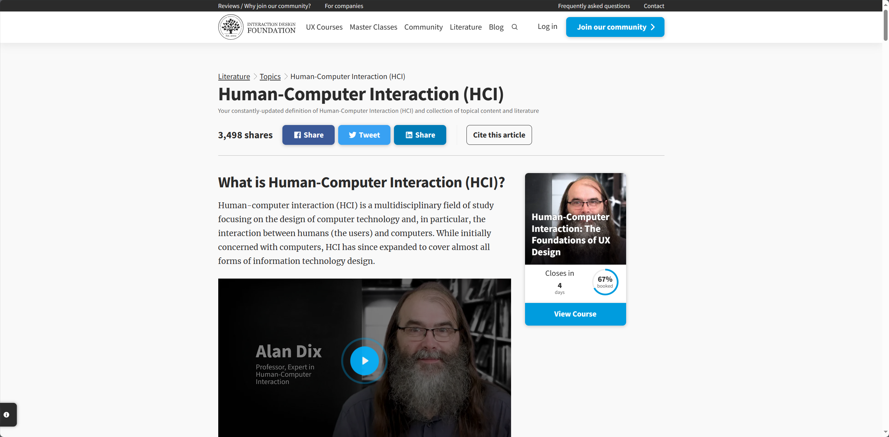

# CST Assignment #1

## 1. HCI Video Clips [40 points]

### Video Clip #1

[【ZD Course】一个开启技术大门的入门级人机交互技术基础系列课｜Course1: 初识人机交互](https://www.bilibili.com/video/BV1L14y1D7HJ/?share_source=copy_web&vd_source=2e2bcfa887bf8da9bde84af9fe79f8eb)

- **Video Clip time**: From 2:33 to 12:06, about 9 minutes.
- **Description**:
  
  - **What it presents**:
  This video clip briefly introduces the a closed loop  process of human-computer interaction, from the human cognitive system, to issuing instructions from motor system and entering the computer's input interface, to the computer completing processing, outputting feedback in different forms in computer's output interface, returning to the human perception system, and finally back to the cognitive system.
  - **Its significance for Human-Computer Interaction**:
  This video clip made me realize how to decompose a human-computer interaction system, which will help me decompose the tasks of designing such human-computer interaction systems in the following courses and even future work and study, and consider using appropriate tools, methods to solve the corresponding problems.

### Video Clip #2
[【初代iPad】乔布斯眼中的完美，消费者眼中的残废？](https://www.bilibili.com/video/BV1sh411a733/?share_source=copy_web&vd_source=2e2bcfa887bf8da9bde84af9fe79f8eb)

- **Video Clip time**: From 2:00 to 9:04, about 8 minutes, but I recommend you to watch the entire video(It takes about 12 minutes).
- **Description**:
  
  - **What it presents**:
  This is a video clip that introduces the first-generation iPad. I think this is an excellent example of human-computer interaction design. The video creator mentioned various iPad software, including memos, maps, and books, showing the exquisite design of these software at the human-computer interaction level, and then he talked about the interaction design at the physical level: touch screen design. This outstanding human-computer interaction design also promoted the birth of the iPhone and opened a new era of smartphones. At the end of the video, it is emphasized that "the designer of the machine is not the machine", which further highlights the people-centered idea of ​​human-computer interaction.
  - **Its significance for Human-Computer Interaction**:
  This video clip demonstrates a theme in different aspects: the design of human-computer interaction is human-centered. Design that conforms to human intuition can greatly reduce the difficulty of interaction and at the same time increase people's interest in interaction. This requires excellent inspiration and excellent software and hardware collaboration to build a perfect human-computer interaction system. The reason why I think this video is worth watching is: Compared with the previous video, this video shows us different human-computer interaction designs from a new perspective and starting from examples, causing us to think new about human-computer interaction.

## 2. HCI Website [30 points]

[Human-Computer Interaction (HCI)](https://www.interaction-design.org/literature/topics/human-computer-interaction)

- **Description**:
  
  - **What it presents**:
  This page is an introduction to the field of human-computer interaction (HCI), which studies the design of computer technology and its interaction with humans. It explains the origins, scope, methods, and applications of HCI, as well as its relation to other fields such as user-centered design, user interface design, and user experience design. It also provides links to various resources on HCI, such as a book chapter by a founder of HCI, John M. Carroll, courses on HCI taught by another expert, Alan Dix, and a collection of literature on HCI by the Interaction Design Foundation.
  - **Its significance for Human-Computer Interaction**:
  This page is significant for human-computer interaction because it gives a comprehensive overview of the field and its relevance for creating intuitive and effective user interfaces. It also offers valuable insights from leading researchers and practitioners in HCI, as well as opportunities to learn more about the field through online courses and articles.
  I think this website is worth using and/or exploring because it is a reliable source of information and education on HCI and related topics. It is also updated regularly with the latest developments and trends in HCI. Moreover, it is designed to be user-friendly and engaging, with clear navigation, attractive visuals, interactive elements, and feedback mechanisms.