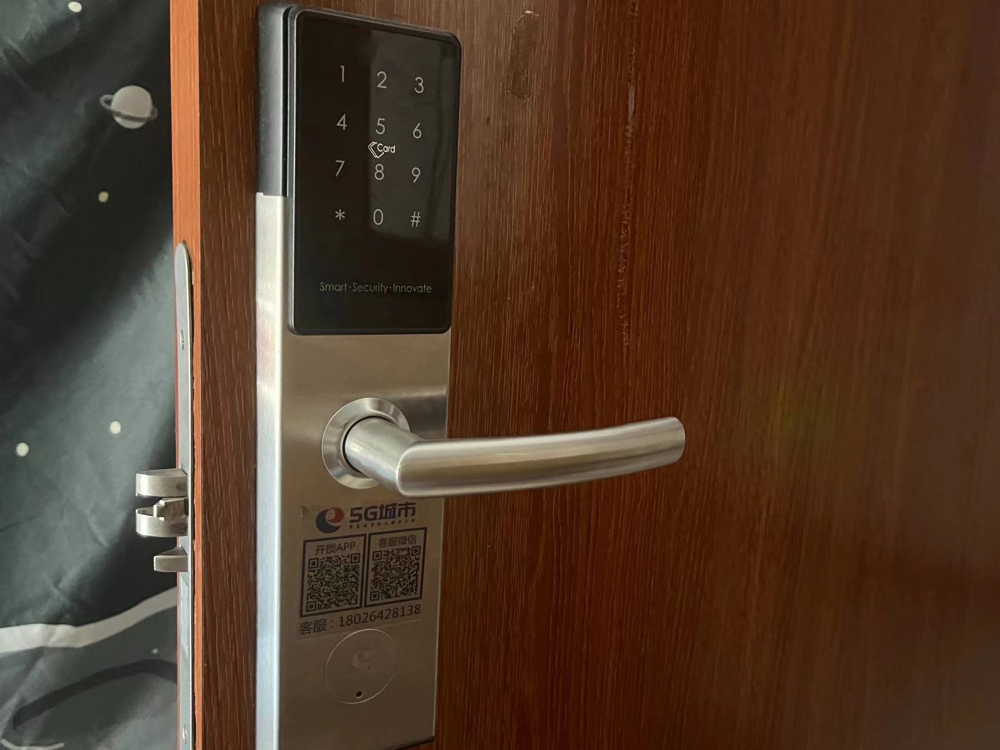

# CST Assignment #2

## HCI bad design & solution

### Example #1: Cancel physical buttons on the car

#### Description
Automobile manufacturers will pursue more advanced and modern designs in the process of building cars. With the advancement of technology, automobile manufacturers have begun to integrate large touch screens into cars as the main interface of the center console.

While these screens are visually appealing and offer a wealth of functionality, they can also cause driver distraction as some basic functions, such as adjusting the air conditioning or changing audio settings, may require the driver to avert their eyes and perform them on the touch screen. Multi-step operation, and because the touch screen lacks the tactile feedback provided by physical buttons, it is difficult for the driver to operate solely by touch, which reduces driving safety.

#### Solution
1. **Physical control elements**: For commonly used functions (such as air conditioning temperature, volume, wind direction, etc.), consider retaining or reintroducing physical knobs or buttons. This way, the driver can make quick adjustments without looking at the screen.

2. **Voice Control**: Enhance the voice control function of the in-vehicle system, allowing the driver to use natural language to perform basic operations, such as "increase the temperature" or "play the next song."

3. **Intuitive User Interface**: Make sure on-screen icons are large and obvious, and reduce multi-layered menus. The most commonly used features should be on the home screen or in an easily accessible location.

4. **Tactile feedback**: When operating on the touch screen, tactile feedback is provided so that the driver can feel that his operation has been received.

5. **Simplified Driving Mode**: When the vehicle is driving, the accessible functions are limited or simplified to ensure that the driver only focuses on basic and safe operations.

Through the above suggestions, the car central control touch screen system can ensure driving safety and prevent driver distraction while enhancing the user experience.

### Example #2: Door locks that only use card scanning

#### Description
Smart door locks provide convenient solutions for home security, but some designs are not user-friendly enough.

In the dormitory building of Jinan University, students may forget to bring the door card in an emergency or be unable to open the door lock when the power of the door lock is exhausted. The only remaining password design requires a phone card provided by the operator, and the phone card is used to contact the operator. The password obtained by sending a request to the merchant is also temporary, and the operation is very cumbersome.

#### Solution
1. **Multiple Access Methods**:
   - While maintaining the door card system, consider adding biometric access (like fingerprint or facial recognition). Modern biometrics are secure and provide quick access without needing a physical object.
   - Introduce a permanent password option that students can set and remember, alongside the temporary password feature.

2. **Emergency Power Backup**:
   - Integrate a backup power solution for the lock, such as a slot for an external battery or a USB-C port that allows students to use a power bank to temporarily power the lock.
   
3. **Simplified Password Retrieval**:
   - For students without smartphone access, consider a centralized kiosk in the dormitory or at the security desk where they can authenticate their identity (perhaps with their student ID and fingerprint) to receive a temporary password.

Incorporating these solutions can significantly enhance the user experience, reduce lockout incidents, and increase overall satisfaction with the smart door lock system.
