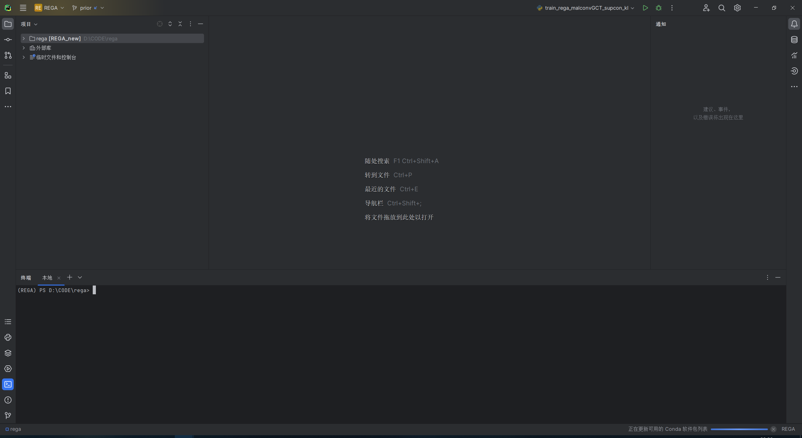

# CST Assignment #3

## A software tool that supports the construction of user computer interfaces

### 1. Introduction to PyCharm
- **Producing Company:** JetBrains s.r.o., a Czech Republic-based company known for its development tools.
- **Current Status:** PyCharm is under active development with regular updates and bug fixes. The latest versions and updates can be found on their official website or through the JetBrains Toolbox app.
- **Availability:** 
  - PyCharm Community Edition: Free, lightweight, and designed for pure Python development.
  - PyCharm Professional Edition: Paid, with full-fledged support for web development and data science.

### 2. Main Characteristics and Applicability
- **Main Functions:**
  - **Code Analysis:** Provides on-the-fly error highlighting and quick-fixes.
  
  - **Graphical Debugger and Test Runner:** Offers a powerful debugger with a user-friendly interface and a test runner for Python tests.
  
  - **Integrated Unit Testing:** Supports test frameworks like PyTest and Unittest right from the IDE.
  
  - **VCS Support:** Integrates with version control systems like Git, SVN, and Mercurial.
  

- **Organization:**
  - The IDE's workspace is divided into several areas: the editor, the navigation bar, the status bar, and tool windows. Each part can be customized or hidden according to user preferences.
  

- **Capabilities:**
  - **Web Development:** Full-stack support with HTML, CSS, JavaScript, and specific frameworks like Django, Flask, etc.
  - **Database Support:** Features like database introspection, efficient database navigation, and SQL support.

- **Intended Areas of Application:**
  - Suited for a wide range of Python projects, from simple scripts to large-scale web services, including scientific and machine learning applications.

### 3. Simple Applications/Examples
- **Simple game development**

- **Numerical Analysis**

- **Machine Learning**

### 4. Evaluation Criteria
- **Ease of Use**(The user interface is intuitive, with a manageable learning curve for beginners): ⭐⭐⭐⭐
PyCharm offers intelligent code completion, quick navigation, and error detection, which significantly streamline the development process. The docking system for managing windows and panels is intuitive. However, the sheer number of features and settings can be overwhelming for new users, hence a score of 4 instead of 5.

- **Flexibility**(Customizable to fit various programming needs and styles, with support for plugins):⭐⭐⭐⭐
The IDE is highly customizable. Users can tailor the environment to their preferences, from the UI theme to the arrangement of panels and the behavior of code assistance. Its plugin ecosystem allows for further personalization and extension of capabilities. It gets a 4 because while it's flexible, some plugins may not be maintained or could introduce instability.

- **Feature Set**(Offers a comprehensive suite of tools essential for professional Python development):⭐⭐⭐⭐⭐
PyCharm arguably offers the most comprehensive feature set for Python development, including advanced code analysis, a robust debugger, a built-in terminal, database tools, and support for web frameworks. The Professional edition further extends these features to support scientific tools and database work. It's a well-deserved 5.

- **Performance**(Generally performs well but can be resource-intensive on lower-end hardware):⭐⭐⭐
Performance is where PyCharm may lose some points. It's a heavyweight IDE which means that it may not perform as well on older or less powerful hardware. It can be slow to start up and may consume considerable system resources during operation. For those with capable hardware, this isn't an issue, but for others, it can be a limitation.

- **Support & Documentation**(Extensive documentation is available, and community support is robust):⭐⭐⭐⭐⭐
JetBrains provides excellent documentation, tutorials, and a robust community forum for PyCharm. The professional version also comes with priority support. Given the wealth of resources available, new users can quickly learn to navigate and use the IDE effectively.