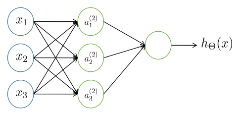

# Machine Learning Note

$\text{H3Art}$

## 成绩分布
平时成绩：40%，其中项目展示20%，报告20%（意味着应该是没有考勤的）
闭卷考试：60%

## 项目要求
项目等级的判别标准以及对应分数：
- A：**自己创建数据集**，**提供源码**，**对比多种算法**且相对准确，有**实验结果**以及**图表分析**，有**案例讨论**以及**结论展望**，报告书写整体质量较好。对应90-100分。
- B：以上条件缺1或2，报告整体质量一般。对应80-89分。
- C：以上条件缺3或4，有明显的不足（比如算法简单），报告整体质量欠佳。对应70-79分。
- D：只有方法介绍，没有实验结果。对应60-69分。
- E：缺最终报告文档。对应0-60分。

## 考试题形
- 填空30分
- 判断10分
- 简答20分
- 开放40分

## 考试内容

### 1. Introduction 介绍
- **General Procedure** to ML机器学习的一般化过程：
  - Problem Definition问题定义 -> Data Collection数据收集 -> Feature Analysis特征分析 -> Model Training模型训练 -> Evaluation Metric评估指标

- **Supervised** vs. **Unsuervised** vs. **Semi-supervised**
  - **Supervised learning监督学习**: learn with **labeled有标签** training data
  - **Unsupervised learning无监督学习**: learn with **unlabeled无标签** training data
  - **Semi-supervised半监督学习**: a **small amount of labeled data** with a **large amount of unlabeled data**.
    - Train model with labeled data
    - Use the learned model to predict unlabeled data, then adjust parameter

### 2. Overview of Supervised Learning 监督学习概述
- **Least Square最小二乘法**
  - **Linear Model线性模型**：给定一个向量输入$\mathbf{X}^\top = (X_1, X_2, \dots, X_p)$，模型表示为$\displaystyle\hat{\mathbf{Y}} = \hat{\beta_0} + \sum_{j=1}^pX_j\hat{\beta_j}$，$\hat{\beta_0}$是偏置量(bias)，$\hat{\beta_j}$是向量中每个量的权重(weight)。
  - **Residual sum of squares平方残差和**：$\displaystyle\text{RSS}(\beta) = \sum_{i=1}^N(y_i - x_i^\top\beta)^2 = (\mathbf{y}- \mathbf{X}\beta)^\top(\mathbf{y} - \mathbf{X}\beta)$

- **k-nearest neighbors/K-NN k-最邻近算法**
  - $N_k(x)$是由$k$个最靠近点$x$的点$x_i$构成的邻居集合，记作$\displaystyle\hat{Y}(x) = \frac{1}{k}\sum_{x_i\in N_k(x)}y_i$
  - 一般的对距离进行度量的方式为欧几里得距离：$d(p, q) = \sqrt{(p_1 - q_1)^2 + (p_2 - q_2)^2 + \cdots + (p_i - q_i)^2 + \cdots + (p_n - q_n)^2}$

- **Loss function vs. Expected prediction error损失函数与期望预测误差**
  - 损失函数：惩罚在预测中产生的误差：
    - 平方误差函数用于回归问题，即模型函数$f$是连续的
    - 0-1误差函数用于分类问题，即模型函数$f$是离散的
      - 贝叶斯分类器（Bayes Classifier）
  - 期望预测误差：误差函数的期望值
  - 最优预测（Optimal prediction）：最小化EPE（Expected Prediction Error）即最小化期望预测误差

- **Curse of dimensionality维度灾难**
  - 当维数增加时，**空间体积增加得很快**，导致**可用数据变得稀疏**
  - 支持结果所需的**数据量**往往随维数呈**指数级增长**
  - **采样困难**；本地方法效率低下

- **Bias-variance decomposition偏差-方差分解**
  - **Variance方差**：由于训练集的变化（即数据扰动的影响）而导致的学习性能的变化，公式表示为$\text{E}_\tau[\hat{y_0}-\text{E}_\tau(\hat{y_0})]^2$，比喻为在一个标靶打中的点的分散程度
    - 方差大：在训练时拟合优秀，在测试时表现差
    - 减小方差的做法：添加正则化、增大训练集、降维、减少模型复杂度、Dropout
  - **Bias偏差**：学习算法的预期结果和实际结果之间的偏差，即学习算法的拟合能力，公式表示为$\text{E}_\tau(\hat{y_0}) - f(x_0)$，比喻为在一个标靶中打中的点是否靠近中心（预测目标）
    - 偏差大：无法拟合原本的数据（在训练过程中）
    - 减少偏差的做法：添加更多的特征、构造更复杂的模型、减小正则化
  - **MSE/Mean Square Error均方误差 = variance方差 + squared bias平方偏差**，其由以上两式可得如下式：
  $$
    \begin{align}
      \text{MSE}(x_0) &= \text{Var}_\tau(\hat{y_0}) + \text{Bias}^2(\hat{y_0})\nonumber\\
      &= \text{E}_\tau[\hat{y_0}-\text{E}_\tau(\hat{y_0})]^2 + [\text{E}_\tau(\hat{y_0}) - f(x_0)]^2\nonumber\\
      &= \text{E}_\tau[\hat{y_0}^2 - 2\hat{y_0}\text{E}_\tau(\hat{y_0}) + (\text{E}_\tau(\hat{y_0}))^2] + \text{E}_\tau(\hat{y_0})^2 - 2\text{E}_\tau(\hat{y_0})f(x_0) + f(x_0)^2\nonumber\\
      &= \text{E}_\tau(\hat{y_0}^2) - 2\text{E}_\tau(\hat{y_0})f(x_0) + f(x_0)^2\nonumber\\
      &= \text{E}_\tau(\hat{y_0}^2) - 2\text{E}_\tau(\hat{y_0}f(x_0)) + \text{E}_\tau(f(x_0)^2)\nonumber\\
      &= \text{E}_\tau[(\hat{y_0}^2) - 2\hat{y_0}f(x_0) + f(x_0)^2]\nonumber\\
      &= \text{E}_\tau[f(x_0) - \hat{y_0}]^2\nonumber
    \end{align}
  $$

### 3. Linear Model 线性模型
- **Linear regression线性回归**
  - 线性模型的优点：simple model; basic model; good interpretability（简单、基础、好的可解释性）
  - 单变量线性回归：$f(x_i) = wx_i + b$，因此$f(x_i) \approx y_i$，此时$x_i$是一个标量（scalar），最小化其均方误差可得权重$w$和偏置$b$的表达式

    - $\displaystyle w = \frac{\sum_{i=1}^my_i(x_i - \bar{x})}{\sum_{i=1}^mx_i^2 - \frac{1}{m}\bigg(\sum_{i=1}^mx_i\bigg)^2}$
    - $\displaystyle b = \frac{1}{m}\sum_{i=1}^m(y_i - wx_i)$

  - 多变量线性回归：$f(\mathbf{x_i}) = \mathbf{w^\top x_i} + \mathbf{b}$，因此$f(\mathbf{x_i}) \approx \mathbf{y_i}$，此时$\mathbf{x_i}$是一个向量（vector），同样的使用导数最小化均方误差后，可以得到权重$\mathbf{w}$的表达式

   - $\mathbf{\hat{w}^*} = (\mathbf{X^\top X})^{-1}\mathbf{X^\top y}$

  - 广义的线性模型：$y = g^{-1}(w^\top x + b)$，此时$g(·)$是一个单调可微函数

- **Logits function 逻辑函数**
  - 目的：使用线性回归模型来处理分类问题
  - Logistic函数：任意阶可微凸函数（convex function）
    - Sigmoid函数：$\displaystyle y = \frac{1}{1 + e^z}$，其中$z$是输入的线性组合，通常为$z = \mathbf{w^\top x + b}$，这样的函数是对单位阶跃函数（Unit-step function）的平滑近似，单位阶跃函数即当输入大于0时输出1，小于0时输出0
    - 逻辑回归可以用来估计给定$x$时$y$为$1$的条件概率$P(y = 1|x)$，其通过上述所提到的Sigmoid函数有这样的转化：将$z = \mathbf{w^\top x + b}$带入Sigmoid函数，移项并取对数可得$\displaystyle \ln\frac{y}{1 - y} = \mathbf{w^\top x + b} \rightarrow \ln\frac{P(y=1|x)}{P(y=0|x)}$，则：
      - $\displaystyle P(y=1|x) = \frac{e^{\mathbf{w^\top x + b}}}{1 + e^{\mathbf{w^\top x + b}}}$
      - $\displaystyle P(y=0|x) = \frac{1}{1 + e^{\mathbf{w^\top x + b}}}$
    - 似然函数$L(\mathbf{w, b})$表示了在给定参数$\mathbf{w}$和$\mathbf{b}$下，观察到当前数据集预测结果的概率，为了便于计算，通常对似然函数取对数，最大化对数似然等价于最小化损失函数：
    - $$
      \begin{align}
        L(\mathbf{w, b}) &= \sum_{i=1}^m\ln p(y_i | x_i; w, b)\nonumber\\
        &= \sum_{i=1}^m\frac{y_i e^{\beta^\top\hat{x_i}}+(1-y_i)}{1+e^{\beta^\top\hat{x_i}}}\nonumber
      \end{align}
      $$

- **Linear discriminant analysis(LDA)线性判别分析**
  - 目标：
    - 将样本投射到一条直线上
    - 将相似样本投影得尽可能近
    - 将不相似样本投影得尽可能远
    - 对于新样本，根据其投影点的相对位置确定类别

  - Eng Ver:
    - Cast the samples onto a straight line
    - Project the similar samples as close as possible
    - Project the dissimilar samples as far as possible
    - For a new sample, determine the class according to the relative position of its projection point.

  - 数学描述：
    - 最大化$\displaystyle J = \frac{||\mathbf{w^\top\mu_0} - \mathbf{w^\top\mu_1}||_2^2}{\mathbf{w^\top\sum_0w} + \mathbf{w^\top\sum_1w}} = \frac{\mathbf{w^\top(\mu_0 - \mu_1)(\mu_0 - \mu_1)^\top\mathbf{w}}}{\mathbf{w^\top(\sum_0 + \sum_1)w}}$
    - 此时，类内散度可以表示为：$\mathbf{S_w} = \sum_0 + \sum_1 = \sum_\mathbf{x\in X_0}(\mathbf{x - \mu_0})(\mathbf{x - \mu_1})^\top$
    - 类间散度可以表示为：$\mathbf{S_b} = (\mu_0 - \mu_1)(\mu_0 - \mu_1)^\top$
    - 因此根据以上三式，$\displaystyle J = \frac{\mathbf{w^\top S_b w}}{\mathbf{w^\top S_w w}}$
    - 为了解出最优的线性组合$\mathbf{w}$，可以设定目标为最小化$\mathbf{-w^\top S_b w}$且$\mathbf{w^\top S_w w} = 1$，通过这种方式使得类间散布最大化而类内散布最小化，解的导出包括使用拉格朗日乘子法来求解带有约束的优化问题即$\mathbf{S_bw} = \lambda\mathbf{S_ww}$

### 4. Decision Tree 决策树
- **Basic algorithm基本算法**
  - 如果所有实例都来自于一个类别，那么决策树就只是包含该类名的应答节点/最终节点
  - 否则：
    - 定义$a_{\text{best}}$为具有某种机制的属性
    - 对于$a_{\text{best}}$的每个值$v_{\text{best, i}}$，从$a_{\text{best}}$生长出一个分支到所有具有$a_{\text{best}}$属性的值$v_{\text{best}}$的实例递归构建的决策树

- **Attribute Selection属性选择**
  - **Information entropy信息熵**
    - 用于衡量数据集的干净程度，信息熵越小，数据集越干净
    - 定义数据集$D$，共有$|Y|$个类，第$k$个类的占比为$p_k$，那么信息熵的计算公式定义为：$\displaystyle\text{Ent}(D) = -\sum_{k=1}^{|Y|}p_k\log_2p_k$

  - **Information gain信息增益**（在ID3算法中使用）
    - 定义在一个离散的属性集合$a$内，它有$v$个可能的取值，$a = \{a^1, a_2, \dots, a^v\}$，再定义$D^v$按照这$v$个取值划分出$v$个子集，其信息增益的度可以表示为：$\displaystyle \text{Gain}(D, a) = \text{Ent}(D) - \sum_{v=1}^V\frac{|D^v|}{D}\text{Ent}(D^v)$

  - **Gain ratio信息增益率**（在C4.5算法中使用）
    - $\displaystyle\text{Gain ratio}(D, a) = \frac{\text{Gain}(D, a)}{\text{IV}(a)}$
    - $\displaystyle\text{IV}(a) = -\sum_{v=1}^V\frac{|D^v|}{|D|}\log_2\frac{|D^v|}{|D|}$

  - **Gini index基尼指数**（在CART算法中使用）
    - $\displaystyle\text{Gini}(D) = \sum_{k=1}^{|y|}\sum_{k'\not=k}p_kp_{k'} = 1 - \sum_{k=1}^{|y|}p_k^2$
    - $\displaystyle\text{Gini index}(D, a) = \sum_{v=1}^V\frac{|D^v|}{|D|}\text{Gini}(D^v)$

- **Bi-partition for continuous value连续值的二分**
  - 对连续属性 $a$ 上的 $n$ 个不同值进行排序，得到 { $a^1, a^2, ..., a^n$ }
  - 根据分割点 $t$ 将数据集 $D$ 分为 $D_t^+$ 和 $D_t^-$
  - 候选分割点集合为 $\displaystyle T_a = \{ \frac{a^i + a^{i+1}}{2} | 1 \leq i < n \}$
  - 选择最佳的 $t$ ，使得 $\text{Gain}(D, a, t)$最大化，即$\displaystyle \text{Gain}(D, a) = \max_{t\in T_a} \text{Gain}(D, a, t) = \max_{t\in T_a}\text{Ent}(D) - \sum_{\lambda\in\{-, +\}}\frac{|D_t^\lambda|}{|D}\text{Ent}(D_t^\lambda)$

- **Reweight for missing value重新计算缺失值的权重**
  - 信息增益：
    - $$\begin{align}
    \text{Gain}(D, a) &= \rho\times\text{Gain}(\tilde{D}, a)\nonumber\\
    &= \rho\times\bigg(\text{Ent}(\tilde{D})-\sum_{v=1}^V\tilde{r_v}\text{Ent}(\tilde{D^v})\bigg)\nonumber\\
    &= \rho\times\bigg( -\sum_{k=1}^{|y|}\tilde{p_k}\log_2\tilde{p_k}  -\sum_{v=1}^V\tilde{r_v}\text{Ent}(\tilde{D^v})\bigg)\nonumber
    \end{align}
    $$

  - 如果需要，重新设置样本 $x$ 的权重 $w_x$：
    - 如果 $x$ 在属性 $a$ 上有某个值，就保持 $w_x$ 不变
    - 否则，首先将 $x$ 加入到**每一个**与属性 $a$ 对应的节点，然后将 $x$ 的权重设置为 $\tilde{r}_{v} \cdot w_x$

- **Random forest随机森林**

1. 对于$b = 1$到$B$：
   (a) 从训练数据中抽取一个大小为 $N$ 的bootstrap引导/自举？样本 $\mathbf{Z}^*$
   (b) 对bootstrap样本 $Z^*$ 生长一个随机森林树 $T_b$，通过递归重复以下步骤直到每个终端节点的树，直到达到最小节点大小 $n_{\text{min}}$ 为止
      i. 从 $p$ 个变量中随机选择 $m$ 个变量
      ii. 在这 $m$ 个变量中选择最佳变量/分割点
      iii. 将节点分成两个子节点

2. 输出树的集合 $\{T_b\}_{b=1}^B$。
  为了在新点 $x$ 上做出预测：
  回归：$\hat{f}^B_\text{rf}(x) = \frac{1}{B} \sum_{b=1}^B T_b(x)$
  分类：设 $\hat{C}_b(x)$ 为第$b$个随机森林树的类别预测，然后 $\hat{C}^B_\text{rf}(x) = \text{majority vote} \{\hat{C}_b(x)\}_{b=1}^B$

### 5. Neural Networks 神经网络
- **Model representation模型表示**
  
  在这里，第一层的输入为$x_1, x_2, x_3$，每一个神经元的权重记做$\Theta$，上标表示层数，下标与输入神经元的下标相对应，在计算过程中，我们会添加偏置项$x_0$和$a_0$，增加模型的灵活度，以更好地拟合数据。

  第一层的$x$到第二层的$a$的对应关系可以表示为：

  - $a_1(2) = g(\Theta_{10}^{(1)}x_0 + \Theta_{11}^{(1)}x_1 + \Theta_{12}^{(1)}x_2 + \Theta_{13}^{(1)}x_3)$
  - $a_2(2) = g(\Theta_{20}^{(1)}x_0 + \Theta_{21}^{(1)}x_1 + \Theta_{22}^{(1)}x_2 + \Theta_{23}^{(1)}x_3)$
  - $a_3(2) = g(\Theta_{30}^{(1)}x_0 + \Theta_{31}^{(1)}x_1 + \Theta_{32}^{(1)}x_2 + \Theta_{33}^{(1)}x_3)$

  其中，$g(·)$代表激活函数

  第二层的$a$到第三层的输出$h_\Theta(x)$的对应关系可以表达为：

  - $h_\Theta(x) = g(\Theta_{10}^{(2)}a_0^{(2)} + \Theta_{11}^{(2)}a_1^{(2)} + \Theta_{12}^{(2)}a_2^{(2)} + \Theta_{13}^{(2)}a_3^{(2)})$

  在向量化的实现中，$x = [x_0, x_1, x_2, x_3]^\top$, $z$代表每层输出的加权和，那么第二层的$z^{(2)} = [z_1^{(2)}, z_2^{(2)}, z_3^{(2)}]^\top$，总写起来为$z^{(2)} = \Theta^{(1)}x$，即第二层的$z$是第一层$x$根据相应的权重得到的加权和，但需要注意的是此时结果未激活，需要经过激活函数$g(·)$处理才得到了第二层的$a$，同理可得$z^{(3)} = \Theta^{(2)}a^{(2)}$，最后第三层的输出$h_\Theta(x) = g(z^{(3)})$

- **Backpropagation algorithm反向传播**（写出算法，产生输出和产生错误的公式）

  > **Backpropagation Algorithm**
  > Training Set $\{ (x^{(1)},  y^{(1)}), \dots , (x^{(m)}, y^{(m)})\}$
  > Set $\Delta_{ij}^{(l)} = 0$ (for all $l, i, j$)
  > For $i = 1$ to $m$
  > $\space\space\space\space\space\space$Set $a^{(1)} = x^{(i)}$
  > $\space\space\space\space\space\space$Perform forward propagation to compute $a^{(l)}$ for $l = 2, 3, \dots, L$
  > $\space\space\space\space\space\space$Using $y^{(i)}$, compute $\delta^{(L-1)} = (a_i^{(l)} - y) \cdot g'(z_i^{(l)})$
  > $\space\space\space\space\space\space$Compute $\delta^{(L-1)}, \delta^{(L-2)}, \dots, \delta^{(2)}$

  - $\displaystyle a_j^{l+1} = g\bigg(\sum_{i=1}^{S_l} \theta_{ji}^l\cdot a_i^l \bigg)$
  - $\displaystyle \delta_i^{(l)} = \frac{\partial\text{E}}{\partial z_i^{(l)}} = \sum_j^{N^{(l+1)}}(\delta_j^{l+1}\cdot \Theta_{ji}^{(l)})\cdot g'(z_i^{(l)})$

  Reset weights: $\theta_{ji}^l = \theta_{ji}^l - \alpha \cdot \delta_j^{(l+1)} \cdot a_i^{(l)}$

- **Convolutional Neural Network/CNN 卷积神经网络**
  - 一个卷积神经网络主要由以下5层组成：
    - 数据输入层/ Input layer
    - 卷积计算层/ CONV layer：卷积运算是指以一定间隔滑动卷积核的窗口，将各个位置上卷积核的元素和输入的对应元素相乘，然后再求和（有时将这个计算称为乘积累加运算），将这个结果保存到输出的对应位置
    - ReLU激励层 / ReLU layer：CNN采用的激活函数一般为ReLU，当x<0，其值为0，当x>0，其值=x
    - 池化层 / Pooling layer：池化层夹在连续的卷积层中间， 用于压缩数据和参数的量，减小过拟合，池化层通常出现在卷积层之后，二者相互交替出现，并且每个卷积层都与一个池化层一一对应
    - 全连接层 / FC layer：两层之间所有神经元都有权重连接，通常全连接层在卷积神经网络尾部。也就是跟传统的神经网络神经元的连接方式是一样的