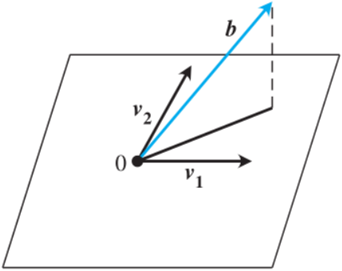

## 第四章重点（非线性方程组的求解）

### 最小二乘法
- **最小二乘解的来源推导**
  

  
  

  - $v_1x_1 + v_2x_2$构成了一个在$R^3$内的平面
  - 但$b$处于平面之外
  - 没有解满足$v_1x_1 + v_2x_2 = b$
  - 一个特别的向量$\bar{x}$在$v_1x_1 + v_2x_2$平面中最靠近$b$
  - 这个向量满足$b - v_1\bar{x}_1 - v_2\bar{x}_2$垂直于平面$v_1x_1 + v_2x_2$

  根据上述推导，我们可以设$A$是一个$m\times n$的矩阵，$b$是一个$m$维的向量，那么$Ax = b$的最小二乘解$\bar{x}$满足$$(b - A\bar{x})\perp\{Ax|x\in R^n\}$$

- **最小二乘解的求解方法/计算公式**
  - 根据最小二乘解满足$(b - A\bar{x})\perp\{Ax|x\in R^n\}$
  - 对于任意$x\in R^n$，$(Ax)^\top(b - A\bar{x}) = 0$
  - 即对于任意$x\in R^n$，$x^\top A^\top (b - A\bar{x}) = 0$
  - 那么向量$A^\top(b - A\bar{x})$垂直于任意向量$x \in R^n$
  - 因此有$A^\top(b - A\bar{x}) = 0$
  - 化简得到解$Ax = b$的最小二乘解方程$A^\top A\bar{x} = A^\top b$，$A^\top A\bar{x} = A^\top b$也称为$Ax = b$的**标准方程（normal equations）**

  **最小二乘定理**：令$A$为一个$m\times n$的矩阵，$b$是一个$m$维的向量。令$\bar{x}$为$A^\top Ax = A^\top b$的解，那么当$x = \bar{x}$时，二范数$||Ax - b||_2$取得其最小值

- **最小二乘解的误差衡量方式**

    残差计算：
      $$r = d - A\bar{x}$$

    三种方式：
    - **2-范数（2-norm）**：
      $$||r||_2 = \sqrt{r_1^2 + \cdots + r_m^2}$$

    - **平方差（squared error/SE）**：
      $$r_1^2 + \cdots + r_m^2$$

    - **均方根误差（root mean squared error/RMSE）**：
      $$\sqrt{\frac{r_1^2 + \cdots + r_m^2}{m}} = \frac{||r||_2}{\sqrt{m}}$$

### QR分解应用
- **矩阵的QR分解，$\mathbf{Q}$和$\mathbf{R}$**

  - 引入：当解最小二乘方程$A^\top Ax = A^\top b$时，$A^\top A$的条件数太大了（条件数定义为$||A^\top A||\cdot||(A^\top A)^{-1}||$）

  - **施密特正交化（Gram-Schmidt orthogonalization）**：
  记$y_i$为一个辅助向量，其垂直于$q_1, \dots, q_{i-1}$
    - 令$y_1 = A_1$，即$A$的第一列
    - 标准化$y_1$得到$\displaystyle q_1 = \frac{y_1}{||y_1||_2}$，即使得$q_1^\top q_1 = 1$
    - 通过正交化得到$y_2 = A_2 - q_1q_1^\top A_2$
      - $q_1^\top y_2 = q_1^\top(A_2 - q_1q_1^\top A_2) = q_1^\top A_2 - q_1^\top A_2 = 0$
    - 标准化$y_2$得到$\displaystyle q_2 = \frac{y_2}{||y_2||_2}$
    - $\vdots$
    - 通过正交化得到$y_j = A_j - q_1(q_1^\top A_j) - \cdots - q_{j-1}(q_{j-1}^\top A_j)$
    - 标准化$y_j$得到$\displaystyle q_j = \frac{y_j}{||y_j||_2}$
    - 最终直到得到$q_n$的结果

  - **QR分解的关系**：
    - $$(A_1|\cdots|A_n) = (q_1|\cdots|q_n)\begin{bmatrix}
      r_{11} & r_{12} & \cdots & r_{1n} \\
             & r_{22} & \cdots & r_{2n} \\
             &        & \ddots & \vdots \\
             &        &        & r_{nn}
    \end{bmatrix}$$
    - $r_{jj} = ||y_j||_2$
    - $r_{ij} = q_i^\top A_j$
    - $A_j = r_{1j}q_1 + \cdots + r_{j-1, j}q_{j-1} + r_{jj}q_j$
    - 此时的QR分解是**简化QR分解（reduced QR factorization）**

  - **完全QR分解**：
  给原有的矩阵补上线性无关的列使其变成一个$m\times m$的矩阵，再对其进行QR分解可得完全QR分解的结果
    - 在简化QR分解中，$Q$是$m\times n$的，$R$是$n\times n$的
    - 在完全QR分解中，$Q$是$m\times m$的，$R$是$m\times n$的

  - **施密特正交化的QR分解算法表示**：
  $$
  \begin{align}
    &\textbf{Input: } A\text{: An } m \times n \text{ matrix} \nonumber\\
    &\textbf{Output: } Q\text{: An orthogonal matrix} \nonumber\\
    &\space\space\space\space\space\space\space\space\space\space\space\space\space\space\space\space\space R\text{: An upper triangular matrix s.t. } A = QR \nonumber\\
    &\textbf{for } j = 1, 2, \dots, n \textbf{ do}\nonumber\\
    &\space\space\space\space\space\space y = A_j \nonumber\\
    &\space\space\space\space\space\space\textbf{for } i = 1, 2, \dots, j - 1 \textbf{ do} \nonumber\\
    &\space\space\space\space\space\space\space\space\space\space\space\space r_{ij} = q_i^\top A_j \nonumber\\
    &\space\space\space\space\space\space\space\space\space\space\space\space y = y - r_{ij}q_i \nonumber\\
    &\space\space\space\space\space\space r_{jj} = ||y||_2 \nonumber\\
    &\space\space\space\space\space\space q_j = \frac{y}{r_{jj}} \nonumber
  \end{align}
  $$

- **利用QR分解实现对非齐次线性方程组的估计计算**
  
  - **算法转化**：
    - 最小二乘法的目标：最小化$||Ax - b||_2$
    - 转化为最小化$||QRx - b||_2\space\space(A = QR)$
    - 再转化为$||Rx - Q^\top b||_2\space\space(||Rx - Q^\top b||_2 = ||QRx - b||_2$

  - **算法应用**：
    $Rx - Q^\top b = e$，$||e||_2$是$Ax$与$b$之间的误差：

    $$
    \begin{bmatrix}
      r_{11} & r_{12} & \cdots & r_{1n} \\
             & r_{22} & \cdots & r_{2n} \\
             &        & \ddots & \vdots \\
             &        &        & r_{nn} \\
       0     &   0    & \cdots &    0   \\
      \vdots &        &        & \vdots \\
       0     &   0    & \cdots &    0
    \end{bmatrix}
    \begin{bmatrix}
      x_1 \\
      \vdots \\
      x_n
    \end{bmatrix} - 
    \begin{bmatrix}
      d_1 \\
      \vdots \\
      d_n \\
      d_{n+1} \\
      \vdots \\
      d_m
    \end{bmatrix} = 
    \begin{bmatrix}
      e_1 \\
      \vdots \\
      e_n \\
      e_{n+1} \\
      \vdots \\
      e_m
    \end{bmatrix}
    $$

    此时$d = Q^\top b$，$\bar{x}$直接以$R$的上半部分（非零行）进行计算得到，$||e||_2^2 = d_{n+1}^2 + \cdots + d_m^2$是最小二乘误差

- **Householder reflect方法的证明**

  - **Householder reflector的定义**：
  令$v$是一个$n$维的单位向量，那么矩阵$H = I - 2vv^\top$就是一个Householder reflector，$H$是对称且正交的：
    - 对称性：
    $$
    \begin{align}
      H^\top &= (I - 2vv^\top)^\top = I^\top - 2(vv^\top)^\top \nonumber\\
      &= I - 2[(v^\top)^\top v^\top] = I - 2vv^\top = H \nonumber
    \end{align}
    $$

    - 正交性：
    $$
    \begin{align}
      HH^\top &= (I - 2vv^\top)(I - 2vv^\top) \nonumber\\
      &= I - 2vv^\top - 2vv^\top + 4vv^\top vv^\top \nonumber\\
      &= I - 4vv^\top + 4vv^\top = I \nonumber
    \end{align}
    $$

    Householder reflector可用于投影一个$n$维的向量到$n-1$维的平面上，同时不改变该向量的长度

- **Householder reflector形式的证明**

  - **引理**：令$x$和$w$为两个向量且$||x||_2 = ||w||_2$，那么$w - x$和$w + x$是垂直的
    - 证明：
    $$(w - x)^\top(w + x) = w^\top w - x^\top w + w^\top x - x^\top x = ||w||_2 - ||x||_2 = 0$$

  - **定理**：给定如下量
    - $x$和$w$为两个向量且$||x||_2 = ||w||_2$
    - $u = w - x$且$\displaystyle v = \frac{u}{||u||_2}$
    - $H = I - 2vv^\top$
  
    那么$Hx = w$且$Hw = x$

    - 证明：
    首先证明$Hx = w$：
    $$
    \begin{align}
      Hx &= x - 2vv^\top x \nonumber\\
      &= w - u - 2\frac{uu^\top x}{||u||_2^2} \nonumber\\
      &= w - \frac{uu^\top u}{||u||_2^2} - \frac{uu^\top x}{||u||_2^2} - \frac{uu^\top (w - u)}{||u||_2^2} \nonumber\\
      &= w - \frac{uu^\top(w+x)}{||u||_2^2} \nonumber\\
      &= w - \frac{u(w-x)^\top(w+x)}{||u||_2^2} \nonumber\\
      &= w \nonumber
    \end{align}
    $$
    再证明$Hw = x$：
    $$
    \begin{align}
      Hx &= w \nonumber\\
      H^{-1}Hx &= H^{-1}w \nonumber\\
      x &= H^\top w \nonumber
    \end{align}
    $$

- **Householder reflector的计算方式**

  - **计算Householder reflector**：
  给定两个向量$x$和$w$，需要找到$H$使得$Hx = w$且$Hw = x$

    令$u = w - x$，$\displaystyle v = \frac{u}{||u||_2}$，那么$H = I - 2vv^\top$
  

  - **QR分解**：
  给定一个$m\times n$的矩阵：
  $$
  A = \begin{bmatrix}
    A_1 & A_2 & \cdots & A_n
  \end{bmatrix} = \begin{bmatrix}
    a_{11} & a_{12} & \cdots & a_{1n} \\
    a_{21} & a_{22} & \cdots & a_{2n} \\
    \vdots & \vdots & \ddots & \vdots \\
    a_{m1} & a_{m2} & \cdots & a_{mn}
  \end{bmatrix}
  $$
    - 令$x_1 = \begin{bmatrix}
        a_{11} & a_{21} & \cdots & a_{m1}
      \end{bmatrix}^\top$
    - 令$w_1 = \begin{bmatrix}
      \text{sgn}(x_{11})||x_1||_2 & 0 & \cdots & 0
    \end{bmatrix}^\top$
      - $\text{sgn}(·)$函数代表输入大于$0$则为$1$，小于$0$则为$-1$，等于$0$则为$0$
    - 因此$u_1 = w_1 - x_1$，$\displaystyle v_1 = \frac{u_1}{||u_1||_2}$且$H_1 = I - 2v_1v_1^\top$
    - 接下来我们得到矩阵$B$：
    $$
    B = H_1A = \begin{bmatrix}
      b_{11} & b_{12} & \cdots & b_{1n} \\
      0 & b_{22} & \cdots & b_{2n} \\
      \vdots & \vdots & \ddots & \vdots \\
      0 & b_{m2} & \cdots & b_{mn}
    \end{bmatrix}
    $$

    - 接下来我们对$B$进行运算，令$x_2 = \begin{bmatrix}
      b_{22} & b_{23} & \cdots & b_{2m}
    \end{bmatrix}^\top$
    - 令$w_2 = \begin{bmatrix}
      \text{sgn}(x_{21})||x_2||_2 & 0 & \cdots & 0
    \end{bmatrix}^\top$
    - 因此$u_2 = w_2 - x_2$，$\displaystyle v_2 = \frac{u_2}{||u_2||_2}$且$\hat{H}_2 = I - 2v_2v_2^\top$（注意这里得到的是$\hat{H}$，它的尺寸并不匹配）
    - 接下来我们得到矩阵$C$：
    $$
    C = H_2B = \begin{bmatrix}
      1 & 0 & \cdots & 0 \\
      0 &   &        &   \\
      \vdots & & \hat{H_2} & \\
      0 & & &
    \end{bmatrix}B = \begin{bmatrix}
      c_{11} & c_{12} & c_{13} & \cdots & c_{1n} \\
      0 & c_{22} & c_{23} & \cdots & c_{2n} \\
      0 & 0 & c_{33} & \cdots & c_{3n} \\
      \vdots & \vdots & \vdots & \ddots & \vdots \\
      0 & 0 & c_{m3} & \cdots & c_{mn}
    \end{bmatrix}
    $$

    - 接下来根据上述步骤，我们可以不断递推，令$x_n = \begin{bmatrix}
      z_{nn} & \cdots & z_{nm}
    \end{bmatrix}^\top$
    - 令$w_n = \begin{bmatrix}
      \text{sgn}(x_{n1})||x_n||_2 & 0 & \cdots & 0
    \end{bmatrix}^\top$
    - 因此$u_n = w_n - x_n$，$\displaystyle v_n = \frac{u_n}{||u_n||_2}$且$\hat{H_n} = I - 2v_nv_n^\top$
    - 接下来我们得到最终的$R$矩阵：
    $$
    R = \begin{bmatrix}
      1 & \cdots & 0 & \cdots & 0 \\
      \vdots & \ddots & 0 & \cdots & 0 \\
      0 & \cdots & 1 & \cdots & 0 \\
      \vdots & \vdots & \vdots & \hat{H_n} & \\
      0 & \cdots & 0 & & &
    \end{bmatrix}H_{n-1}\cdots H_1 A = \begin{bmatrix}
      r_{11} & r_{12} & \cdots & r_{1n} \\
      0 & r_{22} & \cdots & r_{2n} \\
      0 & 0 & \ddots & \vdots \\
      0 & 0 & 0 & r_{nn} \\
      0 & \cdots & \cdots & 0 \\
      \vdots & 0 & 0 & \vdots
    \end{bmatrix}
    $$
    - 最终，$Q = H_1\cdots H_n$，$R = H_n\cdots H_1A$

