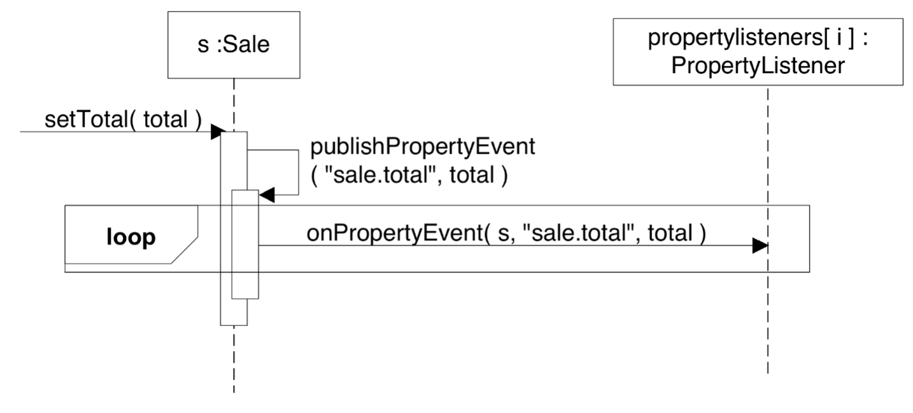
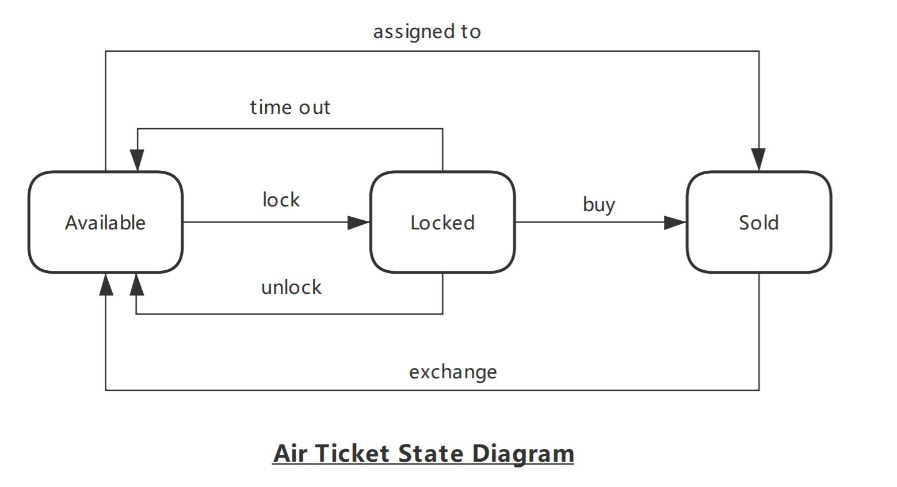

# Object-Oriented Methodology Homework

*2024 Fall Semester*

<!-- TOC -->

- [Object-Oriented Methodology Homework](#object-oriented-methodology-homework)
  - [Homework01](#homework01)
  - [Homework02](#homework02)
  - [Homework03](#homework03)
  - [Homework04](#homework04)
  - [Homework05](#homework05)
  - [Homework06](#homework06)
  - [Homework07](#homework07)
  - [Homework08](#homework08)
  - [Homework09](#homework09)
  - [Homework10](#homework10)
  - [Homework11](#homework11)
  - [Homework12](#homework12)

<!-- /TOC -->

## Homework01
Short answer questions:

1. What is the difference between OOA and OOD?
2. What is the difference between the incremental and iterative approach to software development?
3. What is the Relationship Between the Disciplines and Phases?

## Homework02
Use case diagram for a music streaming platform

Imagine you are designing a music streaming platform. Create a use case diagram to represent the interactions between different actors and use cases in the system.Show the relationships between actors and use cases (e.g., generalization, association, includes, extends).

Actors:
1. Free User: Registered user with limited access to the platform's features such as search for music , listen to music via online streaming.
2. Premium Member: Subscribed user with additional benefits, including ad-free streaming, offline downloads, and personalized recommendations.
3. Artist: Musicians or bands who upload their music to the platform.
4. Administrator: Manages the platform, including handling copyright issues, managing user complaints, and monitoring content.
All users create accounts on the platform. Users log in to their accounts to access personalized features. if they forget the password, they can recover the password through the "Retrieve Password" function.

## Homework03
Fully dressed use case for Library System

Imagine you're on a development team for a Library System that manages book borrowing and return by members. Your task is to write a 'Borrow Book' use case. It should include the following elements: Use Case Name, Scope, Level, Primary Actor, Stakeholders and their Interests, Preconditions, Success Guarantee (or Postconditions), Main Success Scenario (Basic Flow), Extensions (Alternative Flows), and Special Requirements, to fully describe the borrowing process.

Please refer to the Template and examples provided in Section 6.8 of Larman's textbook. Ensure that your use case is detailed and follows the guidelines provided in the textbook.

## Homework04
Based on the following use case text (UC01: Buy a Product ):

1. Create a System Sequence Diagram and an Activity Diagram to illustrate the interactions involved in the Basic Flow.

2. Develop a Conceptual Class Diagram (Domain Model) to represent the key entities and relationships within this scenario.


UC01: Buy a Product 

Main Success Scenario(Basic Flow):
1. Customer browses catalogue and selects items to buy.
2. Customer goes to the checkout.
3. Customer fills in shipping information
4. System presents full pricing information
5. Customer fills in credit card information
6. System authorizes purchase
7. System confirms sale
8. System sends confirming email to customer

Extensions:

3a: Customer is a regular customer
1. System displays current shipping information
2. Customer may accept or override
  
6a: System fails to authorize credit purchases
1. Customer may reenter credit card information or may cancel

## Homework05
Short answer questions:
1. Based on the system sequence diagram and domain model from your Homework04, select one of the system operations in the system sequence diagram and write an operation contract for it.
2. How does a strict layered architecture differ from a relaxed layered architecture?
3. What's the connection between SSDs, system operations, and layers?
4. What is a key advantage of sequence diagrams over communication diagrams?
5. How do communication diagrams benefit Agile Modeling practices?

## Homework06
Short answer questions:
1. What is the difference between generalization in a domain model class diagram and generalization in a design class diagram (DCD)?
2. How are GRASP and GoF patterns related?
3. What is the difference between Low Coupling and High Cohesion in the context of object design?
4. How can operation contracts be used in use case realizations?
5. Based on operation contracts in homework 5, apply GRASP to realize the operation with interaction diagrams.

## Homework07
Based on the UML sequence diagram below, please draw the corresponding UML communication diagram and write the Java code of the methods: setTotal() and publishPropertyEvent().



## Homework08
Design Problem: Strategy Pattern in Game Development

Title: Implementing AI Decision-Making with Strategy Pattern

Context:
Imagine you are working on a video game where different types of non-player characters (NPCs) need to make decisions based on various scenarios. The game has multiple levels, each with unique challenges where NPCs could either fight, flee, or negotiate with enemies.

Objective:
Design a class diagram showing how the strategy pattern can be used to implement decision-making behavior for NPCs. Your design should allow for easy addition of new strategies without modifying existing classes.

Requirements:
1. Define an interface DecisionStrategy with a single method makeDecision().
2. Create concrete classes for FightStrategy, FleeStrategy, and NegotiateStrategy implementing DecisionStrategy.
3. Design an NPC class that uses the strategy pattern to dynamically choose its decision-making behavior.

## Homework09
Design Problem: Decorator Pattern in Graphic Design Development

Problem Statement: 
Design a class diagram showing how the Decorator Pattern can be used to implement a graphic design application. The application allows users to create simple shapes (e.g., circles, rectangles) and then decorate them with various effects (e.g., border, shadow, color fill). Each effect should be a separate decorator that can be applied to any shape.

## Homework10
Design Problem: Command Pattern in Elevator Control System Development

Problem Statement:
Design a class diagram showing how the Command Pattern can be used to implement an elevator control system. The system should be able to handle different types of elevator commands such as moving the elevator to a specific floor, stopping the elevator, and opening/closing the elevator doors. The system should also support undoing the last command in case of errors or changes in requests.

## Homework11
Design Problem: Adapter Pattern in E-commerce Development

Problem Statement:
Imagine you are working on a project where you need to integrate a new payment gateway system into an existing e-commerce platform. The existing platform expects a specific interface with methods like processPayment(), authorizeTransaction(), and refundPayment(). However, the new payment gateway provides a different interface with methods named charge(), confirmAuthorization(), and issueRefund().

How would you use the Adapter Pattern to bridge this interface mismatch and allow the existing platform to interact seamlessly with the new payment gateway?

1) Write a simple Java code snippet demonstrating the Adapter class and how it would be used;
2) Draw the class diagram.

Interface expected by the existing platform:

```java
public interface OldPayment {
  void processPayment(double amount);
  void authorizeTransaction(String transactionId);
  void refundPayment(String transactionId, double amount);
}
```

Interface provided by the new payment gateway:

```java
public interface NewPayment {
  void charge(double amount);
  void confirmAuthorization(String transactionId);
  void issueRefund(String transactionId, double amount);
}
```

New payment gateway that implements NewPayment interface:

```java
public class NewPaymentGateway implements NewPayment {
  public void charge(double amount) {
    System.out.println("Charging: $" + amount);
  }
  public void confirmAuthorization(String transactionId) {
    System.out.println("Confirming authorization for transaction: " + transactionId);
  }
  public void issueRefund(String transactionId, double amount) {
    System.out.println("Issuing refund for transaction: " + transactionId + " Amount: $" + amount);
  }
}
```

## Homework12


Using the GoF State Pattern, write a complete Java program to simulate the Air Ticket System represented by the state diagram above.
