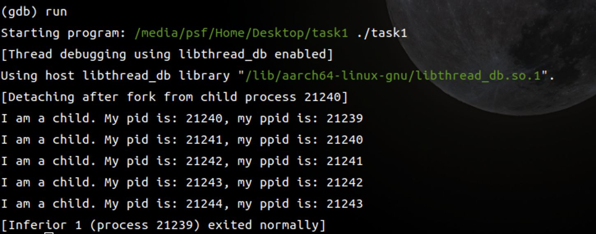
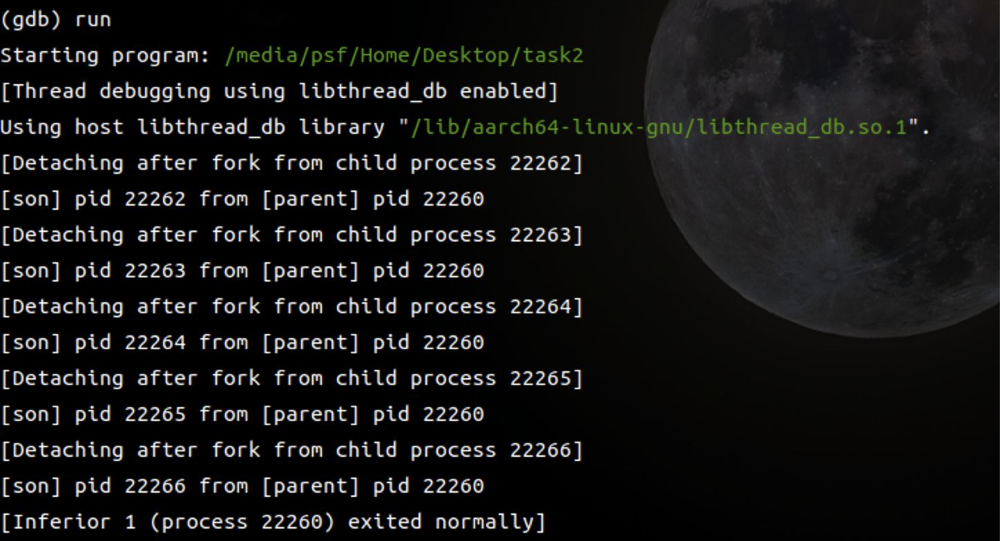

# Operating System Lab 01

---

## Task 1
Write a C program to create 4 processes where first process is the parent of the second one and the second process is the parent of the third one and the third process is the parent of the fourth one. Your program should be capable of:
- checking if the processes is forked with success
- printing the pid and parent pid of each process
- printing the parent pid of the first process

### Idea
1. Use loop to inplement the total program structure
2. `fork()` return `0` for the child process and the **process identifier** of child is returned to the parent process, On failure, `-1` is returned to the parent process
3. Since the task requires to create process one by one sequencially, I need to make every parent process `wait()` after the `fork()` finished

### Code Structure
```c
#include <stdio.h>
#include <stdlib.h>
#include <sys/types.h>
#include <sys/wait.h>
#include <unistd.h>

#define PROC_NUM 5

int main(int argc, char* argv[]) {
    pid_t pid;

    for (int i = 0; i < PROC_NUM; i++) {
        pid = fork();

        if (pid == -1) {
            fprintf(stderr, "Fork Failed\n");
            exit(1);
        } else if (pid == 0) {
            printf("I am a child. My pid is: %d, my ppid is: %d\n", getpid(),
                   getppid());
        } else {
            /*
             * This `wait(NULL)` is still unremovable because if we remove it
             * from here, the parent process will break then return directly.
             * When the child process want to output its ppid after the parent
             * process return, the ppid will be pointed to a root process, not
             * its direct parent
             */
            wait(NULL);
            /*
             * The position of `break` statement is critical
             * without the break here, the parent process will be awake if
             * - The child terminated
             * - The child was stopped by a signal
             * - The child was resumed by a signal
             * then it will enter loop again and fork more child processes
             */
            break;
        }
    }

    return 0;
}
```

### Execution Results


---

## Task 2
Write a C program to create a fan of processes. That is, process 1 is the parent of processes 2, 3, 4, 5, 6.

### Idea
1. Total structure is similar as task 1
2. Every child process can return after they are created and print their own info
3. The parent process need to `wait()` until next `fork()` calling

### Code Structure
```c
#include <stdio.h>
#include <stdlib.h>
#include <sys/types.h>
#include <sys/wait.h>
#include <unistd.h>

#define PROC_NUM 5

int main(int argc, char* argv[]) {
    pid_t pid;

    for (int i = 0; i < PROC_NUM; i++) {
        pid = fork();

        if (pid == -1) {
            fprintf(stderr, "Fork Failed\n");
            exit(1);
        } else if (pid == 0) {
            printf("[son] pid %d from [parent] pid %d\n", getpid(), getppid());
            /*
             * just need to make every child process
             * `break` directly after they printed their status
             */
            break;
        } else {
            /*
             *  This `wait(NULL)` is only for the parent process, 
             *  if parent process return faster than the child process
             *  the terminal will detect the program termination
             *  
             *  Although it just lead to output format becoming a little
             *  strange...
             */
            wait(NULL);
        }
    }

    return 0;
}
```

### Execution Results

