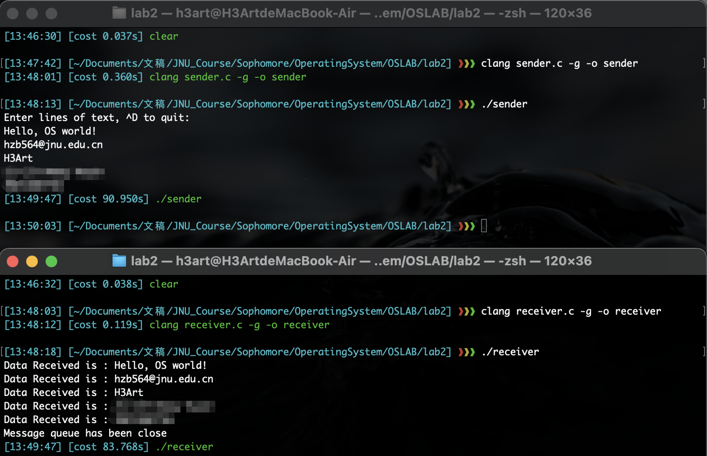

# Operating System Lab 02

## Task
Write the reader (or receiver) program, named as: **receiver.c** and print the received messages by the reader

### Idea
1. In receiver.c, create a message queue with the **same identifier**(namely, the key) as sender.c
2. Use the `msgrcv()` function to continuously read the information transmitted in the sender through a loop, and when the queue is empty, the `msgrcv()` function will block and wait
3. Handle the behavior of the receiver when the message queue is closed: the updated `errno` when the `msgrcv()` function returns `-1` determines the next behavior of the receiver

### Code Structure
```c
#include <errno.h>
#include <stdio.h>
#include <stdlib.h>
#include <string.h>
#include <sys/ipc.h>
#include <sys/msg.h>
#include <sys/types.h>

struct my_msgbuf {
  long mtype;
  char mtext[200];
};

int main(int argc, char *argv[]) {
  struct my_msgbuf buf;
  int msqid;
  key_t key;

  /**
   * Keep the key of message queue being the same as the sender
   */
  if ((key = ftok("sender.c", 'B')) == -1) {
    perror("ftok");
    exit(1);
  }

  /**
   * Receiver just needs the readable permission
   */
  if ((msqid = msgget(key, 0444 | IPC_CREAT)) == -1) {
    perror("msgget");
    exit(1);
  }

  /**
   * Specify msgflg: MSG_NOERROR,
   * if the length of the message obtained by the function is greater than
   * msgsz, it will only return the information of the length of msgsz.
   */
  while (msgrcv(msqid, &buf, sizeof(buf.mtext), 1, MSG_NOERROR) != -1) {
    printf("Data Received is : %s \n", buf.mtext);
  }

  /**
   * If the sender was closed, the message queue has been removed,
   * the upper msgrcv() will return -1, then it will update the errno to EIDRM,
   * when errno == EIDRM, the receiver doesn't need to destroy the message
   * queue.
   */
  if (errno == EIDRM) {
    printf("Message queue has been close\n");
  } else {
    if (msgctl(msqid, IPC_RMID, NULL) == -1) {
      perror("msgctl");
      exit(1);
    }
  }

  return 0;
}
```

### Execution Results

