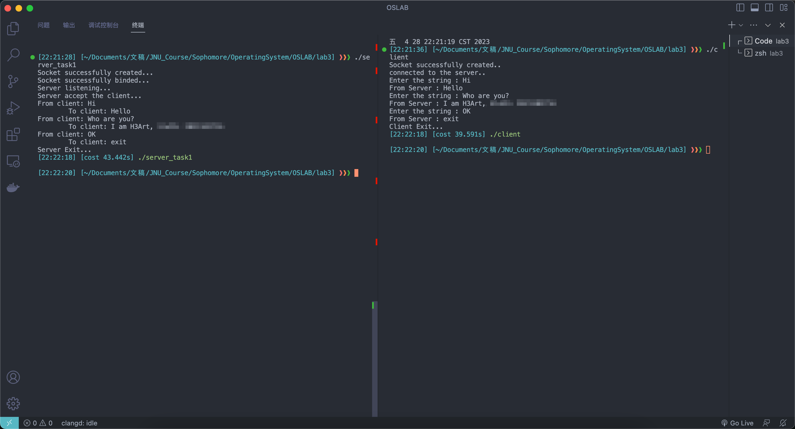
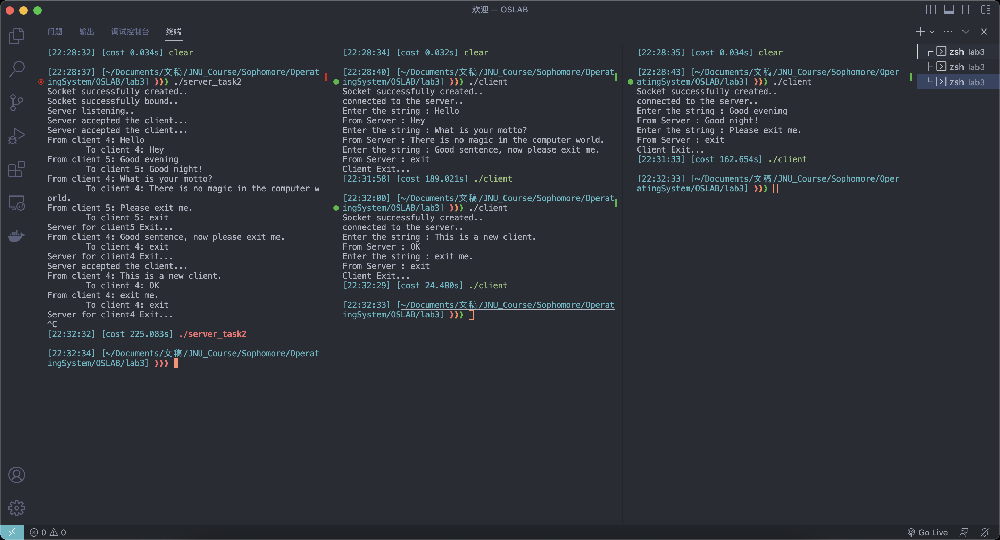

# Operating System Lab 03

## Task1
Write the server program, named as: server.c

### Idea
- The basic step of **establish connection** is: 
  - create a socket identifier: `socket()`
  - set the socket protocol content: set the `struct sockaddr_in`
  - bind the socket identifier and protocol content: `bind()`
  - set the server to the listening state: `listen()`
  - accept the connection request from the client: `accept()`
- For **data exchange**, server needs to read the client's data and store them in the server's buffer, then print them. After that, server cleans the buffer and write its own message in it then send them to client.

### Code Structure
```c
#include <arpa/inet.h> // For inet_addr()
#include <netdb.h>
#include <netinet/in.h>
#include <stdio.h>
#include <stdlib.h>
#include <string.h>
#include <sys/socket.h>
#include <unistd.h> // For Unix/Linux system function: read()/write()/close()

#define MAX 80
#define PORT 8080
#define SA struct sockaddr

void data_xchg(int clientfd) {
  char buff[MAX];
  int n = 0;
  for (;;) {
    // Read data from client and store in buffer
    read(clientfd, buff, sizeof(buff));
    printf("From client: %s", buff);

    // Clear the buffer, prepare to write from server
    bzero(buff, sizeof(buff));

    // Read data from stdin and write them into buffer
    n = 0;
    printf("\tTo client: ");
    while ((buff[n++] = getchar()) != '\n')
      ;
    // Send the data from buffer to socket
    write(clientfd, buff, sizeof(buff));

    if ((strncmp(buff, "exit", 4)) == 0) {
      printf("Server Exit...\n");
      return;
    }
  }
}

int main(int argc, char *argv[]) {
  int sockfd, clientfd;
  struct sockaddr_in serv_addr;
  struct sockaddr_in cli_addr;
  unsigned int cli_addr_len = sizeof(cli_addr);

  // Create socket
  sockfd = socket(AF_INET, SOCK_STREAM, 0);
  if (sockfd == -1) {
    printf("Socket creation failed...\n");
    exit(EXIT_FAILURE);
  } else
    printf("Socket successfully created...\n");

  // Initialize each byte with 0
  bzero(&serv_addr, sizeof(serv_addr));
  bzero(&cli_addr, sizeof(cli_addr));

  // Assign IP, port
  serv_addr.sin_family = AF_INET;
  serv_addr.sin_addr.s_addr = inet_addr("127.0.0.1");
  serv_addr.sin_port = htons(PORT);

  // Bind the socket file descriptor and the IP port
  if (bind(sockfd, (SA *)&serv_addr, sizeof(serv_addr)) < 0) {
    printf("Socket bind failed...\n");
    exit(EXIT_FAILURE);
  } else {
    printf("Socket successfully binded...\n");
  }

  // Set the server to listening state
  if (listen(sockfd, 1) < 0) {
    printf("Socket listen failed...\n");
    exit(EXIT_FAILURE);
  } else {
    printf("Server listening...\n");
  }

  // Accept the connection from client program
  clientfd = accept(sockfd, (struct sockaddr *)&cli_addr, &cli_addr_len);
  if (clientfd < 0) {
    printf("Server accept the client failed...\n");
    exit(EXIT_FAILURE);
  } else {
    printf("Server accept the client...\n");
  }

  data_xchg(clientfd);

  close(sockfd);

  return 0;
}
```

### Execution Results


## Task2
The above implementation can only perform **single-process communication**, that is to say, each time can only make a client connect to server for data communication, which obviously does not meet the basic requirements of the server.

We can modify the code on the server side by creating a child process each time after a client connection is successfully accepted by the server, and letting the child process handle the read and write data while the parent process continues to listen and accept.

### Idea
- Modify the `accept()` part and surround it with an infinite loop to receive the multi-client connection requests
- Every time when accept a connection request from new client program, we `fork()` a child process to perform the **data exchange**
- In the process of using `fork()` to achieve the communication between multi-client and server, I found that the alternate execution of multi-client will destroy the order of standard output(in a sense, this is a kind of **concurrent bug**), resulting in the output of the server does not match the actual situation
- I modified the program to use **threads** to implement, and added a **mutex** mechanism to ensure that the input and output streams will not be interrupted
- Later, I used the functions of the **semaphore** library and successfully solved the synchronization problem of using the process.

### Code Structure
- using threads version
```c
#include <arpa/inet.h> // For inet_addr()
#include <netdb.h>
#include <netinet/in.h>
#include <pthread.h> // For pthread_create()/pthread_join()/pthread_mutex_*
#include <stdio.h>
#include <stdlib.h>
#include <string.h>
#include <sys/socket.h>
#include <unistd.h> // For Unix/Linux system function: read()/write()/close()

#define MAX 80
#define PORT 8080
#define SA struct sockaddr

// Define mutex to synchronize stdout access
pthread_mutex_t stdout_mutex;

void *data_xchg_thread(void *arg) {
  int clientfd = *(int *)arg;
  char buff[MAX];
  int n = 0;
  for (;;) {
    // Read data from client and store in buffer
    read(clientfd, buff, sizeof(buff));

    // Acquire the lock to synchronize stdout access
    pthread_mutex_lock(&stdout_mutex);
    printf("From client %d: %s", clientfd, buff);

    // Clear the buffer, prepare to write from server
    bzero(buff, sizeof(buff));

    // Read data from stdin and write them into buffer
    n = 0;
    printf("\tTo client %d: ", clientfd);
    while ((buff[n++] = getchar()) != '\n')
      ;
    // Send the data from buffer to socket
    write(clientfd, buff, sizeof(buff));

    if ((strncmp(buff, "exit", 4)) == 0) {
      printf("Server for client%d Exit...\n", clientfd);
      close(clientfd);
      pthread_mutex_unlock(&stdout_mutex); // Release the lock before returning
      return NULL;
    }

    // Release the lock after finishing stdout access
    pthread_mutex_unlock(&stdout_mutex);
  }
}

int main(int argc, char *argv[]) {
  int sockfd, clientfd;
  struct sockaddr_in serv_addr;
  struct sockaddr_in cli_addr;
  unsigned int cli_addr_len = sizeof(cli_addr);

  // Create socket
  sockfd = socket(AF_INET, SOCK_STREAM, 0);
  if (sockfd == -1) {
    printf("Socket creation failed...\n");
    exit(EXIT_FAILURE);
  } else {
    printf("Socket successfully created..\n");
  }

  // Initialize each byte with 0
  bzero(&serv_addr, sizeof(serv_addr));
  bzero(&cli_addr, sizeof(cli_addr));

  // Assign IP, port
  serv_addr.sin_family = AF_INET;
  serv_addr.sin_addr.s_addr = htonl(INADDR_ANY);
  serv_addr.sin_port = htons(PORT);

  // Bind the socket file descriptor and the IP port
  if ((bind(sockfd, (SA *)&serv_addr, sizeof(serv_addr))) != 0) {
    printf("Socket binding failed...\n");
    exit(EXIT_FAILURE);
  } else {
    printf("Socket successfully bound..\n");
  }

  // Set the server to listening state
  if ((listen(sockfd, 10)) != 0) {
    printf("Listen failed...\n");
    exit(EXIT_FAILURE);
  } else {
    printf("Server listening..\n");
  }

  // Initialize the mutex
  pthread_mutex_init(&stdout_mutex, NULL);

  for (;;) {
    // Accept the data packet from client and verification
    clientfd = accept(sockfd, (SA *)&cli_addr, &cli_addr_len);
    if (clientfd < 0) {
      printf("Server accept failed...\n");
      exit(EXIT_FAILURE);
    } else {
      printf("Server accepted the client...\n");
    }

    // Create a thread to handle data exchange with this client
    pthread_t tid;
    pthread_create(&tid, NULL, data_xchg_thread, &clientfd);

    // Detach the thread to avoid memory leak
    pthread_detach(tid);
  }

  // Destroy the mutex before exiting
  pthread_mutex_destroy(&stdout_mutex);

  close(sockfd);

  return 0;
}
```

- Using `semaphore.h` version
```c
#include <arpa/inet.h> // For inet_addr()
#include <netdb.h>
#include <netinet/in.h>
#include <semaphore.h>
#include <stdio.h>
#include <stdlib.h>
#include <string.h>
#include <sys/signal.h>
#include <sys/socket.h>
#include <unistd.h> // For Unix/Linux system function: read()/write()/close()

#define MAX 80
#define PORT 8080
#define SA struct sockaddr

int sockfd;
sem_t *sem;

void sig_handler() {
  sem_close(sem);
  sem_unlink("/mysem");
  close(sockfd);
}

int data_xchg(int clientfd) {
  char buff[MAX];
  int n = 0;
  for (;;) {
    sem_wait(sem);

    // Read data from client and store in buffer
    read(clientfd, buff, sizeof(buff));
    printf("From client%d: %s", clientfd, buff);

    // Clear the buffer, prepare to write from server
    bzero(buff, sizeof(buff));

    // Read data from stdin and write them into buffer
    n = 0;
    printf("\tTo client%d: ", clientfd);
    while ((buff[n++] = getchar()) != '\n')
      ;
    // Send the data from buffer to socket
    write(clientfd, buff, sizeof(buff));

    if ((strncmp(buff, "exit", 4)) == 0) {
      printf("Server for client%d Exit...\n", clientfd);
      sem_post(sem);
      close(clientfd);
      return 0;
    }

    sem_post(sem);
  }
}

int main(int argc, char *argv[]) {
  int clientfd;
  struct sockaddr_in serv_addr;
  struct sockaddr_in cli_addr;
  unsigned int cli_addr_len = sizeof(cli_addr);

  signal(SIGINT, sig_handler);

  // Create socket
  sockfd = socket(AF_INET, SOCK_STREAM, 0);
  if (sockfd == -1) {
    printf("Socket creation failed...\n");
    exit(EXIT_FAILURE);
  } else
    printf("Socket successfully created...\n");

  // Initialize each byte with 0
  bzero(&serv_addr, sizeof(serv_addr));
  bzero(&cli_addr, sizeof(cli_addr));

  // Assign IP, port
  serv_addr.sin_family = AF_INET;
  serv_addr.sin_addr.s_addr = inet_addr("127.0.0.1");
  serv_addr.sin_port = htons(PORT);

  // Bind the socket file descriptor and the IP port
  if (bind(sockfd, (SA *)&serv_addr, sizeof(serv_addr)) < 0) {
    printf("Socket bind failed...\n");
    exit(EXIT_FAILURE);
  } else {
    printf("Socket successfully binded...\n");
  }

  // Set the server to listening state
  if (listen(sockfd, 1) < 0) {
    printf("Socket listen failed...\n");
    exit(EXIT_FAILURE);
  } else {
    printf("Server listening...\n");
  }

  // Create semaphore
  if ((sem = sem_open("/mysem", O_CREAT | O_EXCL, 0666, 1)) < 0) {
    printf("Semaphore init failed...\n");
    exit(EXIT_FAILURE);
  }
  // sem_post(sem);

  // Accept the connection from client program
  for (;;) {
    clientfd = accept(sockfd, (SA *)&cli_addr, &cli_addr_len);
    sem_wait(sem);
    if (clientfd < 0) {
      printf("Server accept the client failed...\n");
      exit(EXIT_FAILURE);
    } else {
      printf("Server accept the client...\n");
    }
    sem_post(sem);

    pid_t pid = fork();
    if (pid == 0) {
      if (data_xchg(clientfd) == 0) {
        return 0;
      }
    } else if (pid < 0) {
      printf("Fork failed...\n");
      exit(EXIT_FAILURE);
    }
  }
}
```

### Execution Results
