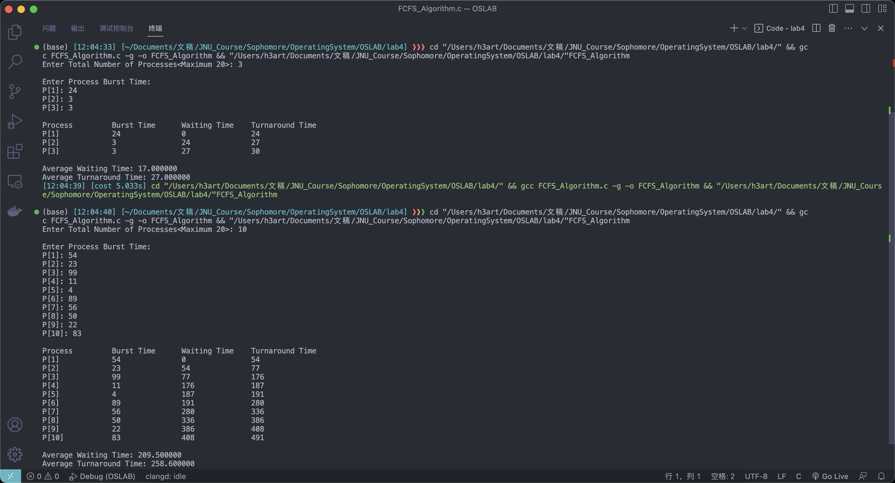
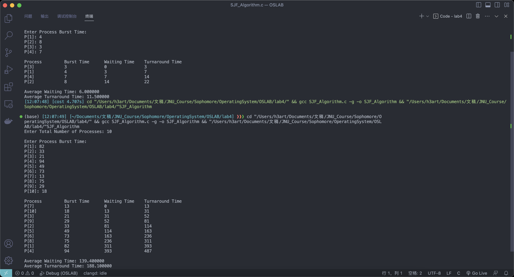

# Operating System Lab 04

## Task
Write a C program that simulates the **FCFS(First Come First Served)** and non-preemptive **SJF(Shortest Job First)** CPU scheduling algorithms. Repeat this experiment with different sets of processes and trace the waiting and turnaround times for each process. Here we are considering that arrival time for all processes is 0.

### Idea
1. Input the processes along with their burst time (bt).
2. Find waiting time (wt) for all processes.
3. As first process that comes need not to wait so 
 waiting time for process 1 will be 0 i.e. wt[0] = 0.
4. Find **waiting time** for all other processes i.e. for process i -> wt[i] = bt[i-1] + wt[i-1] .
5. Find **turnaround time** = waiting_time + burst_time for all processes.
6. Find **average waiting time** = total_waiting_time / no_of_processes.
7. Similarly, find **average turnaround time** = total_turn_around_time / no_of_processes.
### Code Structure

#### FCFS Algorithm
```c
#include <assert.h>
#include <stdio.h>
#include <stdlib.h>

#define MAX_PROC_NUM 20

typedef struct process {
  unsigned int id;
  unsigned int burst_time;
  unsigned int waiting_time;
  unsigned int turnaround_time;
} process;

int main(int argc, char *argv[]) {
  int proc_num;
  process *proc;

  printf("Enter Total Number of Processes<Maximum 20>: ");
  scanf("%d", &proc_num);
  if (proc_num > MAX_PROC_NUM) {
    perror("The number of processes should be less than 20");
    exit(EXIT_FAILURE);
  }
  
  proc = (process *)calloc(proc_num, sizeof(process));
  // Input every process's burst time
  // Calculate their waiting time simoutanously
  printf("\nEnter Process Burst Time:\n");
  for (int i = 0, waiting_time = 0; i < proc_num; i++) {
    (proc + i)->id = i + 1;
    printf("P[%d]: ", i + 1);
    scanf("%u", &((proc + i)->burst_time));

    (proc + i)->waiting_time = waiting_time;
    (proc + i)->turnaround_time = waiting_time + (proc + i)->burst_time;

    // Update next process's waiting time
    waiting_time += (proc + i)->burst_time;
  }

  // Print the time table
  printf("\n%-16s%-16s%-16s%-16s\n", "Process", "Burst Time", "Waiting Time",
         "Turnaround Time");
  for (int i = 0; i < proc_num; i++) {
    char proc_id[6];
    sprintf(proc_id, "P[%d]", (proc + i)->id);
    printf("%-16s%-16u%-16u%-16u\n", proc_id, (proc + i)->burst_time,
           (proc + i)->waiting_time, (proc + i)->turnaround_time);
  }

  // Calculate the avg waiting time
  double sum_of_waiting_time = 0;
  for (int i = 0; i < proc_num; i++) {
    sum_of_waiting_time += (proc + i)->waiting_time;
  }
  printf("\nAverage Waiting Time: %lf\n", sum_of_waiting_time / proc_num);

  // Calculate the avg turnaround time
  double sum_of_turnaround_time = 0;
  for (int i = 0; i < proc_num; i++) {
    sum_of_turnaround_time += (proc + i)->turnaround_time;
  }
  printf("Average Turnaround Time: %lf\n", sum_of_turnaround_time / proc_num);

  free(proc);

  return 0;
}
```

#### SJF Algorithm
```c
#include <assert.h>
#include <stdio.h>
#include <stdlib.h>

typedef struct process {
  unsigned int id;
  unsigned int burst_time;
  unsigned int waiting_time;
  unsigned int turnaround_time;
} process;

void quick_sort(process*, int, int);

int main(int argc, char *argv[]) {
  int proc_num;
  process *proc;

  printf("Enter Total Number of Processes: ");
  scanf("%d", &proc_num);

  proc = (process *)calloc(proc_num, sizeof(process));

  printf("\nEnter Process Burst Time:\n");
  for (int i = 0; i < proc_num; i++) {
    (proc + i)->id = i + 1;
    printf("P[%d]: ", i + 1);
    scanf("%u", &((proc + i)->burst_time));
  }

  // Sort the process by burst time in increasing order
  quick_sort(proc, 0, proc_num - 1);
  // Calculate every waiting & turnaround time after sorting
  for (int i = 0, waiting_time = 0; i < proc_num; i++) {
    (proc + i)->waiting_time = waiting_time;
    (proc + i)->turnaround_time = waiting_time + (proc + i)->burst_time;

    // Update next process's waiting time
    waiting_time += (proc + i)->burst_time;
  }

  // Print the time table
  printf("\n%-16s%-16s%-16s%-16s\n", "Process", "Burst Time", "Waiting Time",
         "Turnaround Time");
  for (int i = 0; i < proc_num; i++) {
    char proc_id[6];
    sprintf(proc_id, "P[%d]", (proc + i)->id);
    printf("%-16s%-16u%-16u%-16u\n", proc_id, (proc + i)->burst_time,
           (proc + i)->waiting_time, (proc + i)->turnaround_time);
  }

  // Calculate the avg waiting time
  double sum_of_waiting_time = 0;
  for (int i = 0; i < proc_num; i++) {
    sum_of_waiting_time += (proc + i)->waiting_time;
  }
  printf("\nAverage Waiting Time: %lf\n", sum_of_waiting_time / proc_num);

  // Calculate the avg turnaround time
  double sum_of_turnaround_time = 0;
  for (int i = 0; i < proc_num; i++) {
    sum_of_turnaround_time += (proc + i)->turnaround_time;
  }
  printf("Average Turnaround Time: %lf\n", sum_of_turnaround_time / proc_num);

  free(proc);

  return 0;
}

void quick_sort(process *proc, int begin, int end) {
  if (begin > end) {
    return;
  }
  // Set the beginning element as standard
  process std = *(proc + begin);
  int i = begin;
  int j = end;

  while (i != j) {
    // If the process burst time satisfies the order, skip it
    while ((proc + j)->burst_time >= std.burst_time && i < j) {
      j--;
    }
    while ((proc + i)->burst_time <= std.burst_time && i < j) {
      i++;
    }
    // Exchange the two which are out of order
    if (i < j) {
      process temp = *(proc + i);
      *(proc + i) = *(proc + j);
      *(proc + j) = temp;
    }
  }

  // Finally when i and j coincide, this position 
  // is the standard element's position
  *(proc + begin) = *(proc + i);
  *(proc + i) = std;

  quick_sort(proc, begin, i - 1);
  quick_sort(proc, i + 1, end);
}
```

### Execution Results

#### FCFS Algorithm


#### SJF Algorithm
