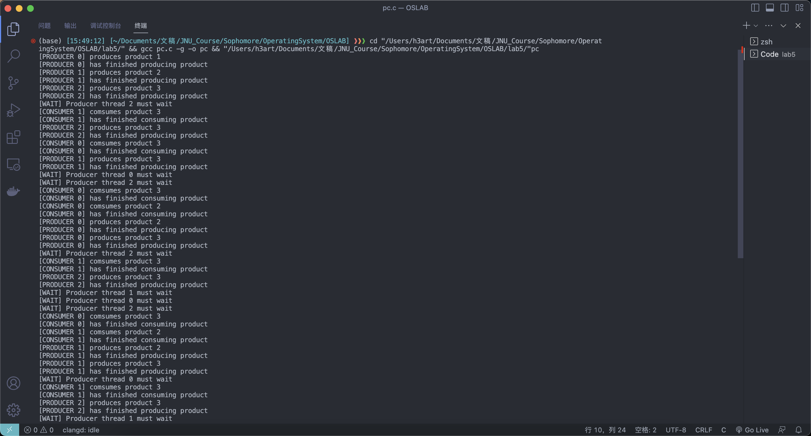

# Operating System Lab 05

## Task
Write code to solve the producer-consumer synchronization problem. Partial of the code have been given in pc.c. 

### Idea
- Use `pthread_mutex_lock()` and `pthread_mutex_unlock()` to make sure only one producer or consumer can get into the critical section to produce or consume.
- Use `pthread_cond_wait()` and `pthread_cond_signal()` to restrict producers from producing too many products, and also restrict consumers from consuming when there is no product
- Use `sleep()` to sleep the thread that completes the production or consumption to obtain more fully the results of different thread calls

### Code Structure
```c
#include <pthread.h>
#include <stdio.h>
#include <stdlib.h>
#include <unistd.h>

#define PRO_NUM 3 // Number of producer thread
#define CON_NUM 2 // Number of consumer thread

pthread_cond_t n_full;
pthread_cond_t n_empty;
pthread_mutex_t mutex;

int g_num = 0;     // Number of products
int empty_num = 3; // Size of buffer

// producer
void *pro_route(void *arg) {
  // Write producer code here:
  int id = *(int *)arg;
  free(arg);

  for (;;) {
    pthread_mutex_lock(&mutex);

    while (g_num == empty_num) {
      printf("[WAIT] Producer thread %d must wait\n", id);
      pthread_cond_wait(&n_full, &mutex);
    }

    printf("[PRODUCER %d] produces product %d\n", id, ++g_num);
    printf("[PRODUCER %d] has finished producing product\n", id);
    pthread_cond_signal(&n_empty);
    pthread_mutex_unlock(&mutex);
    sleep(rand() % 4);
  }
}

// consumer
void *con_route(void *arg) {
  // Write consuder code here:
  int id = *(int *)arg;
  free(arg);

  for (;;) {
    pthread_mutex_lock(&mutex);

    while (g_num == 0) {
      printf("[WAIT] Consumer thread %d must wait\n", id);
      pthread_cond_wait(&n_empty, &mutex);
    }

    printf("[CONSUMER %d] comsumes product %d\n", id, g_num--);
    printf("[CONSUMER %d] has finished consuming product\n", id);
    pthread_cond_signal(&n_full);

    pthread_mutex_unlock(&mutex);
    sleep(rand() % 4);
  }
}

int main() {
  srand(getpid());

  pthread_t tids[PRO_NUM + CON_NUM];

  // Initialize mutex and condition variables
  pthread_mutex_init(&mutex, NULL);
  pthread_cond_init(&n_full, NULL);  // Condition varible n_full
  pthread_cond_init(&n_empty, NULL); // Condition variable n_empty

  // Create producer thread
  for (int i = 0; i < PRO_NUM; ++i) {
    int *p = (int *)malloc(sizeof(int)); // Thread number
    *p = i;
    pthread_create(&tids[i], NULL, pro_route, p);
  }

  // Create consumer thread
  for (int i = 0; i < CON_NUM; ++i) {
    int *p = (int *)malloc(sizeof(int));
    *p = i;
    pthread_create(&tids[i], NULL, con_route, p);
  }

  // Wait for the termination of thread
  for (int i = 0; i < PRO_NUM + CON_NUM; ++i) {
    pthread_join(tids[i], NULL);
  }

  pthread_mutex_destroy(&mutex);
  pthread_cond_destroy(&n_full);
  pthread_cond_destroy(&n_empty);

  return 0;
}
```

### Execution Results

