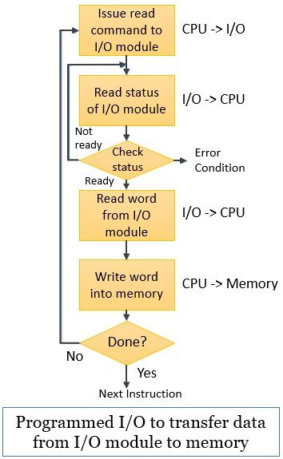
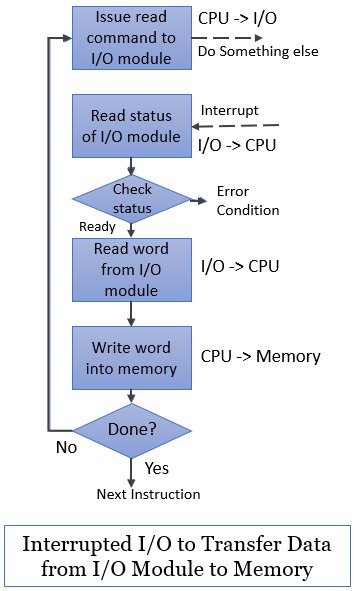
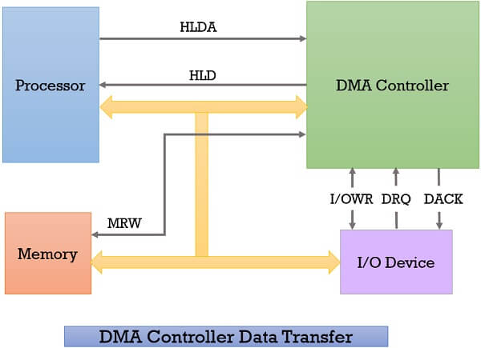
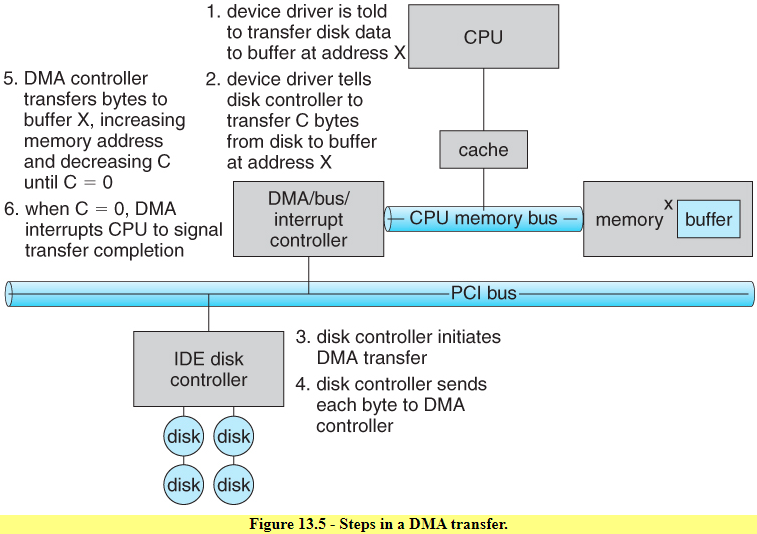
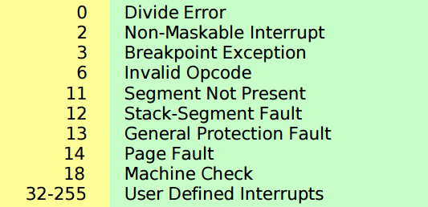
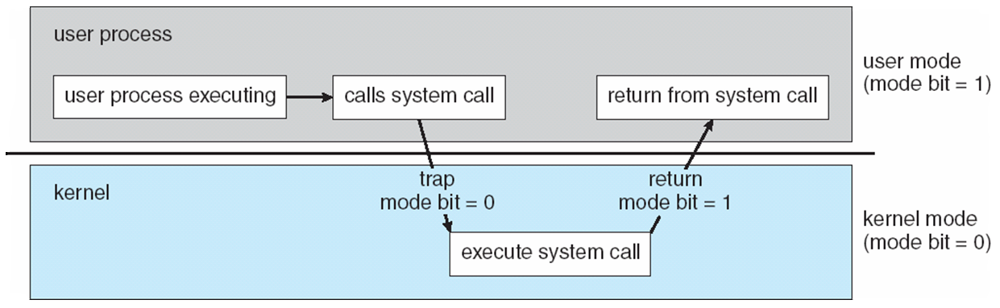

# OS Chapter 1 Introduction

<!-- TOC -->

- [OS Chapter 1 Introduction](#os-chapter-1-introduction)
  - [What is an Operating System](#what-is-an-operating-system)
  - [What Operating Systems Do — User view](#what-operating-systems-do--user-view)
  - [What Operating Systems Do — System view](#what-operating-systems-do--system-view)
  - [Where is the OS stored on the computer \& What operation or program starts the OS](#where-is-the-os-stored-on-the-computer--what-operation-or-program-starts-the-os)
  - [Storage Structure](#storage-structure)
  - [I/O](#io)
    - [Programmed I/O(程序控制下的I/O)](#programmed-io程序控制下的io)
    - [Interrupted I/O(中断型I/O)](#interrupted-io中断型io)
    - [Direct Memory Access(DMA/直接内存访问)](#direct-memory-accessdma直接内存访问)
      - [DMA controller modes](#dma-controller-modes)
    - [Comparison](#comparison)
  - [Operating System Structure](#operating-system-structure)
  - [Interrupt](#interrupt)
    - [Interrupt driven(中断的驱动形式)](#interrupt-driven中断的驱动形式)
    - [Exceptions(异常)](#exceptions异常)
    - [Interrupt Service Routine(中断服务程序)](#interrupt-service-routine中断服务程序)
  - [System Call](#system-call)
  - [Operating-System Operations](#operating-system-operations)
    - [Operating System Mode and Effect](#operating-system-mode-and-effect)
    - [User Mode](#user-mode)
    - [Kernel Mode](#kernel-mode)
  - [Management](#management)
    - [Process Management Activities](#process-management-activities)
    - [Memory Management Activities](#memory-management-activities)
    - [Storage Management](#storage-management)
    - [Mass-Storage Management](#mass-storage-management)
  - [Migration of data “A” from Disk to Register](#migration-of-data-a-from-disk-to-register)

<!-- /TOC -->

> **Workload**
> - 1 mid-term exam
> - 2 take-home assignments
> - 1 final exam
> - 6 lab assignments

## What is an Operating System
- An Operating System (OS) is a **program** that manages the computer **hardware**
  - 操作系统(OS)是管理计算机**硬件**的**程序**
- An Operating System (OS) provides a **basis** for Application Programs
  - 操作系统(OS)为应用程序提供了**基础**
- A Operating System (OS) acts as an **intermediary** between computer **user** and computer **hardware**
  - 操作系统(OS)作为**用户**和计算机**硬件**之间的**中介**

## What Operating Systems Do — User view
- One PC user want **convenience**, **ease of use** and **good performance**, and don’t care about **resource utilization**
  - 需要**方便**，**易用**以及**高性能**，但不关心**资源利用率**
- Shared computer such as mainframe or minicomputer must **keep all users happy**
  - ⼤型机或⼩型机等共享计算机必须**让所有⽤⼾都满意**
- Handheld computers are **resource poor**, **optimized for usability** and **battery life**
  - 掌上型电脑资源(算力、存储容量)匮乏，需要针对可⽤性和电池寿命进⾏优化
- Some computers have little or no user interface, such as embedded computers in devices and automobiles
  - 有些计算机⼏乎没有⽤⼾界⾯，例如设备和汽⻋中的嵌⼊式计算机

## What Operating Systems Do — System view
- OS is a **resource allocator资源分配器**
  - Manages all resources(CPU time, memory space, file-storage space, I/O devices, and so on)
    - 管理所有的资源(CPU时间，内存空间，文件存储空间，I/O设备等等)
  - Decides between conflicting requests for efficient and fair resource use
    - 在冲突请求之间做出决定，保证整个计算机系统的高效和公平的资源利用
- OS is a **control program控制程序**
  - Controls execution of programs to prevent errors and improper use of the computer, especially for I/O
    - 执行控制程序以防⽌错误和不当使⽤计算机，尤其是I/O的不正当使用

## Where is the OS stored on the computer & What operation or program starts the OS
- **bootstrap program引导程序** is loaded at power-up or reboot
  - Loads operating system kernel and starts execution
    - Locate the operating-system kernel and load it into memory
  - Some services are provided outside of the kernel, by system software
  - Typically stored in ROM, generally known as **firmware**
    - 一般来说引导程序存储在ROM中，而整个操作系统存储在硬盘中，引导程序引导操作系统从硬盘加载到主存储器(内存)中

## Storage Structure
- Main memory – **only** large storage media that the CPU **can access directly**
  - Also called Random access memory(RAM)
  - Rewritable
- Computers use other forms of memory as well
  - Read-only memory(ROM）
- Interaction is achieved through a sequence of **load** or **store** instructions to specific memory addresses
  - 系统交互是通过对特定内存地址的⼀系列**加载**或**存储**指令来实现的
- Ideally, we want the programs and data to reside in main memory permanently. Usually, it is **impossible**
  - Main memory is too **small**
  - Main memory is **volatile易失性的**
- Secondary storage – extension of main memory that provides large **nonvolatile** storage capacity
  - Hard disks(HDD) – the most common secondary-storage device
  - Solid-state disks(SSD) – faster than hard disks, nonvolatile
    - Stores data in a large DRAM, a hidden hard disk, a battery
    - Becoming more popular: flash memory
  - Caching(Cache) – copying information into faster storage system; main memory can be viewed as a cache for secondary storage

## I/O
Input & Output

### Programmed I/O(程序控制下的I/O)
A technique that we use to transfer data between the processor and the I/O module.

特点就是利用编程，实现`while()`式的等待，处理器不断检查I/O模块是否准备好接收和发送数据，或者I/O模块是否完成了期望的任务。 处理器的这种长时间等待会降低系统的性能

编程式I/O的主要特点是简单、**易于实现**，但是CPU需要不断轮询I/O设备的状态，会**浪费CPU资源**，并且响应速度较慢

### Interrupted I/O(中断型I/O)
An approach to transfer data between ‘memory’ and ‘I/O devices’ through the ‘processor’.

在中断式I/O中，处理器向相应的I/O模块发出`READ`I/O命令，并继续执行其他一些有用的任务。它**不会等待I/O**模块准备好所需的数据

当I/O设备完成操作时，它会**向CPU发送中断信号**，当当处理器发现I/O模块的中断时，它会暂停当前的执行并保存上下文（例如，程序计数器、处理器寄存器），并跳转到中断处理程序来处理I/O设备的数据

中断式I/O的主要特点是能够**减少CPU的轮询操作**，提高了CPU的利用率和响应速度，但是中断处理程序会占用CPU时间，并且需要进行中断处理程序的设计和实现

### Direct Memory Access(DMA/直接内存访问)
Transfers the block of data between the memory and I/O devices of the system, **without the participation of the processor**.

设备控制器(Device Controller)将数据块从缓冲存储器**直接传输到主存储器**，⽆需CPU⼲预。对于数据，**每个块只产⽣⼀个中断**，⽽不是每个字节产⽣⼀个中断，因此DMA是⽤于能够以接近内存速度传输信息的⾼速I/O设备

#### DMA controller modes
1. **Burst Mode**(突发模式)
   - The DMA controller gains the charge of the system bus, then it releases the system bus only after completion of data transfer. Till then the CPU has to wait for the system buses.
   -  DMA控制器在**突发模式**下直接**占据总线**，它优先访问总线，而CPU则会被暂停访问总线，直到DMA传输操作完成或者达到传输长度的限制，才会释放总线给CPU进行访问。这种方式可以避免CPU和DMA控制器之间的竞争，提高系统的性能和效率(单次全部数据传输)

2. **Cycle Stealing Mode**(周期传输/周期窃取模式)
   - The DMA controller forces the CPU to stop its operation and relinquish the control over the bus for a short term to DMA controller. After the transfer of every byte, the DMA controller releases the bus and then again requests for the system bus. In this way, the DMA controller steals the clock cycle for transferring every byte.
   - DMA控制器在**周期传输模式**下强制CPU停止运行，并在**短期内将对总线的控制权交给DMA控制器**。传输完每个字节后，DMA 控制器释放总线，然后再次请求系统总线(多次传输数据)

3. **Transparent Mode**(透明模式)
   - The DMA controller takes the charge of system bus only if the processor does not require the system bus.
   - DMA控制器通过总线接口，直接读写内存和外设寄存器，进行数据传输和处理，在完成数据传输和处理后，通过DMA中断或者其他方式向CPU发出通知。需要注意的是，在**透明模式**下，DMA控制器**具有和CPU相同的访问权限**，因此需要谨慎处理访问冲突和竞争。同时，由于Transparent Mode需要直接访问系统内存和外设寄存器，因此需要进行适当的安全性和稳定性考虑，以避免对系统造成损害和影响。

### Comparison
- **Programmed I/O**: It transfers data at a high rate, but it can’t get involved in any other activity during data transfer.
  - 程序控制下的I/O可以高速地传输数据，易于编程实现，但在数据传输过程中CPU不能参与其他任何活动
- **Interrupted I/O**: the processor doesn’t keep scanning for I/O devices ready for data transfer. But, it is fully involved in the data transfer process.
  - 中断型I/O也可以高速地传输数据，它利用操作系统提供的中断机制，通过中断通知CPU当前的传输状态，虽然CPU不会持续扫描I/O设备，但是CPU还是参与了整个数据传输过程(CPU干预了数据从I/O与内存之间的传输)
- **DMA**: completes this task at a faster rate and is also effective for transfer of large data block.
  - DMA虽然也利用了中断机制，但它只需要在传输的开始与结束进行中断通知，同时CPU不需要介入数据传输的干预，数据可以通过I/O设备直达内存

## Operating System Structure
- **Multiprogramming** is needed for efficiency(保证多程序运行)
  - Single user cannot keep CPU and I/O devices busy at all times(保证多用户运行时的公平性)
  - Multiprogramming organizes jobs (code and data) so CPU always has one to execute(保证CPU总是有活可干)
- **Basic idea** of multiprogramming
  - A subset of total jobs in system is kept in memory(一部分工作将会被保存在内存中)
  - One job selected and run via job scheduling(存在工作调度)
  - When it has to wait (for I/O for example), OS switches to another job(需要等待时，操作系统将会到切换其他的工作)
- **Timesharing**(**multitasking**) is logical extension in which CPU switches jobs **so frequently** that users can interact with each job while it is running, creating interactive computing(分时/多任务的概念——CPU非常频繁地在任务间切换导致用户可以与任一工作交互)
  - Response time should be < 1 second(程序的回复/反应时间总是低于1秒)
  - Each user has at least one program executing in memory(process进程的概念)
- Timesharing and multiprogramming require that **several jobs be kept simultaneously** in memory(多项工作同时保存在内存中)
  - If several jobs ready to be brought into memory $\rightarrow$ **Job scheduling(工作调度)**
  - If several jobs ready to run at the same time $\rightarrow$ **CPU scheduling(处理器调度)**
- In timesharing, the OS must **ensure reasonable response time**
  - If processes don’t fit in memory, **swapping** moves them in and out to run(内存与硬盘之间的swap策略)
  - **Virtual memory** allows execution of processes not completely in memory(虚拟内存允许进程的执行有部分不在内存中——地址空间可以扩展到硬盘)

> **Prompt: 能向我解释一下分时操作系统和实时操作系统的特点和区别吗**
>
> **Reply be ChatGPT:**
>
> 当涉及到操作系统时，分时操作系统和实时操作系统是两个非常不同的概念。下面是它们的特点和区别：
> 
> **分时操作系统（Time-sharing Operating System）特点**：
>
> - 分时操作系统是一种多任务操作系统，允许多个用户同时访问计算机资源，并在同一时间内运行多个程序。
> - 它为每个用户分配一定的时间片，以轮流执行用户的请求，从而在感觉上实现同时操作的效果。
> - 分时操作系统能够有效地利用计算机的资源，提高计算机的利用率和效率。
>
> **实时操作系统（Real-time Operating System）特点**：
>
> - 实时操作系统是一种专门为实时应用设计的操作系统，它需要在特定的时间范围内完成任务，并保证任务能够按照规定的时间完成。
实时操作系统通常分为硬实时系统和软实时系统。
> - 硬实时系统要求任务必须在规定的时间内完成，否则会导致系统故障或者损失，这种系统通常用于控制和自动化领域。
> - 软实时系统要求任务在规定的时间内完成，但可以容忍一定的延迟，这种系统通常用于多媒体和通信领域。
> 
> **区别：**
> 
> - 分时操作系统是为了处理多个用户请求而设计的，它的主要目标是为了提供良好的用户体验。
> - 分时操作系统的响应时间通常不需要非常短，因为它更注重于用户的交互性和易用性，而不是实时性能。
> - 实时操作系统的主要目标是保证任务能够按照规定的时间完成，因此它的响应时间非常短，通常只有几毫秒的时间。
> - 实时操作系统需要特定的调度算法和内存管理技术，以确保任务能够按时完成，并且必须保证系统的可靠性和稳定性。
> - 分时操作系统和实时操作系统在设计和实现上有很大的差异，因此它们通常用于不同的应用场景。

## Interrupt

### Interrupt driven(中断的驱动形式)
- **Hardware** interrupt by one of the devices
  - 硬件中断——发送电信号给CPU(例如：I/O传输完毕)
- **Software** interrupt (**exception** or **trap**):
  - Software error (e.g., division by zero)
    - 软件运行错误
  - Invalid memory access
    - 非法内存访问
  - A specific request from user program that an OS service be performed
    - 程序的特定请求，请求执行操作系统服务

### Exceptions(异常)
- Any event that can alter normal CPU instruction execution flow
  - **异常**的定义是：任何可以改变CPU正常指令执行流的事件

### Interrupt Service Routine(中断服务程序)
- Interrupt transfers control to the **interrupt service routine** generally, through the **interrupt vector**, which contains the addresses of all the service routines
  - 中断将控制转移到**中断服务程序**，通过**中断向量**，中断向量中包含所有中断服务程序的地址
- Every interrupt type is assigned a number:
  - **Interrupt vector中断向量**
- A table of pointers to interrupt routine
- When an interrupt occurs, the vector determines what code is invoked to handle the interrupt, the **interrupt vectors table** is as follows

- The interrupt must transfer control to the appropriate interrupt service routine.Thus, the interrupt routine is called indirectly through the table
  - **中断处理的流程：**
  外部设备/内部软件发出中断 $\rightarrow$ 查找中断向量表对应的中断类型 $\rightarrow$ CPU挂起当前进程 $\rightarrow$ 中断服务程序(ISR)处理中断 $\rightarrow$  控制流归还给进程

## System Call
- System call provides the services of the operating system to the user programs via **Application Program Interface (API)**. 
  - 系统调用通过**应用程序接口**向用户程序提供操作系统的服务
- It provides an **interface** between a process and operating system to allow user-level processes to request services of the operating system.
  - 它提供进程和操作系统之间的**接口**，允许用户级进程请求操作系统的服务
- System calls are the **only** entry points into the kernel system.
  - 系统调用是进入内核系统的**唯一**入口点

## Operating-System Operations

### Operating System Mode and Effect
- **Proper execution**: **distinguish** between the execution of operating-system code and user-defined code区分操作系统代码和用户定义的代码的执行
  - **Dual-mode** operation allows OS to protect itself and other system components双模式的操作系统可以保护自身的代码
    - User mode and kernel mode它区分了用户态和系统内核态
    - Mode bit provided by hardware
      - Provides ability to distinguish when system is running user code or kernel code
    - System call changes mode to kernel, return from call resets it to user使用系统调用将会将系统从用户态切换至内核态，操作系统接管并执行操作后返回到用户态
- **Protection** operating system保护操作系统
  - Some instructions designated as privileged, only executable in kernel mode高权限的指令只能在内核态下被执行

### User Mode
- Because an application's virtual address space is **private**, one application cannot alter data that belongs to another application.
  - 用户应用程序的虚拟地址空间是**私有**的，一个应用程序不能更改属于另一个应用程序的数据
- Each application runs in **isolation**, and if an application crashes, the crash is limited to that one application. 
  - 每个应用程序都**独立运行**，如果一个应用程序崩溃，则崩溃仅限于该应用程序
- Other applications and the operating system are **not affected by the crash**.
  - 其他应用程序和操作系统**不受崩溃的影响**
- In addition to being private, the virtual address space of a user-mode application is **limited**.
  - 用户应用程序除了虚拟地址空间私有之外，用户模式应用程序的**虚拟地址空间也是有限的**
- A processor running in user mode **cannot access** virtual addresses that are reserved for the operating system. 
  - 以用户模式运行的处理器**无法访问为操作系统保留的虚拟地址**
- Limiting the virtual address space of a user-mode application **prevents** the application from altering, and possibly damaging, critical operating system data.
  - 限制用户模式应用程序的虚拟地址空间可**防止**应用程序更改并可能损坏关键操作系统数据

### Kernel Mode
- All code that runs in kernel mode **shares** a single virtual address space. 
  - 在内核模式下运行的所有代码**共享一个虚拟地址空间**
- This means that a kernel-mode driver is **not isolated** from other drivers and the operating system itself. 
  - 这意味着内核模式驱动程序并**不**与其他驱动程序和操作系统本身**隔离**
- If a kernel-mode driver accidentally writes to the **wrong virtual address**, data that belongs to the operating system or another driver could be compromised. 
  - 如果内核模式驱动程序不小心写入了**错误的虚拟地址**，则属于操作系统或其他驱动程序的数据可能会**受到损害**
- If a kernel-mode driver crashes, the **entire operating system crashes**.
  - 如果内核模式下的驱动程序崩溃，则**整个操作系统都会崩溃**

## Management

### Process Management Activities
The operating system is responsible for the following activities in connection with process management:

- **Scheduling** processes and threads on the CPUs
  - 在CPU上**调度**进程和线程
- **Creating** and **deleting** both user and system processes
  - **创建**和**删除**用户和系统进程
- **Suspending** and **resuming** processes
  - **挂起**和**恢复**进程
- Providing mechanisms for **process synchronization**
  - 提供**进程同步**机制
- Providing mechanisms for **process communication**
  - 提供**进程通信**机制
- Providing mechanisms for **deadlock handling**
  - 提供**死锁处理**机制

### Memory Management Activities
- To execute a program all (or part) of the **instructions must be in memory**.
  - 要执行程序，所有（或部分）**指令必须在内存中**
- All (or part) of the **data** that is needed by the program **must be in memory**.
  - 程序所需的全部（或部分）**数据必须在内存中**
- Memory management determines **what is in memory** and when optimizing **CPU utilization** and computer **response** to users
  - 内存管理确定**内存中的内容**，**何时优化CPU利用率**，以及计算机**对用户的响应时间**
- Keeping **track** of which parts of memory are currently being used and by whom
  - **追踪**内存当前正在使用哪些部分以及由谁使用
- **Deciding** which processes (or parts thereof) and data to move into and out of memory
  - **决定**将哪些进程（或其部分）和数据移入和移出内存
- **Allocating** and deallocating memory space as needed
  - 根据需要**分配**和释放内存空间

### Storage Management
OS provides uniform, logical view of information storage(统一的、逻辑的信息存储视图)

- Abstracts physical properties to logical storage unit - **file**
  - 将物理属性抽象到逻辑存储单元——**文件**
- **File**
  - a collection of related information defined by its creator
    - 由其创建者定义的相关信息的集合
  - files represent programs and data
    - 文件代表程序和数据

### Mass-Storage Management
- Usually disks used to store data that does not fit in main memory or data that must be kept for a “long” period of time, and entire speed of computer operation hinges on disk subsystem and its algorithms.Therefore, proper management is of central importance
  - 磁盘通常用于存储无法放入主内存的数据或必须“长时间”保存的数据，而计算机运行的整体速度取决于磁盘子系统及其算法。因此，适当的管理至关重要
- OS activities
  - Free-space management自由空间管理
  - Storage allocation存储分配
  - Disk scheduling磁盘调度

## Migration of data “A” from Disk to Register

- Multitasking environments must be careful to use most recent value, no matter where it is stored in the storage hierarchy
  - 多任务环境必须小心使用最近的值，无论它存储在存储层次结构中的哪个位置
- Multiprocessor environment must provide cache coherency in hardware such that all CPUs have the most recent value in their cache
  - 多处理器环境必须在硬件中提供高速缓存一致性，以便所有CPU在其高速缓存中具有最新值

1. For example, suppose that an integer A that is to be incremented by 1 is located in file B, B resides on disk;
假设一个要加1的整数A位于文件B中，B存储在磁盘上

2. The increment operation proceeds by first issuing an I/O operation to copy the disk block on which A resides to main memory; 
在整个增量操作中，首先发出I/O操作，将A所在的磁盘块复制到主存；

3. This operation is followed by copying A to the cache and to an internal register
此操作之后是将A复制到缓存和CPU的内部寄存器

4. Thus, the copy of A appears in several places: on the disk, in main memory, in the cache, and in a integer register
因此，A的副本出现在几个地方：磁盘上、主存中、高速缓存中和整数寄存器中

5. On the increment takes place in the internal register, the value of A differs in the various storage systems; The values of A becomes the same only after the new value of A is written from the internal register back to the disk
由于发生在内部寄存器的增量，A的值在不同的存储系统中不一定是相同的；只有将新的A值从内部寄存器写回磁盘后，A的值才变得相同

6. This situation becomes more complicated in a multiprocessor environment where, in addition to maintaining internal registers, each of the CPUs also contains a local cache. 
这种情况在多处理器环境中变得更加复杂，因为在多处理器环境中，除了维护内部寄存器外，每个CPU还包含一个本地缓存

7. In such an environment, a copy of A exist simultaneously in several caches. 
在这样的环境中，A的副本同时存在于多个缓存中

8. Since the various CPUs can all execute in parallel, we must make sure that an update to the value of A in one cache is immediately reflected in all other caches where A resides. This situation is called **cache coherency**
由于各种 CPU 都可以并行执行，我们必须确保对一个缓存中 A 的值的更新立即反映到 A 所在的所有其他缓存中。 这种情况称为**缓存一致性**

9.  In a distributed environment, several copies of the same file can be kept on different computers
在分布式环境中，同一个文件的多个副本可以保存在不同的计算机上