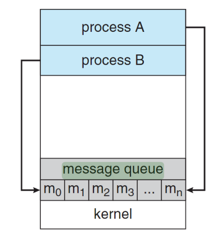

# OS Chapter 2 Process

<!-- TOC -->

- [OS Chapter 2 Process](#os-chapter-2-process)
  - [Process Concept](#process-concept)
    - [Multiple parts](#multiple-parts)
    - [Supplement](#supplement)
  - [Process Control Block(进程控制块/PCB)](#process-control-block进程控制块pcb)
    - [Information associated with each process(与每个进程相关的信息)](#information-associated-with-each-process与每个进程相关的信息)
  - [Process state](#process-state)
    - [States](#states)
  - [Process Scheduling](#process-scheduling)
    - [Time sharing system](#time-sharing-system)
    - [Implement](#implement)
    - [Schedulers(调度器)](#schedulers调度器)
      - [Long-term scheduler](#long-term-scheduler)
      - [Mid-term scheduler](#mid-term-scheduler)
      - [Short-term scheduler](#short-term-scheduler)
      - [Process type](#process-type)
  - [Context switch](#context-switch)
  - [Operations on processes](#operations-on-processes)
    - [Process Creation](#process-creation)
    - [Process Termination](#process-termination)
      - [exit() system call](#exit-system-call)
      - [wait() system call](#wait-system-call)
  - [Inter-process Communication](#inter-process-communication)
    - [Shared memory](#shared-memory)
      - [Bounded-buffer](#bounded-buffer)
    - [Message passing](#message-passing)
    - [Shared memory vs Message passing](#shared-memory-vs-message-passing)
      - [Comparison](#comparison)

<!-- /TOC -->

## Process Concept
- A process is the instance of computer program that is being executed.
  - 进程是计算机程序运行的实例
- Process is basically a program in execution.
  - 进程就是一个在运行中的程序
### Multiple parts


  - The program **code**, also called **text section文本段**
  - **Data section数据段** containing **global variables**, **static variables**
  - **Heap堆区** containing memory **dynamically allocated** during run time
  - **Stack栈** containing temporary data like **function parameters**, **return addresses**, **local variables**

### Supplement
- **Program** is **passive** entity stored on disk (executable file), **process** is **active**, and program becomes process when executable file loaded into memory.
  - 程序是存储在磁盘上的被动的实体(以可执行文件的形式)，而进程是主动的。当可执行文件被加载进内存时，程序就成为了进程
- **One program** can be **serveral processes**, when multiple users executing the same program, these processes associated with the same program are **separate execution sequences**, although the **text sections are equivalent**, the data, heap, and stack sections vary
  - 一个程序可以成为多个进程，当多个用户执行相同的程序时，这些与同一个程序相关联的进程都是单独的执行序列，尽管它们共享了相同的文本段(代码)，但是它们的数据段、堆区、栈区的内容是各不相同的

## Process Control Block(进程控制块/PCB)
- Each process is represented in the operating system by a **process control block**
  - 每个进程在操作系统中由**进程控制块**表⽰

### Information associated with each process(与每个进程相关的信息)

*also called **task control block***


- **Program counter程序计数器** – address of next instruction to be executed
- **Process state进程状态** – running, waiting, etc
- **CPU registers CPU寄存器** – contents of all process-centric registers所有以进程为中⼼的寄存器的内容
  - **Process Register进程寄存器**
    - SP(stack pointer栈指针)
    - BP(base pointer基指针)
    - IP(instruction pointer指令指针)
    - When a processes is running and it's time slice expires, the current value of process specific registers would be stored in the PCB and the process would be swapped out(PCB会在进程运行时间片用完，被切换出去时，将进程特有的寄存器值保存起来)
    - When the process is scheduled to be run, the register values is read from the PCB and written to the CPU registers. This is the main purpose of the registers in the PCB(当进程被调度执行时，PCB中保存的该进程的寄存器值将会被加载进CPU寄存器中，这是PCB寄存器的主要用途)
- **CPU scheduling information CPU调度信息** - priorities, scheduling queue pointers
  - **Process Priority进程优先级**, eg: OS process priority > User process priority
- **Memory-management information内存管理信息** – memory allocated to the process
- **Accounting information统计信息** – CPU used, clock time elapsed since start, time limits
- **I/O status information I/O状态信息** – I/O devices allocated to process
  - **I/O info I/O信息**
  - **List of Open Files打开文件的列表**
  
## Process state
- The state of a process is defined in part by the current activity of that process.
  - 进程的状态部分由该进程的当前活动定义


### States
- **new**: The process is being created
- **ready**: The process is waiting to be assigned to a processor
- **running**: Instructions are being executed
- **waiting**: The process is waiting for some event to occur
  - For waiting, there is another graph to show the status:
  
- **terminated**: The process has finished execution

## Process Scheduling
- The objective of multiprogramming is to have some  processes running at all times, to **maximize CPU utilization**.
  - 多道程序设计的目标是让某些进程一直运行，以**最大限度地提高CPU利用率**
- The objective of **time sharing** is to switch the CPU among processes **so frequently** that users can interact with each program while it is running. To meet these objectives, the process scheduler selects an available process for program execution on the CPU
  - **分时**的目的是**频繁地在进程之间切换**CPU，以便用户可以在每个程序运行时与其进行交互。 为了满足这些目标，进程调度程序选择一个可用进程在CPU上执行程序

### Time sharing system
- Time sharing, or multitasking, is a **logical extension逻辑延展** of multiprogramming.
- Multiple jobs are executed by **switching the CPU** between them.
- In this, the CPU time is **shared by different processes**, so it is called as "Time sharing Systems"
- Time slice is **defined by the OS**, for sharing CPU time between processes.
- Examples: **Multics**, **Unix**, **Linux**, **Windows**, etc.

### Implement
- Maximize CPU use, quickly switch processes onto CPU for time sharing
- **Process scheduler** selects among available processes for next execution on CPU
- Maintains **scheduling queues** of processes
  - **Job queue** – set of all processes in the system
  - **Ready queue** – set of all processes residing in main memory, ready and waiting to execute
  - **Device queues or I/O queue** – set of processes waiting for an I/O device
  - Processes migrate among the various queues**进程将会在各个队列中不断切换**
  


### Schedulers(调度器)

#### Long-term scheduler
- **Long-term scheduler**(or **job scheduler**) – selects which processes should be brought into the ready queue
  - Long-term scheduler is invoked **infrequently**(seconds, minutes) 
  - The long-term scheduler controls the degree of multiprogramming(the number of processes in memory)
  - May be slow

#### Mid-term scheduler
- **Medium-term scheduler** can be added **if degree of multiple programming needs to decrease**
  - Remove process from memory, store on disk, bring back from disk to continue execution: **swapping**


#### Short-term scheduler
- **Short-term scheduler**(or **CPU scheduler**) – selects which process should be executed next and allocates CPU
  - Short-term scheduler is invoked **frequently**(milliseconds)  
  - It must be fast, because of the short time between executions

#### Process type
Processes can be described as either:
- **I/O-bound process** – spends more time doing I/O than computations, many short CPU bursts
  - If **all processes are I/O bound**, the ready queue will almost always be empty, and the **short-term scheduler** will have little to do
- **CPU-bound process** – spends more time doing computations; very long CPU bursts
  - If **all processes are CPU bound**, the I/O waiting queue will almost always be empty, **devices will go unused**, and again the **system will be unbalanced**

## Context switch
- **Interrupts** cause the OS to change a CPU from its current task and to run a kernel routine. Such operation happen frequently on general-purpose systems
  - **中断**导致操作系统将CPU从其当前任务更改为运行内核程序。 这种操作在通用系统上经常发生
- When CPU switches to another process, the system must **save the state** of the old process and **load the saved state** for the new process scheduled to run via a **context switch**
  - 当发生上下文切换时，CPU切换到另一个进程，需要保存正在运行的进程的状态，
- Context of a process represented in the PCB
- Context-switch time is **overhead**; the system does no useful work while switching
  - The **more complex** the OS and the PCB $\rightarrow$ the **longer** the context switch


## Operations on processes
- The processes in most systems can execute concurrently, and they may be created and deleted dynamically. Thus, these systems must provide a mechanism for process creation and termination
  - 大多数系统中的进程可以并发执行，并且可以动态地创建和删除。 因此，这些系统必须提供进程创建和终止的机制

### Process Creation
- **Parent** process create **children** processes, which, in turn create other processes, forming a **tree** of processes
  - 父进程创建子进程，子进程又创建其他进程，形成进程树
- Generally, process identified and managed via a **process identifier**(**pid**)
  - A unique value for each process每个进程独一无二的标识符
  - An index to access various attributes of a process作为访问一个进程属性的唯一下标
- `fork()`function
  - Returns a value of type `pid_t`(essentially, an integer)
  - Does not take any input parameters, what is indicated by the formal parameter void.
  - The return code for fork is `0` **for the child process** and the **process identifier** of child is returned to the parent process.
  - On success, both processes continue execution at the instruction after the fork call, parent and children execute concurrently
    - 得到的返回值为`0`，则当前进程为子进程，若为`pid_t`，则当前进程为父进程，若为`-1`，则代表`fork()`失败
    - We don’t know whether the OS will first give control to the parent process or the child process(在老版本的Linux系统中，子进程是优先的，但后来发现如果不断地fork，父进程就永远不执行，因此移除了这个设定)
  - On failure, `-1` is returned to the parent process.
- **Resource Sharing Options父子进程资源共享选项**
  - Child processes can obtain resources directly from the operating system
    - 子进程可以直接从操作系统获取资源
  - Child processes may be limited to a subset of parent process resources
    - 子进程可用的资源被限制为父进程资源的子集
    - Prevent any process that creates too many child processes from overloading the system
      - 这是为了防止进程创建太多的子进程而导致系统过载
- There are also **two address space possibilities(地址空间)** for new processes:
  - The child process is a copy of the parent process (it has the same programs and data as the parent process)
    - 子进程是父进程的副本
  - The child process loaded a program(Use `execve()`)
    - 子进程加载了新的程序

### Process Termination

#### exit() system call
- Process executes last statement and then asks the operating system to delete it using the `exit()` system call.
  - 使用系统调用`exit()`删除/退出进程
  - Returns status data from child to parent (via `wait()`)
    - 在子进程中，执行`exit()`系统调用后会返回其状态信息到父进程，若父进程正在`wait()`，则它将会得到这条信息并被唤醒
  - Process’resources are deallocated by operating system
    - 结束的进程资源将会被操作系统释放
- Parent may terminate the execution of children processes using the `abort()` system call.  Some reasons for doing so:
  - 父进程可用使用`abort()`系统调用终止子进程的执行，其场景有：
  - Child has exceeded allocated resources
    - 子进程使用的资源超过了已分配的资源
  - Task assigned to child is no longer required
    - 不再需要分配任务给子进程
  - The parent is exiting and the operating systems does not allow a child to continue if its parent terminates
    - 父进程正在退出，此时操作系统不允许子进程继续执行

#### wait() system call
- When a process creates a child process, sometimes it becomes necessary that the parent process should execute only after the child has finished. 
  - 当进程创建子进程时，有时父进程只在子进程完成后才执行是必要的
- `wait()` system call does exactly this. It makes the parent process wait for child process to finish and then the parent continues its working from the statement after the `wait()`.
  - `wait()`系统调用使父进程等待子进程完成，然后父进程从`wait()`之后的语句继续其工作
- On success, `wait()` returns the PID of the terminated child process while on failure it returns `-1`.
  - 成功时，`wait()`返回已终止子进程的 PID，失败时返回`-1`
- If a process terminates, then all its children must also be terminated.
  - 如果一个进程终止了，那么它的子进程也必须终止
  - **cascading termination级联终止**. All children, grandchildren, etc. are terminated.
  - The termination is initiated by the operating system.
    - 操作系统进行对这些子进程的终止
- The parent process may wait for termination of child process by using the wait() system call. The call returns status information and the PID of the terminated process `pid = wait(&status);`
  - 父进程可以使用`wait()`系统调用来等待子进程的终止，该系统调用返回状态信息以及终止的子进程的PID
- If no parent waiting (did not invoke wait () yet), terminated process is a **zombie**
  - 当子进程`exit()`退出之后，他的父进程没有通过`wait()`系统调用回收他的进程描述符的信息，该进程会继续停留在系统的进程表中，占用内核资源，这样的进程就是**僵尸进程**
- If parent terminated without invoking wait(), process is an **orphan**
  - 当一个进程正在运行时，他的父进程忽然退出，此时该进程就是一个**孤儿进程**。作为一个进程，需要找到一个父进程，否则这种进程在退出之后没人回收他的进程描述符，空耗内存。此时该进程会找到一个父进程，如果自己所在的进程组没人收养，那就作为init进程的子进程

## Inter-process Communication
Processes within a system may be **independent** or **cooperating**. Cooperating process can affect or be affected by other processes, including sharing data. And cooperating processes need **inter-process communication (IPC)进程间通讯**

系统中的进程可以是独立或协作的，协作进程可以影响其他进程或被其他进程影响，包括共享数据。而协作进程需要**进程间通信(IPC)**

- Reasons for cooperating processes:
  - **Information sharing信息共享**
  - **Computation speedup计算加速**
  - **Modularity模块化**
  - **Convenience方便**
- Two fundamental models of IPC
  - **Shared memory共享内存**
  - **Message passing消息传递**

### Shared memory
A region of **memory shared by cooperating processes** is established. Processes can then exchange information by reading and writing data to the shared region.

建立由协作进程**共享的内存区域**。进程可以通过向共享区域读取和写入数据来交换信息


The processes initially set up a region of their virtual memory to use for the IPC. Once the region is established within the process, the process issues a system call to request that the kernel make the region shared. After the initial system call to set up the shared memory, the processes can read from and write to the region just as it would access non-shared data on its own heap. This data then appears within the context of the other process automatically. There is no explicit system call required to read the new data.

一个进程设置了它的虚拟内存区域以用于IPC。一旦在进程中建立了区域，进程就会**发出系统调用请求内核共享该区域**。在设置共享内存的初始化系统调用之后，进程可以读取和写入该区域，就像访问其自己堆上的非共享数据一样。然后，**此数据会自动出现在其他进程的上下文中**，读取新数据不需要明确的系统调用。


在两个进程各自的地址空间中，共享内存的地址可以是不一致的，但是都指向同一块区域

The communication is under the control of the users processes not the operating system.

通信在**用户进程**而非操作系统的控制下(共享内存是用户态通讯)

Major issues is to provide mechanism that will allow the user processes to synchronize their actions when they access shared memory.

在使用共享内存时，存在的主要问题是需要提供一种机制，允许用户进程在访问共享内存时同步它们的操作

#### Bounded-buffer
Producer-Comsumer model:
- Producer: Producer process produces information
- Comsumer: Comsumer process comsumes information


- The buffer is **empty** when `in==out`
- The buffer is **full** when `((in + 1) % BUFFER_SIZE) == out`
```c
#define BUFFER_SIZE 15

typedef struct {
	...
} item;

item buffer[BUFFER_SIZE];
int in = 0;
int out = 0;
```

- Producer:
```c
while (true) { 
  /* produce an item in next produced */ 
  while (((in + 1) % BUFFER_SIZE) == out) 
    ; /* do nothing */ 
  buffer[in] = next_produced; 
  in = (in + 1) % BUFFER_SIZE; 
} 
```

- Comsumer:
```c
while (true) {
	/* consume the item in next consumed */ 
  while (in == out) 
    ; /* do nothing */
  next_consumed = buffer[out]; 
  out = (out + 1) % BUFFER_SIZE;
} 
```

### Message passing
Message passing is particularly useful in a **distributed environment**, where the communicating processes may reside on **different computers** connected by a network.

消息传递在**分布式环境**中特别有用，在这种环境中，通信进程可能驻留在通过网络连接的**不同计算机**上(此时不容易建立共享内存区块)

The user-mode process(sender) will copy the data into a buffer, then **issue a system call to request the data be transferred**. Once the kernel is invoked, it will copy the transferred data first into its own memory. The target process(receiver) will also **issue a system call to retrieve the data**.

用户态进程(发送者)将数据复制到缓冲区中，然后发出**系统调用请求传输数据**。一旦内核被调用，它将首先将传输的数据复制到自己的内存中。目标进程(接受者)还将**发出系统调用以检索数据**


In message passing, every piece of data exchanged requires two system calls: one to read and one to write. In addition, the transferred data must be copied twice: once into the kernel memory and once into the receiving process.

在消息传递中，每交换一条数据都需要两次系统调用：一次读取，一次写入。此外，传输的数据必须复制两次：一次复制到操作系统内核，一次复制到接收进程内



### Shared memory vs Message passing
If processes P and Q wish to communicate, they need to:
- Establish a **communication link** between them
- Exchange messages via send/receive

Implementation of communication link
- Physical:
  - Shared memory
  - Hardware bus
  - Network
- Logical:
  - Direct or indirect
    - Direct Communication直接通讯——端到端
    - Indirect Communication间接通讯——端到服务器再到端(在操作系统中，可以表示为：进程$\rightarrow$内核$\rightarrow$进程)
  - Synchronous or asynchronous
  - Automatic or explicit buffering

#### Comparison
The shared memory techniques only require a **one-time performance penalty** during the set-up phase. Once the memory has been shared, there is no additional penalty, regardless of the amount of data transferred.

共享内存技术在设置阶段只需要**一次性的性能损失**。共享内存后，无论传输的数据量如何，都不会产生额外的损失

If the two processes will be **exchanging a lot of data** back and forth repeatedly, shared memory performs very well. While the work to **set up the shared memory** is **expensive**.

如果两个进程将反复来回**交换大量数据**，则共享内存性能非常好。而**设置共享内存**的工作是**昂贵的**

If processes only need to **exchange a single message of a few bytes**, shared memory will perform very poorly. **Message passing** techniques impose **significantly smaller overhead** to set up a one-time data exchange.

如果进程只需要**交换几个字节的单个消息**，共享内存的性能会很差。**消息传递**技术为建立一次性数据交换施加的**开销要小得多**

- **Advantage of message passing**
  - Useful for exchanging smaller amount of data
    - 在少量数据传输时很好用
  - Easier to implement in distributed system
    - 在分布式系统中容易实现
- **Advantages of shared memory**
  - Can be faster than message passing, since once the shared memory is established, all accesses are treated as routine memory accesses
    - 当共享内存区间设置完成，一切信息传输都像正常的内存读写一样高速
  - In contrast, message passing are typically implemented using system calls. Time consuming! 
    - 信息传递需要多次系统调用，系统用户态和内核态切换也是耗时的
  - Disadvantage: synchronization
    - 需要同步
  - Shared memory suffers from cache coherency issues
    - 会受到缓存一致性的影响(也是涉及同步的内容)
