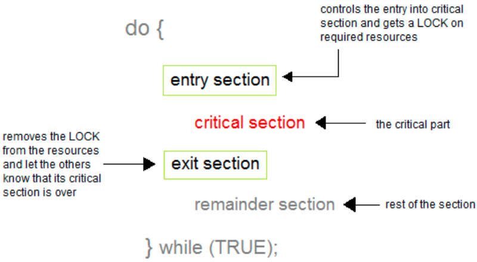

# OS Chapter 3 OS Synchronization

<!-- TOC -->

- [OS Chapter 3 OS Synchronization](#os-chapter-3-os-synchronization)
  - [Background](#background)
  - [Race condition](#race-condition)
  - [Critical Section Problem](#critical-section-problem)
    - [Critical Section Definition](#critical-section-definition)
    - [Solution to Critical-Section Problem](#solution-to-critical-section-problem)
      - [Mutual Exclusion](#mutual-exclusion)
      - [Progress](#progress)
      - [Bounded Waiting](#bounded-waiting)
    - [Lock And Unlock](#lock-and-unlock)

<!-- /TOC -->

## Background
Processes can execute concurrently, but may be interrupted at any time, partially completing execution. **Concurrent access to shared data** may result in **data inconsistency**. Maintaining data consistency requires mechanisms to ensure the orderly execution of cooperating processes.

进程可以并发执行，但其随时可能被中断，只有部分完成执行。**并发访问共享数据**可能会导致**数据不一致**。 维护数据一致性需要机制来确保协作进程的有序执行

## Race condition
A **race condition** is a situation where several processes access and manipulate the same data concurrently and the outcome of the execution **depends on the particular order** in which the access takes place.

**竞争条件**是指多个进程同时访问和操作相同数据并且执行结果**取决于访问顺序**的特定的情况

Race condition problems often occur when：
- one process does a "**check-then-act**" (e.g. "check" if the value is X, then "act" to do something that depends on the value being X) 
  - 一个进程执行“**先检查后操作**”（例如，“检查”值是否为X，然后“执行”以X为条件的操作）
- and **another process** does something to the value in between the "check" and the "act".
  - **另一个进程**对“检查”和“操作”之间的值进行了操作

Which of the following can cause a race condition?
- [ ] Read-read
- [x] Write-write
- [x] Read-write/Write-read
  - One reader and one writer
  - One reader and multiple writers
  - Multiple readers and one writer

If there is **only one producer and one consumer**, the solution for the producer-consumer problem does not have race condition. 

If there are **mulitiple producers or multiple consumers**, the solution for the producer-consumer problem have race condition.

## Critical Section Problem

### Critical Section Definition
- When more than one process access a same code segment that segment is known as **critical section**
  - 当多个进程访问同一代码段时，该段称为**临界区**
- Critical section contains **shared variables** or resources which are needed to be **synchronized** to maintain consistency of data variable
  - 临界区包含需要**同步**的**共享变量**或资源，以保持数据变量的一致性
- a critical section is group of instructions/statements or region of code that need to be **executed atomically**
  - 临界区是一组需要**原子执行**的指令/语句或代码区域
- General structure:
  

### Solution to Critical-Section Problem
- A solution to the critical-section problem must satisfy the following **three** requirements:
  - 临界区问题的解决方案必须满足以下三个要求：
    - Mutual Exclusion
    - Progress
    - Bounded Waiting

#### Mutual Exclusion 
- Mutual Exclusion - When one process is executing in its critical section, no other process is allowed to execute in its critical section
  - 互斥 —— 当一个进程在其临界区执行时，不允许其他进程在其临界区执行

#### Progress
- Progress – No process running outside the critical section should block the other interesting process from entering into a critical section when in fact the critical section is free
  - 进展 —— 在临界区之外运行的任何进程都不应阻止其他感兴趣的进程进入临界区，而此时实际上临界区是空闲的
- If no process is executing in its critical section and there exist some processes that wish to enter their critical section, then the selection of the processes that will enter the critical section next cannot be postponed indefinitely
  - 如果没有进程在其临界区执行，并且存在一些希望进入其临界区的进程，则不能无限期地推迟选择下一个将进入临界区的进程

#### Bounded Waiting 
- Bounded Waiting -  A bound must exist on the number of times that other processes are allowed to enter their critical sections after a process has made a request to enter its critical section and before that request is granted
  - 有界等待 —— 在进程发出进入其临界区的请求之后和该请求被授予之前，必须存在允许其他进程进入其临界区的次数的界限
- No process should have to wait forever to enter into the critical section. there should be a boundary on getting chances to enter into the critical section
  - 任何进程都不应该永远等待才能进入临界区。 获得进入关键部分的机会应该有一个界限

### Lock And Unlock