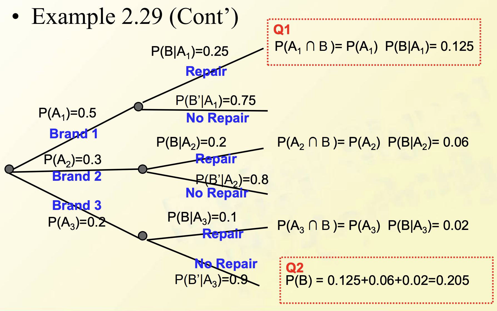

# Course 3

**conditional probability条件概率**

$P(A|B) = ?$, $B$ is the condition of this total event

$\displaystyle{P}(A) = \frac{N(A)}{N(S)}$

$\displaystyle{P}(A|B) = \frac{N(A\cap{B})}{N(B)} = \frac{\frac{N(A\cap{B})}{N(S)}}{\frac{N(B)}{N(S)}} = \frac{P(A\cap{B})}{P(B)}$

$P(A|B) \not = P(B|A)$

$P(A\cup{B}\cup{C}) = P(A) + P(B) + P(C) - P(A\cap{B}) - P(A\cap{C}) - P(B\cap{C}) - P(A\cap{B}\cap{C})$

**解复杂的条件概率题目时画Venn Graph解决会方便许多** *（光展开能展开到发疯）*

**multiplication rule乘法律**

$${P}(A|B) = \frac{P(A\cap{B})}{P(B)}\Rightarrow{P}(A\cap{B}) = P(A|B)\times{P}(B) = P(B|A)\times{P}(A)$$

therefore, $\displaystyle{P}(A_1\cap{A_2}\cap{A_3}) = P(A_3|A_1\cap{A_2})\times{P}(A_1\cap{A_2})$

**probability tree概率树**

*解题前要画出来*

**the law of total probability(2D-case)**

- $A\cup{A'} = S$
- $A\cap{A'} = \emptyset$
- $P(B) = P(B\cap{A}) + P(B\cap{A'}) = P(B|A)\times{P}(A) + P(B|A')\times{P}(A')$

**Bayes'Theorem贝叶斯定理**: Let $A_1,A_2,\dots,A_k$ be a collection of $k$ mutually exclusive and exhaustive events with $P(A)>0$ for $i=1,\dots,k$, then for any other event $B$ for which $P(B)>0$

令 $A_1,A_2,\dots,A_k$ 为$k$个互斥且详尽的事件的集合，对于 $i=1,\dots,k$，$P(A)>0$，然后对于任何其他事件$B$其中$P(B)>0$，有：

$$
P(A_j|B) = \frac{P(A_j\cap B)}{P(B)} = \frac{P(A_j)P(B|A_j)}{P(B)} = \frac{P(A_j)P(B|A_j)}{\sum_{i = 1}^kP(A_i)P(B|A_i)}\space\space\space j = 1,2,\dots,k
$$

## Homework
Section 2.4 46, 50, 58, 53
