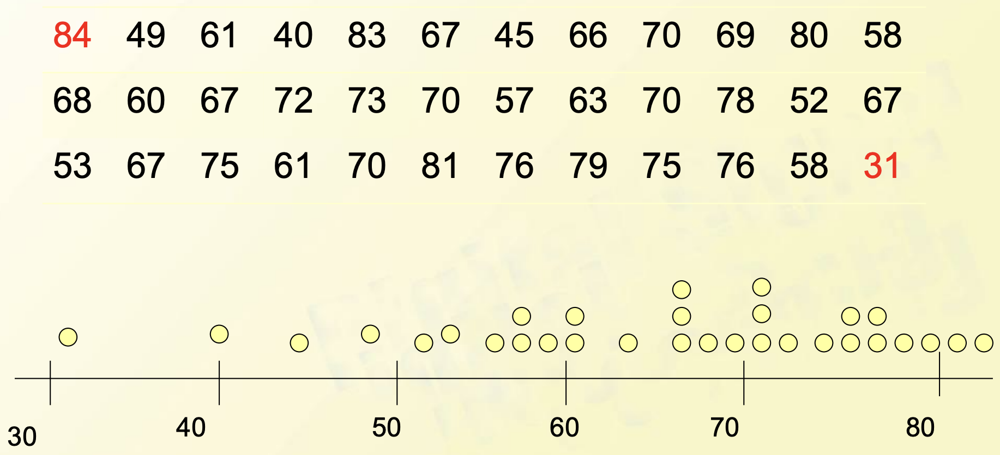

# Course 1

**population总体**: the set of all objects of interest

**variables变量**: whose value will change

- univariate单变量
- bivariate双变量
- multivariate多变量

**sample样本**: a subset of population总体中的一部分

**descriptive statistics描述性统计**

pictorial and tabular methods以下为图示/表格表述法

- Stem-and-Leaf Displays茎叶图

- Dot plot点阵图

- Histogram柱状图(只要求掌握离散变量图的作法)

- box plot箱线图(数据的横轴分四段)
  - $f_s=\text{upper fourth} - \text{lower fourth}$
  - 上四分位数——数据集的中位数和最大值之间的中间值
  - 下四分位数——数据集的中位数和最小值之间的中间值
  - Outlier: Any observation father than $1.5f_s$ from the closest fourth is an outlier
  - Extreme: An outlier is extreme if it is more than $3f_s$ from the nearest fourth
  - Mild: An outlier is mild if it is in the range of $(1.5f_s,3f_s]$ from the nearest fourth

**inferential statistics推论统计**: Use sample information to draw some type of conclusion about the population从样本推总体

**collecting data数据收集**

- random samplings随机采样
- stratified sampling分层抽样

**outlying value远点值**: data that lie far from main body of data

**sample mean平均值**: $\displaystyle\bar{x}=\frac{\sum{x_i}}{n}$

**sample median中位数**: 

$$\tilde{x} = \begin{cases}
(\frac{n+1}{2})^{th}\text{ordered value} &\text{n is odd} \\
\text{avg.} (\frac{n}{2})^{th}\&(\frac{n+1}{2})^{th}\text{ordered values} &\text{n is even}
\end{cases}$$

**quartiles四分点**: divide the data set into four equal parts每部分包含25%的数据

**trimed mean修正过的平均值**

A 10% trimmed mean, for example, would be computed by eliminating the smallest 10% and the largest 10% of the sample and then averaging what is left over

修正10%将会去除最大的10%以及最小的10%

**sample variance样本方差**

$${s}^2 = \frac{\sum{(x_i-\bar{x})^2}}{n-1}$$

shortcut method简化方法(对计算机而言)

$${s}^2 = \frac{S_{xx}}{n-1}$$

$$S_{xx} = \sum{x_i^2}-\frac{(\sum{x_i})^2}{n}$$

$$s^2 = \frac{\sum{x_i^2}-\frac{(\sum{x_i})^2}{n}}{n-1}$$

Considering unbiased estimate, here divide by $n-1$ artificially

**sample standard deviation标准差**: $s = \sqrt{s^2}$

**population variance总体方差**: $\displaystyle\sigma^2 = \frac{\sum{(x_i-µ)^2}}{N}$

注意**总体方差**与**样本方差**的区别只在于除的分母

## Homework
Section 1.2 11, 14, 20
Section 1.3 34, 40
Section 1.4 44, 56