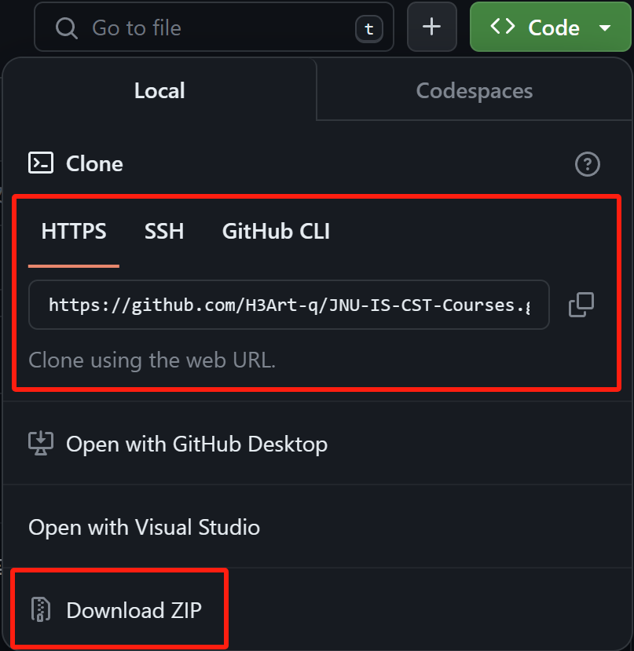

# 🤗JNU-IS-CST-Courses

> 🤔该仓库用于存放一些JNU果园计科专业课程的**笔记**（**Notes**）等资料内容，多以markdown形式呈现，也会上传在本地编译好的pdf版本内容。
> 
> 😋对于部分课程，相关的**作业/实验内容**（**HW/Lab**）以及某些**杂项内容**（**miscellaneous**）（可能包括Slides/Sol Manual等内容）我也会放进来。
> 
> 🤓需要**电子书**（**E-books**）和部分**特殊物品**（**Bonus**）掉落请直接联系我，一般来说电子书老师会直接发，而且年级越高越没人看书。
>
> 🥵如果本仓库的内容对你有帮助，可以为我在仓库的右上角点一个**小小的star**吗【

## 👉如何下载
- 直接安装[git](https://git-scm.com/)，这是一个免费的开源分布式版本控制系统，现在使用的Github便是一个在线的git版本控制托管平台，如果你想学习更多关于git的知识请搜索相关的教程，在这里只需要一行命令即可将本仓库的内容下载到本地，在git中称为**克隆**（**clone**）
  ```sh
  git clone https://github.com/H3Art-q/JNU-IS-CST-Courses.git
  ```
  在以后的Github冲浪🏄‍中，你可以通过点击每个仓库中的那个**绿色的code按钮**获得clone项目仓库的链接
  <div align="center">
    
  </div>
- 如果你觉得装git的操作过于繁琐，你可以直接点击绿色的code按钮找到**Download ZIP**选项下载本仓库内容，内容会被封装成一个zip压缩包整体下载
- 如果你只想**下载单个文件夹**，我找到了一个同样在Github/Gitee（国内的git托管站）上的开源项目[DownGit](https://zhoudaxiaa.gitee.io/downgit/#/home)，只要打开仓库里你想要的文件夹，再把此时对应的链接贴到这个网站里，网站就会创建一个仅下载该文件夹的下载链接（❌2024.8.13这个网站似乎挂了）
- 🆕新增一个支持Chrome/Microsoft Edge浏览器的GitHub文件夹下载插件：[GitZip](https://chromewebstore.google.com/detail/gitzip-for-github/ffabmkklhbepgcgfonabamgnfafbdlkn)，用法详见页面说明


## 😋大一 Freshman Year
| 课程Courses                                        | 笔记Notes | 实验Lab | 作业HW | 书E-books         | 杂项Misc | 特殊物品掉落Bonus |
| -------------------------------------------------- | --------- | ------- | ------ | ----------------- | -------- | ----------------- |
| 大学语文 College Chinese                           | √         | ×       | ×      | ×                 | ×        | √                 |
| 英语读写 English Reading & Writing                 | ×         | ×       | ×      | ×                 | ×        | ×                 |
| 英语听说 Aural-oral-English                        | ×         | ×       | ×      | ×                 | ×        | √                 |
| 计算机导论 Introduction to Computer Science        | √         | ×       | ×      | ×                 | ×        | ×                 |
| 高等数学 Advanced Mathematics                      | ×         | ×       | √      | √ with Sol Manual | √        | √                 |
| 线性代数 Linear Algebra                            | ×         | ×       | ×      | √ with Sol Manual | √        | √                 |
| 离散数学 Discrete Mathematics                      | √         | ×       | ×      | √ with Sol Manual | √        | ×                 |
| 问题求解与程序设计 Problem Solving and Programming | √         | √       | √      | ×                 | √        | ×                 |


## 🤣大二 Sophomore Year
| 课程Courses                                     | 笔记Notes | 实验Lab | 作业HW | 书E-books         | 杂项Misc | 特殊物品掉落Bonus |
| ----------------------------------------------- | --------- | ------- | ------ | ----------------- | -------- | ----------------- |
| 大学物理 University Physics                     | √         | ×       | √      | √                 | √        | √                 |
| 大学物理实验 University Physics Lab             | ×         | √       | ×      | ×                 | ×        | √ Bonus example   |
| 数据结构 Data Structures                        | ×         | √       | ×      | √                 | ×        | √                 |
| 计算机组成原理 Computer Organization            | ×         | √       | ×      | √                 | ×        | ×                 |
| 概率统计 Probability Statistics                 | √         | ×       | √      | √ with Sol Manual | √        | √                 |
| 操作系统 Operating Systems                      | √ Partial | √       | ×      | √                 | ×        | ×                 |
| 软件工程 Software Engineering                   | √         | ×       | ×      | √                 | √        | √                 |
| 算法分析与设计 Design and Analysis of Algorithm | √         | ×       | ×      | √                 | √        | √                 |
| Java程序设计 Java Programming                   | ×         | √       | ×      | √                 | √        | ×                 |


## 😱大三 Junior Year
| 课程Courses                                          | 笔记Notes | 实验Lab | 作业HW | 书E-books         | 杂项Misc | 特殊物品掉落Bonus |
| ---------------------------------------------------- | --------- | ------- | ------ | ----------------- | -------- | ----------------- |
| 机器学习 Machine Learning                            | √         | ×       | ×      | √                 | √        | √ Report          |
| 计算机网络 Computer Networks                         | √         | √       | √      | √                 | √        | ×                 |
| 数字图像处理 Digital Image Processing                | ×         | √       | √      | √                 | √        | √ Report          |
| 数据库系统 Database Systems                          | ×         | ×       | ×      | ×                 | √        | √ Report          |
| 人机交互 Human-computer Interaction                  | ×         | ×       | √      | ×                 | ×        | √ Report          |
| 数值计算基础 Numerical Computation                   | √         | √       | √      | √ with Sol Manual | √        | √                 |
| 密码算法与协议 Cryptographic Algorithm and Protocols | ×         | ×       | √      | √ with Sol Manual | √        | ×                 |
| 统计学方法入门 Introduction to Statistical Methods   | √         | ×       | √      | √                 | √        | √ Report          |
| 数据仓库与数据挖掘 Data Warehousing and Data Mining  | ×         | ×       | ×      | ×                 | √        | √ Report          |
| C++程序设计 C++ Programming                          | √         | ×       | √      | √                 | √        | ×                 |
| 信息安全与管理 Information Security and Management   | ×         | ×       | ×      | ×                 | √        | √ Report          |


## 😭大四 Senior Year
| 课程Courses                                             | 笔记Notes | 实验Lab | 作业HW | 书E-books | 杂项Misc | 特殊物品掉落Bonus |
| ------------------------------------------------------- | --------- | ------- | ------ | --------- | -------- | ----------------- |
| 面向对象方法学 Object-Oriented Methodology              | ×         | ×       | √      | √         | √        | ×                 |
| 编译构建 Compiler Construction                          | ×         | ×       | √      | √         | √        | ×                 |
| 计算机视觉 Computer Vision                              | ×         | ×       | √      | √         | √        | √ Report          |
| 教育数据分析与挖掘 Educational Data Analysis and Mining | ×         | ×       | √      | ×         | √        | ×                 |
| 计算机体系结构 Computer Architecture                    | ×         | ×       | ×      | ×         | √        | √ Report          |

## 补充声明
如果你认为本仓库的一些文件侵犯了您的权益，请向我[发送邮件](mailto:h03yqin16@foxmail.com)。我将会从仓库中彻底清除这些文件。

## 许可
由贡献者本人编写部分的许可如下：

[CC-BY-NC-SA：署名-非商业性使用-相同方式共享](https://creativecommons.org/licenses/by-nc-sa/4.0/deed.en)

其他部分的版权归属于其各自的作者。资料仅供参考，请自己判断其适用性。