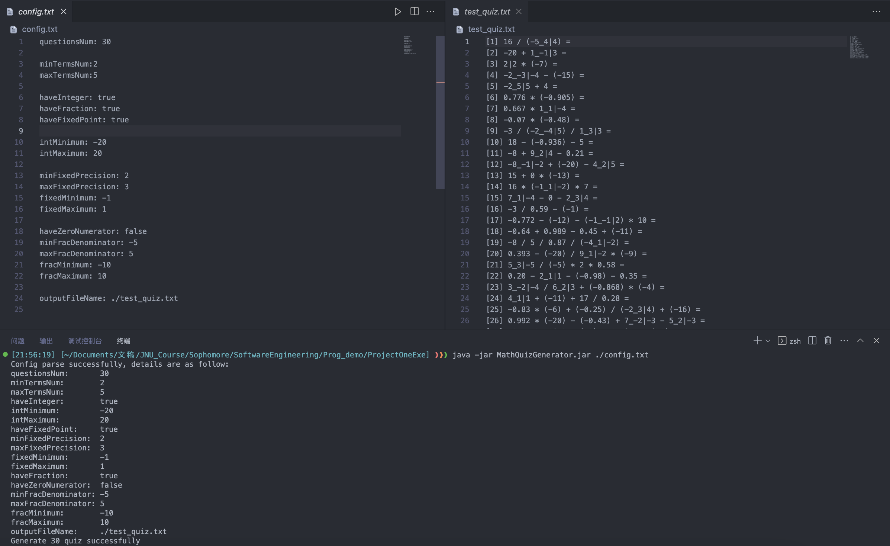
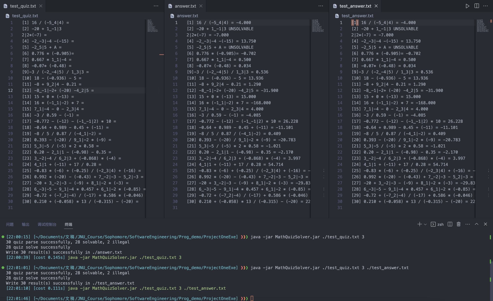
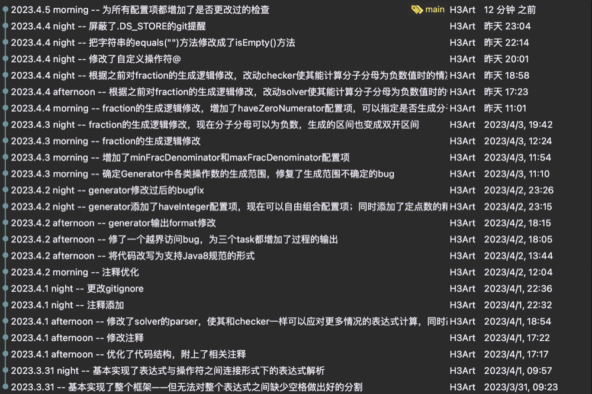

# Project One 文档

$\text{H3Art}$

*编写全程使用Java 8版本支持的语法*~~(本来用的Java 18)~~

<!-- TOC -->
- [Project One 文档](#project-one-文档)
  - [Task 1 数学测验题生成器](#task-1-数学测验题生成器)
    - [需求](#需求)
    - [介绍](#介绍)
      - [用法](#用法)
      - [配置文件](#配置文件)
      - [生成器特性](#生成器特性)
      - [运行实例](#运行实例)
  - [Task 2 数学测验题解答器](#task-2-数学测验题解答器)
    - [需求](#需求-1)
    - [介绍](#介绍-1)
      - [用法](#用法-1)
      - [解答器特性](#解答器特性)
      - [运行实例](#运行实例-1)
  - [Task 3(可选) 数学测验题答案检查器](#task-3可选-数学测验题答案检查器)
    - [需求](#需求-2)
    - [介绍](#介绍-2)
      - [用法](#用法-2)
      - [检查器特性](#检查器特性)
      - [运行实例](#运行实例-2)
  - [Conclusion 项目总结](#conclusion-项目总结)
    - [语言选择](#语言选择)
    - [存在问题](#存在问题)
    - [总结收获](#总结收获)

## Task 1 数学测验题生成器

### 需求
>   根据输入**文本文件/json文件/XML文件/属性文件**中指定的要求生成小学级别的数学小测验，并将生成的测验输出到一个文本文件中
> 
>   这些问题应涵盖给定范围内的**整数**、**分数**和**定点数**中的 **+ - * /** 运算
> 
>   分数可以表示为**3|7**或**23_1|11**，测验题的样例如下：
> 
>[3] 171 / 9 =
>
>[8] 123_3|5 - 19_4|7 = 
>
>[15] 3.14159 * 3_1|2 * 2 = 
>
>[21] 3|8 * 5_2|7 + 2_1|2 / 0.618 = 
>
>   (提示：可以设计一个特殊的ID来识别每个问题的问题类型和问题本身)

### 介绍

#### 用法
在工作路径下使用命令：
```shell
java -jar MathQuizGenerator.jar <config_path/config_name.txt>
```
- `<config_path/config_name.txt>`代表您的配置文件路径及配置文件名称，配置文件的形式在下方介绍

#### 配置文件
本数学测验生成器以**普通文本文件**(.txt)作为指定配置文件，程序内具备**默认值**，因此配置项可以不填写，其可配置的项如下：
| **配置名**             | **说明**                                                                                                               |
| ---------------------- | ---------------------------------------------------------------------------------------------------------------------- |
| **questionsNum**       | 指定测验题的生成数量，类型为整数，默认值为$10$                                                                         |
| **minTermsNum**        | 指定生成测验题多项式的最少项数，类型为整数，默认值为$2$                                                                |
| **maxTermsNum**        | 指定生成测验题多项式的最多项数，类型为整数，默认值为$2$                                                                |
| **haveInteger**        | 指定是否生成整数，类型为布尔值，默认值为$\mathrm{true}$                                                                |
| **intMinimum**         | 指定整数的下界（包括），类型为整数，默认值为$0$                                                                        |
| **intMaximum**         | 指定整数的上界（包括），类型为整数，默认值为$10$                                                                       |
| **haveFraction**       | 指定是否生成分数，类型为布尔值，默认值为$\mathrm{false}$                                                               |
| **haveZeroNumerator**  | 指定是否存在分子为$0$的情况，类型为布尔值，默认值为$\mathrm{false}$                                                    |
| **minFracDenominator** | 指定分母的下界（包括），分子也使用该下界进行生成，但最后对分母取模后的数字介于$0$到分母值$-1$，类型为整数，默认值为$1$ |
| **maxFracDenominator** | 指定分母的上界（包括），分子也使用该上界进行生成，但最后对分母取模后的数字介于$0$到分母值$-1$，类型为整数，默认值为$2$ |
| **fracMinimum**        | 指定整个分数值的下界（可能包括），是否包括取决于分母以及分子的设置，类型为整数，默认值为$0$                            |
| **fracMaximum**        | 指定整个分数值的上界（可能包括），是否包括取决于分母以及分子的设置，类型为整数，默认值为$10$                           |
| **haveFixedPoint**     | 指定是否生成定点数，类型为布尔值，默认值为$\mathrm{false}$                                                             |
| **minFixedPrecision**  | 指定定点数精度的下界（包括），类型为整数，默认值为$2$                                                                  |
| **maxFixedPrecision**  | 指定定点数精度的上界（包括），类型为整数，默认值为$2$                                                                  |
| **fixedMinimum**       | 指定定点数的下界（包括），类型为整数，默认值为$0$                                                                      |
| **fixedMaximum**       | 指定定点数的上界（不包括），类型为整数，默认值为$10$                                                                   |
| **outputFileName**     | 指定输出测验题文件的文件路径及名字，类型为字符串，默认为当前工作路径下的./quiz.txt                                     |

对于以上配置项，在配置文件中的格式为`配置项:值`，以英文输入下的半角冒号 `:` 分割，无视空格与空行，最终读取的配置为最后一次该配置项被赋予的值

#### 生成器特性
1. **配置文件展示**
在解析配置文件成功后，生成器将在标准输出打印它解析到的配置项，若您没有对其中的某个配置项进行修改，生成器将在该项输出(**Default**)表示这个配置项**使用生成器中的默认值**

2. **分数的生成与表示**
对于生成器中生成的分数，先取得整数、分子与分母各部分的值，再将分子分母化为真分数，多余的整数部分直接舍弃
考虑到分子分母在化为真分数后，若分母的范围横跨正负数，整个分数的基础范围为$(-1, 1)$，因此将分数值的配置的设定范围设置为**双开区间**且上界与下界之差必须大于$1$
若结果的整数部分为$0$，整个分数表示为**分子|分母**，若结果的整数部分不为$0$，整个分数表示为**整数_分子|分母**

3. **负操作数加括号**
在生成器配置中，若您将操作数的下界设定为**小于$0$**，那么在测验题的生成过程中，**除首项外**的所有随机生成的**负操作数整体**将会被**添加一个括号**，这符合我们一般的算式书写习惯

4. **定点数的精度设置**
通过设置`minFixedPrecision`和`maxFixedPrecision`，生成器生成的定点数将在这两个参数指定的区间下生成**随机精度**的定点数

5. **项数逐增**
对于给定的配置项`minTermsNum`与`maxTermsNum`，生成器将题目数量`questionsNum`为基准划分出**等比例**的题目，以项数**由少到多**地生成测验题

#### 运行实例


## Task 2 数学测验题解答器

### 需求
> 它读取Task 1的生成器生成的问题并输出一个**答案文本文件**，它**包含原来的测验题和答案**

### 介绍

#### 用法
在工作路径下使用命令：
```shell
java -jar MathQuizSolver.jar <quiz_path/quiz_name.txt> <precision> <ans_path/ans_name.txt>(optional)
```
- `<quiz_path/quiz_name.txt>`代表您的测验文件路径及测验文件名称
- `<precision>`代表您希望解答器以多高的精度输出答案，答案以**四舍五入**原则进行处理，该项的值必须为**非负数**
- `<ans_path/ans_name.txt>`代表您希望将解答完成的文件输出的路径及其文件名，这个项是**可选的**，若您没有填写，这个项将默认为`./answer.txt`

#### 解答器特性
1. **解析器的设计**
解答器中的表达式解析器会无视测验题中生成的括号，因为生成器配套的测验生成中没有设计对括号优先级表达式的生成，解析器会**忽略所有小括号**
解析器以运算符（**+、-、*、/**）作为分割基准，每次查找到一个运算符，就将运算符之前的部分作为操作数存入表达式列表，再将运算符也存入表达式列表
解析器将会去除表达式前置的题号以及所有空格再进行解析，当测验题文件中的表达式的空格分割错乱、整个题号被删除时，解析器依然将其判定为合法的表达式

2. **非法表达式的处理**
对于解析器中解析的表达式，解析器将会判断该表达式是否合法并维护一个表达式合法性的布尔值列表，若合法，解答器可以正常解答，若非法，解答器将会直接略过，并在最后的答案文件中输出**UNSOLVABLE**标签
对于不带等于号的表达式，解析器将其归类为非法表达式

3. **特殊运算的设计**
在对生成器的设计中，一开始没有考虑对分数（包括带分数）的分子分母可以为负数的设计，生成负数的分子分母功能添加入生成器后，原有的解析器的分割基准导致了无法正确分割。因此在解析分数的部分，其设定为：
定义$@$符号是对两个操作数**求商的负数**运算符，对于形如$7\_-1|2$，$4|-9$，$-3|-8$的**真分数**部分，在进入解析环节前，通过单独的分数检查将其修改为$7\_1@2$，$4@9$，$3|8$，以绕过解析器的运算符分割

4. **解答器的算法**
采用了双栈方式（一个操作数栈、一个运算符栈）对表达式进行计算，基本原理是遇到操作数就直接入栈，遇到运算符时根据**运算符的优先级**进行判定：
- 对于**高优先级**的运算符：直接入栈
- 对于**低优先级或同优先级**的运算符：弹出栈中的两个操作数和一个运算符，进行计算后再将结果和遇到的运算符入栈
在对结果精度的处理上，对于运算过程中遇到的分数，解答器将其转化为定点数（不考虑四舍五入的精度直接入栈），直到最终操作数栈只剩下结果时再**只对结果进行四舍五入**

5. **杂谈**
根据生成器和解答器的设计，只要稍作修改就可以为整个系统加入括号运算了，但是我没有再进行修改设计了。~~毕竟它只是一个小学级别的测验生成器与解答器~~

#### 运行实例


## Task 3(可选) 数学测验题答案检查器

### 需求
>   它读取包含学生给出答案的问题的测验题文本文件，逐个检查所有答案，为每个问题添加**CORRECT**或**WRONG**标记，并根据输入的测验题结果输出带有检查标记的文本文件(**CORRECT**或**WRONG**)

### 介绍

#### 用法
在工作路径下使用命令：
```shell
java -jar MathQuizSolver.jar <ans_path/ans_name.txt> <precision> <checkedAns_path/checkAns_name.txt>(optional)
```
- `<ans_path/ans_name.txt>`代表您的原答案文件路径及原答案文件名称
- `<precision>`代表您希望检查器以多高的精度检查答案，答案以**四舍五入**原则进行处理，该项的值必须为**非负数**
- `<ans_path/ans_name.txt>`代表您希望将检查完成的文件输出的路径及其文件名，这个项是**可选的**，若您没有填写，这个项将默认为`./checked_answer.txt`

#### 检查器特性
1. **代码的复用**
因为检查器中同样需要一套对表达式进行计算的系统，所以检查器中也使用了解答器中的解析器和解答器代码，但不完全相同，因为检查器还需要检查整个式子是否有答案
因为答案将会出现在等于号之后，而有时答案输入将会与等于号直接相连，没有隔断的空格，因此这是设计无空格解析器的灵感来源，而解析器最终迭代了$4$个版本：
- **解析器Ver. 1**：只能对生成器生成的标准测验题以及用空格分割的等号与答案进行正确解析
- **解析器Ver. 2**：可以对没有题号的测验题以及答案与等号相连的式子进行正确解析
- **解析器Ver. 3**：可以对任意空格（包括无空格）分割的单行式子进行正确解析
- **解析器Ver. 4**：可以对包含负数分子分母的式子进行正确解析

2. **对状态的判定**
检查器对一个式子划分为$3$种状态：

| **状态**                 | **处理方式**                                                                              |
| ------------------------ | ----------------------------------------------------------------------------------------- |
| **COMPLETE_EQUATION**    | 正常进行计算，存储计算结果并与原答案在检查器中比对                                        |
| **WITHOUT_ANSWER**       | 正常进行计算，存储计算结果，原答案设定为"Unsolved"字符串，依然可以在检查器中比对          |
| **CANNOT_FORM_EQUATION** | 不进行计算，计算结果设定为"0.0"，原答案设为"Can't solve"字符串，"0.0"$\not=$"Can't solve" |

3. **判断处理**
对于一个非法的表达式，判断结果直接置为$\mathrm{false}$，而对一个合法的表达式，需要进行：
- **浮点数判断**，以`Double.parseDouble()`方法进行值比对检查
- **字符串精度判断**，这代表一些情况如$15.000$与$15.0$两个值在数字形式下相等，但在精度上无法满足要求，因此$15.000 \not= 15.0$，这个结果将会被判定为错误

4. **结果输出**
对结果的输出上，该检查器在task3的要求之上，设计了$4$类标签以标识检查结果：

| **标签**               | **形式**                                           |
| ---------------------- | -------------------------------------------------- |
| **CORRECT**            | 6_6\|10 - 2_-3\|-6 = 4.100 [CORRECT]               |
| **WRONG**              | 6_6\|10 - 2_-3\|-6 = 4.10 [WRONG(expected: 4.100)] |
| **UNSOLVED**           | 6_6\|10 - 2_-3\|-6 = [UNSOLVED(expected: 4.100)]   |
| **ILLEGAL EXPRESSION** | 6_6\|10 - H3Art = 4.100 [ILLEGAL EXPRESSION]       |

在输出标签时，检查器根据输入的答案文件获得最长行的长度，将标签统一输出在最长行后一个空格的位置

#### 运行实例


## Conclusion 项目总结
这是一个真正的对**软件工程**概念的练习项目

### 语言选择
本学期是我第一次正式系统接触Java语言的学习，此前已经掌握了C/C++的基础语法和Python的基础语法

在面对这个项目时，一开始我的打算是使用Python进行开发，因为我预料到这是一个**对字符串操作要求比较高**的项目，而c语言自带的字符串处理函数库十分简陋，而我对对C++的string库也不够了解，而Python具有强大的字符串处理函数，它将是一个更好的选择

但是在本学期开设的Java课程中，我发现Java也有强大的字符串处理函数，同时我在完成此前的一些课程作业中发现，Java是一个更严谨、更适合**组织开发结构**的语言，因此最终我选择了Java作为这个项目的开发语言，当然也出于一种训练的目的，我开始使用Java以面向对象的写法进行开发

### 存在问题
作为到目前为止独立开发的最大项目，三个tasks融合在一起的工作，相比起之前的普通课程作业难度增大不少，主要难点在于对**各个模块的管理**不好把握，也没有事先做好全面的规划

在开发过程中遇见新的需求/问题都需要在原有的代码中做出改动，而一个**耦合度高**的设计常常导致连锁反应，即进行一个改动就需要对大量的代码进行修改，因此我在后期的开发中已经有意识地对代码模块进行拆分**解耦**（虽然有一些方法还是比较大，不好改动，~~写出了屎山~~），以下是开发时的部分版本管理：



### 总结收获
在开发这个项目时，我收获到了：
- 对项目体系的设计构建思维
- 面向对象编程的基本操作
- Java语言的字符串操作
- Java语言的文件输入输出流操作
- Java语言的抛出异常与异常捕获
- JavaDoc的注释方式
- 正则表达式的规则与运用（帮了大忙）

该项目的完成让我对**软件工程**的概念有了进一步认识，以前开发的小工具/小玩具属于软件，现在开发的多个工具集成的项目也是软件，但如果无法对软件规模与设计有足够的经验和认识，开发更大的软件就会成为一件相当困难的事情，这也是为什么开发软件能够成为**工程**。虽然我本人经验不足以完全把控相当规模的软件开发，但计算机是人设计的，**软件是人类世界需求在计算机世界的投影（引用自NJU JYY教授）**，我相信只要肯花时间，软件工程乃至软件世界不会有太多神秘之处。