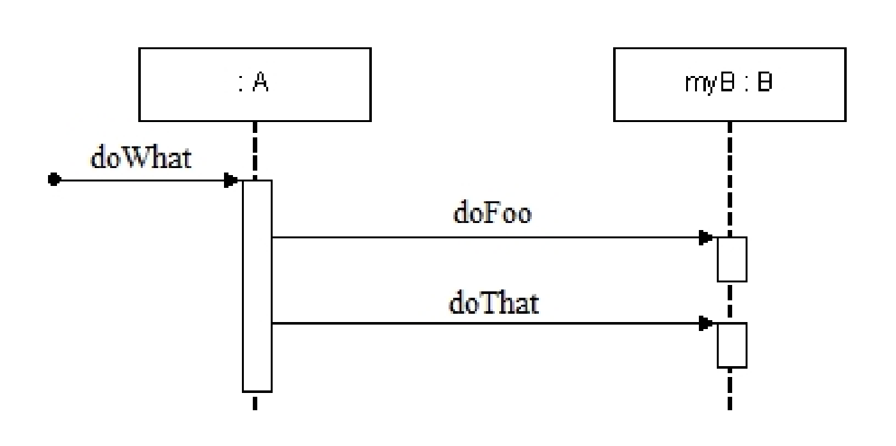

# Exam Paper Content

## Section I: Completion by Matching
Identify the letter of the choice that best complete each statement.

| Selections                         |                                                          |
| ---------------------------------- | -------------------------------------------------------- |
| A. Availability可用性              | N. Reuse重用                                             |
| B. Activity活动                    | O. Scenario testing场景测试                              |
| C. Client-server客户端-服务器      | P. Sociotechnical systems社会技术系统                    |
| D. Context上下文                   | Q. Specification规格                                     |
| E. Development开发                 | R. System requirements系统需求                           |
| F. Ethnography人类学               | S. Technical systems技术系统                             |
| G. Equivalence partition等价划分   | T. Test-driven测试驱动                                   |
| H. Functional requirements功能需求 | U. Use-case用例                                          |
| I. Heterogeneity异质性（跨平台）   | V. User interfaces用户界面                               |
| J. Interaction交互                 | W. User requirements用户需求                             |
| K. Open-source开源                 | X. Validation我们是否在构建正确的产品？（末期/最终验证） |
| L. Pair programming成对编程        | Y. Verification我们是否正确地构建产品？（早期/过程验证） |
| M. Pipe and filter管道及过滤器     | Z. Workflow工作流程                                      |

- **Scenario testing** is an approach to release testing where you write a story describing how a system may be used and design tests based on the sequence of events in the scenario.
- **Sociotechnical systems** is/are self-aware and include defined operational processes and procedures.
- **Availability** is the ability of a system to deliver services when requested.
- Requirements expressed as scenarios, **Pair programming**, and test-first development are three important characteristics of extreme programming.
- **User requirements** are statements in a language that is understandable to a user of what services the system should provide and the constraints under which it operates.

## Section II: Multiple Choices
Identify the choice that best completes the statement or answers the question.

1. __d__ is the phenomenon where a module in a system implements or partially implements anumber of different system requirements.
a. Concerning   c. Floating
b. Scattering   d. Tangling

2. Which is **NOT** one of the 4 levels at which software reuse is possible? __d__
a. The abstraction level  d. The specification level
b. The object level       e. The component level
c. The system level

3. Which is **NOT** one of the principal system re-engineering activities? __e__
a. Source code translation        d. Reverse engineering
b. Program structure improvement  e. Program Debuging
c. Program modularisation         f. Data re-engineering

4. Which is **NOT** one of the four principal dependability properties? __a__
a. Understandability  d. Reliability
b. Availability       e. Safety
c. Security

5. Which is **NOT** one of the 4 sectors in each loop in Boehm’s spiral model? __b__
a. Objective setting  d. Risk assessment and reduction
b. Feasibility study  e. Development and validation
c. Planning

## Section III: Short Answer
Please Select(mark a √ before the No. of the question chosen) and briefly answer 2 from the following 3 questions.

1. Explain, using examples as appropriate, what is meant by the following architectural style(choose only one from the following four styles):
a. Pipes and filters architecture
b. Layered architecture
c. Client-server architecture
d. Object-oriented architecture

## Section IV: Design Problems

1. Consider the following Sequence Diagram in design stage, draw a equivalent communication diagram and write down the corresponding code segments in any object-oriented programming language for class A and class B.

## Section V: Essay