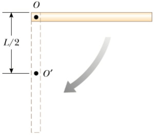
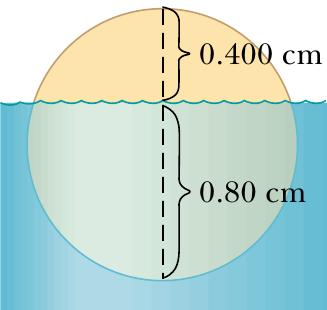
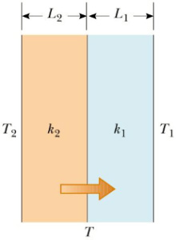

# $Problems\space{and}\space{Examples}(Translation)$

$\displaystyle\mathrm{By\space21\space{CST}\space{H3Art}}$

1. (**比值问题**)单个细胞必须在微观尺寸下才能形成坚固的结构，这似乎与人类脊髓中的神经细胞可以长达一米的事实相矛盾，尽管它们的宽度仍然非常小。为什么这是可能的？

    解：我们可以设$r$和$L$为管子的半径和长度来计算面积体积比：

    $\displaystyle{{\mathrm{Area}}\over{\mathrm{Volume}}}={{2πrL}\over{πr^2L}}={{2}\over{r}}$

    比值是一个常数，因为r应该是一个常数。因此，无论神经细胞有多长，其面积体积比总是相同的。这意味着神经细胞的长度不影响细胞体的强度

2. (**量纲分析**)请用量纲分析求得向心力$F$的表达式。假设一个质量为$m$的质点，以匀速$v$绕半径为$r$的圆运动，其受的力$F$与$m$的若干次幂成正比，假设$m$是$m^a$;$r$是$r^b$，$v$是$v^c$。
   
    解：列出表达式：$\displaystyle{F\varpropto{m^a}{r^b}{v^c}}$

    利用量纲分析的方法，我们得到：
    $\displaystyle{MLT^{-2}=M^aL^b(LT^{-1})^c=M^aL^{b+c}T^{-c}}$

    因此，$a = 1，b = −1，c = 2$，表达式是：$\displaystyle{F\varpropto{{mv^2}\over{r}}}$

3. (**向量**)求出向量${F_1}=10\hat{i}−20.4\hat{j}+2\hat{k}$和${F_2}=−15\hat{i}−6.2\hat{k}$之间的夹角。
   
    解：重新排列点积公式的项得
    
    $\displaystyle{\cos{\theta}={{{F_1}{\cdot{F_2}}}\over{|{F_1}||{F_2}|}}={{10(-15)+(-20.4)(0)+2(-6.2)}\over{\sqrt{10^2+20.4^2+2^2}\sqrt{15^2+6.2^2}}}=-0.439}$

    因此，$\theta=116°$

4. (**向量**)矢量${A}=2\hat{i}+5\hat{j}$在矢量${B}=\hat{i}−2\hat{j}+ 3\hat{k}$方向上的大小是多少？

    解：答案可以通过求${A}\cdot{\hat{B}}$的点积得到，其中${\hat{B}}$是${B}$的单位向量，即：

    $\displaystyle{(2\hat{i}+5\hat{j})\cdot{{\hat{i}-2\hat{j}+3\hat{k}}\over{\sqrt{1^2+(-2)^2+3^2}}}=-{8\over{\sqrt{14}}}}$

5. (**向量**)请证明余弦定理：$R=\sqrt{A^2+B^2+2AB\cos{\theta}}$，其中R是向量A和B的合力，它们之间有一个锐角$θ$。

    解：利用平行四边形法则和勾股定理(毕达哥拉斯定理)，得到：

    $\displaystyle{R=\sqrt{(A\cos{\theta}+B)^2+A^2\sin^2{\theta}}}
    \\\\ 
    =\displaystyle{\sqrt{A^2\cos^2{\theta}+2AB\cos{\theta}+B^2+A^2\sin^2{\theta}}}
    \\\\
    =\displaystyle{\sqrt{A^2+B^2+2AB\cos{\theta}}}$

6. (**速度**)一个人正在跳伞。从她跳出飞机到打开降落伞的这段时间内，她的高度方程为：$y=10000-50(t+5e^{-t/5})\mathrm{m}$，计算当$t=7.0\mathrm{s}$时她的速度。

    解：把$y$对$t$求导得：

    $\displaystyle{{\mathrm{d}y}\over{\mathrm{d}t}}=0-50{{\mathrm{d}}\over{\mathrm{d}t}}(t+5e^{-t/5})
    =\displaystyle{−50(1 − e^{−t/5})}$

    当$t=7.0\mathrm{s}$时，她的速度是：
    $\displaystyle{{{\mathrm{d}y}\over{\mathrm{d}t}}\big|_{t=7}=-50(1-e^{-7/5})=−37.67m/s}$

    速度为负，表示她的方向向下

7. (**加速度**)一个孩子以初始速度$v_t$向空中扔了一个弹珠，另一个孩子在同一时刻扔了一个球。比较两个物体飞行时的加速度。

    解：我们只需要考虑这两种情况的垂直分量，因为它们的水平加速度为零。对于弹珠来说，无论孩子如何将弹珠朝任何方向扔，在弹珠从手上被释放后，除了重力，没有其他外力(加速度)作用在弹珠上。第二个物体——球显然是仅受重力作用下落的。因此，两个物体在空气中的加速度是相同的，即重力加速度

8. (**加速度**)$Alice$的位置关于时间的函数为$\displaystyle{x = \frac{a}{b + t^2}}$其中$a$，$b$是正的常数。求她的最大速度。

    解：将函数对时间分别求导一次与两次，可以得到速度和加速度的表达式

    $\displaystyle{{{\mathrm{d}x}\over{\mathrm{d}t}}=-{{2at}\over{(b+t^2)^2}}}$

    $\displaystyle{{{\mathrm{d^2}x}\over{\mathrm{d}t^2}}=a{{(b+t^2)^2(-2)-(-2t)[2(b+t^2)2t]}\over{(b+t^2)^4}}}$

    当$\displaystyle{\frac{\mathrm{d^2}x}{\mathrm{d}t^2} = 0}$时，为最大速度，得到：

    $b+t^2=0$或$b-3t^2=0$

    (实际上，我们需要再次对计算的加速度进行微分，以验证它是向上凸的还是向下凹的最小值或最大值)舍弃第一个解，因为$b$应该是正的，第一个方程将给出虚数时间解(这是非物理的/不现实的)。因此，在$\displaystyle{t=\sqrt{\frac{b}{3}}}$时，她达到了最大速度，为：

    $\displaystyle{{{\mathrm{d}x}\over{\mathrm{d}t}}={\frac{-2a\sqrt{b/3}}{(b+b/3)^2}}=-a\bigg(\frac{4b}{3}\bigg)^{-3/2}}$

9. (**速度**)在天气好的情况下，从A市到B市的高速公路需要$2\mathrm{h}47\min$，平均速度为$115\mathrm{km/h}$。然而，在雨天，平均时速只有$75\mathrm{km/h}$是很正常的。按这个平均速度，旅行要多长时间？

    解：设我们在下雨天开车的时间为$t$，记住要把分钟转化成十进制，那么有：

    $\displaystyle{t=\frac{115}{75}(2+\frac{47}{60})=4.27\mathrm{h}}$

    按分钟计算(60进制)，则为：

    $\displaystyle{4+27\times\frac{60}{100}=4\mathrm{h}16\min}$

10. (**运动**)证明把一个物体直接抛向空中所花费的上升时间和它回落到起点所花费的时间一样多。(提示：建立两个向上的等式，一个向下的等式)

    解：设正$s$为从地面到最高位置的位移，正$u$为初速度，$t_1$，$t_2$为向上和向下间隔所花费的时间
    
    有两个方向向上的$\mathrm{SUVAT}$方程：(*XUVAT Equations，即描述位移、初速度、末速度、加速度、时间之间的关系的四大公式，在英国体系中也叫SUVAT Equations*)

    $\displaystyle{s=ut_1+\frac{1}{2}gt_1^2}$

    $0=u+gt_1$

    还有一个方向向下的方程：

    $\displaystyle{-s=0+\frac{1}{2}gt_2^2}$

    对第一个和第三个方程求和消去$s$，然后代入第二个方程消去$u$，可以得到：

    $\displaystyle{-gt_1^2+\frac{1}{2}g(t_1^2+t_2^2)=0}$

    这表明，$t_1=t_2$

11. (**平抛/抛射运动**)一块石头从建筑的顶部向上抛出，以与水平地面成$30°$的角度，初始速度为$20\mathrm{m/s}$，如图所示。如果建筑物的高度是$45\mathrm{m}$，  
    (1). 石头落地要多长时间？  
    (2). 石头落地前的速度是多少？  

    解：
    
    (1). 石子速度的初始$\mathrm{x}$和$\mathrm{y}$分量是

    $v_{xi}=v_i\cos{\theta_i}=20\times\cos{30°}=17.3\mathrm{m/s}$

    $v_{yi}=v_i\sin{\theta_i}=20\times\sin{30°}=10\mathrm{m/s}$

    要求出所用的时间$t$，我们可以直接使用$\displaystyle{y_f=v_{yi}t+\frac{1}{2}a_yt^2}$，代入$y_f=-45\mathrm{m}$，$a_y=-g，v_yi=10\mathrm{m/s}$得：

    $\displaystyle{-45=10t-\frac{1}{2}\times9.8\times{t^2}}$

    求解$t$的二次方程，对于正根，$t=4.22\mathrm{s}$

    (2). 我们可以使用$v_{yf}=v_{yi}+a_{y}t$，代入$t=4.22\mathrm{s}$，可以得到在y方向石头着地时刻的速度分量为：

    $v_{yf}=10-9.8\times4.22=-31.4\mathrm{m/s}$

    因为$v_{xf}=v_{xi}=17.3\mathrm{m/s}$，所求的速度为：

    $v_f=\sqrt{{v_{xf}}^2+{v_{xy}}^2}=\sqrt{(17.3)^2+(-31.4)^2}=35.9\mathrm{m/s}$

12. (**平抛/抛射运动**)足球运动员以与水平地面成$45.0°$将球踢飞。如果没有风的影响，球将水平移动$60.0\mathrm{m}$。  
    (1). 球的初速度是多少？  
    (2). 当球接近它的最大高度时，它会经历一阵短暂的阵风，使它的水平速度降低$1.50\mathrm{m/s}$。球水平运动的距离是多少？

    解：

    (1). 使用等式：$\displaystyle{R_{max}=\frac{v^2\sin{2\theta}}{g}}$，可得足球的初速度为$\sqrt{60\times9.8}=24.25\mathrm{m/s}$，与地面成45°角

    (2). 由(1)得水平方向的速度为$24.25\cos{45˚}=17.15\mathrm{m/s}$，它将在第二段位移(经过最大高度后)变成$17.15-1.50=15.65\mathrm{m/s}$，实际的位移距离为：

    $\displaystyle{\frac{60}{2}+\frac{15.65}{17.15}\times\frac{60}{2}=57.4\mathrm{m}}$

    我们用简单的比值表示距离，因为惯性水平运动是线性的

13. (**平抛/抛射运动**)跳远运动员以与水平方向成$20°$的角度离开地面，速度为$11\mathrm{m/s}$。  
    (1). 他在水平方向上跳多远？  
    (2). 达到的最高高度是多少？

    解：

    (1). 分别写出水平和竖直方向上的分量方程：

    水平：$R=11\cos{20˚}\times{t}$

    竖直：$y=11\sin{20˚}\times{t}+(-9.8)t^2/2$

    可得：$\displaystyle{R=\frac{11^2\sin{(2\times20˚)}}{9.8}=7.94\mathrm{m}}$

    (2). 根据对称性，达到最大高度的用时仅为整个行程时间的一半。我们可以直接从上面的方程再一次解出$t$，或者通过对竖直方向方程对时间$t$求导，然后令求导后的式子等于$0$，解出达到最大高度的时间$t$：

    由 $\displaystyle{\frac{\mathrm{d}}{\mathrm{d}t}(11\sin{20˚}t+\frac{1}{2}(-9.8)t^2)=0}$ 得 $\displaystyle{t=\frac{11\sin{20˚}}{9.8}=0.384\mathrm{s}}$

    达到的最大高度为：

    $\displaystyle{11\sin{20˚}(0.384)+\frac{1}{2}(-9.8)(0.384)^2=0.722\mathrm{m}}$

14. (**末速度**)计算将$70\mathrm{kg}$重的降落伞降至$14\mathrm{m/s}$的末速度的降落伞半径。

    解：假设降落伞没有质量。设$R$为降落伞的半径。终端速度由：

    $\displaystyle{v_t=\sqrt{\frac{W}{CA}}=\sqrt{\frac{W}{CR^2π}}}$

    给出，其中$W$，$C$，$A$为跳伞者的重量($Weight$)，空气阻力系数($Coefficient$)，以及与下落方向相对的法向表面积($Area$)。重新排列等式的项，我们得到：

    $\displaystyle{R=\sqrt{\frac{W}{Cπv_t^2}}}$

    将数据代入等式可得：

    $\displaystyle{R=\sqrt{\frac{70\times10}{0.88π\times14^2}}≈1.1\mathrm{m}}$

15. (**力**)质量为$m$的直升机垂直起飞。作用在螺旋桨上的力只有地球引力和空气对螺旋桨叶片的推力$F$。  
    (1). 如果直升机在$t = 0$时起飞，$t$时刻的垂直速度是多少？  
    (2). 将数字代入第(1)部分的方程，$m = 2300\mathrm{kg}$，$F = 27000\mathrm{N}$，$t = 4.0\mathrm{s}$。

    解：

    (1). 系统的合力是：

    $\displaystyle{F-W=ma\xrightarrow{}a=\frac{F-W}{m}}$

    其中$W$和$a$是直升机的重量和加速度。设$u = 0$，我们有：

    $\displaystyle{v=u+at\xrightarrow{}v=\frac{(F-W)t}{m}}$

    (2). 代入得：

    $\displaystyle{v=\frac{(27000-2300\times9.81)\times4}{2300}=7.7\mathrm{m/s}}$

16. (**摩擦力**)在一个粗糙的水平表面上，质量为$m_1$的块通过一个轻量级的无摩擦滑轮上的轻绳连接到质量为$m_2$的球，如图所示。一个与水平方向成$θ$角的$F$大小的力作用在物体上。物块与表面之间的动摩擦系数为$µ_k$。确定两个物体的加速度大小。  

    
    解：施加的力$F$分别有$x$和$y$分量$F\cos{θ}$和$F\sin{θ}$。将牛顿第二定律应用于两个物体，假设物体的运动方向向右，我们得到物体的运动方程为：

    (1). $\displaystyle{\sum{F_x}=F\cos{\theta}-f_k-T=m_1a_x=m_1a}$

    (2). $\displaystyle{\sum{F_y}=n+F\sin{\theta}-m_1g=m_1a_y=0}$

    其中$f_k$和$n$是动摩擦和法向反作用力。
    
    球的运动方程为：

    $\displaystyle{\sum{F_x}=m_2a_x=0}$

    (3). $\displaystyle{\sum{F_y}=T-m_2g=m_2a_y=m_2a}$

    因为这两个物体是相连的，我们可以将物体加速度的$x$分量和球加速度的$y$分量的大小列为一个等式。因为$f_k=µ_kn$和$n=m_1g-F\sin{θ}$，我们可以得到：

    (4). $f_k=µ_k(m_1g-F\sin{\theta})$

    也就是说，摩擦力减小(比水平施加力$F$时小)是因为$F$的$y$分量为正，将(4)代入(3)，将$T$的值代入(1)，得到：

    $F\cos{\theta}-µ_k(m_1g-F\sin{\theta})-m_2(a+g)=m_1a$

    解$a$，可以得到：

    $\displaystyle{a=\frac{F(\cos{\theta}+µ_k\sin{\theta})-g(m_2+µ_km_1)}{m_1+m_2}}$

17. (**摩擦力**)用一根绳子连接的两个木块，通过施加在其中一个木块上的力在水平表面上被拉动，如下图所示。物体与表面之间的动摩擦系数是$0.25$。如果每个物体向右有$2.0\mathrm{m/s^{2}}$的加速度，作用力的大小$F$是多少？  

    解：这个系统的运动方程是：

    $F\cos{60˚}-µ(3g-µF\sin{60˚})-µg=(1+3)a$

    代入给定的数据，这个力$F=24.8\mathrm{N}$

18. (**向心力**)质量为$m$的飞行员驾驶喷气式飞机绕一个环，如图所示。在这个操纵过程中，飞机以$225\mathrm{m/s}$的恒定速度在半径$2.7\mathrm{km}$的垂直圆周内移动，飞行员的自身重量用$mg$表示。确定座椅对飞行员施加的力于：  
    (1). 在环的底部  
    (2). 在环的顶部  
  
    解：

    (1). 由于合力是质量和向心加速度的乘积，有：

    $\displaystyle{n_{bot}-mg=m\frac{v^2}{r}}$

    用给定的值替换速度和半径得到：

    $\displaystyle{n_{bot}=mg\bigg(1+\frac{v^2}{rg}\bigg)=mg\bigg(1+\frac{225^2}{2.7\times10^3\times9.8}\bigg)=2.91mg}$

    因此，座椅施加在飞行员身上的力$n_{bot}$的大小为飞行员的体重的$2.91$倍，也就是说，他受到的表观重力比他的真实重力大$2.91$倍

    (2). 另一方面，在环的顶部情况下，合力方程是：

    $\displaystyle{n_{top}+mg=m\frac{v^2}{r}}$

    因此有：

    $\displaystyle{n_{top}=mg\bigg(\frac{v^2}{rg}-1\bigg)=mg\bigg(\frac{225^2}{2.7\times10^3\times9.8}-1\bigg)=0.913mg}$

    座椅施加在飞行员身上的力的大小为他的真实重力的$0.913$倍，飞行员感觉自己更轻了

19. (**向心力**)一个$0.50\mathrm{kg}$重的球系在一根长$1.50\mathrm{m}$的绳子的末端。球在水平方向上旋转。如果绳能承受$50.0\mathrm{N}$的最大张力，那么在绳断裂之前球能达到的最大速度是多少？假设弦在运动过程中保持水平。

    解：水平匀速圆周运动的方程是：

    $\displaystyle{m\frac{v^2}{r}=T}$

    让$T=50\mathrm{N}$，我们可以得到最大速度的方程：

    $\displaystyle{\frac{0.5v_{max}^2}{1.5}=50\xrightarrow{}v_{max}=12.25\mathrm{m/s}}$

20. (**向心力**)  
    (1). 考虑一颗质量为$m$的卫星，以恒定的速度$v$、高度$h$绕地球运行，如图所示。用$G$、$h$、$R_E$(地球的半径)和$M_E$(地球的质量)来确定卫星的速度。  
    (2). 这颗卫星在$1000\mathrm{km}$的高空以圆形轨道绕地球运行。地球的半径为$6.37 × 10^6\mathrm{m}$，质量为$5.98 × 10^{24}\mathrm{kg}$。求出卫星的速度，然后求出周期。$(G = 6.673 × 10^{−11}\mathrm{Nm^2/kg^2})$  

    解：

    (1). 作用在卫星上的唯一外力是重力，重力作用于地心，使卫星保持在圆形轨道上。因此有：

    $\displaystyle{\frac{GM_Em}{r^2}=\frac{mv^2}{r}}$

    由于地心引力是向心力的来源，否则，卫星将沿直线运动而离开地球。求解$v$，因为$r=R_E+h$，我们得到：

    $\displaystyle{v=\sqrt{\frac{GM_E}{r}}=\sqrt{\frac{GM_E}{R_E+h}}}$

    (2). 直接将数据代入上方的式子，可得：

    $\displaystyle{v=\sqrt{\frac{6.673\times10^{-11}\times5.98\times10^{24}}{6.37\times10^6+10^6}}=7.36\times10^3\mathrm{m/s}}$

    一圈(周期)所花的时间由以下公式得到：

    $T=\displaystyle{\frac{2π(R_E+h)}{v}=2π\sqrt{\frac{(R_E+h)^3}{GM_E}}}
    \\\\
    =\displaystyle{2π\sqrt{\frac{(6.37\times10^6+10^6)}{6.673\times10^{-11}\times5.98\times10^{24}}}}
    \\\\
    =\displaystyle{6.29\times10^3\mathrm{s}}$

21. (**向心力**)在狂欢节的游乐设施中，游客们站在一个大圆筒里靠墙站着。当圆筒旋转时，圆筒的地板下降，游客被离心力压在墙上。假设游客与圆筒壁的摩擦系数为$0.6$，圆筒半径为$5\mathrm{m}$，使游客紧紧靠在壁上的圆筒的最小角速度是多少？  

    解：设$N$为垂直于壁面指向圆柱体中心的法向反作用力。平衡(骑手不坠落)的垂直和水平方程为：

    $mr\dot{\theta}^2=N$ 和 $mg=µN$

    其中$\dot{\theta}$是角速度，$µ$是骑手与墙壁之间的静摩擦系数。我们可以解得：

    $\displaystyle{\dot{\theta}=\sqrt{\frac{g}{rµ}}}$

    将$g=9.8，r=5，µ=0.6$代入，得到：

    $\displaystyle{\dot{\theta}=\sqrt{\frac{9.8}{5\times0.6}}=1.8\mathrm{rad/s}}$

22. (**能量**)比较一辆$2000\mathrm{kg}$质量的汽车从$30.0$到$40.0\mathrm{km/h}$所需要的功和从$50.0$到$60.0\mathrm{km/h}$所需要的功。

    解：尽管在这两种情况下速度差是相同的，但使它们达到所需速度所需的动能的增量是非线性比例，通过计算可以得到：
    
    $\displaystyle{\frac{1}{2}2000(40^2-30^2)\bigg(\frac{10^3}{60^2}\bigg)^2=54012≈54\mathrm{kJ}}$

    $\displaystyle{\frac{1}{2}2000(60^2-50^2)\bigg(\frac{10^3}{60^2}\bigg)^2=84876≈85\mathrm{kJ}}$

23. (**重力势能**)质量为$m$的粒子在靠近地球表面的垂直距离$h$处移动。请证明在这种情况下，重力势能变化的一般表达式可以被简化为熟悉的关系式$U=mgh$。

    解：因为：

    $\displaystyle{U=-GMm\bigg(\frac{1}{r_f}-\frac{1}{r_i}\bigg)=GMm\bigg(\frac{r_f-r_i}{r_ir_f}\bigg)}$

    其中$r_i$和$r_f$是距离地心的初始高度和最终高度。因为粒子的初始和最终位置都接近地球表面，那么：

    $r_f-r_i=h$ 且 $r_ir_f≈R_E^2$

    $R_E$是地球的半径。由于$\displaystyle{g=\frac{GMm}{R_E^2}}$，我们得到：
    
    $\displaystyle{U≈\frac{GMmh}{R_E^2}=mgh}$

24. (**能量**)工程师们希望用这个方程来模拟蹦极绳的弹力大小：
    
    $\displaystyle{F(x)=a\bigg[\frac{x+9}{9}-\bigg(\frac{9}{x+9}\bigg)^2\bigg]}$

    $x$是绳子沿着它的长度的拉伸量，$a$是一个常数。如果将绳子拉伸$16.7\mathrm{m}$需要$22.0\mathrm{kJ}$的功，确定常数$a$的值。

    解：对给定的力函数进行对拉伸长度的积分，得到能量的值，即：

    $\displaystyle{22\times10^3=\int_0^{16.7}a\bigg[\frac{x+9}{9}-\bigg(\frac{9}{x+9}\bigg)^2\bigg]\mathrm{d}x}
    \\\\
    =\displaystyle{a\bigg[\frac{x^2}{18}+x+\frac{81}{x+9}\bigg]_0^{16.7}}
    \\\\
    =\displaystyle{a\bigg(\frac{16.7^2}{18}+16.7+\frac{81}{25.7}-9\bigg)}$

    最终得到$a=835\mathrm{N}$

25. (**动量**)一个速度为$v$的，质量很大的物体，与一个质量很小的静止物体正面相撞。没有动能转化为其他形式。证明质量小的物体会以$2v$的速度反冲。(提示：使用质心参照系)

    解：在一维弹性碰撞中，我们有动量守恒和动能守恒的表达式：

    $m_1u_1+m_2u_2=m_1v_1+m_2v_2$

    $\displaystyle{\frac{m_1u_1^2}{2}+\frac{m_2u_2^2}{2}=\frac{m_1v_1^2}{2}+\frac{m_2v_2^2}{2}}$

    $m_1$，$m_2$是质量，$u_1$，$u_2$是碰撞前的初速度，$v_1$，$v_2$是碰撞后的最终速度。联立这些方程并求解得到：

    $\displaystyle{v_1=\frac{u_1(m_1-m_2)+2m_2u_2}{m_1+m_2}}$

    $\displaystyle{v_2=\frac{u_2(m_2-m_1)+2m_1u_1}{m_1+m_2}}$

    在该例子中，我们设$m_1\gg{m_2}$，$u_1=v$，$u_2=0$。利用最后一个式子，可得：

    $\displaystyle{v_2=\frac{2m_1v}{m_1+m_2}≈2v}$

26. (**冲量**)一辆以$27\mathrm{m/s}$的速度行驶的汽车与一栋建筑物相撞。与建筑物的碰撞使汽车在大约$1\mathrm{s}$内停下来。驾驶员重$860\mathrm{N}$，由可变张力安全带和安全气囊组合保护。安全气囊和安全带减缓了他的速度，使他在大约$2.5\mathrm{s}$后停下来。  
    (1). 碰撞时驾驶员平均承受的力是多少？  
    (2). 如果没有安全带和安全气囊，他的碰撞时间大约是0.20秒。在这种情况下，他会受到多大的力？

    解：

    (1). 平均力或冲力是：

    $\displaystyle{F_{av}=\frac{860}{9.8}\times(0-27)\times\frac{1}{2.5}=-948\mathrm{N}}$

    (2). 没有安全气囊和安全带，他的碰撞时间为$1+0.2=1.2\mathrm{s}$。冲力是：

    $\displaystyle{F_{av}^{'}=\frac{860}{9.8}\times(0-27)\times\frac{1}{1.2}=-1975\mathrm{N}}$

27. (**向心力**)圆锥摆由质量为$m$的摆锤组成，摆锤在水平面上沿圆周路径运动。
  
    在运动过程中，长度为$l$的连接绳与垂线的夹角$θ$保持恒定。证明质点绕圆心的动量的大小为：

    $\displaystyle{L=\sqrt{\frac{m^2gl^3\sin^4{\theta}}{\cos{\theta}}}}$

    解：设$T$是沿绳子的张力，平面圆周运动的方程为：

    $\displaystyle{T\sin{\theta}=\frac{mv^2}{r}}$

    由于角动量$L = mvr$，$r = l\sin{θ}$，以上方程可以简单地改写为：

    $\displaystyle{T=\frac{L^2}{ml^3\sin^4{\theta}}}$

    利用用竖直方向上的方程$T\cos{θ}=mg$，消去$T$，得到$L$，即为：

    $\displaystyle{\frac{mg}{\cos{\theta}}=\frac{L^2}{ml^3\sin^4{\theta}}\xrightarrow{}L=\sqrt{\frac{m^2gl^3\sin^4{\theta}}{\cos{\theta}}}}$

28. (**角动量**)流星进入地球大气层，在它在大气层中燃烧之前，被地面上的人于位置向量$r=25\hat{i}+28\hat{j}\space\space\mathrm{km}$观察到。在观测者看到流星的那一刻，流星的线性动量$p=−30\hat{j}\space\space\mathrm{kg\cdot{km}/s}$，质量为$16\mathrm{kg}$，沿着它的运动路径有恒定的加速度$−2\hat{j}\space\space\mathrm{m/s^2}$。  

    (1). 人观察到的流星的角动量是多少？  
    (2). 流星在原点(观测者)上的力矩是多少？

    解：

    (1). 关于观察者的角动量是位置向量与线性动量的叉乘：

    ${L}={r}\times{p}=(25\hat{i}+28\hat{j})(10^3)\times(-30\hat{j})(10^3)=-7.5\times10^8\hat{k}\space\space\mathrm{kg\cdot{m}/s}$

    (2). 关于观察者的力矩是：

    ${\tau}={r}\times{F}=(25\hat{i}+28\hat{j})(10^3)\times16(-2\hat{j})=8\times10^5\hat{k}\space\space\mathrm{N\cdot{m}}$

    **请注意**：这个问题表明，线性运动也被视为旋转，除非观察者也在运动方向(或负方向)的同一直线上

29. (**旋转**)直径为$1\mathrm{m}$的轮子旋转时的角加速度为$4\mathrm{rad/s^2}$。  
    (1). 如果车轮的初始角速度是$2.0\mathrm{rad/s}$，$10 s$后的角速度是多少？  
    (2). 在$10\mathrm{s}$间隔内旋转的角度是多少？  
    (3). 在$10\mathrm{s}$间隔结束时，轮子边缘上一点的切向速度和加速度是多少？

    解：

    (1). 利用公式$\dot{\theta}_f=\dot{\theta}_u+\ddot{\theta}t$，可得：

    $\dot{\theta}_f=2+4(10)=42\mathrm{rad/s}$

    (2). 旋转的角度为：

    $\displaystyle{\Delta\theta=\dot{\theta}_it+\frac{1}{2}\ddot{\theta}t^2=2\times10+\frac{1}{2}\times4\times10^2=220\mathrm{rad}}$

    (3). 切向速度为：

    $r\dot{\theta}_f=0.5\times42=21\mathrm{m/s}$

    切向加速度为：

    $r\ddot{\theta}=0.5\times4=2\mathrm{m/s^2}$

30. (**刚体运动**)棒球投手投球时，前臂围绕肘关节旋转，同时还有其他动作。如果在距离肘关节$0.480\mathrm{m}$处，球相对于肘关节的线速度是$20\mathrm{m/s}$，前臂的转动惯量是$0.5\mathrm{kg\cdot{m^2}}$，那么前臂的转动动能是多少？

    解：假设球足够轻，不影响前臂的转动惯量。由于球的线速度是旋转前臂绕肘关节的切向速度，因此前臂的旋转动能为：

    $\displaystyle{\frac{1}{2}I\omega^2=\frac{1}{2}\times0.5\times\bigg(\frac{20}{0.48}\bigg)^2=434\mathrm{J}}$

31. (**角动量**)一个质量为$m_1$的球体和一个质量为$m_2$的物体由一根穿过滑轮的轻绳连接，如图所示。滑轮的半径是$R$，绕轴的转动惯量是$I$。物体在无摩擦的水平面上滑动。利用角动量和力矩的概念，求出两个物体的线性加速度的表达式。  
  

    解：此时球体和物体的速度为$v$，球体的角动量为$m_1vR$，物体的角动量为$m_2vR$。同一时刻，滑轮的角动量为$\displaystyle{Iω = I\frac{v}{R}}$。因此，系统的总角动量为：

    (1). $\displaystyle{L=m_1vR+m_2vR+I\frac{v}{R}}$

    现在让我们计算作用在系统上的关于滑轮轴的总外部扭矩。因为轴施加在滑轮上的力的力矩臂为零，不贡献扭矩。此外，作用在块体上的法向力(支持力)被重力$m_2g$所平衡，所以这些力对扭矩没有贡献。作用在球体上的重力$m_1g$产生了一个绕轴的力矩，其大小等于$m_1gR$，其中R是绕轴的力臂。这是关于皮带轮轴的总外部扭矩;即$\sum{τ} = m_1gR$。利用(1)的结果，我们发现：

    $\displaystyle{\sum{\tau}=\frac{\mathrm{d}L}{\mathrm{d}t}}$

    $\displaystyle{m_1gR=\frac{\mathrm{d}}{\mathrm{d}t}\bigg[(m_1+m_2)Rv+\frac{Iv}{R}\bigg]=(m_1+m_2)R\frac{\mathrm{d}v}{\mathrm{d}t}+\frac{I}{R}\frac{\mathrm{d}v}{\mathrm{d}t}}$

    因为$\displaystyle{\frac{\mathrm{d}v}{\mathrm{d}t}=a}$，所以：

    $\displaystyle{a=\frac{m_1g}{(m_1+m_2)+I/R^2}}$

32. (**角动量**)圆盘的半径为$r$，质量为$M$，静止时，其轴垂直。一颗质量为$m$，速度为$v$的子弹，水平发射并与圆盘切向，落在圆盘的周长上。圆盘的角速度是多少？

    解：这个问题类似于一些线性非弹性碰撞问题，这里我们用角动量守恒来代替动量守恒。子弹相对于圆盘轴的角动量是$mvr$。碰撞后我们有：

    $mvr=mr^2\dot{\theta}+I\dot{\theta}$

    将$\displaystyle{I=\frac{Mr^2}{2}}$代入，圆盘的角速度可得：

    $\displaystyle{\dot{\theta}=\bigg(\frac{2m}{2m+M}\bigg)\frac{v}{r}}$

33. (**转动惯量**)质量为$m$，半径为$r$的圆箍像轮子一样旋转，但其中心保持静止。它的周期是$T$。求圆环的转动惯量。证明它的动能等于$2π^2mr^2/T^2$。

    解：设$ρ$是环的单位长度的质量。它的转动惯量是：

    $\displaystyle{I=\int_0^{2π}r^2\cdot{\rho}r\mathrm{d}{\theta}=2π{\rho}r^3=mr^2}$
    
    转动动能为：

    $\displaystyle{KE_R=\frac{1}{2}I\dot{\theta}=\frac{1}{2}mr^2\bigg(\frac{2π}{T}\bigg)^2=\frac{2π^2mr^2}{T^2}}$

34. (**刚体运动**)如图所示，长度为$L$，质量为$M$的均匀杆在通过一端的无摩擦转轴上自由旋转。杆在水平位置从静止状态释放。  
    (1). 它到达最低点时的角速度是多少？  
    (2). 确定质心的线速度$v_{cm}$和杆在垂直位置时最低点的线速度。  
  

    解：

    (1). 当杆旋转到所示位置时，转动产生的动能等于杆释放前的势能，有：

    $\displaystyle{\frac{1}{2}MgL=\frac{1}{2}I{\omega}^2=\frac{1}{2}(\frac{1}{3}ML^2){\omega}^2}$

    上式运用了杆转动惯量公式$\displaystyle{I=\frac{ML^2}{3}}$，因此，角速度为：

    $\displaystyle{{\omega}=\sqrt{\frac{3g}{L}}}$

    (2). 质心(对于这根质量均匀分布的杆来说，质心就是杆的中点)的线速度是：

    $\displaystyle{v_{cm}=\frac{L}{2}{\omega}=\frac{1}{2}\sqrt{3gL}}$

    因为最低点的线速度是$cm$点的两倍，所以是：

    $2v_{cm}=\sqrt{3gL}$

35. (**刚体运动**)一个$8\mathrm{kg}$重、半径$0.2\mathrm{m}$的实心圆柱体，在一个$12\mathrm{kg}$重的质量与缠绕在圆柱体上的绳子相连产生的垂直力的作用下，从静止开始绕其圆柱体轴旋转。  
    (1). 求角加速度。  
    (2). 求出圆柱体的扭矩。  
    (3). 求出旋转两个半圈时的角速度。  
  

    解：
    
    (1)、(2). 设$m$是绳子所挂重物的质量，$T$是沿着绳子的张力，$R$是圆柱体的半径，$I$，$a$，，实心圆柱体的转动惯量，圆柱体的切向加速度。根据牛顿第二定律有：

    $T=m(g-a)$

    扭矩可以写为$\tau=TR$，切向加速度是$v=R\dot{θ}$对时间的导数，其中$v$是切向速度，那么$a=R\ddot{θ}$。把它代入运动方程，我们可以从两个联立方程得到$τ$和$\ddot{θ}$：

    ${\tau}=mR(g-R\ddot{\theta})$， ${\tau}=I\ddot{\theta}$

    上述两式联立，消去$\ddot{\theta}$或者消去$\tau$就可以得到另一个量的表达式，结果为：

    $\displaystyle{\tau=\frac{mRg}{1+mR^2/I}}$ 和 $\displaystyle{\ddot{\theta}=\frac{mRg}{I+mR^2}}$

    将数值代入方程$\displaystyle{I=\frac{1}{2}MR^2=\frac{1}{2}\times8\times0.2^2=0.16\mathrm{kg\cdot{m^2}}}$，可以得到：

    $\ddot{\theta}=36.75\mathrm{rad/s^2}$ 和 $\tau=5.88\mathrm{N\cdot{m}}$

    (3). 利用转动运动学方程$\dot{θ}^2 = 2\ddot{θ}∆θ$，其中$\Delta{θ}=5π$，得到角速度$\dot{θ}=33.98\mathrm{rad/s}$

36. (**压强**)大约在1657年，空气泵的发明者奥托·冯·格里克(Otto von Guericke)抽空了一个由两个黄铜半球组成的球体中的气体(如下图所示)。两组由八匹马组成的队伍在只能在某些尝试中能将两个半球分开，然后“非常困难”地发出类似于大炮发射的声音。  
    (1). 证明将内部气体稀疏半球拉开所需的力$F$为$πR^2(P_0−P)$，其中$R$为半球的半径，$P$为半球内部的压力，远小于$P_0$。  
    (2). 确定当$P=0.1P_0$，$R=0.3\mathrm{m}$时的力。  
  

    解：
    
    (1). 球体内部表面积的一半为$2πR^2$。这些力产生的总压力等于大气压力$P_0$与内部压力$P$之差，有：

    $\displaystyle{\frac{F}{2πR^2}+\frac{F}{2πR^2}=P_0-P\xrightarrow{}F=πR^2(P_0-P)}$

    (2). 把所有的数字代入上面得到的公式($P_0=101.325\mathrm{kPa}$)，得到$F=2.564×10^4\mathrm{N}$

37. (**压强**)你可以用门牙咀嚼非常坚硬的物体，因为门牙能在小面积的尖处施加很大的力。用你的牙齿在$1\mathrm{mm^2}$的面积上施加$500\mathrm{N}$的力能产生多大的压强？

    解：压强为$\displaystyle{\frac{500}{1\times10^6}=5\times10^8\mathrm{N/m^2}}$

38. (**压强**)一个U型管原先装有汞，现在将水添加到其中一个管臂中，水柱高度$20\mathrm{cm}$。水汞界面的压强是多少？从水汞界面的水平面测量另一边的汞柱高度是多少？(汞密度：$14000\mathrm{kg/m^3}$)

    解：由于我们只想找出压强的量值，我们可以在计算中简单地忽略大气压力。(大气压强$P_0$将在管道的两边被抵消)水汞界面的测量压力为：

    $1000\times9.8\times0.2=1960\mathrm{Pa}$

    这个压力与由汞产生的压力平衡，即$1960={\rho}_mgh_m$，因此有：

    $\displaystyle{h_m=\frac{1960}{14000\times9.8}=0.14\mathrm{m}}$

39. (**黏度**)一个小的球形颗粒在液体中下落时受浮力和阻力的影响，阻力由斯托克斯定律($Stokes\space{Law}$)给出，$F_s=6πrηv$。证明终端速度由$\displaystyle{v =\frac{2R^2g}{9η}(ρ_s−ρ_l)}$给出，其中$R$为球的半径，$ρ_s$为球的密度，$ρ_l$为流体的密度，$η$为粘度系数。

    解：粒子的运动方程为$W−B−F_s=ma$，其中$W$为粒子的重量，$B$为对粒子的浮力，$F_s$为对粒子的阻力。方程可以转化为：

    $\displaystyle{\rho_s\bigg(\frac{4πR^3}{3}\bigg)g-\rho_l\bigg(\frac{4πR^3}{3}\bigg)g-6πR\eta{v}=\rho_s\bigg(\frac{4πR^3}{3}\bigg)a}$

    当$a=0$时粒子达到末速度，因此有：

    $\displaystyle{\frac{2}{9}R^2(\rho_s-\rho_l)g-\eta{v}=0\xrightarrow{}v=\frac{2R^2g}{9\eta}(\rho_s-\rho_l)}$

40. (**浮力**)实心球体的直径为$1.2\mathrm{cm}$。它漂浮在水面上，其直径浮出水面$0.4\mathrm{cm}$，如图所示。确定球体的密度。  
  

    解：我们必须先找出球的一部分的一般公式。假设有一个圆半径为$a$，满足$x^2+y^2=a^2$(即以球中心为原点建立直角坐标系)，其中一部分的体积为：

    $\displaystyle{\int_{-a}^{x'}y^2π\mathrm{d}x=\int_{-a}^{x'}π(a^2-x^2)\mathrm{d}x=\frac{π}{3}(3a^2x'+2a^3-x'^3)}$

    $x'$是从中心到$x$轴的长度。用$x'=a$代入对上式进行简单的检验，可以得到球体体积为$\displaystyle\frac{4πa^3}{3}$。对于图中所示的体积，将$a=0.6$，$x'=0.2$代入公式，得到球体浸入部分的体积为$0.67\mathrm{m^3}$。由于整个体积为$\displaystyle\frac{4π(0.6)^3}{3}=0.9$，所以球体的密度为：

    $\displaystyle{\frac{0.67}{0.9}\times1000=744\mathrm{kg/m^3}}$

41. (**流动**)假设平均流速为$5\mathrm{L/min}$中，心脏在$75$年中能泵出多少$m^3$的血液？

    解：流速和时间的乘积即是在这段时间内的总泵血量。因此有：

    $(5×10^{−3}×60^{−1})×(75×365.25×24×602)=197235 ≈2×10^5m^3$

42. (**伯努利方程**)当风吹过两座大建筑物时，会产生明显的压力下降。大楼内部的气压通常是$1\mathrm{atm}$，所以外面的气压下降会导致一扇平板玻璃窗弹出大楼，摔到下面的街道上。$27\mathrm{m/s}$的风速会产生多大的压强差？一个$2×3\mathrm{m^2}$的平板玻璃窗会受到多大的力？在$27\mathrm{˚C}$下$1\mathrm{atm}$时的空气密度为$1.29\mathrm{kg/m^3}$。

    解：如果外面没有风，建筑物内外的压力应该是一样的。当有风时，根据伯努利方程，气压会下降。在玻璃上的净压强为：

    $\displaystyle{\Delta{P}=\frac{1}{2}\times1.29\times27^2=470\mathrm{Pa}}$

    $2\times3\mathrm{m^2}$的玻璃窗受到的力大小为：

    $470\times2\times3=2820\mathrm{N}$

43. (**伯努利方程**)如图所示，流体在水平管道中流动。  
  
    
    请证明：

    $\displaystyle{v_2=A_1\sqrt{\frac{2(P_1-P_2)}{\rho(A_1^2-A_2^2)}}}$

    解：由连续性方程$A_1v_1=A_2v_2$，我们发现$\displaystyle{v_1=\frac{A_2}{A_1}v_2}$

    将此表达式代入相同高度下的伯努利方程，即$h=0$，得到：

    $\displaystyle{P_1+\frac{1}{2}\rho\bigg(\frac{A_2}{A_1}\bigg)^2v_2^2=P_2+\frac{1}{2}\rho{v_2^2}}$

    因此有：

    $\displaystyle{v_2=A_1\sqrt{\frac{2(P_1-P_2)}{\rho(A_1^2-A_2^2)}}}$

44. (**伯努利方程**)有一个非常大的直径无盖的水箱，放置在地面上，装入高度为$h$的水。水箱在离底部$0.5\mathrm{m}$的高度被刺出一个小孔。水位高度$h$为多少时，才能使得从小孔中喷出的水抵达在水平方向上离水箱孔$3\mathrm{m}$远的位置？
    
    解：$h$高度和$0.5\mathrm{m}$高度处的压强相等，根据伯努利方程有：

    $\displaystyle{\frac{1}{2}\rho{v_t^2}+\rho{gh}=\frac{1}{2}\rho{v^2}+0.5\rho{g}}$

    其中，$v_t$和$v$分别为水在顶部下落的速度和在孔中喷射的速度。由于$v\gg{v_t}$，我们忽略了$v_t$，将它视为$0$。因此，水从孔中喷出的速度为$v=\sqrt{2g(h−0.5)}$。在垂直方向上，着陆所需的时间满足：

    $\displaystyle{0.5=\frac{1}{2}gt^2\xrightarrow{}t=\sqrt{\frac{1}{g}}}$

    因为在水平方向水喷出的范围是$3\mathrm{m}$，由$\displaystyle{3=\sqrt{2g(h-0.5)}\cdot\sqrt{\frac{1}{g}}=\sqrt{2(h-0.5)}}$得$h=5\mathrm{m}$

45. (**热容**)一块$20\mathrm{g}$，$90\mathrm{˚C}$的铝掉落到一个处于$0\mathrm{˚C}$的大冰块空腔中。铝能融化多少冰？(假设铝的比热容为$0.215\mathrm{cal/(g\cdot{˚C})}$，冰的融化潜热$3.33 × 10^5\mathrm{J/kg}$)

    解：假设所有的能量都用来融化铝片上的冰。我们有能量守恒方程：

    $20×0.215×90×4.184=3.33×10^5×m$

    其中$m$为融化的冰的质量，单位为$\mathrm{kg}$，我们换算$1\mathrm{cal}= 4.184\mathrm{J}$，因此有：

    $m=0.00486\mathrm{kg}=4.86\mathrm{g}$ 冰被融化了

46. (**热容**)一个人将一颗质量为$2\mathrm{g}$、初速为$200\mathrm{m/s}$的银制子弹射入一间酒馆的松树墙。假设所有撞击产生的内部能量都留在子弹上。子弹的温度变化是什么(银的比热容是$234\mathrm{J/(kg\cdot{˚C})}$)。

    解：子弹的动能是$\displaystyle\frac{mv^2}{2}$。子弹的温度升高是因为动能变成了额外的内能。温度的变化与动能通过热量从炉子传递到子弹时所发生的变化相同。使用$234\mathrm{J/(kg\cdot{˚C})}$作为银的比热容，我们得到：

    $\displaystyle{\Delta{T}=\frac{Q}{mc}=\frac{\frac{1}{2}mv^2}{mc}=\frac{v^2}{2c}=\frac{200^2}{2\times234}=85.5\mathrm{˚C}}$

47. (**潜热**)液氦的沸点很低，只有$4.2\mathrm{K}$，蒸发潜热也很低，只有$2.09×10^4\mathrm{J/kg}$。如果能量以$10.0\mathrm{W}$的速率从浸入式电加热器转移到一个装有沸腾的液氦的容器中，需要多长时间才能煮沸掉$1.00\mathrm{kg}$的液体？

    解：要煮掉$1.00\mathrm{kg}$，我们必须提供$2.09×10^4\mathrm{J}$的能量。因为$10.0\mathrm{W}=10.0\mathrm{J/s}$，所以每秒有$10.0\mathrm{J}$的能量转移到氦中。因此，传递$2.09 × 10^4\mathrm{J}$能量所需的时间为：

    $\displaystyle{t=\frac{2.09\times10^4}{10}=2.09\times10^3\mathrm{s}≈35\mathrm{min}}$

48. (**热量流动**)墙壁(包括窗户)和屋顶的平均热导率在下图中描述的房子是$0.480\mathrm{W/(m\cdot˚C)}$，他们的平均厚度是$21.0\mathrm{cm}$。房子用天然气加热，其燃烧热(即每$\mathrm{m^3}$燃烧的天然气所提供的能量)为$9300\mathrm{kcal/m^3}$。如果外部温度是$0.0\mathrm{˚C}$，每天必须燃烧多少$\mathrm{m^3}$的气体，以保持内部温度$25.0\mathrm{˚C}$？不考虑辐射和通过地面的热量损失的能量。  

    解：传导的能量流速$P$由$\displaystyle{P=kA\frac{\Delta{T}}{L}}$给出

    在上式中，$k$为热导率，$A$为热流的法线方向面积，$L$为渗透长度，$\Delta{T}$为温差。我们只有房子的面积和能量的流速未知，计算如下：

    $\displaystyle{A=2(10×5)+2(8×5)+\frac{2}{2}×8×4\tan{37˚}+2×10×4\cos {37˚}=304.28\mathrm{m^2}}$

    和

    $\displaystyle{P=\frac{9300×4184×V}{24×60×60}}$

    $V$是我们想计算的一天所需的天然气体积。我们把单位从$\mathrm{kcal}$改为$\mathrm{J}$，用秒表示$24$小时。将这些数值和$\Delta{T}=25\mathrm{K}$，$L=0.21\mathrm{m}$，$k=0.48$代入最开始的流速方程，即：

    $\displaystyle{\frac{9300×4184×V}{24×60×60}=0.48×304.28×\frac{25}{0.21}}$

    我们可得$V=38.6\mathrm{m^3}$

49. (**热量流动**)如图所示，厚度为$L_1$和$L_2$，导热系数为$k_1$和$k_2$的两块板之间存在热接触。它们的外表面温度分别为$T_1$和$T_2$，$T_2 >T_1$。确定在平衡态下，通过平板传导的界面温度和单位面积的能量转移率。  
  

    解：如果$T$是界面处的温度，那么能量通过平板一和平板二的传输速率为：

    $\displaystyle{H_1=\frac{k_1A(T-T_1)}{L_1}}$，$\displaystyle{H_2=\frac{k_2A(T_2-T)}{L_2}}$

    其中$A$为各界面的面积。当达到平衡态时，这两个速率必须相等；因此有：

    $\displaystyle{\frac{k_1A(T-T_1)}{L_1}=\frac{k_2A(T_2-T)}{L_2}}$

    解$T$可得：

    $\displaystyle{T=\frac{k_1L_2T_1+k_2L_1T_2}{k_1L_2+k_2L_1}}$
    
    把它代入前一个方程，就可以得到单位面积的热流(能量转化率)：

    $\displaystyle{H=\frac{A(T_2-T_1)}{L_1/k_1+L_2/k_2}}$

50. (**压强**)一个人每分钟呼吸约$20$次，每次呼吸含$0.5\mathrm{L}$空气。如果进入的空气是干燥的，呼出的湿润呼吸完全饱和，那么每小时呼出的呼吸中的水分会带走多少热量？假设饱和呼出空气中的水蒸气压力为$24\mathrm{torr}$($1\mathrm{torr}$即$1\mathrm{mmHg}$的压强)。

    解：我们把单位都换成$SI$(即国际单位制)。每次呼吸呼出的气压为$1.33×10^2×24\mathrm{Pa}$。呼出气量为$0.5×10^{−3}\mathrm{m^3}$。因为$\Delta{P}V=\Delta{Q}$，且假设呼出的空气中水蒸气完全饱和。因此，一小时内呼出的空气的热量为：

    $(1.33×10^2×24)×(0.5×10^{−3})×(20×60)=191.52\mathrm{J}$

51. (**理想气体**)在$20\mathrm{˚C}$下，$1\mathrm{cm^3}$的氦气中有多少分子？

    解：假设气体在$1$个大气压下服从理想气体定律，我们由公式$PV=Nk_BT$可得有：

    $\displaystyle{N=\frac{PV}{k_BT}}=\frac{10^5\times10^{-6}}{1.38\times10^{-23}\times(273+20)}=2.47\times10^{19}$个氦分子数

52. (**理想气体**)  
    (1). 气体分子在$24\mathrm{˚C}$时的平均动能是多少？  
    (2). 求出在此温度下氧分子的均方根速度($rms\space{speed}$)。(给定氧分子质量：$5.356×10^{−26}\mathrm{kg}$)

    解：

    (1). 因为粒子的平均动能是由$\displaystyle{\frac{1}{2}mv_{rms}^2=\frac{3}{2}k_BT}$定义的，那么有：

    $\displaystyle{\frac{3}{2}\times1.38\times10^{-23}\times(273+24)=6.1479\times10^{-21}\mathrm{J}}$

    (2). 假设氮分子和氧分子的均方根速度相似。由于氧分子的质量约为$5.356×10^{−26}\mathrm{kg}$，所以其均方根速度为：

    $v_{rms}=\sqrt{6.1479\times10^{-21}\times2/(5.356\times10^{-26})}=479.14\mathrm{m/s}$

53. (**热力学**)燃煤发电站利用燃烧煤炭的热量传递做功，转动涡轮机发电。设煤的传热量为$2.2×10^{14}\mathrm{J}$，向环境的传热量为$1.35 ×10^{14}\mathrm{J}$。  
    (1). 电站做了多少功？  
    (2). 电站的效率如何？  

    解：

    (1). 假设没有能量转化成内能的理想情况，即$\Delta{U}=0$，输出的功为：

    $W=Q_h-Q_c=(2.2-1.35)\times10^{14}=0.85\times10^{14}\mathrm{J}$

    (2). 电站的效率为：

    $\displaystyle{\frac{0.85\times10^{14}}{2.2\times10^{14}}\times100}$% $=$ $38.6$%

54. (**熵变**)缓慢添加热量给在$0\mathrm{˚C}$下的$0.08\mathrm{kg}$冰块，直到它在相同的温度下完全融化成水。冰的熵变是多少？(给定冰的融化潜热：$335\mathrm{J/g}$)

    解：冰因加热而融化有：

    $Q=mL_f=0.08\times10^3\times335=26800\mathrm{J}$

    当冰获得热量时熵增加，熵变为正：

    $\displaystyle{\Delta{S}=\frac{26800}{273}=98.17\mathrm{J/K}}$

55. (**熵变**)一个大的，冷的物品处于$−10\mathrm{˚C}$，另一个大的，热的物品处于$130\mathrm{˚C}$。证明一小部分能量，例如$6\mathrm{J}$，不可能自发地从冷的物体转移到热的物体却不减少宇宙的熵，从而违反热力学第二定律。

    解：根据定义，熵变等于热量传递的变化除以温度。为了将$6\mathrm{J}$能量从冷的物体转移到热的物体，系统的熵变为：

    $\displaystyle{\bigg(\frac{6}{273+130}\bigg)_h+\bigg(\frac{-6}{273-10}\bigg)_c=−0.007925}$

    $h$代表$\mathrm{hot\space{object}}$，$c$代表$\mathrm{cold\space{object}}$，计算结果的要表达主要观点是，负号表示在能量传递过程中整个系统的熵减小，而这一过程被热力学第二定律所禁止。

56. (**熵变**)假设你抛$5$枚硬币，$4$个正面$1$个反面，你得到一个最有可能的结果，$2$个正面$3$个反面。熵变是多少？

    解：熵的变化等于最终熵减去系统的初始熵，有：

    $\Delta{S}=S_f-S_i=k\ln{\Omega_f}-k\ln{\Omega_i}$

    因为得到$4$个正面$1$个反面的方法的个数是$C_5^1=5$，得到2个正面3个反面的方法的个数是$C_5^2=10$，所以：

    $\Delta{S}=1.38\times10^{-23}(\ln10-\ln5)=9.57\times10^{-24}\mathrm{J/K}$

57. (**正弦波**)沿$x$轴正方向传播的正弦波的振幅$A$为$15\mathrm{cm}$，波长$\lambda$为$40\mathrm{cm}$，频率$\nu$为$8\mathrm{Hz}$。在$t=0$和$x=0$处，介质的垂直位移也是$15\mathrm{cm}$，如图所示。  
    (1). 求出波的角波数$k$、周期$T$、角速度$ω$、速度$v$。  
    (2). 确定相位常数$\phi$，并写出波函数的一般表达式。  
  

    解：

    (1). 波数、角速度、周期和速度分别为：

    $\displaystyle{k=\frac{2π}{\lambda}=\frac{2π}{40}=0.157\mathrm{rad/cm}}$

    $\omega=2π\nu=2π\times8=50.3\mathrm{rad/s}$

    $\displaystyle{T=\frac{1}{v}=\frac{1}{8}=0.125\mathrm{s}}$

    $\displaystyle{v=\lambda\nu=40\times8=320\mathrm{cm/s}}$

    (2). 因为当$x=0$，$t=0$时，$A=15\mathrm{cm}$ 且 $y=15\mathrm{cm}$，有：

    $15=15sinφ$ 或 $sinφ=1$

    我们可以取基准值值$\phi=π/2$。因此，波函数的形式为：

    $\displaystyle{y=A\sin{\bigg(kx-\omega{t}+\frac{π}{2}\bigg)}=A\cos{(kx-\omega{t})}}$

58. (**声速**)一根均匀的绳的质量为$0.3\mathrm{kg}$，长度为$6\mathrm{m}$(如图所示)。绳子通过滑轮，挂起一个$2\mathrm{kg}$重的物体。求出沿着这根线的脉冲速度。  
  

    解：忽略绳子垂直段的质量，绳子单位长度的质量和绳子的张力为：

    $\displaystyle{µ=\frac{0.3}{6}=0.05\mathrm{kg/m}}$

    $T=2g=2\times9.8=19.6\mathrm{N}$

    利用介质中脉冲速度的公式，我们得到：

    $\displaystyle{v=\sqrt{\frac{T}{µ}}=\sqrt{\frac{19.6}{0.05}}=19.8\mathrm{m/s}}$

59. (**正弦波**)曼陀林(一种乐器)的G弦长$0.34\mathrm{m}$，其单位长度的质量为$0.004\mathrm{kg/m}$。如果弦的张力是$68.2\mathrm{N}$，弦的基准频率是多少？

    解：由于弦的两端是固定的，弦的长度是基准频率波长的一半。因此有：

    $\displaystyle{v={\frac{\nu}{2L}}=\frac{1}{2L}\sqrt{\frac{T}{µ}}=\frac{1}{2\times0.34}\sqrt{\frac{68.2}{0.004}}=192\mathrm{Hz}}$

60. (**正弦波**)一个正弦波用$y=0.002\sin{(0.5x−628t)}$表示。确定其振幅、频率、周期、波长和波速。

    解：由于振幅、波数和角频率为：

    $y_0=0.002\mathrm{m}$，$k=0.5$，$\omega=628\space\mathrm{rad/s}$

    因此，周期、波长和速度是：

    $\displaystyle{T=\frac{2π}{\omega}=\frac{2π}{628}=0.01\mathrm{s}}$

    $\displaystyle{\lambda=\frac{2π}{k}=\frac{2π}{0.5}=12.6\mathrm{m}}$

    $\displaystyle{v=\frac{\lambda}{T}=\frac{12.6}{0.01}=1260\mathrm{m/s}}$

61. (**叠加**)如果两个波向右传播，它们的频率、波长和振幅相同，但相位不同，叠加后的波是什么？解释你的结果。

    解：设波的振幅(函数)分别为：

    $\psi_1=\psi_0\sin{(kx-\omega{t})}$ 和 $\psi_2=\psi_0\sin{(kx-\omega{t}+\phi)}$

    其中$\phi$为两波之间的相位差。利用叠加原理，新波是两个波的和，即：

    $\displaystyle{\psi=\psi_1+\psi_2}
    \\\\
    =\psi_0[\sin{(kx-\omega{t})+\sin{(kx-\omega{t}+\phi)}}]
    \\\\
    =2\psi_0\cos{\bigg(\frac{\phi}{2}\bigg)}\sin{\bigg(kx-\omega{t}+\frac{\phi}{2}\bigg)}$

    合成的波函数$ψ$也是正弦的，并且具有由正弦函数项所描述的相同的频率和波长。但如果$\phi$不是常数，振幅将是由余弦函数项控制的。振幅的变化也是一种波，叫做包络($envelope$)。

    如果$\displaystyle\cos\frac{\phi}{2}=1$，即$\phi=2nπ$，其中$n = 0，1，2，\dots$，这种情况是建设性的(即相位叠加)，合成振幅将会加倍。同样，当$\phi=(2n+1)π$，$n = 0，1，2，\dots$时，存在相消干涉(失相)。

62. (**驻波**)一段长$1.23\mathrm{m}$的排水渠在风吹过时发出阵阵呼啸声。  
    (1). 如果排水渠两端开敞，确定其前三个谐波的频率。设$v = 343\mathrm{m/s}$为空气中的声速。  
    (2). 若排水渠一端被堵死，其三个谐波最低固有频率是多少？  

    解：

    (1). 前三个谐波的波长为：

    $\lambda_1=2\times1.23=2.46\mathrm{m}$

    $\lambda_2=1\times1.23=1.23\mathrm{m}$

    $\displaystyle{\lambda_3=\frac{2}{3}\times1.23=0.82\mathrm{m}}$

    对应的频率为：

    $\displaystyle{\mathrm{\nu_1}=\frac{343}{2.46}=139.4\mathrm{Hz}}$

    $\displaystyle{\mathrm{\nu_2}=\frac{343}{1.23}=278.9\mathrm{Hz}}$

    $\displaystyle{\mathrm{\nu_3}=\frac{343}{0.82}=418.3\mathrm{Hz}}$

    (2). 三个最低频率的波长分别为$4L$、$4L/3$、$4L/5$，其中$L$为排水渠的长度。再次使用公式$λ=\nu/λ$，得到：

    $\displaystyle{\mathrm{\nu_1}=\frac{343}{4\times1.23}=69.7\mathrm{Hz}}$

    $\displaystyle{\mathrm{\nu_2}=\frac{343}{4\times1.23/3}=209.1\mathrm{Hz}}$

    $\displaystyle{\mathrm{\nu_3}=\frac{343}{4\times1.23/5}=348.6\mathrm{Hz}}$

63. (**共振**)如图所示，水以$18\mathrm{cm^3/s}$的速率被泵入一个垂直的长圆筒中。圆柱体的半径为$4\mathrm{cm}$，圆柱体顶部的开口处有音叉以$200\mathrm{Hz}$的频率振动。当水面上升时，连续的共振之间间隔了多少时间？  
  

    解：当一端闭一端开的管道长度为$(2n−1)λ/4$的整数倍时，共振就发生了，其中$λ$是根据音叉的频率确定的波长。连续两次共振时，水上升的高度为$λ/2$。设圆柱体半径为$r$，则水上升的体积为：

    $\displaystyle{\frac{r^2π\lambda}{2}=\frac{r^2πv}{2\nu}=18t}$

    $t$是连续共振之间所花费的时间。将数值代入声速方程$v=330\times10^2 \mathrm{cm/s}$，可得：

    $\displaystyle{t=\frac{4^2π\times330\times10^2}{2\times18\times200}=230\mathrm{s}}$

64. (**声强**)。两台相同的机器被放置在离一个工人同样距离的地方。每台机器在工人所在位置发出的声音强度为$2 × 10^{−7}\mathrm{W/m^2}$。求出工人听到的声级，当：  
    (1). 一台机器运行时  
    (2). 两台机器都在运行时  

    解：

    (1). 一台机器正在运转时有：

    $\displaystyle{对数强度(Logarithmic\space{intensity})=10\log_{10}{\bigg(\frac{2\times10^{-7}}{10^{-12}}\bigg)}}=53\mathrm{dB}$

    (2). 两台机器同时工作时，强度加倍至$4×10^{−7}\mathrm{W/m^2}$，因此对数强度变为：

    $\displaystyle{10\log_{10}\bigg(\frac{4\times10^{-7}}{10^{-12}}\bigg)=56\mathrm{dB}}$

    从中我们可以看到，当声强加倍时，声级只增加了$3\mathrm{dB}$

65. (**声强**)。声波在距离声源$r$处的强度由$I=\displaystyle{\frac{P_{av}}{A}=\frac{P_{av}}{4πr^2}}$给出，其中，$P_{av}$是从声源发出声波的平均功率。如果一个点声源发出声波的平均输出功率为$80\mathrm{W}$  
    (1). 求离声源$3\mathrm{m}$的声强。  
    (2). 找出声级为$40\mathrm{dB}$的距离。

    解：

    (1). 用题目所给公式，可得：

    $\displaystyle{I=\frac{80}{4π\times3^2}=0.707\mathrm{W/m^2}}$

    (2). 给定的强度以$\mathrm{dB}$为单位。对于给定的公式，我们必须将其改为以$\mathrm{W/m^2}$表示：

    $\displaystyle{10^{-12}log_{10}^{-1}\frac{40}{10}=10^{-8}\mathrm{W/m^2}}$

    因此有：

    $\displaystyle{r=\sqrt{\frac{P_{av}}{4πI}}=\sqrt{\frac{80}{4π\times10^{-8}}}=25231\mathrm{m}}$

    这个意想不到的结果似乎与我们的日常经验相矛盾。一个功率只有$80\mathrm{W}$的点声源如何能将声音传播到距离我们能听到的$40\mathrm{dB}$音量大小$25\mathrm{km}$远的地方？因为计算时假设环境气压无变化，无风等。然而在地球上，声音(气压)总是被周围的环境所稀释。

66. (**多普勒效应**)一列通勤列车以$40\mathrm{m/s}$的恒定速度通过一个客运站台。火车喇叭按其特征频率$320\mathrm{Hz}$鸣响。  
    (1). 当列车驶近时，站台上的人能感知到什么波长？  
    (2). 当列车经过时，站台上的人能感知到频率的什么变化？  

    解：

    (1). 人能感知到的波长小于在运动系统中测量到的波长，运动系统中测量到的波长为：

    $\displaystyle{vT-40T=\frac{343-40}{320}=0.95\mathrm{m}}$

    其中$T$为周期，$v$为空气中的音速

    (2). 在列车接近和列车离开的情况下，波长的变化分别为$vT - 40T$和$vT +40T$。因此，列车通过时频率的变化为：

    $\displaystyle{\Delta\nu=\frac{v}{vT+40T}-\frac{v}{vT-40T}=\frac{343\times320}{343+40}-\frac{343\times320}{343-40}=-75.7\mathrm{Hz}}$

    结果的负号表示频率下降

67. (**多普勒效应**)写出四种多普勒效应情况下关于声源速度$v_s$、观察者速度$v_o$和声速$v$在$v_s，v_o < v$的条件下的观测频率方程。

    解：

    (1). $v_s\xrightarrow{}\space\space\space\space{v_o}\xrightarrow{}$

    当$O$远离$S$(频率$\downarrow$)，$S$接近$O$(频率$\uparrow$)时，观测到的频率为：

    $\displaystyle{\nu'=\frac{v-v_o}{v-v_s}\nu}$

    (2). $\xleftarrow{}v_s\space\space\space\xleftarrow{}v_o$

    当$O$接近$S$(频率$\uparrow$)，$S$远离$O$(频率$\downarrow$)时，观测到的频率为：

    $\displaystyle{\nu'=\frac{v+v_o}{v+v_s}\nu}$

    (3). $\xleftarrow{}v_s\space\space\space\space{v_o}\xrightarrow{}$

    当$O$远离$S$(频率$\downarrow$)，$S$远离$O$(频率$\downarrow$)时，观测到的频率为：

    $\displaystyle{\nu'=\frac{v-v_o}{v+v_s}\nu}$

    (4). $v_o\xrightarrow{}\space\space\space\xleftarrow{}v_o$

    当$O$接近$S$(频率$\uparrow$)，$S$接近$O$(频率$\uparrow$)时，观察到的频率为：

    $\displaystyle{\nu'=\frac{v+v_o}{v-v_s}\nu}$

    **请注意**：无论速度$v_s$还是$v_o$大，只要小于$v$就行

68. (**多普勒效应**)当一辆救护车以$33.5\mathrm{m/s}$的速度沿着高速公路向东行驶时，其警报器发出的声音频率为$400\mathrm{Hz}$。一个人开车以$24.6\mathrm{m/s}$的速度向西行驶(给定声速$343\mathrm{m/s}$)，  
    (1). 求当该车接近救护车时人听到的频率  
    (2). 求当车辆驶离救护车时人听到的频率  

    解：

    (1). 设$v，v_o，v_s$是声速，观察者的速度和救护车的速度。由于两辆车的行驶距离越来越近，因此警报器在救护车前发出的声音的新波长为$vT−v_sT$，其中$T$为周期，波长即为$(v−v_s)/\nu$。这个人听到的声音的频率是：

    $\displaystyle{\frac{观察者与声音的相对速度}{救护车前面声音的波长}=\frac{v+v_o}{v-v_s}\nu=\frac{343 + 24.6}{343 − 33.5}\times400=475\mathrm{Hz}}$

    (2). 当汽车远离救护车时，救护车后部的声波被拉长；波长为$vT+v_sT=(v+v_s)/\nu$。观察者和声音的相对速度也被减慢到$v−v_o$。因此，人听到的声音应该是新的频率为：

    $\displaystyle{\frac{v-v_o}{v+v_s}\nu=\frac{343−24.6}{343+33.5}\times400=338\mathrm{Hz}}$

69. (**光学**)对于一个曲率半径为$14\mathrm{cm}$的球面凸面镜，描述一个$2.5\mathrm{cm}$的物体放置在距镜面主轴$30\mathrm{cm}$处的像。

    解：我们取凸镜焦距为负，并期望像距也为负。因此像距为：

    $\displaystyle{\frac{1}{30}+\frac{1}{q}=-\frac{1}{7}}$ 得 $q=-5.7\mathrm{cm}$

    则图像的放大倍率为图像与物体距离的比值：

    $\displaystyle{M=-\frac{-5.7}{30}=0.19}$

    图像高度$h=0.19×2.5=0.48\mathrm{cm}$。像距的负号表示(虚)像在镜子后面
    
    **请注意**：在放大倍率计算中我们手动添加了一个符号来表示图像(垂直图像)被正向放大了

70. (**光学**)发散透镜的焦距为$−20\mathrm{20}$。在镜头前$30\mathrm{cm}$处放置一个$2\mathrm{cm}$高的物体。求图像所在的位置。

    解：使用$thin-less$公式$p=30\mathrm{cm}$和$f=−20\mathrm{cm}$，我们由：

    $\displaystyle{\frac{1}{30}+\frac{1}{q}=\frac{1}{-20}}$ 得 $q=-12\mathrm{cm}$

71. (**光学**)焦距为$10\mathrm{cm}$的透镜所能达到的最大放大倍率是多少？当眼睛放松时，这个透镜的放大倍率是多少？(假设这个人的近点距离是25厘米)  
  

    上图：  
    (a) 放置在眼睛近处的物体与眼睛的夹角$\theta_0≈h/25$。    
    (b) 将物体放置在聚光透镜的焦点附近，产生的放大图像对着眼睛的角度为$\theta≈h'/25$。  

    解：在上图中，物体在近点时的角度放大倍数为：

    $\displaystyle{m=\frac{\theta}{\theta_0}}$

    当图像在眼睛的近处(即更靠近眼睛，能够看得更大)时，角放大倍率是最大的。当$q=−25\mathrm{cm}$时，像距对应的物体距离为：

    $\displaystyle{\frac{1}{p}+\frac{1}{-25}=\frac{1}{f}}$ 即 $\displaystyle{p=\frac{25f}{25+f}}$

    其中$f$是放大镜的焦距。因为在小角度近似中，有：

    $\displaystyle{\tan{\theta_0}≈\theta_0≈\frac{h}{25}}$ 和 $\displaystyle{\tan{\theta}≈\theta≈\frac{h}{p}}$

    那么上述第一个式子可以变为：

    $\displaystyle{m_{max}=\frac{\theta}{\theta_0}=\frac{h/p}{h/25}=\frac{25}{p}=\frac{25}{25f/(25+f)}=1+\frac{25}{f}}$

    当图像在无限远处时，眼睛是最放松的(但图像也是最小的，因为距离最远)。要使放大镜形成的图像在无穷远处出现，物体必须在透镜的焦点处。因此，上述第一个式子变成：

    $\displaystyle{\theta_0≈\frac{h}{25}}$ 和 $\displaystyle{\theta≈\frac{h}{f}}$

    放大倍数是：

    $\displaystyle{m_{min}=\frac{\theta}{\theta_0}=\frac{25}{f}}$

    因此，将$f=10\mathrm{cm}$代入$m_{max}$和$m_{min}$，最大和最小放大倍数分别为：

    $\displaystyle{m_{max}=1+\frac{25}{10}=3.5}$

    $\displaystyle{m_{min}=\frac{25}{10}=2.5}$

72. (**电学**)月球因地心引力而和地球联系在一起。如果吸引的力是由于每个物体都有相同大小但符号相反的电荷而产生的，求出要产生所需的力所需的电荷量。

    解：设$M$是地球的质量，$m$是月球的质量，$Q$是相应的电荷。重力和库仑力方程是：

    $\displaystyle{F=-\frac{GMm}{r^2}}$ 和 $\displaystyle{F=k\frac{Q(-Q)}{r^2}}$

    其中$r$为地球中心与月球中心之间的距离。把这个方程化简可得：

    $\displaystyle{Q^2=\frac{GMm}{k}=\frac{6.67×10^{−11}×5.97×10^{24}×7.34×10^{22}}{8.99×10^9}}$

    最终得到$Q = 5.702×10^{13}\mathrm{C}$这是产生与重力相等的力所需的电荷量

73. (**电学**)假设有一条点电荷线，原点$q_1 = 8\mathrm{µC}$，$2\mathrm{cm}$处$q_2 =−12\mathrm{µC}$，$4\mathrm{cm}$处$q_3 = 10\mathrm{µC}$。其他两个电荷对$q_3$的力是多少？

    解：作用在$q_3$上的力就是$F_{31}$和$F_{32}$两个力的矢量和：

    $\displaystyle{\frac{9×10^9×8×10×(10^{−6})^2}{(4×10^{−2})^2}+\frac{9×10^9×(−12)×10×(10^{−6})^2}{(2×10^{−2})^2}=2250\mathrm{N}}$

74. (**电学**)如图所示，电子进入均匀电场区域时，$v_i=3×10^6\mathrm{m/s}$，$E=200\mathrm{N/C}$。板的水平长度$l=0.1\mathrm{m}$。  
    (1). 求电子在电场中的加速度。  
    (2). 求出电子穿过磁场所需的时间。  
    (3). 电子在磁场中的垂直位移$y$是多少？ 
   

    解：

    (1). 电子上的电荷量为$1.6×10^{−19}\mathrm{C}$，$m=9.11×10^{−31}\mathrm{kg}$。因此，沿$y$轴的加速度大小为：

    $\displaystyle{a=\frac{F}{m}=-\frac{eE}{m}=-\frac{1.6×10^{−19}×200}{9.11×10^{−31}}=−3.51×10^{13}\mathrm{m/s^2}}$

    (2). 所需的时间为：

    $\displaystyle{t=\frac{l}{v_i}=\frac{0.1}{3\times10^6}=3.33\times10^{-8}\mathrm{s}}$

    (3). 运用牛顿力学，垂直位移是：

    $\displaystyle{y=\frac{1}{2}at^2=\frac{1}{2}(-3.51\times10^{13})\times(3.33\times10^{-8})^2=-0.0195\mathrm{m}}$

75. (**电学**)放置在相距$2×10^{−2}\mathrm{m}$的两个带电平行板之间的电子，可以观察到其加速速度为$5×10^{14}\mathrm{m/s^2}$。平板上的电压是多少？

    解：电子受到的力是：

    $\displaystyle{F=ma=9.1\times10^{-31}\times5\times10^{14}=4.6\times10^{-16}\mathrm{N}}$

    移动这个电子所需的电场强度是：

    $\displaystyle{E=\frac{F}{e^-}=\frac{4.6\times10^{-16}}{1.6\times10^{-19}}=2.8\times10^3\mathrm{N/C}}$

    带电平行板之间的电压是：

    $\displaystyle{V=\frac{U}{e^-}=\frac{Fd}{e^-}=Ed}$

    即：

    $V=2.8\times10^3\times2\times10^{-2}=57\mathrm{V}$

76. (**电学**)求下图所示电容组合$a$和$b$之间的等效电容。所有的电容都以微法拉($\mathrm{µF}$)为单位。  
  

    解：我们逐步减少其组合，如下图所示：  
     
    
    上支路中$1\mathrm{µF}$和$3\mathrm{µF}$并联，按$C_{eq}=C_1+C_2=4\mathrm{µF}$组合。下支路中$2\mathrm{µF}$和$6\mathrm{µF}$并联，具有$8\mathrm{µF}$的等效电容。上图(b)中的上支路由两个$4\mathrm{µF}$电容串联而成，其组合公式形式如下：

    $\displaystyle{\frac{1}{C_{eq}}=\frac{1}{C_1}+\frac{1}{C_2}=\frac{1}{4}+\frac{1}{4}=\frac{1}{2}}$

    $\displaystyle{C_{eq}=\frac{1}{\frac{1}{2}}=2\mathrm{µF}}$

    图(b)中较低的分支由两个$8\mathrm{µF}$电容串联而成，它们组合在一起可产生等效的$4\mathrm{µF}$电容。最后，图(c)中$2\mathrm{µF}$与$4\mathrm{µF}$并联，具有$6\mathrm{µF}$的等效电容

77. (**电学**)用$200\mathrm{V}$电源给一个$12\mathrm{µF}$电容充电，然后将这个电容与一个不带电的$7\mathrm{µF}$电容并联，计算并联后整个电容的电压。

    解：电容器储存的电荷量由$Q=CV$给出。带电的$12\mathrm{µF}$电容与$7\mathrm{µF}$电容并联有：

    $12\times200=(12+7)V_n$

    其中$V_n$是新的电压。因此，$V_n≈126\mathrm{V}$

    **请注意**：我们不能直接使用能量守恒定律，比如用：

    $\displaystyle{\frac{1}{2}\times12\times200^2=\frac{1}{2}(12+7)V_n^2}$

    得出$V_n≈160\mathrm{V}$，这实际上是不正确的。这里的情况非常类似于牛顿力学中的非弹性碰撞，在碰撞过程中能量会损失。在我们的例子中，充电后的$12\mathrm{µF}$电容在给$7\mathrm{µF}$电容充电的过程中损失了能量，因此不能直接使用能量守恒定律

78. (**电学**)一个$1000\mathrm{W}$电加热器工作电压为$115\mathrm{V}$。  
    (1). 计算电加热器的电流、电阻和一小时内产生的热量。  
    (2). 如果电压降低到$110\mathrm{V}$(假设电阻不变)，输出的热量会如何变化？  

    解：

    (1). 电流、电阻和热量是：

    $\displaystyle{I=\frac{P}{V}=\frac{1000}{115}=8.7\mathrm{A}}$

    $\displaystyle{R=\frac{V}{I}=\frac{V^2}{P}=\frac{115^2}{1000}=13.2\Omega}$

    $U=1000\times60\times60=3.6\times10^6\mathrm{J}$

    (2). 因为$\displaystyle{P=\frac{V^2}{R}}$，且$R$是一个常数，即：

    $\displaystyle{\frac{V_1^2}{P_1}=\frac{V_2^2}{P_2}\xrightarrow{}P_2=\frac{110^2}{115^2}\times1000}$

    因此，新的输出功率为$P_2=915\mathrm{W}$

79. (**电学**)除颤器是一种利用大电流引起强直性痉挛实现心脏同步的临床装置。该装置中的一个电容器被充电到约$6000\mathrm{V}$，储存约$200\mathrm{J}$的能量。两个电极通过开关连接到电容器放置在胸部。当开关闭合时，电容器通过阀体快速放电。电流脉冲持续约$5\mathrm{ms}$，在此期间心脏处于强直性痉挛状态。  
    (1). 请计算电容器的电容。  
    (2). 求脉冲期间流过的平均电流的大小。  

    解：

    (1). 因为$\displaystyle{E=\frac{1}{2}CV^2}$，其中$E$、$C$、$V$为电容器的储能、电容和电位差。因此，电容为：

    $200=\frac{1}{2}C(6000)^2$

    $C=1.1\times10^{-5}\mathrm{F}=11\mathrm{µF}$

    (2). 平均电流$I$是电荷的变化量除以给定的时间间隔：

    $\displaystyle{I=\frac{Q_f-Q_i}{t_f-t_i}}$

    其中$Q_f$、$Q_i$为通过器件的末电荷和初电荷，$t_f$、$t_i$为对应的时刻。由于$Q_f = 0$，并且我们设置初始时刻$t_i = 0$，那么我们有：

    $\displaystyle{I=\frac{0-Q_i}{t_f-0}=\frac{-\Delta{Q}}{\Delta{t}}=\frac{-CV}{\Delta{t}}=\frac{-2E}{V\Delta{t}}=\frac{-2\times200}{6000\times5\times10^{-3}}=-13.3\mathrm{A}}$

    平均电流的大小为$13.3\mathrm{A}$

80. (**电学**)有一枚电压$12\mathrm{V}$内阻$0.05\Omega$的电池，其两端连接到$3.00\Omega$的负载电阻。  
    (1). 求出电路中的电流和电池的两端电压。  
    (2). 计算负载电阻的输出功率，电池内阻的输出功率，电池输出功率。  

    解：

    (1). 电流为：

    $\displaystyle{I=\frac{12}{3+0.05}=3.93\mathrm{A}}$

    因此，电池的两端电压为：

    $12-3.93\times0.05=11.8\mathrm{V}$

    (2). 电池传递到负载电阻的功率为：

    $I^2R=3.93^2\times3=46.3\mathrm{W}$

    传递给内阻的功率为：

    $I^2r=3.93^2\times0.05=0.772\mathrm{W}$

    因此，电池提供的能量是这些能量的总和，为：

    $46.3+0.772≈47.1\mathrm{W}$

81. (**相对论运动学**)如果你的车停着的时候是$4.3\mathrm{m}$长，那么当你以$30\mathrm{m/s}$的速度开车经过时，在路边静止的观察者看来，它会短多少呢？

    解：观察者看到汽车的水平长度将收缩到一定长度：

    $\displaystyle{L=L_p\sqrt{1-\frac{v^2}{c^2}}≈L_p\bigg(1-\frac{1}{2}\frac{v^2}{c^2}\bigg)}$

    上式我们对因子$\displaystyle\sqrt{1−\frac{v^2}{c^2}}$进行了二项式展开。路边观察者看到汽车的长度发生的变化量为$L_p−L$：

    $\displaystyle{L_p-L≈\frac{L_p}{2}\bigg(\frac{v^2}{c^2}\bigg)=\frac{4.3}{2}\times\bigg(\frac{3\times10}{3\times10^8}\bigg)^2=2.2\times10^{-14}\mathrm{m}}$

    这比原子的直径小得多

82. (**相对论运动学**)假设你正以$30\mathrm{m/s}$的速度开车出差。你的老板在你的目的地等着你，他预计这趟旅行需要$5$个小时。当你迟到时，你的借口是你的汽车时钟显示已经经过了$5$个小时，但你开得很快，所以你的时钟走得比你老板的慢。如果你的汽车时钟确实显示了$5$个小时的行程，你老板的时钟在地球上静止了多长时间？

    解：$\mathrm{Gamma}$项表示为：

    $\displaystyle{\gamma=\frac{1}{\sqrt{1-v^2/c^2}}=\frac{1}{\sqrt{1-(3\times10)^2/(3\times10^8)^2}}=\frac{1}{\sqrt{1-10^{-14}}}}$

    我们利用用二项式定理展开而不用计算器计算上式，因为用计算器可能会得到$γ=1$(精度问题)，利用二项式定理展开上式得：

    $\displaystyle{\gamma=(1-10^{-14})^{-\frac{1}{2}}≈1+\frac{1}{2}\times10^{-14}=1+5\times10^{-15}}$

    利用时间膨胀公式$\Delta{t}=γ\Delta{t'}$，其中$\Delta{t}$和$\Delta{t'}$为静止坐标系中的时间(老板的时钟)和固有时间(运动坐标系中的时间/汽车时钟)。你的老板测量的时间间隔，将为：

    $\Delta{t}=\gamma\Delta{t'}=(1+5\times10^{-15})\times5\mathrm{h}=5+2.5\times10^{-14}\mathrm{h}=5\mathrm{h}+0.09\mathrm{ns}$

    也就是说，你老板的时钟只比你的汽车时钟快$0.09\mathrm{ns}$。你可能要试试另一个借口了

83. (**相对论力学**)一个粒子产生相当于其三分之一静止能量的动能时，它的速度是多少？

    解：其总能量为：

    $\displaystyle{E_t=\gamma{m_0}c^2=KE+m_0c^2=\frac{1}{3}m_0c^2+m_0c^2=\frac{4}{3}m_0c^2}$

    这表明：

    $\displaystyle{\gamma=\frac{1}{\sqrt{1-v^2/c^2}}=\frac{4}{3}}$

    因此，粒子的速度为：

    $\displaystyle{v=\sqrt{\frac{7}{16}}c=0.66c}$